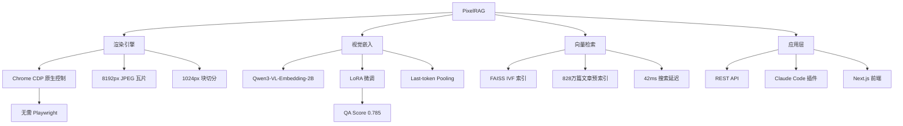

## 📋 文章信息

- **来源**: 微信公众号 - AI开源提效指南
- **作者**: AI开源提效指南
- **发布时间**: 2026年6月22日
- **阅读链接**: [原文](https://mp.weixin.qq.com/s/qebK10CZB8gPbth-MuYqsg)

---

## 🎯 核心摘要

传统 RAG 系统将网页渲染为纯文本，丢失了表格、图表、排版等所有视觉结构信息。伯克利 SkyLab 团队开源的 PixelRAG 提出了一种全新的范式——直接对页面截图，在像素级别进行向量检索。项目上线不到一个月即获得 3000+ Star，已预索引 828 万篇 Wikipedia 文章，通过 LoRA 微调 Qwen3-VL-Embedding 模型，将 QA Score 从 0.715 提升至 0.785。核心思想是：检索的未来，是"看"而不是"读"。

## 📊 核心观点

### 1. 传统 RAG 的致命缺陷：视觉结构丢失

**背景/现状**：
- 传统 RAG 系统将网页、PDF 等文档解析为纯文本后再进行检索
- 表格、图表、信息图、布局等视觉信息在文本化过程中全部丢失

**核心论述**：
- 对于包含大量图表、表格的文档，文本 RAG 几乎无法正确理解和检索
- 视觉排版本身携带着重要的语义信息（如标题层级、数据关联、空间关系）
- 解决这一问题的根本方法是在像素级别保留完整的视觉信息

### 2. 像素级检索：以截图为基础的全新范式

**背景/现状**：
- PixelRAG 使用 Chrome CDP 协议将任意网页渲染为 8192px 高的 JPEG 瓦片
- 瓦片进一步切分为 1024px 的块（chunk），减少视觉 token 数量约 8 倍

**核心论述**：
- 通过原生 WebSocket 控制 Chrome，无需 Playwright 依赖
- 支持 Turbo 加速路径（定制版 Chrome + 共享内存 + 并行 JPEG 压缩）
- 兼容 URL、PDF、本地图片、HTML 文件等多种输入格式

### 3. 视觉嵌入模型：LoRA 微调提升检索质量

**背景/现状**：
- 基于开源 Qwen3-VL-Embedding-2B 模型进行 LoRA 微调
- 使用 ViT 视觉编码器 LoRA + 文本预热 + 难负样本挖掘

**核心论述**：
- 微调后 QA Score 从基础模型的 0.715~0.730 提升至 0.785
- 支持 vLLM / SGLang / 原生 transformers 多种推理后端
- 训练数据、LoRA 适配器全部开源，可复现

### 4. 端到端工程完备性

**背景/现状**：
- 从渲染→嵌入→索引→搜索→前端，提供完整流水线
- FAISS IVF 索引支持十亿级检索，单次搜索延迟约 42ms（GPU 编码）

**核心论述**：
- 预索引 828 万 Wikipedia 文章，约 2810 万个截图块，即开即用
- 提供 Claude Code 插件（pixelbrowse），一行命令安装
- 支持 REST API、Colab 笔记本、Web 前端等多种入口

## 🧠 概念图谱



## 🏗️ 技术架构

### 架构概述

PixelRAG 采用模块化四层架构：渲染层负责将网页/PDF 转为截图瓦片，嵌入层将截图块编码为向量，索引层基于 FAISS 构建搜索引擎，应用层提供 API 和前端交互。

### 核心组件

| 组件 | 职责 | 关键技术 |
|------|------|----------|
| render/ | 网页/PDF 截图渲染 | Chrome CDP WebSocket、8192px 瓦片、JPEG 压缩 |
| embed/ | 视觉向量化编码 | Qwen3-VL-Embedding-2B + LoRA、vLLM/SGLang |
| index/ | 端到端索引构建 | FAISS IVF、YAML 配置、多数据源 |
| serve/ | 搜索 API 服务 | FastAPI + Uvicorn、按需渲染 |
| train/ | 模型微调训练 | PyTorch + GradCache、对比学习 |
| web/ | 前端与 Agent | Next.js + Tailwind CSS、Claude Agent SDK |

### 数据流向

```
URL/PDF/HTML → Chrome CDP 渲染 → 8192px JPEG 瓦片 → 1024px 块切分
→ Qwen3-VL-Embedding 编码 → 向量 → FAISS IVF 索引
→ 查询编码 → FAISS 搜索 → 返回匹配结果
```

## 🔑 关键洞察

### 1. "看"比"读"更适合某些检索场景

**分析**：
- 很多文档的核心信息存储在视觉结构中——表格里的行列对应关系、图表中的趋势线、信息图中的空间布局
- 传统 RAG 把这些信息"拍扁"成文本后，语义损失巨大
- PixelRAG 的像素级检索实际上是在做一件很直觉的事：让 AI 像人一样"看"文档

### 2. LoRA 微调小模型 > 直接用大模型

**分析**：
- 2B 参数的 Qwen3-VL-Embedding 经过 LoRA 微调后效果显著优于基础模型
- 说明在小规模嵌入任务上，针对性训练比简单增大模型更有效
- 训练数据、适配器全部开源，降低了领域适配门槛

### 3. 预计算索引是大规模检索的必经之路

**分析**：
- 828 万篇文章 × 3.4 个块/篇 ≈ 2810 万个截图块，全部预计算
- 搜索时只需编码查询向量 + FAISS 毫秒级检索，延迟 42ms
- 这种"重索引、轻查询"的模式是构建生产级 RAG 系统的关键

## 🚧 不足与局限

### 1. 存储成本高
- 每篇文章生成多个 JPEG 瓦片，828 万篇文章的索引规模庞大
- 截图相比纯文本的存储开销高 1-2 个数量级

### 2. 渲染依赖 Chrome
- 虽然无需 Playwright，但仍依赖 Chrome/Chromium 运行
- SPA 页面需要等待 JS 执行完成，渲染耗时不可忽略

### 3. 多语言和垂直领域验证不足
- 目前预索引仅覆盖 Wikipedia，垂直领域（如医学、法律文档）的效果尚未验证
- 中文文档的视觉嵌入质量有待进一步评估

### 4. 信息更新延迟
- 预索引模式意味着新内容无法实时搜索，需要重建索引

## 🔮 延伸思考

### 方向1：与传统文本 RAG 的混合架构
- 将 PixelRAG 的视觉检索与传统文本 RAG 结合，通过混合排序（reciprocal rank fusion）融合两种信号
- 表格/图表走视觉路径，纯文本走文本路径，互补而非替代

### 方向2：Agent 场景中的视觉 RAG
- Claude Code 插件已经证明了这个方向的可行性
- 未来的 AI Agent 可能会同时"读"代码和"看"文档截图，构建更全面的知识上下文

### 方向3：动态渲染与增量索引
- 结合按需渲染（render_ondemand）与增量索引更新，解决预计算模式的内容时效性问题

## 💡 实践启示

### 1. 当文档包含大量图表/表格时，考虑视觉 RAG

**要点**：
- 财务报告、技术文档、数据仪表盘等场景是 PixelRAG 的最佳适用场景
- 如果你的 RAG 系统主要处理纯文本文档，传统方案仍然更高效

### 2. 小模型 + LoRA 是嵌入领域的性价比最优解

**要点**：
- 2B 模型 + LoRA 微调的效果优于直接使用大模型
- 对于领域特定的检索任务，收集少量领域数据微调即可显著提升效果

### 3. 端到端开源是吸引社区的关键

**要点**：
- PixelRAG 从模型、训练数据、LoRA 适配器到完整源码全部开源
- 这种"可复现 + 可扩展"的开源策略是其快速获得 3000+ Star 的重要原因

## 📝 关键金句

> "检索的未来，是看而不是读。"

> "传统 RAG 系统会把网页渲染成纯文本格式，表格、图表、信息图——所有视觉结构全丢了。"

> "让 Agent 学会自己造工具，比给 Agent 造更多工具，重要得多。"（作者在展望 Agent 生态时的观点）

## 🏷️ 标签

RAG、视觉嵌入、多模态检索、Qwen3-VL、FAISS、开源项目、伯克利 SkyLab

---

## 🔗 相关资源

- **项目仓库**：https://github.com/StarTrail-org/PixelRAG
- **在线演示**：https://pixelrag.ai
- **API 文档**：https://pixelrag.ai/docs
- **LoRA 适配器**：https://huggingface.co/Chrisyichuan/wiki-screenshot-embedding-lora
- **FAISS 索引**：https://huggingface.co/StarTrail-org/pixelrag-faiss-indexes
