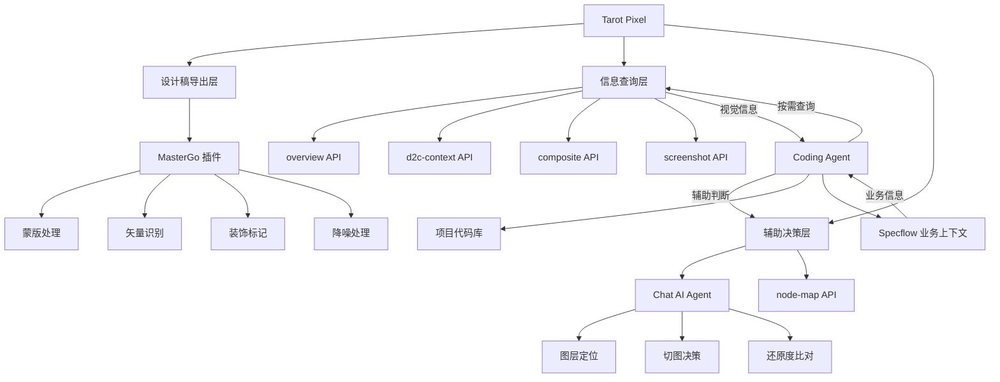

## 📋 文章信息

- **来源**: 微信公众号 - 大淘宝技术
- **作者**: 木偶（淘天集团-用户场景营销技术团队）
- **阅读链接**: https://mp.weixin.qq.com/s/xpaoZFWeSw5S3aifUGjF2Q

---

## 🎯 核心摘要

文章介绍了 Tarot Pixel ——一个面向 AI Native 时代的视觉还原方案。与传统 D2C 平台"建管道"的思路不同，Tarot Pixel 采用"建图书馆"的范式：将设计稿导出为结构化视觉预览，通过 REST API 让 Coding Agent 按需查询视觉信息，而非全量注入上下文。核心创新在于将"工具为人类服务"转变为"工具为 Agent 服务"，设计稿从一次性输入变为持续在线的参考源，形成"实现→比对→修正"的自主闭环。

## 📊 核心观点

### 1. 从 Vibe Coding 到 Agentic Engineering

**背景/现状**：
- Karpathy 提出 vibe coding → agentic engineering 的演进
- Coding Agent 已能在 30-60 分钟内独立推进完整任务
- 开发者角色从"写代码"转向"定义问题、表达约束、判断结果"

**核心论述**：
- Anthropic 研究发现"协作悖论"：工程师大量使用 AI，但能完全委托的任务比例仍不高
- Agent 能做多远不只取决于模型本身，也取决于工具、上下文和任务清晰度
- 对业务团队而言，上下文质量是掌握在自己手里的核心变量

### 2. 传统 D2C 的结构性矛盾

**背景/现状**：
- D2C 在布局识别、组件匹配、样式提取等方面积累了大量经验
- 对 B 端标准化场景效率显著，但自动化链路中仍有大量人工环节

**核心论述**：
- **图层整理与打标**：需手动打开设计工具选择图层
- **切图与合图**：需人工判断哪些该切图、哪些该用 CSS
- **多状态识别**：多个独立画板需开发者自己识别合并
- **一次性输出**：设计稿信息使命结束后，无法持续修正
- C 端场景中人工成本被急剧放大（20+ 图层叠加的红包组件、多种按钮状态、频繁更新的运营活动）

### 3. 视觉还原不是孤立任务

**背景/现状**：
- 前端没有独立的 D2C 任务，视觉还原只是完整功能开发的一个环节

**核心论述**：
- 与业务状态耦合（任务完成、优惠券过期等决定视觉表现）
- 与交互逻辑耦合（弹窗、Tab 切换、过渡动画）
- 与数据流耦合（价格、库存、用户状态影响渲染）
- 脱离业务上下文单独生成的 D2C 代码只是一个空壳

### 4. 不建管道，建图书馆

**背景/现状**：
- Agent 工作在"观察→规划→执行→反思"的自主循环中
- Agent 不像传统程序需要一次性拿到所有输入

**核心论述**：
- Tarot Pixel 设计为一个"视觉参考系统"，而非"代码生成管道"
- 设计稿一次性导出为结构化视觉预览（HTML 渲染 + 结构化数据）
- 提供按需查询的 REST API，Coding Agent 通过 Skill 文档自主决策
- 设计稿不是输入，是参考资料——就像有经验的前端反复切回设计稿看细节

### 5. 工程与 AI 的边界

**背景/现状**：
- 不需要再造一个 Agent，而是为已存在的 Agent 提供缺失的能力

**核心论述**：
- **工程层**：像素级精确 CSS 提取、资源导出、蒙版处理、布局推断（确定性高）
- **AI 层**：理解"装饰 vs 内容""同一组件的不同状态""实现与设计稿差异"（需要理解力）
- **Coding Agent**：结合项目代码库，用正确的组件和架构写出能用的代码
- 核心原则：能用工程确定性解决的，绝不交给 AI

## 🧠 概念图谱

## 🏗️ 技术架构

### 架构概述

Tarot Pixel 采用四层架构：数据导出层（MasterGo 插件）→ 可视化中间层（Viewer Server）→ API 服务层（REST API）→ 辅助决策层（Chat AI Agent）。核心设计理念是"分层获取、按需拉取、幂等无状态"。

### 核心组件

| 组件 | 职责 | 关键技术 |
|------|------|----------|
| MasterGo 插件 | 设计稿解析与降噪 | TypeScript + React，蒙版翻译、PEN 形状识别、装饰标记 |
| CLI 工具 | 视觉稿管理与服务启动 | TUI 交互式界面，一键配置 |
| Viewer Server | 可视化中间层 | Bun + Vite，一比一渲染、Map 模式叠加标注 |
| REST API | 按需查询接口 | overview、d2c-context、composite、screenshot 等 20+ 接口 |
| Chat AI Agent | 视觉理解辅助 | 独立 LLM Agent，20+ 工具调用能力 |
| Skill 文档 | Agent 协作接口 | 纯 API 参考，适配 Cursor/Qoder |

### 渐进式上下文分层

- **第 1 层**：模块概览（预览图 + 基本信息）
- **第 2 层**：模块级布局 + 直接子节点文本
- **第 3 层**：节点级 CSS + 资源信息
- **第 4 层**：子节点级详细信息

实现简单按钮只需第 1-2 层，复杂卡片才需深入第 3-4 层。

## 🔑 关键洞察

### 1. Agent-Native 工具设计：工具是给 AI 用的

**分析**：
- 传统工具以人类用户为中心设计界面和交互
- Agent-Native 工具需要不同设计思维：自然格式（prose/markdown）而非复杂结构化格式、充分文档、优雅错误处理、假设 Agent 可能以意外方式使用
- Tarot Pixel 选择 REST API + Skill 文档的组合，REST API 比任何特定 Agent 协议都更通用

### 2. 信息密度控制是上下文管理的核心

**分析**：
- 传统 D2C 全量 IR 注入上下文，造成严重信息过载
- Tarot Pixel 的"按需拉取"策略本质上是一种信息密度控制机制
- 分层 API 让 Coding Agent 只获取当前决策所需的最少信息
- 降噪发生在导出阶段、查询阶段和合图阶段三个层面

### 3. 中心化扩展 vs 去中心化扩展

**分析**：
- 传统 D2C 是中心化扩展：每支持新设计模式需更新规则引擎和代码模板
- Skill 模式是去中心化扩展：工程层提供新数据标签，Coding Agent 自己学会使用
- 天然优势：模型变聪明了，Skill 的理解和运用自动变好，系统无需改动

### 4. 干预次数才是真正的效率指标

**分析**：
- "AI 代码采纳率"不够衡量真正的效率
- 核心指标是：从需求到交付，开发者需要介入多少次
- 传统 Vibecoding："人告诉 AI 怎么做"
- Tarot Pixel："人指出问题，AI 自己查资料自己修"
- 干预成本从"指导式"降为"反馈式"

## 🚧 不足与局限

### 1. 模型依赖性高
- 方案对模型的视觉理解、长上下文处理、工具调用稳定性、多轮任务推进能力都有较高要求
- 模型能力不够时，即使上下文完整，也可能在定位、判断和连续修正上出现明显退化

### 2. 边界场景仍有不足
- 图层定位效率：复杂设计稿中 Coding Agent 遍历节点树定位速度不够快
- 切图准确性：半透明装饰与内容重叠等边界情况需人工确认
- 复杂模块还原度：一般需 1-3 轮额外对话微调
- 多状态识别准确率仍在持续优化

### 3. 当前仅适配 MasterGo
- 文中未提及对 Figma、Sketch 等其他设计工具的支持计划
- MasterGo 生态在中国市场有优势，但全球化扩展面临设计工具多样性挑战

## 🔮 延伸思考

### 方向1：Agent-Native 设计范式的泛化
Tarot Pixel 的思路不仅适用于视觉还原。任何"信息→实现"的链路都可以重新思考：不是建一条自动化的管道，而是建一个 Agent 可查询的知识系统。测试数据生成、API 文档查询、运维手册查阅——都可以借鉴"图书馆"范式。

### 方向2：多 Agent 协作的未来
当前是 Specflow（业务上下文）+ Tarot Pixel（视觉上下文）+ Coding Agent（编码执行）的三方协作。未来可能出现更多专业化的"能力补丁"：安全审计 Agent、性能优化 Agent、可访问性检查 Agent，各自通过 Skill 文档注入能力。

### 方向3：Browser Use 能力改变游戏规则
Coding Agent 内置 Browser Use 后，可以实现"截图→识别→定位→修正"的视觉反馈闭环。这意味着 Agent 的自主能力进一步增强，人工干预成本可能进一步降低到"验收式"而非"修正式"。

## 💡 实践启示

### 1. 为 AI 设计工具，而非为人类设计工具

**要点**：
- 工具接口应优先考虑 Agent 的消费方式（API + Skill 文档），而非人类的操作方式（GUI + 向导）
- 用自然语言文档描述能力，而非复杂的结构化 schema
- 假设 Agent 会以意想不到的方式使用工具，设计应保持灵活性

### 2. 上下文质量是新的核心竞争力

**要点**：
- 模型和工具链由平台方迭代，业务团队可控的变量是上下文质量
- 为 Agent 提供精准信息、过滤干扰噪声，是业务团队的新核心能力
- "给模型足够的上下文，减少对 Agent 的干扰"是一条朴素的实践原则

### 3. 追求可迭代，而非一次性完美

**要点**：
- "一次性完美生成"是理想目标，但实践中"可对话迭代"更有价值
- 关键是建立闭环：信息始终在线，Agent 随时可以查和改
- 首次 80% + 快速迭代到 95% > 追求 100% 但无法修正

### 4. 能用工程确定性解决的，绝不交给 AI

**要点**：
- 工程擅长确定性任务（CSS 提取、资源导出、蒙版处理）
- AI 擅长理解力任务（语义判断、分类决策、对比分析）
- 明确边界，避免用 AI 解决可以用规则解决的事情

## 📝 关键金句

> "我没有做 Agent，我做了一个为 Agent 服务的系统。"

> "给模型足够的上下文，减少对 Agent 的干扰。"

> "传统 Vibecoding 是'人告诉 AI 怎么做'，Tarot Pixel 是'人指出问题，AI 自己查资料自己修'——干预成本完全不同。"

> "设计稿不是一次性输入，而是随时可查的参考源。"

> "能用工程确定性解决的，绝不交给 AI。AI 只处理需要理解力和判断力的部分。"

## 🏷️ 标签

AI Coding、Agent、D2C、视觉还原、前端开发、Tarot Pixel、Skill 驱动、Agent-Native 设计、上下文管理

---

## 🔗 相关资源

- **拓展阅读**：AI Coding 上下文管理、Coding Agent 工具链设计、前端 AI 工程化实践
- **关联概念**：Specflow（塔罗任务规划 Agent）、Browser Use、Figma MCP、Vibe Coding
