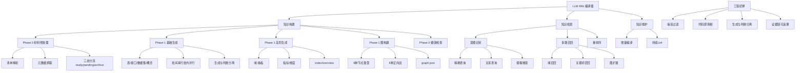

## 📋 文章信息

- **来源**: 微信公众号 - 阿里云开发者
- **作者**: 阿里云开发者团队
- **发布时间**: 2025年
- **阅读链接**: https://mp.weixin.qq.com/s/6-xg2jJqIPbrqHcbjHBuTg

---

## 🎯 核心摘要

文章提出"LLM Wiki"理念——用编译器思维将散落、矛盾、易腐化的领域知识编译为结构化、有约束、可验证的知识资产，直接供 AI 消费。核心论点是：RAG 只是把"人找不到"变成"AI找到了但答不准"，真正的问题出在知识本身。文章以阿里直播数据团队为实践背景，完整阐述了从知识构建、检索到增量维护的全套工程体系，包括 6 个 Agent Skill 的编排架构、三层校验的正确性保障、以及编译时/运行时的知识分层策略。最终效果：模型迭代影响分析从半天缩短到小时级，下游表遗漏率从 20%降到 0%。

## 📊 核心观点

### 1. 领域知识是 AI 时代最值得长期投入的资产

**背景/现状**：
- AI 系统由模型、知识、架构三部分组成
- 模型由供应商提供，架构随模型升级而失效
- 领域知识只能从内部积累，不可替代

**核心论述**：
- 知识散落在代码、配置、文档、沟通记录中，导致知识质量退化和工程熵增
- 直接套 RAG 无法解决根本问题——RAG 不改变知识本身的状态
- 需要在检索之前加一道"编译过程"，把散落材料加工为可被 AI 直接消费的知识

### 2. LLM Wiki 本质是编译器，不是文档

**背景/现状**：
- 传统 Wiki 靠人工维护，成本高、腐化快、难持续
- AI 生成的文档缺乏结构约束，不可验证

**核心论述**：
- LLM Wiki 是"结构化、有约束、可验证的知识资产"
- 四层设计原则：结构可解析、层级可下钻、关系可遍历、正确性可度量
- 构建过程对应编译器流水线：提取→生成→归类→聚合→链接→验证

### 3. 知识质量保障需要工程纪律而非口号

**背景/现状**：
- 源材料带噪音（注释过期、文档写错口径）
- LLM 生成存在幻觉
- 域归属等判断有主观性

**核心论述**：
- 四道工程纪律：噪音过滤、代码即真相、生成与判断分离、证据链可追溯
- "代码即真相"——以任务代码为权威，注释和文档可能失修
- 生成阶段推断字段强制留空，独立跑判断阶段，人工确认兜底

### 4. 编排与干活层分离是 Agent 系统的关键架构

**背景/现状**：
- Wiki 编译是多阶段、多类型任务
- LLM 调用是主要时间瓶颈

**核心论述**：
- 编排层只做四件事：意图路由、用户确认、子 Agent 调度、结果汇报
- 干活层 6 个 Skill 遵循高内聚低耦合，通过文件系统约定目录交互
- 基础 Wiki（原子）和高阶 Wiki（聚合）的拆分是干活层最关键的一刀

### 5. 检索栈是构建投入的最终消费场景

**背景/现状**：
- AI 上下文有限，不可能一次加载全部知识
- 业务问题往往涉及横向关联而非单张表

**核心论述**：
- 三步检索：意图识别→多路召回→重排序输出
- 域推断是模糊搜索的前置必要步骤（不可跳过）
- 排序三维度：覆盖度（硬门槛）+ 相关性 + 通用性

## 🧠 概念图谱



## 🏗️ 技术架构

### 架构概述

LLM Wiki 系统以文件为底座，三层主干架构：

| 层级 | 组件 | 职责 |
|------|------|------|
| 存储层 | 多级文件系统 | 知识的物理组织和生命周期管理 |
| 知识模型层 | Schema 定义 | 定义知识结构和约束（frontmatter + 正文契约） |
| 计算层 | Agent 编排 | 调度计算任务，管理并行与串行 |

### 核心组件

| 组件 | 职责 | 关键技术 |
|------|------|----------|
| wiki-orchestrator | 编排层：意图路由、用户确认、子 Agent 调度 | Agent 编排模式 |
| wiki-material-prep | Phase 0：材料抓取、验证、三态分流 | 全脚本化执行、断点续传 |
| wiki-base-generator | Phase 1 基础：生成表/接口/数据集/概念页面 | 批间串行批内并行、增量感知 |
| wiki-advanced-generator | Phase 1 高阶：聚合域/看板/指标/维度页面 | DAG 驱动、三路并行 |
| wiki-graph-builder | Phase 1 链接：构建全局关系图 | 只存正向边、反向按需计算 |
| wiki-health-check | Phase 2：全局对账和质量门禁 | 6 项校验规则、构建失败阻断发布 |
| wiki-query | 运行时检索：意图识别+多路召回+重排序 | 覆盖度+相关性+通用性三维排序 |

### 多级文件系统

```
KB_ROOT/
├── pre/              # 待处理清单 + 临时产物
├── raw/
│   ├── ready/        # 完整可用，直接进入 Wiki 生成
│   ├── pending/      # 需治理后晋升 ready
│   └── archive/      # 已下线或弃用
├── wiki/
│   ├── tables/       # 表页面
│   ├── domains/      # 域页面
│   ├── concepts/     # 概念页面
│   ├── metrics/      # 指标页面
│   ├── dimensions/   # 维度页面
│   ├── dashboards/   # 看板页面
│   ├── apis/         # 接口页面
│   ├── datasets/     # 数据集页面
│   ├── graph.json    # 全局关系图
│   ├── index.md      # 全局索引
│   └── overview.md   # 全景概览
├── log/              # 构建日志和健康检查报告
├── tmp/              # 跨 skill 协作中间状态
└── schema/           # 页面模板（定义 frontmatter 与正文契约）
```

## 🔑 关键洞察

### 1. "编译时 vs 运行时"的知识分层思维

**分析**：
- 这是本文最核心的认知模型。LLM Wiki 是编译时产物（预处理高质量语料），RAG 是运行时手段（查询时刻精准召回）
- 两者互补而非冲突：Wiki 提供高质量语料，RAG 提供精准召回，组合才是完整检索栈
- 这个思维可以推广到任何知识密集型 AI 系统——先解决"知识本身的质量"，再优化"检索的效率"

### 2. 代码即真相——多源冲突的唯一仲裁规则

**分析**：
- 注释和文档可能长期失修，但任务代码每天实际跑在生产上
- 这条规则把所有"以谁为准"的争议收敛到唯一答案
- 在数据团队场景中极为实用——DDL + 任务代码的组合覆盖了结构信息和逻辑信息
- 启发：任何 AI 知识系统都需要类似的"真理源"定义机制

### 3. 生成与判断分离——对抗 LLM 幻觉的架构级方案

**分析**：
- 不是在 prompt 里加"请确保准确"这种无力约束
- 而是从架构层面把"生成内容"和"判断归属"拆成两个独立阶段
- 生成阶段：只写有源材料直接支撑的内容，推断字段强制留空
- 判断阶段：基于已写入内容综合输出候选，经机械门禁 + 人工门禁双道验证
- 本质上是将"容易出错的两类动作彻底解耦"

### 4. 关系显式建图 > 正文隐含关系

**分析**：
- 正文中隐含的关系需要 LLM 每次重新抽取，不稳定且低效
- 显式存图后：影响范围可计算、归属关系可聚合、枢纽节点可识别
- 只存正向边 + 反向按需计算 + 回填关键反向字段的策略，平衡了存储开销和查询灵活性
- 用单文件 JSON 而非图数据库的选择，适合当前规模且便于版本管理

### 5. 通用性作为检索排序维度——对抗数据重复建设

**分析**：
- 在数仓场景中，用户不知道已有公共表而另建相似表，是数据负债的根源
- 把通用性（被大量下游消费的表）纳入排序维度，让用户检索时能感知现有公共依赖
- 这是知识系统反哺资产治理的典型案例

## 🚧 不足与局限

### 1. 规模化瓶颈
- 当前以单文件 JSON（graph.json）存储关系图，文章也承认"适合当前规模的知识库"
- 当表数量达到数千甚至数万时，图遍历的性能和文件 IO 可能成为瓶颈
- 未讨论水平扩展策略（分域独立图、图数据库迁移等）

### 2. 知识保鲜的自动化程度
- 文章在"未来规划"中才提到自动化的源材料变更检测，说明当前实践仍需人工触发
- 增量编译机制虽已建立，但主动检测和触发闭环尚未闭环

### 3. 语义校验的覆盖度
- 当前语义层校验依赖 LLM 评审（描述准确性、口径一致性等），但这本身就是用 AI 校验 AI 产出的知识
- 缺乏独立于 LLM 的语义验证基准（如自动化评测 benchmark）

### 4. 泛化性待验证
- 实践高度绑定阿里内部工具链（ODPS、钉钉文档、内部元数据接口）
- 其他团队复用时需要适配自有工具链，Schema 和抓取逻辑都需要定制

## 🔮 延伸思考

### 方向1：知识编译器模式的泛化
- 这个"编译器"思维不只适用于数据团队，任何知识密集型组织（法律、医疗、金融）都可以借鉴
- 核心是：定义知识 Schema → 多源材料编译 → 关系建图 → Agent 消费
- 关键挑战是不同领域的"真理源"定义——代码团队可以"代码即真相"，但业务团队呢？

### 方向2：与数据治理的融合
- LLM Wiki 的血缘图天然可用于数据资产管理
- 三态分流（ready/pending/archive）可以直接对接数据治理流程
- 健康检查规则可以作为数据质量监控的补充

### 方向3：从"知识编译"到"知识演进"
- 当前 Wiki 是静态快照，未来方向应是知识的版本化演进
- 可以借鉴 Git 的 diff 思维，跟踪知识变更的因果链
- 让 AI 不仅"回答问题"，还能"解释知识为什么是这样"

## 💡 实践启示

### 1. 先解决知识质量，再优化检索效率

**要点**：
- 在建设 RAG 系统之前，先评估知识源的质量：是否散落、矛盾、过期
- 如果知识本身有问题，优化 chunk 策略和 embedding 模型是徒劳的
- 优先投入在知识的结构化和校验上

### 2. 构建知识系统时定义"真理源"

**要点**：
- 明确当多个来源冲突时以谁为准（代码 > 文档 > 口头）
- 在系统中实现这个仲裁规则，而不是依赖人工判断
- 对真理源做变更检测，自动触发知识更新

### 3. Agent 编排系统采用编排层/干活层分离

**要点**：
- 编排器只做调度和用户交互，不直接处理数据
- 干活层各 Skill 高内聚低耦合，通过文件系统约定交互
- 支持独立运行、并行执行、断点调试

### 4. 检索排序纳入"通用性"维度

**要点**：
- 在任何资源检索场景中，将被广泛使用的资源排在前面
- 减少重复建设，提升资产复用率
- 这个思路可以推广到代码库搜索、API 文档检索等场景

## 📝 关键金句

> "问题出在知识本身，不在检索。需要的是在检索之前加一道编译过程——把散落、矛盾、易腐化的源材料，预先加工为可被 AI 直接消费的知识。"

> "RAG 的模式是每次查询都到原始文档碎片里现找现拼——chunk 召回、上下文拼接、模型生成——但它并不改变原始材料本身的状态。只是把'人找不到'变成了'AI找到了但答不准'。"

> "让 LLM 来建，不是让人来建。人工维护 Wiki 的核心问题是成本高、腐化快、难持续。LLM 作为编译器，把散落的源材料编译成结构化页面，人只在关键节点做确认。"

> "领域知识决定了 AI 在业务中能发挥多大的价值，而它只能从内部积累，无法从外部获取。"

## 🏷️ 标签

LLM、知识管理、RAG、Agent、数据仓库、Wiki、编译器、知识图谱、数据治理、AI架构

---

## 🔗 相关资源

- **拓展阅读**：RAG 与知识库设计的最新进展
- **相关主题**：DataOps、数据资产治理、LLM Agent 编排模式
