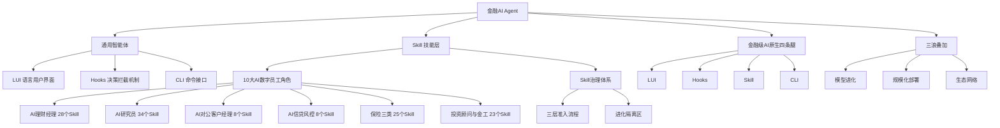

## 📋 文章信息

- **来源**: 微信公众号 BLUES
- **作者**: 兰军
- **发布时间**: 2026年6月
- **阅读链接**: https://mp.weixin.qq.com/s/6MEjoZ_GATJXXyHkMEXung

---

## 🎯 核心摘要

阿里云发布《金融行业Agent百技图》，198页、133个开箱即用的金融AI Skill全量开源，标志着AI Agent从"教育市场"进入"收割市场"阶段。报告提出"通用智能体+N个Skill"是Agent时代的终局架构，覆盖银行、保险、证券三大业态的10大AI数字员工角色。文章指出金融机构正面临"三浪叠加"——模型能力指数级进化、Agent产品规模化部署、生态网络正反馈效应——观望的每一季度都在让先行者积累不可逆转的复利优势。

## 📊 核心观点

### 1. 从"百景图"到"百技图"：AI进入实战落地阶段

**背景/现状**：
- 2025年阿里云发布《金融行业Agent百景图》，侧重"场景"，市场反应是"回去研究一下"
- 2026年发布《金融行业Agent百技图》，侧重"技能"，附带GitHub仓库地址，市场反应变为"赶紧部署"
- 中国金融业已实现7天迭代周期、2500+智能体部署

**核心论述**：
- 一字之差反映行业成熟度的跃迁：从需要被说服"Agent有用"，到需要被告知"Agent怎么用"
- 阿里云正在从"卖云"转向"卖智能"，通过Skill标准构建金融AI操作系统
- 100个Skill本质是在定义"金融数字员工应该会什么"，形成平台化生态护城河

### 2. 三个数字定义Agent时代

**背景/现状**：
- Anthropic年化收入从10亿美元飙升至300亿美元
- ChatGPT周活突破9亿，接近中国总人口的60%
- 四大科技巨头2026年AI相关资本支出合计约7,250亿美元

**核心论述**：
- SaaS行业"从0到100亿美元ARR"的纪录被OpenAI以不到三年打破，AI的供给侧已准备就绪
- 9亿周活用户习惯自然语言交互后，会倒逼金融机构提供同样智能的服务——这不是技术倒逼，而是用户习惯倒逼
- 千亿美元级别的资本投入已不是"豪赌"而是"范式投票"

### 3. "通用智能体+可插拔Skill"是终局架构

**背景/现状**：
- 开发一个专用Agent需10人月，编写一个Skill仅需0.5人月
- 100个场景下，专用Agent方案需1000人月，通用智能体方案仅需150人月，成本差距超10倍

**核心论述**：
- **成本维度**：通用智能体把AI能力建设从"每一个场景都是一次重大工程"变成"编写一个Skill就像写一份业务规则文档"
- **协同维度**：金融业务天然跨域，专用多Agent系统反而降低性能（Google Research与MIT研究显示Multi-Agent性能提升-3.5%）
- **进化维度**：场景变化时，Skill修改周期为"数小时到数天"，而Agent重新开发需"数周到数月"
- **生态维度**：Skill的积累具有复利效应，先行者以年为单位积累的Skill资产构成"经验鸿沟"

### 4. Skill治理：从"野生技能"到"持牌准入"

**背景/现状**：
- 金融场景中，未验证的Skill直接上线可能导致合规事故
- Agent自主学习产生的新Skill可能"漂移"出合规边界

**核心论述**：
- 三层递进式准入流程：基础功能测试 → 专业质量评测（核心结论一致率≥95%）→ 对抗压力测试
- "进化隔离区"机制：Agent自主提炼的新Skill强制落入"草稿箱"，需评判模型初审+人工终审
- Skill的积累是金融机构的新护城河：当模型能力进入平台期，差异化优势来自"技能密度"而非模型本身

### 5. "三浪叠加"：残酷的时间窗口

**背景/现状**：
- GPT-5.5在SWE-bench上82.6%，前沿模型首次触及人类专家水平
- 高盛AI助手扩展至46,000名员工，Salesforce Agentforce签约超29,000客户
- MCP协议全球月下载量突破9,700万次

**核心论述**：
- 第一浪：模型能力指数级进化，百万token价格降幅超99%
- 第二浪：Agent产品规模化部署，从POC走向全公司生产
- 第三浪：生态网络正反馈，Skill建设从"中心化"变"去中心化"
- 每一个季度的观望都意味着先行者多积累一轮复利资产

## 🧠 概念图谱

## 🔑 关键洞察

### 1. Agent越多≠能力越强

**分析**：
- Google Research与MIT的实证研究表明Multi-Agent系统平均性能提升为-3.5%，集中式协调架构成本达到单Agent的285%，混合式架构更高达515%
- 这打破了一个常见误区：协同成本是真实存在的，且比大多数人想象的大得多
- 通用智能体+可插拔Skill的本质优势在于"上下文天然连贯，信息零丢失"

### 2. Skill密度是新护城河

**分析**：
- 当模型能力趋同（GPT-5.5、Claude Opus 4.7、Qwen3.6-Plus差距缩小），竞争焦点从"用什么模型"转向"有多少Skill"
- 类比App Store逻辑：iPhone的价值不在内存而在应用生态
- 500个高质量Skill的金融机构，竞争对手仅靠换底层模型无法复制
- Skill的复利效应：每一个新Skill都能复用已有经验模式，每一次执行都产生优化反馈

### 3. "碳硅协同"是组织形态的拐点

**分析**：
- 文章预测2028年中国将出现第一家"数字员工占半数"的金融机构
- 关键判断：大概率不是大行，而是AI原生架构的新型金融机构
- 逻辑：当新增客户边际服务成本趋近于零时，AI原生机构呈指数增长，传统机构仍陷线性增长
- 这意味着VC/PE最值得投资的赛道不是"另一个大模型"，而是"金融数字员工基础设施"

## 🚧 不足与局限

### 1. 乐观假设较多
- 文章对AI能力在金融核心场景的成熟度可能过于乐观，金融行业的强监管特性使得"7天迭代周期"更多体现在非核心业务
- Skill的"持牌准入"治理体系描述完善，但实际执行中如何平衡效率与合规仍是未知数

### 2. 创业机会分析偏向乐观
- "AI数字员工外包服务"的模式面临与阿里云等大厂直接竞争的风险，SaaS+Service模式的护城河深度存疑
- Skill运维管家的市场空间有待验证，金融机构是否有意愿为此付费仍是问号

### 3. 多Agent系统性能负增长结论的适用性
- Google Research的结论基于2025年底的研究，2026年Agent架构和协调机制已有显著进步
- 金融场景中某些任务（如风控审批）天然需要多Agent隔离，单Agent可能带来合规风险

## 🔮 延伸思考

### 方向1：Skill市场的App Store时刻
- 133个Skill开源只是起点，当第三方开发者围绕金融场景构建Skill生态时，可能出现"金融Skill Store"
- 评估和认证机制将成为关键——谁来评判一个Skill的金融级可靠性？

### 方向2：Token经济学重塑金融机构成本结构
- 文章提到日调用量突破140万亿token，Token正在成为战略资源
- "Token优化即服务"是一个值得关注的新兴赛道：帮助金融机构在保证效果的前提下降低Token消耗

### 方向3：Agent审计与合规的新职业
- 当AI员工承担30%以上工作量，"AI审计师"将成为刚需岗位
- Hooks机制的决策日志如何满足监管审计要求，是一个技术与合规的交叉课题

## 💡 实践启示

### 1. 不要造模型，要造Skill

**要点**：
- 底层通用模型的能力提升速度远超任何垂直玩家，在Skill层建立差异化才是正确策略
- 帮助领域专家将隐性经验编码为结构化Skill，是一门护城河深、客户粘性强、边际成本趋零的生意

### 2. 立即行动，不要等"完美方案"

**要点**：
- 选1-2个高频+标准化+低风险的场景，在6个月内完成首批Skill开发和灰度测试
- 重要的是验证"AI+人的协作效率"是否真的提升，而不是做一个"看起来很酷的Demo"
- 每个季度的观望都意味着先行者多积累一轮复利资产

### 3. 建立Skill资产管理体系

**要点**：
- Skill不是一段提示词，而是企业的数字资产，需要全生命周期管理
- "宁可明确标注'数据缺失'，也不用存疑数据填充"——边界意识是金融AI与通用AI的根本区别

### 4. 把MCP协议纳入技术采购标准

**要点**：
- 不要被单一供应商锁定，未来金融AI系统必然是异构的、多供应商的
- MCP协议确保AI系统可以随时接入新数据源和工具

## 📝 关键金句

> "当模型能力进入平台期后，决定Agent价值的关键变量不再是模型本身，而是其技能密度和技能质量。"

> "Agent越多≠能力越强。协同成本是真实存在的，而且比大多数人想象的要大得多。"

> "焦虑是正常的。但焦虑之后，是行动还是犹豫，决定了三年后你的位置。"

> "每一个Skill的设计哲学是：在明确的边界内做到极致，超出边界必须'举手'要求人工介入。"

## 🏷️ 标签

AI、金融、Agent、Skill、阿里云、数字化员工、碳硅协同

---

## 🔗 相关资源

- **开源仓库**: https://github.com/aliyun/qwen-dianjin （133个金融AI Skill）
- **技能市场**: https://skillsmp.com — 搜索 aliyun/qwen-dianjin
- **报告来源**: 阿里云《金融行业Agent百技图》（2026年6月发布）
