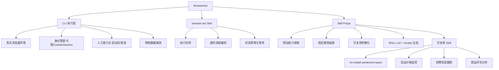

## 📋 文章信息

- **来源**: 微信公众号 - code秘密花园
- **作者**: ConardLi
- **发布时间**: 2026年6月
- **阅读链接**: https://mp.weixin.qq.com/s/DJg74YFmhX0t5xQxTiB1OA

---

## 🎯 核心摘要

BrowserAct 是一款面向 AI Agent 的浏览器自动化 CLI 工具，登上 Product Hunt 日榜第一。它的核心创新不在于"让 Agent 点网页"——这早已不是新鲜事——而在于解决 Agent 操作真实浏览器时的三大痛点：环境稳定性（真实浏览器身份 vs 临时脚本）、人工介入（验证码/登录作为工作流中断点而非任务失败）、以及流程复用（通过 Skill Forge 将跑通的操作沉淀为可复用 Skill）。文章通过"研究 GLM-5.2 在 Hacker News 上的真实口碑"这一实战案例，完整展示了从执行到沉淀的全链路。

## 📊 核心观点

### 1. Agent 操作浏览器存在系统性局限

**背景/现状**：
- 静态抓取无法处理 JS 动态渲染页面
- Playwright/Selenium 暴露给 Agent 时面临自动化检测、状态隔离问题
- RPA 偏 UI 编排，不适合大模型动态推理

**核心论述**：
- 页面问题：很多网站先加载框架再请求数据，Agent"读 URL 内容"看到的不等于用户看到的
- 环境问题：网站会检测浏览器特征、自动化痕迹；验证码、SSO 等需要人工接手
- 复用问题：每次让 Agent 临场分析页面、临场写脚本，流程无法沉淀

### 2. BrowserAct 的三层架构设计

**背景/现状**：
- 传统方案把浏览器当作"页面操作界面"，对 Agent 场景不够用
- Agent 需要的不只是"点哪里"，而是"怎么稳定进入网页"

**核心论述**：
- **BrowserAct CLI**：真实浏览器执行层，负责打开网页、点击输入、提取内容、抓取网络数据
- **browser-act Skill**：执行向导，整理 CLI 能力为 Agent 可遵循的操作流程
- **browser-act-skill-forge Skill**：流程沉淀层，将跑通的网站操作封装为可复用的 Skill

### 3. 三大关键变化：环境身份化、人工接力、身份与任务分离

**背景/现状**：
- Agent 进入网页时像临时脚本，没有稳定身份和上下文
- 遇到验证码/登录时任务直接失败
- 多任务抢占同一页面状态

**核心论述**：
- 隐身浏览器、代理、Cookie、Session → Agent 有稳定身份进入网页
- 人工介入不是任务失败，而是工作流中断点，处理后 Agent 沿原状态继续
- 浏览器 = 账号身份容器，Session = 具体任务工作区，多账号并行互不干扰

### 4. 实战验证：从 15 分钟到 3 分钟的效率跃迁

**背景/现状**：
- 用 BrowserAct 研究 GLM-5.2 在 HN 上的舆情，首次执行约 15 分钟
- 通过 Skill Forge 封装后，研究 DeepSeek V4 同类任务缩短至 3 分钟

**核心论述**：
- 首次执行保留了完整证据链：raw-data.json、raw-data.csv、thematic-counts.json、report.md
- 复用 Skill 不只是复用抓取代码，而是复用方法（数据范围、类型、分析结构、边界表达）
- 5 倍效率提升验证了"流程技能化"的实际价值

## 🧠 概念图谱

## 🏗️ 技术架构

### 架构概述

BrowserAct 采用三层架构：底层 CLI 负责真实浏览器执行，中层 Skill 负责将 CLI 能力编排为 Agent 可遵循的流程，顶层 Skill Forge 负责将已验证的流程沉淀为新的可复用 Skill。

### 核心组件

| 组件 | 职责 | 关键技术 |
|------|------|----------|
| BrowserAct CLI | 真实浏览器执行、数据抓取、状态管理 | Chromium 内核、代理支持、Session 隔离 |
| browser-act Skill | Agent 操作编排向导 | MCP/Tool 调用、页面状态观察、中断点管理 |
| Skill Forge | 流程沉淀与 Skill 生成 | 路径探索、参数抽取、模板化输出 |

## 🔑 关键洞察

### 1. "自动化"的关键不是无人，而是可控

**分析**：
- BrowserAct 不追求 100% 无人值守，而是将人工介入设计为工作流中断点
- 这是一种务实的工程哲学：在真实业务场景中，验证码、SSO 登录等步骤需要人参与是常态
- "人工介入 = 任务失败"的零容忍策略反而降低了自动化方案的可落地性

### 2. 流程复用的本质是"方法"而非"代码"

**分析**：
- Skill Forge 保留的不仅是抓取代码，而是分析结构：数据范围、类型、证据留存方式、分析维度、边界表达
- 这意味着同一个 Skill 换输入（如从 GLM-5.2 到 DeepSeek V4）可以直接复用整个方法框架
- 这与软件工程中"设计模式复用而非实现复用"的理念一致

### 3. 真实浏览器环境是 Agent 操作网页的必要条件

**分析**：
- 很多有价值的数据不在初始 HTML 中，而是由 JS 动态加载的
- 在真实浏览器中，Agent 可以观察页面自身的数据请求路径并复用，而不必在外部猜测 API
- 这比外部脚本硬拼参数获取的数据更可靠、更接近用户实际体验

## 🚧 不足与局限

### 1. 文章偏向产品推广性质
- 全文以介绍 BrowserAct 优势为主，缺乏对局限性的深入讨论（如性能开销、兼容性边界）
- 对比分析中传统方案的不足可能被放大，BrowserAct 的优势可能被理想化

### 2. 案例局限
- 仅展示了一个 HN 舆情调研场景，泛化能力有待更多场景验证
- 从 15 分钟到 3 分钟的提升是量级改善，但首次 15 分钟的时间成本本身仍不算低

## 🔮 延伸思考

### Agent 工具链的"技能化"趋势
- BrowserAct 的 Skill Forge 代表了一种趋势：Agent 做过的事情应该被沉淀为能力
- 类比人类学习：做过一次不等于学会了，但总结方法论后可以教给别人
- 未来可能出现"Agent 技能市场"，网站能力像插件一样被分发和组合

### 网站与 Agent 的共生关系
- 如果 Skill Forge 真的能将任意网站能力模块化，网站是否会主动为 Agent 提供标准化接口？
- 类似于 sitemap.xml 对搜索引擎的意义，未来可能出现"Agent API"为 Agent 提供结构化数据

## 💡 实践启示

### 1. 评估浏览器自动化方案时关注四个维度

**要点**：
- 执行稳定性：能否处理 JS 渲染、动态加载
- 状态管理：能否隔离多账号、保持登录、处理验证码
- 证据留存：操作过程是否可追溯、结果是否可复核
- 流程复用：跑通一次后能否沉淀为可复用的方法

### 2. AI 工具选型看"沉淀能力"

**要点**：
- 不要只看工具能做什么一次任务，要看做过一次后能否变成可复用的能力
- 单次效率和长期复用效率是两个维度，长期价值往往在后者

### 3. 实操尝试 BrowserAct

**要点**：
- 安装：`Install browser-act. Skill URL: https://github.com/browser-act/skills/tree/main/browser-act`
- 适合场景：竞品监控、招聘跟踪、评论分析、论坛口碑巡检、榜单变化日报
- 先跑通一个真实任务，再用 Skill Forge 沉淀为可复用 Skill

## 📝 关键金句

> "HN 把 GLM-5.2 看成开放模型阵营的一次显著跃迁，而不是闭源 SOTA 的终结者。技术社区认可它的进步，也愿意试用，但并不会因为开放权重和榜单成绩就自动买单。"

> "复用 Skill，不只是复用几段抓取代码。真正应该复用的是方法。"

> "Agent 在浏览器里做过的一件事，能不能变成以后反复可用的能力。"

## 🏷️ 标签

Agent、BrowserAct、浏览器自动化、CLI、AI工具、技能沉淀、Skill Forge

---

## 🔗 相关资源

- **BrowserAct 官网**：https://www.browseract.ai/coding
- **BrowserAct GitHub**：https://github.com/browser-act/skills
- **browser-act Skill**：https://github.com/browser-act/skills/tree/main/browser-act
- **Skill Forge**：https://github.com/browser-act/skills/tree/main/browser-act-skill-forge
