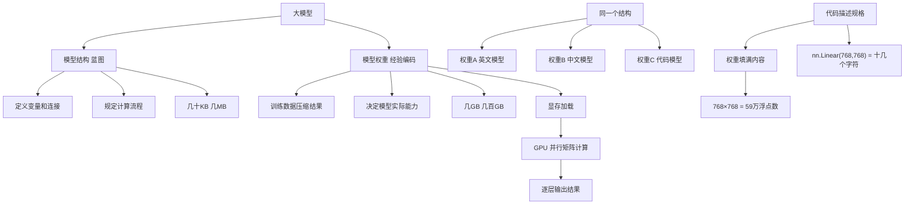

## 📋 文章信息

- **来源**: 微信公众号 - LZ AI Note
- **作者**: LZ
- **发布时间**: 2026年6月
- **阅读链接**: https://mp.weixin.qq.com/s/TM9lv6b-9AH8O9ZiApgTBA

---

## 🎯 核心摘要

这篇文章用一个只有 3 个参数的天气判断模型，彻底讲清了大模型中"代码"与"权重"的关系。核心结论：模型代码（结构）只是蓝图，定义了变量的连接方式和计算流程；模型权重才是从训练数据中提炼出的经验编码，是真正决定能力的载体。推理过程本质就是让输入数据穿过这些存储在显存中的数字矩阵，逐层计算得到输出。文章从最小模型出发，自然过渡到参数爆炸、显存加载、GPU 并行计算等关键话题，是一篇极佳的大模型入门科普。

## 📊 核心观点

### 1. 代码定义蓝图，权重存储知识

**背景/现状**：
- 下载开源模型时，代码只有几十 KB，权重文件却有几个到几十 GB
- 初学者往往困惑：模型的知识到底存在哪里？

**核心论述**：
- 模型结构本质上是一张蓝图，描述有哪些变量、怎么连接、执行什么计算
- 代码只规定了"这里需要三个数字"，但没有规定"这三个数字具体是多少"
- 训练后得到的权重（如 w1=0.7, w2=-0.3, b=5.0）是从历史数据中提炼的经验压缩结果
- 原始训练数据不会保存，保存的只有这些数字

### 2. 加载权重就是填空

**背景/现状**：
- `model.load_state_dict(torch.load("weights.pth"))` 是日常高频操作

**核心论述**：
- 加载权重本质等价于把数字按名字对应复制进去：w1→w1, w2→w2, b→b
- 没有神秘计算、没有自动推理、没有重新训练
- 空蓝图 + 具体数字 = 完整模型

### 3. 结构和权重，权重更决定能力

**背景/现状**：
- 同一个 Transformer 架构可以搭配不同权重

**核心论述**：
- 同结构 + 权重 A = 英文模型；同结构 + 权重 B = 中文模型；同结构 + 权重 C = 代码模型
- 结构没变，变化的是权重
- 类比：模型结构 = 大脑/神经系统，模型权重 = 记忆/学到的知识
- 真正决定模型能力的是权重文件，不是结构文件

### 4. 参数爆炸源于全连接

**背景/现状**：
- 从 3 参数天气模型到 GPT-3 的 1750 亿参数，跨度巨大

**核心论述**：
- 1000 个输入 × 1000 个输出 = 100 万权重
- 8192 × 8192 = 6700 万参数（单个矩阵）
- 几十上百层叠加后达到 70B、175B 级别
- nn.Linear(768, 768) 这十几个字符的代码对应 59 万个浮点数
- 代码描述规格，权重填满内容；规格不会特别大，内容可以无限增长

### 5. 推理必须在显存中进行

**背景/现状**：
- 权重放在 SSD，为什么还要占显存？

**核心论述**：
- 生成一个词时几乎每层都要访问权重，70B 模型 FP16 存储 ≈ 140GB
- SSD 带宽约 7GB/s，读完整个模型需十几到二十秒，远达不到"每秒几十 Token"的期望
- 实际流程：SSD → 内存 → 显存 → GPU 计算，推理时权重常驻显存
- GPU 之所以快，不是因为单个计算强，而是因为能同时做大量相同计算（矩阵并行）

## 🧠 概念图谱

## 🔑 关键洞察

### 1. "大"不是算法复杂，而是记住了太多

**分析**：
- GPT-3 有 1750 亿参数，很多人以为藏着某种全新的数学，实际上模型结构描述的事情非常简单：乘法、加法、传给下一层
- 真正庞大的不是算法本身，而是训练过程中学出来的数字
- 这个洞察帮助理解为什么模型微调（Fine-tuning）有效——微调修改的就是这些数字

### 2. 显存瓶颈是推理的核心约束

**分析**：
- 文章清晰地解释了为什么权重必须常驻显存：不是因为"设计如此"，而是因为 IO 带宽的限制
- SSD → 内存 → 显存的数据搬运是推理延迟的主要来源之一
- 这也解释了为什么量化（将 FP16 压缩为 INT8/INT4）如此重要——直接减少显存占用

### 3. "蓝图 + 填空"的认知模型极具启发性

**分析**：
- 用"蓝图 + 填空"类比结构 + 权重，比"大脑 + 记忆"更直观
- 这解释了为什么可以"偷"模型结构但无法复制能力（权重才是灵魂）
- 也解释了为什么开源权重如此珍贵——结构人人可写，权重需要海量算力训练

## 🔮 延伸思考

### 从"蓝图 + 填空"理解模型迁移和蒸馏

- 既然结构是蓝图、权重是知识，那知识蒸馏就是把大模型的"经验数字"压缩迁移到小模型的"填空格"中
- LoRA 微调则是在不修改原有权重的前提下，额外学习一小组"补丁数字"

### 参数效率的未来方向

- 如果知识全存在权重里，那能否用更少的参数存同等知识？
- 稀疏化、MoE（混合专家）本质上是在让模型更聪明地使用这些数字

## 💡 实践启示

### 1. 理解模型部署的关键步骤

**要点**：
- 部署大模型的核心流程：定义结构 → 加载权重 → 搬入显存 → 输入逐层流过 → 输出结果
- 显存大小是硬件选型的第一约束，模型参数量 × 精度字节数是最低显存需求

### 2. 对模型能力的正确预期

**要点**：
- 模型"能力"不在代码，在权重——换权重就是换模型
- 不要试图通过修改模型结构来大幅提升已有模型的能力

### 3. 入门学习的推荐路径

**要点**：
- 先理解"蓝图 + 填空"的直觉，再去学 Transformer、注意力机制等具体结构
- 从最小模型（几个参数）开始手动走一遍推理，比直接啃 GPT 架构更有效

## 📝 关键金句

> "代码负责定义大脑的结构。权重负责保存大脑的记忆。而推理，本质上就是让输入数据穿过这些记忆，最终得到答案。"

> "权重 ≠ 普通数字。权重 = 从训练数据中提炼出来的经验。"

> "模型结构描述的事情非常简单：乘法、加法、结果传给下一层。真正庞大的，不是算法本身，而是那些训练过程中学出来的数字。"

> "代码负责描述规格，权重负责填满内容。规格不会变得特别大，内容可以无限增长。"

## 🏷️ 标签

大模型、推理机制、权重、模型结构、GPU、显存、神经网络、入门科普、LLM

---

## 🔗 相关资源

- **原文链接**：https://mp.weixin.qq.com/s/TM9lv6b-9AH8O9ZiApgTBA
- **拓展阅读**：Transformer 架构详解、模型量化与推理优化、LoRA 微调原理
