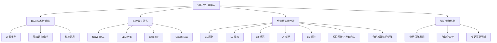

## 📋 文章信息

- **来源**: 知乎专栏 - 技术实践
- **作者**: （知乎作者）
- **发布时间**: 2025年
- **阅读链接**: https://zhuanlan.zhihu.com/p/2050613582593779556

---

## 🎯 核心摘要

文章从工程知识库的实际痛点出发，系统对比了四种主流知识库范式（Naive RAG、LLM Wiki、Graphify、GraphRAG），指出它们共同缺失的"层次感知 + 角色适配"能力。作者提出"金字塔知识库"范式，将知识按稳定性和抽象度分为五层（原则→架构→规范→实现→经验），配合知识图谱的七种有向边做跨层关联，结合角色-层级访问矩阵实现不同角色看到不同层次的知识。在 831 篇文档、200 条 QA 的评测中，Pyramid+RAG 混合方案 Hit@3 达到 89%，显著优于 Naive RAG。

## 📊 核心观点

### 1. RAG 存在三个结构性缺陷

**背景/现状**：
- RAG（chunk → embedding → Top-K → LLM）是当前最流行的知识库方案
- 在简单问答场景表现尚可，但在工程知识库中暴露根本问题

**核心论述**：
- **从零推导**：LLM 每次查询都重新发现知识，没有积累（Karpathy："no accumulation"）
- **无法连点成线**：平坦向量检索无法连接分散信息（Microsoft GraphRAG 研究证实）
- **粒度混乱**：设计原则和代码实现可能在语义上很近，但服务于不同认知需求

### 2. 四种范式各有侧重但都缺少层次感知

**背景/现状**：
- Naive RAG：平铺向量检索，无积累无关联
- LLM Wiki（Karpathy）：持续编译的知识工件，有积累但无自动关联
- Graphify：代码即图谱，擅长关联分析但不擅长直接问答
- GraphRAG（Microsoft）：图谱增强检索，构建成本高、增量更新困难

**核心论述**：
- 四种范式都无法回答"用户在问哪个层次的问题"
- 知识库的四个常见症状（搜到重复、层次错配、不知影响、新人迷路）根源都是缺少结构

### 3. 金字塔五层设计是核心创新

**背景/现状**：
- 工程知识天然具有不同的稳定性和抽象度
- 软件工程中从不变原则到易变经验，存在清晰的层次划分

**核心论述**：
- L1 原则（年稳定期）→ L2 架构（季度）→ L3 规范（月度）→ L4 实现（周级）→ L5 经验（天级）
- 每层有不同保鲜周期和更新触发机制
- 检索逻辑从"从所有文档中找最像的"变为"先确定去哪层找，再精确定位"

### 4. 角色感知让同一知识库服务不同人

**背景/现状**：
- 架构师和开发者需要的知识层次完全不同
- 有限的 context window 需要优先填充最相关知识

**核心论述**：
- 角色-层级访问矩阵：架构师看 L1+L2，开发者看 L2+L3+L4
- 独立的 context_budget 和 priority_order，按优先层逐层填充直到预算用完

### 5. 知识保鲜比知识积累更重要

**背景/现状**：
- 知识库最大的敌人不是"没有内容"而是"内容过期"
- 过期文档比没有文档更危险

**核心论述**：
- 三种腐烂形式：静默过期、层级漂移、覆盖盲区
- 变更驱动更新优于日历驱动更新（绑定架构评审、Lint 变更、故障复盘等已有工作流）
- 用可自动化审计指标替代人工巡检

## 🧠 概念图谱

## 🔑 关键洞察

### 1. 知识库的本质问题不是检索精度而是知识结构

**分析**：
- 所有优化（rerank、hybrid search、query routing）都在"平铺知识"的框架内修补
- 文章揭示的根本洞察：工程知识是"一棵树"和"一张图"，不是"一袋词"
- 向量相似度和认知需求是两个正交维度——语义近不代表需要相同

### 2. LLM 作为知识维护者而非检索者

**分析**：
- Karpathy 的 LLM Wiki 洞察被文章引用为关键灵感
- LLM 擅长做摘要、交叉引用、归档——这些恰恰是人类维护 wiki 失败的原因
- 人类角色从"维护者"转变为"策展者和质量把关人"

### 3. 混合方案优于单一方案

**分析**：
- Pyramid+RAG（Hit@3=89%）显著优于纯 Pyramid（64.5%）或纯 RAG（75%）
- 金字塔做结构化路由（0 API 调用），向量检索补代码级深度（1 API 调用）
- 这暗示未来知识库的方向不是选一个方案，而是按需组合

### 4. 冷启动成本是分层方案的核心代价

**分析**：
- 金字塔需要预先 ingest 构建结构，Naive RAG 即开即用
- 但一旦构建完成，检索成本极低（0 API 调用、纯本地、低 token 消耗）
- 这是一个典型的"前期投入换取长期收益"的工程权衡

## 🚧 不足与局限

### 1. 评测规模有限
- 仅 200 条 QA、单一团队知识库、单评估者非盲评
- A 模式（Naive RAG）数据为估算值，非实测

### 2. 金字塔对代码级细节覆盖不足
- 文章自评代码级深度 ★★★，需要向量检索穿透补深度
- 跨服务关联维度表现相对较弱（68%）

### 3. 缺少增量更新的完整验证
- 增量同步机制描述了四策略（skip/update/move/write），但缺少实际运行数据

### 4. 适用范围待验证
- 仅在中等规模工程团队（14 个代码服务、5 个业务域）测试
- 跨团队、跨领域的通用性未知

## 🔮 延伸思考

### 方向1：与 Agent-native 知识架构的融合
- 文章标题提到"Agent-native Knowledge Context Layer"但正文中未展开
- 如果 Agent 能自主判断需要哪个层次的知识，金字塔的角色感知矩阵可以成为 Agent 的知识路由表

### 方向2：知识图谱的动态演化
- 七种有向边是预定义的，实际工程中知识关系可能更复杂
- 可以引入社区检测自动发现新的关系模式和知识聚类

### 方向3：个人知识管理的映射
- 金字塔五层结构可以映射到个人知识管理：人生原则 → 价值观 → 习惯 → 技能 → 经验
- LLM Wiki 的编译思想可以用于构建个人"第二大脑"

## 💡 实践启示

### 1. 先给知识分层次，再做检索优化

**要点**：
- 在构建或优化知识库前，先问：知识应该如何分层？
- 不同稳定性、不同抽象度的内容不应混在同一个检索池中
- 即使不实现完整的金字塔，简单的分层标签也能显著改善检索质量

### 2. 知识保鲜绑定到已有工作流

**要点**：
- 不要创建独立的"知识库维护"任务，没人会做
- 将知识更新绑定到代码变更、架构评审、故障复盘等已有流程
- 新人提问是最好的"知识缺口检测器"

### 3. 用审计指标替代人工巡检

**要点**：
- 建立可自动化的健康指标：覆盖率、新鲜度、图谱连通性、层级平衡
- 设定明确的阈值（如"无超过 90 天未更新的 L4/L5"）
- 让腐烂的知识自己暴露，而不是靠人去找

### 4. 混合检索是最优解

**要点**：
- 结构化路由（分层/图谱）+ 向量检索（语义精确）的组合优于单一方案
- 先用结构缩小搜索空间，再用语义做精确定位
- 这个思路可以泛化到其他信息检索场景

## 📝 关键金句

> "LLM 在每个问题上都从头重新发现知识，没有任何积累。" — Andrej Karpathy

> "人类放弃 wiki 是因为维护负担增长快于价值。" — Andrej Karpathy

> "向量检索把知识当成'一袋词'，而工程知识是'一棵树'和'一张图'。"

> "过期的文档比没有文档更危险——因为它给你错误的信心。"

> "程序员问一个问题，AI 能在 3 秒内返回正确层次、正确角色、正确关联的答案——而不是 5 段不相关的文本。"

## 🏷️ 标签

AI、RAG、知识库、知识图谱、Agent、架构设计、分层编排、GraphRAG

---

## 🔗 相关资源

- **LLM Wiki Pattern** (Karpathy): https://gist.github.com/karpathy/442a6bf555914893e9891c11519de94f
- **Graphify**: https://github.com/safishamsi/graphify
- **Microsoft GraphRAG**: https://microsoft.github.io/graphrag/
