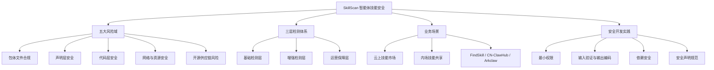

## 📋 文章信息

- **来源**: 微信公众号 - 字节跳动技术团队
- **作者**: 火山引擎 AI 安全
- **发布时间**: 2026年7月1日
- **阅读链接**: https://mp.weixin.qq.com/s/GaefP5FMN8b-1JBfrUMqzQ

---

## 🎯 核心摘要

文章系统介绍了火山引擎推出的 SkillScan——面向 AI Agent 技能包的全链路安全检测方案。随着 Agent 技能生态快速发展，社区贡献的技能质量参差不齐，存在被恶意利用的风险。SkillScan 从包体合规、声明层安全、代码安全、网络资源安全、开源供应链五个维度构建检测体系，并针对云上技能市场、内场共享等不同业务场景提供差异化防护策略。文章还给出了四条技能安全开发最佳实践原则。

## 📊 核心观点

### 1. Agent 技能面临五大类安全风险

**背景/现状**：
- AI Agent 技能生态迅速发展，社区开发者贡献的技能数量与日俱增
- 技能来源多样、质量参差不齐，安全性缺乏有效保障

**核心论述**：
- **包体文件合规风险**：恶意文件植入、硬编码凭证、资源耗尽攻击、目录穿越
- **声明层安全风险**：提示词注入（skill.md 中嵌入恶意指令）、敏感行为声明、高风险依赖声明
- **代码层安全风险**：恶意代码植入、危险函数调用（eval/exec/subprocess）、容器逃逸、敏感路径访问
- **网络与资源安全风险**：未加密 HTTP 通信、C2 通信特征、资源耗尽攻击
- **开源合规与供应链风险**：许可证不合规（GPL 传染）、已知漏洞组件、依赖链投毒、威胁情报匹配

### 2. 检测能力分三层递进

**背景/现状**：
- 不同业务场景面临的安全威胁不同，对检测能力的需求各有侧重

**核心论述**：
- **基础检测层**（默认开启）：包体合规、声明层安全、代码恶意行为、网络连接风险、供应链威胁
- **增强检测层**（按需配置）：开源许可证合规、SCA 软件成分分析、内网敏感信息检测、数据外发检测
- **运营保障层**（持续运营）：威胁情报更新、误报漏报处理、高危技能应急响应

### 3. 不同场景需要差异化防护策略

**背景/现状**：
- SkillScan 已覆盖火山引擎内外多个主流技能生态场景

**核心论述**：
- **云上技能市场**：面向公网用户分发，主要威胁是恶意技能上传、技能投毒、供应链攻击，采用"入口层 + 内容层 + 运营层"三层防护
- **内场技能共享**：企业内部流转，额外增加内网敏感信息检测、数据外发检测、权限合规检查
- **安全准入要求**：8 项高风险检测项命中后需人工复核，确认风险的禁止上架

### 4. 四种接入模式适应不同业务需求

**背景/现状**：
- 不同业务方的集成能力和安全要求差异大

**核心论述**：
- 提供 Webhook、API 调用、SDK 集成、CI/CD 流水线嵌入四种接入模式
- 业务方可根据自身安全要求调整准入策略和风险等级阈值

## 🧠 概念图谱

## 🔑 关键洞察

### 1. Agent 技能安全是供应链安全的延伸

**分析**：
- 技能包本质上是"代码 + 配置 + 声明"的打包体，安全问题与 npm/pypi 包投毒高度类似
- 但新增了"声明层"这一独特风险面——skill.md 中的提示词注入是 Agent 时代特有的攻击向量
- LLM 读取 skill.md 后可能被诱导执行非预期操作，这是传统软件供应链安全不曾面对的

### 2. 提示词注入成为新的攻击面

**分析**：
- skill.md 作为技能的声明文件，其内容会被 LLM 直接读取和执行
- 在描述或示例中嵌入恶意指令，可能劫持 Agent 的行为
- 这标志着安全边界从"代码执行"扩展到"语义理解"层面

### 3. 分层检测映射了纵深防御思想

**分析**：
- 基础层→增强层→运营层的递进，本质上就是纵深防御
- 先用低成本自动化检测覆盖高风险场景，再用增强检测和人工运营兜底
- 这种分层思路适用于任何新兴生态的安全治理

### 4. 安全准入标准是生态治理的关键抓手

**分析**：
- 明确的 8 项高风险"红线"为技能上架设定了清晰的边界
- 比起事后补救，事前准入更能有效阻止恶意技能进入生态
- 这与移动应用商店的审核机制同理——生态安全需要准入门槛

## 🚧 不足与局限

### 1. 未披露检测效果数据
- 文章未给出 SkillScan 的检出率、误报率、漏报率等量化指标
- 缺少与其他安全扫描方案的对比评测数据

### 2. 运行时安全覆盖不足
- 文章侧重静态分析（包体检查、代码扫描、声明审查）
- 对技能运行时的行为监控（沙箱执行、动态分析）着墨较少

### 3. 开发者视角偏轻
- 开发实践部分仅给出四条原则性建议，缺少具体的代码示例和安全编码指南
- 未提供自检工具或 CI 集成示例

## 🔮 延伸思考

### 方向1：跨平台技能安全标准化
- 不同 Agent 平台（OpenClaw、GPTs、Claude Tools 等）的技能格式各异
- 是否需要行业统一的技能安全检测标准，类似 OWASP 依赖检查？

### 方向2：AI 驱动的安全检测
- 文章中的检测以规则匹配为主，AI/LLM 能否增强检测能力？
- 例如用 LLM 理解技能语义，检测"功能声明与代码实现不一致"等隐含风险

### 方向3：技能可信评级体系
- 类似 SSL 证书或应用商店评分，可以为技能建立可信度评级
- 结合静态检测 + 历史行为 + 社区反馈，形成动态信任评分

## 💡 实践启示

### 1. Agent 技能开发者需警惕提示词注入

**要点**：
- skill.md 中不要包含可能被 LLM 误解为指令的内容
- 将"描述"和"指令"明确分离，避免模糊地带
- 对用户输入进行严格过滤，防止间接提示词注入

### 2. 技能发布前做自检清单

**要点**：
- 包体：无二进制文件、无硬编码密钥、无超大/隐藏文件
- 声明：skill.md 无恶意指令、权限声明与功能匹配
- 代码：无危险函数调用、无敏感路径访问、依赖无已知漏洞
- 网络：仅访问必要域名、使用 HTTPS

### 3. 最小权限原则是核心防线

**要点**：
- 仅申请技能真正需要的权限
- 优先使用平台安全封装的 API，避免 exec/subprocess
- 文件和网络访问都应限定在最小必要范围内

## 📝 关键金句

> "技能安全风险贯穿于技能包的整个生命周期，从文件结构、声明配置到代码实现，再到依赖管理和运行时行为，每个环节都可能存在安全隐患。"

> "过期的文档比没有文档更危险"——在安全领域同样适用：一个"被认为安全"的恶意技能比一个"未知风险"的技能更危险。

> "技能来源多样、质量参差不齐，其安全性缺乏有效保障。"

## 🏷️ 标签

AI、Agent、安全、技能安全、供应链安全、提示词注入、字节跳动、SkillScan、最佳实践

---

## 🔗 相关资源

- **原文链接**: https://mp.weixin.qq.com/s/GaefP5FMN8b-1JBfrUMqzQ
- **拓展阅读**: OWASP 供应链安全指南、npm/pypi 包投毒案例分析
