## 📋 文章信息

- **来源**: 微信公众号 - 腾讯云开发者
- **作者**: 李伟山
- **发布时间**: 2026年7月
- **阅读链接**: https://mp.weixin.qq.com/s/3Zbx4RHB4fOdomI5aA_wIQ

---

## 🎯 核心摘要

文章系统梳理了 AI 工程领域从 2022 到 2026 年的四层范式演进——Prompt Engineering、Context Engineering、Harness Engineering、Loop Engineering。核心论点是这四层是**嵌套关系而非替代关系**，外层在内层基础上增加新工程维度。文章逐层拆解每层的定义、技术手段、企业价值与天花板，提出"四层诊断框架"帮企业判断 Agent 故障的根因所在，并给出由内而外逐层验证的务实采纳路径。核心洞察：**企业 Agent 落地的瓶颈已从模型能力迁移到系统工程能力**。

## 📊 核心观点

### 1. 四层是嵌套关系，不是替代关系

**背景/现状**：
- 很多团队误以为"现在是 Loop Engineering 时代了，不用搞 Prompt Engineering 了"
- 2022→2026 年范式迁移了四遍，每层都有行业大佬背书（Karpathy、Hashimoto、Cherny、Osmani）

**核心论述**：
- Context Engineering **包含** Prompt Engineering
- Harness Engineering **包含** Context Engineering
- Loop Engineering **包含**以上所有
- 外层不取消内层——如果 prompt 写得模糊、context 配置混乱，再好的 harness 也救不了

### 2. L1 Prompt Engineering：Agent 的"语言能力"

**背景/现状**：
- 一切的起点，关注"同样的信息换种说法模型表现会不会更好"
- 技术手段：角色设定、输出格式约束、Few-shot、Chain-of-Thought、结构化模板

**核心论述**：
- **天花板**：信息孤岛（不知道业务数据）、无记忆（跨 turn 丢失）、人是瓶颈（吞吐量等于人的带宽）
- **定位**：个人生产力工具，不是组织基础设施
- 大多数企业在这一层停留太久——止步于此，Agent 永远无法从"聊天窗口"进化为"业务流程节点"

### 3. L2 Context Engineering：Agent 的"知识能力"

**背景/现状**：
- Karpathy 2025 年提出"prompt engineering 应该让位给 context engineering"
- Anthropic 正式定义为"策划和维护最优 token 集的策略集"

**核心论述**：
- 技术手段：RAG、MCP、Message History 管理、Tool Schema 精简
- **天花板**：模型的"手"不受控（只管 input 不管 output）、错误不会自愈、仍依赖人触发和人判断
- **关键概念"Context Rot"**：context window 有限，token 数量增加导致召回准确率下降

### 4. L3 Harness Engineering：Agent 的"可靠性"

**背景/现状**：
- Hashimoto 2026 年提出"engineer the harness"，OpenAI 同步发布同名文档
- LangChain 公式：**Agent = Model + Harness**

**核心论述**：
- Harness 五个核心组件：Guides（AGENTS.md）、Sensors（output parser/eval）、Enforcement（linter/test gate）、Context Pipeline（L2 数据管线）、Observability（完整 trace）
- **L2 vs L3 本质区别**：L2 是"给考生发了正确教材期望考好"（基于信任），L3 是"设了阅卷系统和作弊检测不管什么教材答案必须过审"（基于验证）
- **天花板**：仍人触发人收尾、无跨 session 记忆、不能并行规模化
- AGENTS.md 的增长模式：犯错→分析根因→加规则→不再犯，可靠性随时间单调递增

### 5. L4 Loop Engineering：Agent 的"自主性"

**背景/现状**：
- Osmani 2026 年分析发现 Codex 和 Claude Code 独立收敛到几乎相同的 Loop 架构
- Cherny："我不再 prompt Claude 了，我设计循环来 prompt Claude"

**核心论述**：
- Loop 六要素：Automations（自动触发）、Worktrees（工作隔离）、Skills（技能编码）、Plugins/Connectors（MCP 连接）、Sub-agents（maker-checker 分离）、State（外部持久化存储）
- **新风险**：成本可预测性大幅下降（组合爆炸）、可靠性新风险面（triage 错误、死锁、state 损坏）、Comprehension Debt（理解力负债）和 Cognitive Surrender（认知投降）
- **定位**：只有在 L3 扎实基础上才应尝试，没有 L3 的 L4 = 不可靠的全自动化系统

### 6. 四层诊断框架：先判断故障在哪一层

**核心论述**：
- 2025-2026 年大多数生产级 Agent 故障是 **harness 层故障被误诊为 prompt/context 层故障**
- 案例：退款政策搞错（L2 RAG 检索到过期文档，不是 prompt 问题）、废弃 API 仍在用（L3 缺 deprecated detector，不是 context 问题）、一天只能处理 5 个 issue（L4 人在串行驱动，不是模型慢）

## 🧠 概念图谱

```mermaid
graph TD
    A[Agent 工程四层嵌套模型] --> B[L1 Prompt Engineering]
    A --> C[L2 Context Engineering]
    A --> D[L3 Harness Engineering]
    A --> E[L4 Loop Engineering]

    B --> B1[角色设定 / CoT / Few-shot]
    B --> B2[天花板: 信息孤岛+无记忆+人瓶颈]

    C --> C1[RAG / MCP / History管理]
    C --> C2[天花板: 手不受控+错误不自愈+人触发]
    C --> C3[Context Rot 概念]

    D --> D1[Guides / Sensors / Enforcement]
    D --> D2[Context Pipeline / Observability]
    D --> D3[信任策略 vs 验证策略]
    D --> D4[天花板: 人触发+无跨session+不并行]

    E --> E1[Automations / Worktrees / Skills]
    E --> E2[Plugins / Sub-agents / State]
    E --> E3[新风险: 成本爆炸+可靠性+认知投降]

    A --> F[企业采纳路径]
    F --> F1[阶段1: 夯实L1+L2 验证可行性]
    F --> F2[阶段2: 建设L3 可靠执行]
    F --> F3[阶段3: 试点L4 无人值守]
```

## 🔑 关键洞察

### 1. "信任策略" vs "验证策略"是 L2→L3 的核心分水岭

**分析**：
- L2 的哲学是"给模型看正确信息，期望它做正确事"——本质是信任模型
- L3 的哲学是"不管模型看到什么，输出必须通过外部检查"——本质是验证流程
- 这个区分有深远的架构影响：从"概率性正确"到"可验证的正确"，是企业 Agent 从 PoC 到 production 的关键跨越
- 类比精妙：L2 是发教材，L3 是设阅卷系统

### 2. AGENTS.md 是错误经验的结构化沉淀

**分析**：
- 文章对 AGENTS.md 的定义超越了"项目规则文档"——它本质上是"失败模式的知识库"
- 每一条规则对应一个曾经的失败模式，增长模式是"犯错→加规则→不再犯"
- 这创造了一个工程学正循环：系统可靠性随时间单调递增
- 这个思路可以推广到任何需要 LLM 参与的系统设计中

### 3. Cognitive Surrender 是 L4 最隐蔽的风险

**分析**：
- Loop 越流畅，人越倾向于停止审查和思考——这不是技术风险而是人性风险
- "用判断力设计 Loop 是加速器，用 Loop 来逃避思考是灾难"——这句警示极为深刻
- 类比自动驾驶的 complacency：系统越好用，人越不关注，出问题时反应越慢
- 这在 Agent 工程领域是全新的风险管理维度

### 4. 范式迁移的本质是"人在系统中的角色变迁"

**分析**：
- L1：人管每句话怎么说
- L2：人管模型看到什么
- L3：人管执行环境设计
- L4：人管自动化系统编排
- 每一层都把人推到更高层抽象，也意味着核心能力从"调模型"转向"系统设计"
- 这与 DevOps/SRE 的思维方式高度相似

## 🚧 不足与局限

### 1. 偏重代码 Agent 场景
- 文章大量引用 Codex、Claude Code 等编程 Agent 案例
- 对非代码场景（客服、销售、运营）的 L3/L4 具体实践方案着墨较少
- 部分概念（worktree、linter、test gate）在其他领域需要重新映射

### 2. 缺少量化数据支撑
- 未给出各层投入的 ROI 对比数据
- "准确率 85%+"等退出标准缺乏行业基准参考
- 成本模型（token 消耗的层级差异）只有定性描述

### 3. 行业适配部分较薄
- 金融、客服、软件工程的适配差异仅做概述
- 医疗、法律、制造业等高风险行业未涉及

## 🔮 延伸思考

### 方向1：L5 Meta-Loop Engineering 的可行性
- 文章提到斯坦福/MIT 的 Meta-Harness 概念验证——Agent 自己优化 Loop 配置
- 这意味着从"人设计系统让 Agent 运行"到"Agent 设计系统让自己运行"
- 关键问题是：谁来验证 Meta-Loop 的优化方向是否正确？

### 方向2：四层模型在其他 AI 应用领域的映射
- 非代码 Agent（客服、教育、医疗）是否遵循相同的四层演进路径？
- 比如"教育 Agent"的 Harness 可能是什么？Skill 可能是什么？
- 每个领域的"验证"手段不同，L3 的实现形态也会不同

### 方向3：团队组织结构的适配
- 四层模型不仅是技术架构，也隐含了团队角色需求
- L1/L2 需要的是 prompt engineer 和 RAG engineer
- L3 需要的是 SRE/DevOps 思维的工程师
- L4 需要的是系统架构师
- 企业是否需要相应调整团队结构和招聘策略？

## 💡 实践启示

### 1. 停止在 L1 上过度投入

**要点**：
- 如果团队还在花大量时间"调 prompt"，可能在错误层面用力
- prompt 优化有收益递减点，到了就该向下一层推进
- 退出标准：prompt + context 优化已进入收益递减阶段

### 2. 把主要精力放在 L3

**要点**：
- Harness Engineering 是 2026 年企业 Agent 落地的决胜层
- 一个可靠的单任务 Agent 比不可靠的全自动系统有价值得多
- 从 AGENTS.md 开始，把每次失败模式编码为规则
- 确定性约束（linter/test gate）> 概率性引导（prompt 里写"请遵守"）

### 3. 建立四层诊断思维

**要点**：
- Agent 出问题时不要急着改 prompt 或换模型
- 先判断故障在哪一层：是 prompt 问题？context 问题？harness 问题？还是 loop 问题？
- 大多数生产故障是 L3 问题被误诊为 L1/L2 问题

### 4. L4 从最小 Loop 开始

**要点**：
- 不要一上来就搞全自动化，从一个场景、一对 maker-checker 开始
- 设置严格 token budget 上限
- 前两周保持高频人工 review
- 监控 comprehension debt，定期做 code walkthrough

## 📝 关键金句

> "技术团队在用 Demo 阶段的工程方法论，去解决生产阶段的系统问题。"

> "Agent = Model + Harness" — LangChain

> "单靠改善 prompt 无法让 Agent 在生产环境中可靠运行；单靠优化 context 无法防止 Agent 犯同样的错；单靠搭好 harness 无法让 Agent 持续自主地完成复杂目标。"

> "在 prompt 里写'请遵守编码规范'是 L1/L2 的做法；在 CI pipeline 里接一个 linter 让违反规范的 PR 无法合并——这是 L3 的做法。前者是'请你遵守'，后者是'你不遵守就过不了'。"

> "Build the loop. Stay the engineer." — Addy Osmani

## 🏷️ 标签

AI、Agent、工程化、Prompt Engineering、Context Engineering、Harness Engineering、Loop Engineering、企业落地、系统设计

---

## 🔗 相关资源

- **Mitchell Hashimoto, "My AI Adoption Journey"** (2026.02.05)
- **OpenAI, "Harness Engineering: Leveraging Codex in an Agent-First World"** (2026.02.11)
- **Anthropic, "Effective Context Engineering for AI Agents"** (2025.09.29)
- **Addy Osmani, "Loop Engineering"** (2026.06.08)
- **Andrej Karpathy, X Post on Context Engineering** (2025.06.25)
