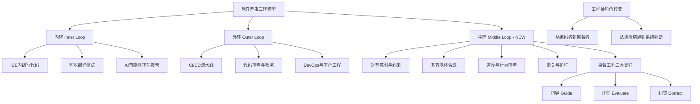

## 📋 文章信息

- **来源**: 微信公众号 - 思特沃克洞见（Thoughtworks）
- **作者**: Richard Gall
- **发布时间**: 2026年
- **阅读链接**: https://mp.weixin.qq.com/s/i_hPgGH5CMg3HivTHyBrJA

---

## 🎯 核心摘要

文章提出了软件开发中"中环"（Middle Loop）的新概念。传统软件开发分为内环（IDE 内编写代码）和外环（git push 后的 CI/CD 部署），而 AI 代码智能体的出现催生了第三层——中环：人类判断与机器执行相互摩擦的阶段。文章提出"监督工程"（Supervision Engineering）作为中环的核心方法论，围绕三大支柱（指导、评估、纠错）展开，强调工程师角色正从"编写代码"转向"监督系统"，核心能力从语法精通转向系统架构理解和判断力。

## 📊 核心观点

### 1. AI 打破了软件开发的"双环"模型

**背景/现状**：
- 几十年来软件开发被整齐地组织成内环（IDE 内编码）和外环（部署）
- 生成式 AI 和自主编码智能体能在几秒内产出数百行语法完美的代码

**核心论述**：
- 瓶颈不再围绕"编写或实现代码的速度"，而是"验证的速度"
- 这催生了一个全新的操作层——中环：AI 智能体提出解决方案后，人类工程师评估、合成、把关的阶段
- 中环不取代内环和外环，而是在两者之间插入一个新的工程层

### 2. 中环的四个核心实践

**背景/现状**：
- "监督"并不意味着工程师只是看管系统，他们仍然需要做很多事情

**核心论述**：
- **对齐意图与设定约束**：在智能体构建前确立精确的架构约束、API 规范和风格指南——"提示智能体构建某些东西很容易；让它以正确的方式构建正确的东西是另一回事"
- **多智能体合成**：一个智能体写前端、一个重构后端、一个生成数据库迁移，工程师必须确保这些并行工作流的输出能干净集成
- **差异与行为审查**：审查从"检查代码怎么写"转变为"验证代码做了什么"，关注行为驱动测试、幻觉漏洞、智能体的捷径行为
- **把关与护栏**：作为触及 CI/CD 前的过滤阶段，应用策略即代码、针对性集成测试，决策机器生成代码是否足够安全

### 3. 监督工程的三大支柱

**核心论述**：
- **指导（Guide）**：将系统架构分解为"智能体大小"的区块、管理上下文窗口、将工程标准明确代码化防止幻觉
- **评估（Evaluate）**：需要深刻的系统上下文来阅读高度可行的代码并质疑——"这是否抓住了边缘情况？是否用了废弃 API？是否只是自信的胡言乱语？"
- **纠错（Correct）**：将由并行工作的不同智能体生成的代码缝合在一起，保持架构一致性

### 4. 工程师角色的根本性转变

**背景/现状**：
- 工程责任的表面积没有缩小，而是扩大了

**核心论述**：
- 不再需要"行走的语法字典"，而是需要：
  - 对系统架构的强大心智模型
  - 对软件运行方式的机械同理心与敏感度
  - 委派和编排复杂任务的能力
- 初级开发者可能需要绕过"语法精通"阶段，直接学习严谨评估的艺术
- 资深工程师的调试经验和系统直觉是成为有效监督者的天然优势

## 🧠 概念图谱

## 🔑 关键洞察

### 1. "中环"概念精准定位了 AI 时代的工程痛点

**分析**：
- 传统内/外环模型无法描述 AI 编码 Agent 引入的新工作流
- 中环本质上是"人类判断力"介入的位置——在 Agent 产出代码和代码进入正式流程之间
- 这个概念与上一篇文章的 L3 Harness Engineering 高度呼应，都强调"验证"而非"编写"
- 但中环的视角更聚焦于人机交互的摩擦面，而非系统基础设施

### 2. 审查范式的根本转变：从"怎么写"到"做了什么"

**分析**：
- 传统 Code Review 审查人类写的代码，关注编码风格、逻辑错误
- AI 生成的代码语法完美但可能有"幻觉漏洞"——看起来合理但行为错误
- 审查重心转向行为验证：跑测试、检查边缘情况、识别自信的胡言乱语
- 这要求审查者具备更深层的系统理解，而非表面的代码阅读能力

### 3. "你过去在编写代码时慢下来；现在必须在阅读和审计代码时慢下来"

**分析**：
- 这句话揭示了 AI 时代工程效率的悖论：机器加速了生产，但人类验证的速度没变
- 如果不刻意在审查环节"慢下来"，AI 加速的只是产出错误代码的速度
- 这暗示了一个潜在的"验证瓶颈"——当 AI 产出速度远超人类审查速度时，系统会积累大量未经充分审查的代码

### 4. 文章简洁但缺少实操深度

**分析**：
- 与上一篇四层工程进化论相比，本文更像概念引入而非实操指南
- "将架构分解为智能体大小的区块"等建议缺乏具体方法论
- "机械同理心"（Mechanical Empathy）概念很有价值但未展开

## 🚧 不足与局限

### 1. 缺少具体的方法论和工具
- 文章停留在概念层面，没有给出中环的具体操作流程、工具链或度量标准
- "策略即代码"、"行为驱动测试"等提及但未深入

### 2. 未讨论团队规模和组织适配
- 监督工程需要多少人？与智能体数量的比例关系？
- 初级开发者如何获得系统直觉？培训和晋升体系如何调整？

### 3. 未涉及成本和效率量化
- 中环增加了人工审查成本，AI 编码的净 ROI 是正是负？
- 没有讨论"审查瓶颈"的解决方案（如用 AI 审查 AI 的代码）

## 🔮 延伸思考

### 方向1：AI 辅助的 AI 审查（审审循环）
- 如果 AI 生成代码的速度超过人类审查速度，是否需要"AI 审查 AI 生成代码"的中间层？
- 这形成了一个 maker-checker-observer 的三层结构，每一层用不同策略验证上一层
- 风险：同源偏差——如果生成和审查用同一个模型，系统性错误不会被捕获

### 方向2：中环的自动化程度演进
- 中环的四个实践（对齐、合成、审查、把关）各自的可自动化程度不同
- 对齐和把关（策略即代码）较容易自动化，审查和合成需要更多人类判断
- 未来中环可能也会分层：自动化的中环 + 人工的中环

### 方向3："机械同理心"作为工程师核心素养
- 这个概念值得深入展开：对软件运行方式的直觉性理解
- 在 AI 编码时代，这种能力比语法能力更稀缺也更难培养
- 可能需要新的培训和评估体系来培养这种能力

## 💡 实践启示

### 1. 重新定义 Code Review 标准

**要点**：
- 审查 AI 生成的代码时，不要看"代码写得怎么样"而要看"代码做了什么"
- 重点关注：边缘情况覆盖、废弃 API 使用、幻觉逻辑、与系统架构的一致性
- 为 AI 生成代码建立专门的审查清单

### 2. 为智能体设定明确的工程约束

**要点**：
- 在智能体开始构建前提供精确的架构约束、API 规范、风格指南
- 将工程标准显式代码化（类似 AGENTS.md），防止智能体幻觉出自己的设计模式
- 约束越明确，中环的纠错成本越低

### 3. 培养系统思维而非语法技能

**要点**：
- 初级开发者应更早接触系统架构和跨组件集成，而非在语法练习上花太多时间
- 资深工程师的调试经验和系统直觉是最有价值的监督资产
- 团队应重视"机械同理心"的培养——理解软件运行方式的直觉

## 📝 关键金句

> "瓶颈不再围绕着我们编写或实现代码的速度，而是围绕着我们验证的速度。"

> "提示智能体构建某些东西很容易；让它以正确的方式构建正确的东西则是另一回事。"

> "你过去常常在编写代码时慢下来；现在，你必须强迫自己在阅读、质疑和审计代码时慢下来。"

> "软件工程的未来不是人类 vs 机器；而是人类的判断力管理机器的速度。"

> "行业不再需要你成为一本行走的语法字典。"

## 🏷️ 标签

AI、Agent、软件工程、监督工程、中环、架构、工程化、Thoughtworks

---

## 🔗 相关资源

- **原文链接**: https://mp.weixin.qq.com/s/i_hPgGH5CMg3HivTHyBrJA
- **拓展阅读**: Mitchell Hashimoto "Harness Engineering"、Anthropic "Effective Context Engineering"、Addy Osmani "Loop Engineering"
