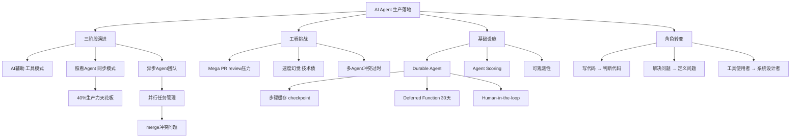

## 📋 文章信息

- **来源**: 微信公众号 - 深思圈
- **作者**: Leo
- **发布时间**: 2025年7月
- **阅读链接**: https://mp.weixin.qq.com/s/cbEtEbDb-A1_YFyf00dj0A

---

## 🎯 核心摘要

作者在旧金山参加了 Inngest 主办的 {AI} in Production 聚会，记录了 Cursor 和 Inngest 两位一线工程师的实践分享。核心内容包括：AI 开发的三阶段演进模型（AI辅助→照看Agent→异步Agent团队）、同步Agent的40%生产力天花板、工程师角色从"写代码"转向"判断代码"、以及 durable agent 在生产环境中的持久性和恢复机制。文章强调可观测性和信任建立是 AI Agent 落地的关键基础设施。

## 📊 核心观点

### 1. AI 开发的三阶段演进

**背景/现状**：
- 大部分开发者停留在 AI 辅助阶段，用 Copilot 补全代码，人是主导
- 很多人以为自己在用 AI Agent，实际在"照看 Agent"

**核心论述**：
- **阶段一 AI辅助**：AI 是工具，人是主导，主动发起交互
- **阶段二 照看Agent**：把任务交给 Agent，但必须全程在场，像"照看婴儿"
- **阶段三 异步Agent团队**：设触发条件后 Agent 自主运行，人只在关键决策节点出现
- Cursor 数据：30% 的 PR 由 AI Agent 自动完成无人工干预；企业使用云 AI Agent 比例从 15%-20% 升至 75%

### 2. 工程师角色的结构性变化

**背景/现状**：
- 几乎所有工程师花在 review 代码上的时间已超过写代码的时间
- AI 生成代码速度远超人工，但验证成为新瓶颈

**核心论述**：
- token 消耗分布显示，大量精力集中在"写完代码之后"：review、验证、测试、调试
- AI Agent 产生大量 "mega PR"，单次改动文件多，review 难度直线上升
- **速度幻觉**：AI 写得太快，你没时间跟上节奏，实际在积累技术债
- **核心能力转变**：从"写代码的能力"变成"判断代码好坏的能力"
- 不同模型在不同任务上表现差异大，需要"用人所长"的思维搭配模型

### 3. 40% 生产力天花板与异步突破

**背景/现状**：
- 很多开发者用 AI Agent 后生产力提升稳定在 40% 后不再增长，这是跨公司的普遍现象

**核心论述**：
- **根因**：同步 Agent 的注意力瓶颈——agent 做一步你确认一步，你的反应速度就是上限
- **突破**：转向异步 Agent 团队，Agent 在后台并行处理，人只在关键节点做决策
- **新挑战**：多 Agent 并行修改同一代码库时，merge 冲突极其复杂，Agent 会因之前的 merge 进入"过时状态"
- **根本解法不在技术层面**：需要在任务分配前思考清楚任务间的依赖关系，只有真正独立的任务才应并行

### 4. Durable Agent：生产环境的关键能力

**背景/现状**：
- 把 AI Agent 跑在本地和部署进生产环境之间有很大鸿沟
- 传统做法是整个任务失败后重跑，浪费时间和成本，某些有副作用的步骤根本不能重跑

**核心论述**：
- **Durable Agent 定义**：能从失败状态恢复的 Agent
- **核心机制**：缓存每一个执行步骤，失败时从断点继续而非从头开始（类似分布式系统的 checkpoint）
- **Deferred Function**：延迟执行函数，支持最长 30 天 defer，处理"等人"环节（如法务审核合同）
- 本质是 **human-in-the-loop 设计哲学**：人工参与不是缺陷，而是能力边界的必要补充

### 5. 信任与可观测性是落地基础设施

**背景/现状**：
- Cursor 内部 60% 代码由 AI 生成，准确率超过 98%，但 2% 错误率在高频任务下仍是灾难
- AI Agent 领域的工具链和可观测性基础设施还很早期

**核心论述**：
- 信任不是全有全无，而是基于场景和风险的精细化判断
- 低风险可逆任务可以让 Agent 完全自主，高风险不可逆任务需插入人工确认
- **Agent Scoring**：实时评分和评估每一步输出，建立行为可见性
- **可观测性是最被低估的基础能力**：当 Agent 出了问题，你需要知道哪一步出了问题、怎么定位原因、怎么防止重犯

## 🧠 概念图谱

## 🔑 关键洞察

### 1. "照看Agent"是最容易被忽视的陷阱

**分析**：
- 大部分团队高估了自己的 Agent 成熟度，以为在阶段三实际在阶段二
- 阶段二比阶段一更耗精力：既没解放双手，又没在做有价值的决策，只是在"管理"一个不太可靠的系统
- 识别自己真实所处的阶段，是制定下一步策略的前提

### 2. 任务设计能力比 Agent 能力更重要

**分析**：
- 多 Agent 并行冲突不是技术问题，是任务规划问题
- 在分配任务前理清依赖关系，是区分"普通用法"和"高水平用法"的关键
- 这意味着系统设计师/架构师的价值在 Agent 时代不降反升

### 3. 分布式系统的经典难题在 Agent 时代重生

**分析**：
- Checkpoint、重试、状态恢复、幂等性——这些传统分布式系统的核心问题以新形式出现在 AI Agent 领域
- 有传统工程积累的工程师在新领域会有结构性优势
- AI Agent 的可靠性工程可能成为下一个重要的专业化方向

### 4. 核心问题从"让AI做什么"变为"让人做什么"

**分析**：
- 这不是简单的角色互换，而是系统设计的范式转变
- 那些需要对"我们在做什么、为什么做"有深刻理解的事情，目前仍需人来完成
- 工程师需要更强的系统设计能力、判断力和产品感

## 🚧 不足与局限

### 1. 数据来源单一
- 主要来自 Cursor 和 Inngest 两家公司的视角，样本量有限
- 缺乏更大规模、更多公司的交叉验证

### 2. 未涉及安全性
- 文章聚焦效率和可靠性，但未深入讨论 AI Agent 的安全风险
- 多 Agent 并行修改代码库时，恶意 Agent 或被注入的 Agent 的风险未提及

### 3. 对中小企业适用性存疑
- 讨论的异步 Agent 团队、评分系统等，需要相当的基础设施投入
- 对于资源有限的小团队，落地的路径可能不同

## 🔮 延伸思考

### 方向1：AI Agent 的可靠性工程是否会成为一个新职业
- 类似 SRE（站点可靠性工程师），可能出现 ARE（Agent 可靠性工程师）
- 专注于 Agent 的监控、恢复、评分和优化

### 方向2："定义问题"的教育体系
- 如果工程师核心价值转向定义问题和设计系统，现有的工程教育体系需要大幅调整
- 系统思维、产品感、判断力可能比算法和数据结构更重要

### 方向3：Agent 编排与任务规划的标准化
- 多 Agent 的任务分配、依赖管理、冲突解决，可能需要标准化的编排框架
- 类比 Kubernetes 对容器编排的标准化，Agent 编排器可能是下一个基础设施级产品

## 💡 实践启示

### 1. 诚实地评估自己所在的阶段

**要点**：
- 如果你的 Agent 还需要你全程盯着，你在阶段二
- 真正的阶段三标志是：Agent 可以在你不在时继续工作并产出可靠结果
- 制定从阶段二到阶段三的具体路径，而不是停留在"用了Agent"的幻觉中

### 2. 建立可观测性基础设施

**要点**：
- 在追求 Agent 能力之前，先确保能看到 Agent 在做什么
- 实时评分、步骤追踪、决策日志，这些是信任建立的基础
- 借鉴传统 SRE 的监控思路，应用于 Agent 领域

### 3. 在任务设计上投入更多前置思考

**要点**：
- 不要把所有任务扔给 Agent 期望自动处理好冲突
- 理清任务间的依赖关系，只有真正独立的任务才并行处理
- 任务设计能力是 AI Agent 高效使用的关键杠杆

### 4. 重新定义工程师的核心能力

**要点**：
- 系统设计能力和判断力比编码能力更稀缺
- 培养对 AI 输出的快速审查能力，识别架构意图偏差和安全漏洞
- 深度参与产品决策，而不仅仅是工程实现

## 📝 关键金句

> "大多数人以为自己在用 AI Agent，其实还停留在第二阶段。他们以为在驾驭 AI，其实只是在照看一个需要不断被推动的系统。"

> "AI 写得太快，你根本没时间跟上它的节奏。你以为在提速，实际上在积累技术债。"

> "在 AI 时代，工程师最核心的能力不再是'写代码的能力'，而是'判断代码好坏的能力'。"

> "以前我们问的是'我们想让 AI Agent 做什么'，现在更应该问的是'我们想让人做什么'。"

> "可观测性是 AI Agent 进入生产环境里最被低估的基础能力。"

## 🏷️ 标签

AI Agent、生产环境、Cursor、Inngest、异步Agent、可观测性、工程师角色、Durable Agent

---

## 🔗 相关资源

- **拓展阅读**: Cursor 官方博客 - AI Agent 在生产环境中的实践
- **拓展阅读**: Inngest 文档 - Durable Agent 与 Deferred Function
- **拓展阅读**: 全局神经元工作空间理论在 AI 系统设计中的启示
- **相关话题**: Vibe Coding 与 AI 编程工具的效率陷阱
