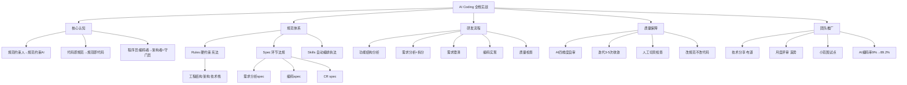

## 📋 文章信息

- **来源**: 微信公众号 - InfoQ（整理自QCon 2026北京站演讲）
- **作者**: 邓立山（淘宝闪购高级技术专家）
- **发布时间**: 2025年7月
- **阅读链接**: https://mp.weixin.qq.com/s/f7EyhoEWGx6BvmJ1gOr-Mw

---

## 🎯 核心摘要

本文整理自淘宝闪购高级技术专家邓立山在QCon 2026的演讲，系统分享了团队一年多AI编码全栈实战经验。核心论点：AI编码可控的本质是将软件工程核心思想强化——以前规范约束人，现在规范必须约束AI。团队构建了rules（硬约束）、spec（环节规范）、skills（自动化编排）三层规范体系，实现了单工程66文件5000+行代码的一次性生成，AI编码率从9%提升至89.2%。

## 📊 核心观点

### 1. AI编码为什么"差那么点意思"：三个维度的问题

**背景/现状**：
- 从模型能力、工具进化、资本投入看，AI完全具备写好代码的能力
- 但生产实践中，AI输出的是代码框架而非完整业务逻辑，架构位置混乱

**核心论述**：
- **AI天然短板**：概率推测vs确定性交付的结构性矛盾；模型知识固化，不了解具体业务上下文
- **人机协同工程缺失**：自然语言作为"编程语言"导致表意偏差；传统逐行审查机制失效
- **认知固化**：有人因幻觉不敢尝试，有人担心技能退化；更深层问题是缺少"怎么驾驭AI"的思考

### 2. AI编码可控的本质：规范的显性化

**背景/现状**：
- 从智能补全→Vibe Coding→SDD规范驱动→Harness编程，演进主线是降低人的参与度

**核心论述**：
- 软件工程目标从未改变：交付确定性和可维护性的软件
- 真正改变的是**生产关系**：以前规范约束人（存在于脑海），现在规范必须约束AI（需显性化表达）
- 从"代码即规范"时代进入"规范即代码"时代

### 3. 减少幻觉：控制输入端和输出端

**背景/现状**：
- 大模型交互三环节：输入→内部思考→输出，能控制的是两端

**核心论述**：
- **输入端**：区分新增类需求和修改类需求，分别定义模板；AI不清楚时必须列出待确认项，不允许自由发挥
- **输出端**：为需求分析、功能结构生成、代码生成、code review四个环节分别定义不同层次规范
- **工程宪法**：先让AI描述整个工程结构（架构模式、目录结构、技术栈、编码风格），作为后续编码的"宪法性约束"

### 4. 编码颗粒度七级模型与任务拆分

**背景/现状**：
- 颗粒度越小可控性越强但效率有限，颗粒度越大效率越高但质量可控性越差

**核心论述**：
- 团队当前实践到单工程级别：AI可一次性完整生成所有相关代码
- **任务拆分机制**：以任务为单位记录编码状态，会话中断可恢复上下文
- **真实案例**：66个文件、5000+行代码，过程中只输入过"继续"两个字

### 5. 三层规范体系：Rules + Spec + Skills

**背景/现状**：
- 调研了open spec和spec-kit，各有优劣：open spec上手成本低但缺宪法机制和需求澄清
- open spec实际问题：汉化不足、需求层级混淆、前后端混合拆分、扩展困难

**核心论述**：
- **Rules**：AI规范的硬约束，"不能踩的红线"，类似宪法
- **Spec**：各开发环节的具体法规——需求分析spec、编码spec、CR spec
- **Skills**：执法机构，将业务流程和spec打包，模型根据语义自动识别加载
- 用户侧无感使用：拷贝到工程目录即可，skills自动匹配加载

### 6. 五步后端研发流程

**核心论述**：
1. **功能结构分析**（一次性）：梳理工程架构全貌
2. **需求分析**：识别需求类型（新增/修改），生成结构化spec+任务拆分+待澄清列表
3. **需求澄清**：一次性提交所有待确认问题给AI裁决
4. **编码实现**：AI按既定规范完成全部代码及过程文件（DDL等）
5. **代码质量检查**：skills多维度review，通常迭代3-5次收敛

### 7. Code Review：AI自审+人工终审闭环

**核心论述**：
- AI审查四维度：功能逻辑、代码设计、代码质量、代码规范
- 首次无交互自审得分约70分，迭代后可达96分
- 人工做"切壳检查"：聚焦高风险边缘case和安全敏感点，不逐行审查
- **关键原则**：发现问题时修改规范而非修改代码——规范越积累越厚越好用

### 8. 团队推广：氛围驱动而非KPI强推

**背景/现状**：
- 2025年4月至9月，AI编码率从9.0%提升至89.2%

**核心论述**：
- **营造氛围**：最佳实践者技术分享、月度评审（邀请HR和leader参与）
- **小范围试点→布道师→飞轮效应**：每团队1-2人一对一辅导，成功后成为布道师
- **硬性指标**：AI编码率 + 代码质量（千行代码Bug率、发布回滚率）

### 9. 未来演进：端到端持续交付闭环

**核心论述**：
- 两个关键小循环：编码↔CR↔单元测试（研发内循环）、自动化测试↔编码（跨阶段循环）
- 更大循环：需求阶段→线上运营阶段的完整反馈链路
- 程序员角色转变：编码执行者→架构决策者+质量守门员的复合角色

## 🧠 概念图谱

## 🔑 关键洞察

### 1. "改规范不改代码"是最被低估的AI编码策略

**分析**：
- 大部分人在AI生成有问题的代码时，直接修改代码本身
- 淘宝团队的做法是回到规范中调整对应规则，让AI下次自动产出正确代码
- 这是一种"元改进"——不是修一个bug，而是提升整个系统的产出质量上限
- 规范越积累越厚，越用越好用，形成正向飞轮

### 2. 需求澄清环节是质量的决定性节点

**分析**：
- 文章明确说"需求分析不清晰，后续所有工作都可能推倒重来"
- 这个洞察往往被技术团队忽视——大家急于进入编码阶段
- 一次性批量澄清比逐个交互效率更高，这是人机交互的实用技巧

### 3. AI编码率从9%到89.2%的关键不是技术而是运营

**分析**：
- 技术方案只解决了"能不能用"的问题，团队推广解决了"愿不愿意用"
- 不用KPI强推而是氛围驱动，说明推广策略与产品策略同等重要
- 小范围试点→一对一辅导→布道师→飞轮效应，这是一个经过验证的组织变革路径

### 4. 前后端需要差异化的AI编码规范

**分析**：
- 前端拆分路径：需求→页面→组件→交互逻辑
- 后端拆分路径：需求→功能模块→功能点→业务规则
- open spec将两者混在一起是实际应用中的重大缺陷
- 这提醒我们，AI编码工具和规范需要领域特化，通用方案往往不如领域定制方案

## 🚧 不足与局限

### 1. 依赖特定工具链
- 整套方案深度绑定Claude Code的rules/skills机制
- 对使用其他IDE或Agent框架的团队，迁移成本可能较高

### 2. 质量评估标准不够透明
- "CR得分约70分→迭代后96分"——评分标准未详细说明
- 千行代码Bug率和回滚率的具体数据未披露

### 3. 跨工程级别的编码尚在探索
- 当前实践上限是单工程级别
- 跨工程、跨服务的复杂场景（涉及多团队协作、微服务链路）的方案尚未涉及

### 4. 前端案例覆盖有限
- 三类前端需求中，"一句话想法型"仍需多轮补充
- 复杂交互场景（动画、手势、响应式）的AI编码能力未涉及

## 🔮 延伸思考

### 方向1：AI编码规范的市场化
- 如果规范是核心竞争力，是否会形成可交易的"行业编码规范库"？
- 类似npm包生态，可能出现spec/skills的共享市场

### 方向2：AI编码质量认证体系
- 随着AI编码率提升至90%，如何向外部证明代码质量？
- 可能需要新的代码审计标准，不只是看代码本身，还要看背后的规范体系

### 方向3：从规范驱动到规范自进化
- 当前是人工发现问题时修改规范
- 未来能否让AI自行发现规范缺陷并提议修改？形成规范的自进化闭环

## 💡 实践启示

### 1. 先建立"工程宪法"，再进入编码

**要点**：
- 让AI先描述整个工程结构，人工确认后作为顶层约束
- 借此机会重新审视和梳理现有架构的合理性
- 架构描述一旦确立，AI在所有编码阶段都必须遵守

### 2. 采用"改规范不改代码"的改进策略

**要点**：
- AI产出有问题时，不要只修代码，回到规范中调整规则
- 规范积累是复利——越用越厚、越厚越好用
- 这要求规范文件本身有良好的结构和可维护性

### 3. 需求分析阶段投入更多时间

**要点**：
- 需求分析不清晰，后续全部工作可能推倒重来
- 让AI必须列出所有不清楚的待确认项，不允许自由发挥
- 批量一次性澄清比逐个交互效率高得多

### 4. Code Review采用分层策略

**要点**：
- AI做四维度全面审查（功能、设计、质量、规范）
- 人工只做"切壳检查"——聚焦高风险边缘case和安全敏感点
- 迭代3-5次即可收敛到高质量，不要追求一次到位

### 5. 推广策略：氛围>强制

**要点**：
- 小范围试点，打磨成熟后再扩展
- 每团队选1-2人一对一辅导，成功者成为布道师
- 定期技术分享和月度评审造势，建立正向飞轮

## 📝 关键金句

> "以前规范约束人，现在规范必须约束AI。"

> "从'代码即规范'的时代，进入'规范即代码'的时代。"

> "当单个结果未达到标准时，不需要修改代码本身，而是回到研发规范中调整对应的规则——规范会越积累越厚，也越来越好用。"

> "AI并不是银弹，但它是一个超级杠杆。用好这个超级杠杆，不仅仅意味着把提示词写好，更意味着我们需要具备更清晰的架构思维、更严谨的规范意识，以及更深刻的软件工程哲学。"

> "AI编码说到底，就是对软件工程的深度实践。"

## 🏷️ 标签

AI Coding、规范驱动编程、Spec Coding、Skills、淘宝闪购、Claude Code、Rules、Code Review、团队推广、工程化落地

---

## 🔗 相关资源

- **相关文章**: Anthropic J-space研究——AI内部思考空间
- **相关文章**: AI Agent生产落地的真实挑战——异步Agent与可靠性
- **拓展阅读**: Harness编程理念与规范驱动开发
- **拓展阅读**: OpenSpec vs Spec-Kit 对比分析
