## 📋 文章信息

- **来源**: 微信公众号 - 腾讯技术工程
- **作者**: zimingxing、kinglongli、yifhao
- **发布时间**: 2025年上半年
- **阅读链接**: [原文链接](https://mp.weixin.qq.com/s/UE-RZH9hnbBd06CVapFGrA)

---

## 🎯 核心摘要

腾讯应用宝活动平台团队在系统重构过程中，从对话式AI Coding升级到Harness Engineering，搭建了一套完整的AI端到端开发流程。整个体系包含800+结构化文档，覆盖90+个微服务，沉淀了12个专家Agent、30+个Skill和15个流程脚本。文章核心阐述了两大工程能力：知识库工程（让AI懂业务）和端到端开发工程（从需求到上线的全流程自动化），并提出了"AI负责认知，脚本负责执行"的核心理念。

## 📊 核心观点

### 1. 对话式AI Coding的四大瓶颈

**背景/现状**：
- 团队初期采用CodeBuddy + Plan Mode、Rules + Prompt、AI辅助编码、人工Review的协作方式
- 在小需求和一次性任务中效果很好

**核心论述**：
- **单窗口上下文快速膨胀**：业务背景、代码规范、生成规则越来越多，多轮交互导致有损压缩和遗忘
- **缺乏完整的业务知识**：每次需求都需要人工梳理多服务、多业务域的复杂关系并喂给AI
- **缺乏工程上的自动化闭环**：需求拆解、测试部署、接口验证等环节仍依赖人工
- **单窗口无法并行**：独立任务只能串行执行，人需不断切换窗口

### 2. 知识库工程：Harness体系的基石

**背景/现状**：
- AI最大的问题不是"不会写代码"，而是缺乏真实、准确、持续更新的业务知识
- 冷启动知识数据规模大，精确提取困难，更新迭代快导致知识易过期

**核心论述**：
- 采用"自动生成 + 手工沉淀"的双轨知识体系
- 自动生成：通过Skill自动读代码、生成8类结构化文档、自动维护新鲜度
- 手工沉淀：`custom.md`和`common/`目录存放AI难以从代码推断的知识
- 三层目录结构：总览层 → 域层 → 服务层
- 渐进式分层加载 + grep 检索，替代传统RAG
- 文档新鲜度检测：通过git hash比较发现过期文档，增量更新保留人工批注

### 3. 状态文件驱动：流程脱离对话窗口独立存在

**背景/现状**：
- 对话历史驱动存在三大问题：有损压缩、中断不可恢复、缺乏可观测性

**核心论述**：
- 两类结构化JSON状态文件：`product-state.json`（多Story并行）和`e2e-state.json`（单Story端到端）
- 每个子Agent在独立上下文中执行后写入状态文件
- 主调度器读取状态文件而非对话记忆来决定下一步
- Hook机制（Stop/SessionStart/SessionEnd）确保流程确定性推进

### 4. 专家Agent体系：单一职责、上下文隔离

**背景/现状**：
- 同一Agent执行多步骤时角色切换不稳定，不同步骤对模型能力要求差异大

**核心论述**：
- 五大类别Agent：规划（需求分析、技术方案、任务拆解）、执行（proto、后端开发、代码修复）、验证（单测、接口验证）、审查（代码审查）、集成（发布、提交）
- 四大设计原则：单一职责、上下文隔离、工具最小权限、确定性输入输出
- 模型可插拔：简单步骤用便宜模型，复杂推理用强模型

### 5. DAG编排 + Fork-Join并行机制

**背景/现状**：
- 串行执行耗时长，上下文快速膨胀

**核心论述**：
- Worktree隔离：同一需求内多任务并行，不同worktree分配给不同开发Agent
- Fork-Join模式：产品需求拆解后Fork并行开发，统一Join收口
- 四类冲突策略：Merge Conflict（文件级隔离）、共享文件（收敛到集成阶段）、Proto协议（前置串行）、DB/配置变更（全局前置确认）

### 6. 脚本化执行：AI负责认知，脚本负责执行

**背景/现状**：
- 大量流程步骤是确定性操作，AI执行浪费token且引入随机性

**核心论述**：
- 沉淀15个流程脚本替代AI的确定性操作
- 状态机解析、worktree管理、编译发布、知识库初始化等全部脚本化
- 调度架构从Agent驱动转向强类型代码编排（Go语言）

## 🧠 概念图谱

```mermaid
graph TD
    A[Harness Engineering] --> B[知识库工程]
    A --> C[端到端开发工程]
    
    B --> B1[自动生成文档]
    B --> B2[手工沉淀文档]
    B --> B3[渐进式检索]
    B --> B4[新鲜度检测]
    
    B1 --> B1a[8类结构化文档]
    B1 --> B1b[增量更新]
    B2 --> B2a[custom.md]
    B2 --> B2b[common/]
    B3 --> B3a[三层加载]
    B3 --> B3b[4种查询模式]
    B4 --> B4a[git hash比较]
    B4 --> B4b[log.md审计]
    
    C --> C1[状态文件驱动]
    C --> C2[专家Agent体系]
    C --> C3[DAG并行编排]
    C --> C4[脚本化执行]
    C --> C5[DevOps集成]
    
    C1 --> C1a[product-state.json]
    C1 --> C1b[e2e-state.json]
    C1 --> C1c[Hook机制]
    
    C2 --> C2a[规划Agent]
    C2 --> C2b[执行Agent]
    C2 --> C2c[验证Agent]
    C2 --> C2d[审查Agent]
    C2 --> C2e[集成Agent]
    
    C3 --> C3a[Worktree隔离]
    C3 --> C3b[Fork-Join]
    C3 --> C3c[冲突治理]
    
    C4 --> C4a[状态机脚本]
    C4 --> C4b[编译发布脚本]
    C4 --> C4c[Go代码编排]
    
    C5 --> C5a[tRPC-Gateway]
    C5 --> C5b[Codar CR]
    C5 --> C5c[多平台集成]
```

## 🏗️ 技术架构

### 架构概述

整个Harness工程体系采用两层架构：知识库工程作为底座提供结构化业务知识，端到端开发工程基于知识库构建从需求到上线的全自动化流程。以"状态文件"为核心驱动，结合专家Agent体系和DAG编排实现并行开发。

### 核心组件

| 组件 | 职责 | 关键技术 |
|------|------|----------|
| 知识库（llm-knowledge） | 结构化业务知识存储与检索 | 三层目录结构、渐进式加载、git hash新鲜度检测 |
| 状态文件系统 | 流程状态持久化与可观测 | product-state.json、e2e-state.json、Hook机制 |
| 专家Agent体系 | 各阶段专属AI执行 | 单一职责、上下文隔离、工具最小权限 |
| DAG编排引擎 | 任务依赖分析与并行调度 | task-planner、Worktree隔离、Fork-Join |
| 流程脚本集 | 确定性操作自动化 | 15+个Go/Shell脚本 |
| DevOps集成层 | 跨平台能力打通 | tRPC-Gateway、Codar、TAPD、Rick、123、七彩石、伽利略 |

## 🔑 关键洞察

### 1. "AI负责认知，脚本负责执行"—— Harness工程的核心思想

**分析**：
- 这是一句非常精炼的架构原则。AI的价值在于需要"想"的动作（判断、分析、生成），而确定性的执行操作应交给脚本。这避免了AI在确定性操作上浪费token和引入随机性，也使得流程可被脚本解析、可被断点恢复。
- 更深层的含义是：不是所有环节都需要AI参与，把AI用在最能发挥价值的地方。

### 2. 知识库比模型能力更重要

**分析**：
- 文章揭示了一个被忽视的事实：在复杂业务系统中，AI最大的瓶颈不是编码能力，而是业务知识。800+文档覆盖90+微服务的知识库建设，才是Harness工程最大的投入和最大的价值所在。
- "过期知识比没有知识更危险"——这提醒我们知识库的生命周期管理同样关键。

### 3. 从Agent驱动到代码编排的架构演进

**分析**：
- 团队的实践经历了一个重要转折：从"AI调用脚本"转向"脚本调用AI"。这个看似简单的方向反转，实际上解决了Agent依从性不足、调试困难、成本不可控等根本问题。
- 这暗示着AI工程的架构分层需要像传统软件工程一样被认真对待。

### 4. 并行开发的核心不是并发，而是冲突治理

**分析**：
- DAG编排看似是技术问题，但真正困难的是四类冲突的处理策略。团队的解决方案体现了"能事前隔离就事前隔离，必须共享就串行收口"的务实思路。
- Proto协议前置、共享文件收敛到集成阶段等策略，都是工程实践中的智慧。

## 🚧 不足与局限

### 1. 工程与工具的深度耦合
- 整套体系重度依赖CodeBuddy CLI，尚未实现工程与工具的解耦，限制了可移植性。

### 2. 缺乏自进化能力
- 流程运行后依赖人工发现和修复问题，没有形成"运行→评估→改进"的闭环。

### 3. 评估体系缺失
- 没有完善的指标来衡量稳定性、开发效果和token成本消耗。

### 4. AI工程方法论尚不成熟
- Agent/Skill的组织方式缺乏像MVC、DDD那样的成熟架构方法论，更多是经验驱动。

## 🔮 延伸思考

### Workflow编排模式的未来方向
- Claude的Workflow模式启发了一个新方向：脚本串联流程、按需调用AI。但"AI驱动流程"与"脚本驱动AI"哪种是最终形态，目前仍无定论。可能未来会是两者的混合——确定性部分脚本化，认知部分AI化，由统一的工作流引擎协调。

### AI工程的架构分层方法论
- 传统软件工程有MVC、DDD等成熟方法论，AI工程也需要类似的架构规范。文章提到的"单一职责、上下文隔离、最小权限"原则只是开始，未来需要更完整的AI系统架构理论。

### "忘记代码"的边界
- 结果导向、容错率高的系统（如内部看板）可以100% Vibe Coding，但核心业务系统仍需人守住架构线。这条边界会随AI能力进化而持续后移。

## 💡 实践启示

### 1. 先建知识库，再谈端到端自动化

**要点**：
- 知识库是Harness体系的底座，没有准确、结构化的业务知识，上层流程再精巧也无效。投入知识库建设是ROI最高的第一步。

### 2. 确定性操作脚本化

**要点**：
- 审视你的AI流程中的每一步，判断它是否需要推理。状态解析、环境部署、编译发布等操作应优先脚本化，只在需要判断和生成的环节使用AI。

### 3. 状态文件是长链路工程的必备基础设施

**要点**：
- 任何涉及多步骤、多Agent协作的AI流程，都应引入结构化状态文件替代对话历史作为流程驱动源。这带来可中断、可恢复、可观测三大能力。

### 4. 并行开发前先做冲突治理设计

**要点**：
- 在引入多Agent并行开发之前，先分析可能的冲突类型（代码文件、共享文件、协议、配置），制定事前隔离策略。不要等到冲突发生后再处理。

### 5. 分层设计Agent，避免全能Agent

**要点**：
- 不要试图让一个Agent做所有事。按职责拆分为规划、执行、验证、审查、集成等专家Agent，每个Agent只加载它需要的上下文，选择匹配的模型。

## 📝 关键金句

> "在复杂业务系统中，AI最大的问题并不是'不会写代码'，而是缺乏真实、准确、持续更新的业务知识作为背景上下文。"

> "过期知识比没有知识更危险，如果AI引入了一份过期的知识，会导致由于误导性知识影响整体的流程，而且往往排查起来非常困难。"

> "AI负责认知，脚本负责执行。AI的价值在于判断、分析、生成这类需要想的动作，而确定性的执行操作，应当交给脚本。"

> "Workflow比Prompt更重要——流程编排的确定性，胜过反复打磨prompt。"

> "从'逐行审查'到'忘记代码'，变化的从来不是代码的价值，而是人在系统中的位置。"

## 🏷️ 标签

Harness Engineering、AI Coding、知识库工程、端到端开发、专家Agent、DAG编排、状态文件驱动、DevOps自动化、腾讯技术

---

## 🔗 相关资源

- **概念延伸**：Harness Engineering — AI驱动的工程化开发范式
- **相关实践**：LLM Wiki、Obsidian-Wiki、GBrain 等知识库方法论
- **技术栈**：CodeBuddy、Codar、TAPD、Rick、tRPC-Gateway
- **推荐阅读**：Claude Workflow 模式、Anthropic "Vibe Coding in Prod" 演讲
