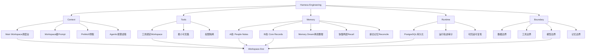

## 📋 文章信息

- **来源**: 微信公众号 - Datawhale
- **作者**: 陈思州（Datawhale 成员）
- **阅读链接**: [原文链接](https://mp.weixin.qq.com/s/iiTmgbtrYHMMjQ7dn7CDrg)

---

## 🎯 核心摘要

文章以开源项目Zleap-Agent为样本，系统拆解了一套面向本地小模型的Agent Harness设计。核心理念是Workspace-first：先选工作区，再组装上下文。围绕Context、Tools、Memory、Runtime、Boundary五个维度，展示了如何让Agent不加载所有工具、记忆和历史，只在当前任务所需的信息范围内工作。文章还引用了OpenClaw、Claude Code、Hermes Agent等实际案例，提供了Agent工程化设计的横向对比视角。

## 📊 核心观点

### 1. 从Prompt到Loop到Harness：Agent工程化的三段式演进

**背景/现状**：
- Claude Code之父Boris Cherny表示工作已变成"写循环"而非手动提示
- OpenClaw之父Peter Steinberger也提出应设计循环机制让Agent自主运行

**核心论述**：
- **Prompt Engineering**：关注这一轮怎么提示模型
- **Loop Engineering**：关注模型如何一轮轮观察、行动、接收反馈
- **Harness Engineering**：关注这些循环运行在什么系统里，如何长期稳定、可控、低成本地工作
- 单轮提示词已不够用，需要处理循环怎么跑、系统怎么撑住循环

### 2. Workspace-first：先选工作区，再组装上下文

**背景/现状**：
- 工具、记忆、历史不断追加，筛选压力回到模型身上
- 本地小模型没有强长上下文定位能力，塞太多信息反而降低效果

**核心论述**：
- 不问Agent能接多少工具，而是问当前任务应该发生在哪个工作区
- 四类工作区：Main（目标调度）、Web Search（搜索阅读）、CLI（文件命令执行）、业务（具体场景）
- 每个Workspace独立拥有prompt、tools、memory、history、model和permission
- Agent进入哪个Workspace，就只加载当前工作区需要的内容
- Workspace≠子Agent：子Agent像临时找人帮忙，Workspace像同一人切换工作台

### 3. Context：不是塞多少，而是这一轮该看什么

**背景/现状**：
- OpenClaw真实数据：system prompt约38,412字符，tool schemas约31,988字符，任务还没展开就已占用大量预算
- 长上下文≠注意力变便宜

**核心论述**：
- 销售复盘案例：粗暴做法塞全部CRM数据 vs 更好做法拆context预取+按需加载
- Main Workspace不直接承担所有上下文，更像调度台
- 进入具体Workspace后，模型只看到当前工作区的prompt、工具、记忆和历史
- 不靠模型在长上下文里自行筛选，而是让Harness先把信息范围收窄

### 4. Tools：工具暴露越全局，风险面越大

**背景/现状**：
- 每个tool schema增加模型要理解的动作空间
- 工具越多，误调用概率和权限审计压力越高

**核心论述**：
- 工具设计的核心不是"接了多少工具"，而是"在什么空间里可见"
- 工具跟Workspace绑定：Web Search Workspace暴露搜索阅读工具，CLI Workspace暴露文件命令工具
- 模型在每个空间只面对更小、更明确的动作集合
- tool schema成本、误调用概率和权限审计压力三降

### 5. Memory：记忆要分区，不能混成一个篮子

**背景/现状**：
- Hermes Agent案例：cron路径因skip_memory=True出现"看似完成、实际未送达"的通道断裂
- 记忆写错、取错、串到别的任务都会影响后续行为

**核心论述**：
- 两条记忆线：A线（people notes）处理用户偏好和稳定画像；B线（core records）处理工作事件和可复用经验
- 经验记忆有准入规则：只记录可复用流程、失败模式、验证习惯，不记录公司名、客户名等私有信息
- Memory Dream：离线记忆整理器，从清理后的会话材料中提取稳定画像和可复用经验
- recall分快慢两层：prefetch用fast模式不走LLM，主动recall走精细检索和rerank
- 新旧记忆reconcile：判断跳过、并存、替换还是保留

### 6. Runtime：每一次循环都留下可复盘轨迹

**背景/现状**：
- WildClawBench数据显示：同一模型切换不同harness，表现最高相差18个百分点
- Agentic Harness Engineering实验：多轮harness演化后pass@1从69.7%提升到77.0%

**核心论述**：
- 运行状态和记忆共用PostgreSQL持久化，不在进程内存里丢弃
- 代码修复案例：必须记录读取哪些文件、为什么选择修改、命令返回什么错误、如何调整方案
- 运行轨迹可审计、可回滚：能倒回看某步具体读了什么、调了什么工具、拿到什么结果

### 7. Boundary：数据、工具、模型、记忆四重边界

**背景/现状**：
- 企业场景中数据不能随便出内网，成本不能无限堆，权限不能靠模型自觉

**核心论述**：
- 本地小模型在敏感数据处理上有天然优势
- 不同Workspace绑定不同模型：常规用便宜模型，复杂分析用强模型
- 数据边界、工具边界、模型边界、记忆边界都要控制

## 🧠 概念图谱

## 🏗️ 技术架构

### 架构概述

Zleap-Agent采用Workspace-first架构，将Agent运行环境切分为多个独立工作区，每个工作区拥有独立的prompt、tools、memory、history、model和permission。上下文公式为：`Context = System Prompt + Workspace Prompt + Tools + Memory + History`。

### 核心组件

| 组件 | 职责 | 关键技术 |
|------|------|----------|
| Main Workspace | 理解用户目标、任务调度 | 全局行为风格System Prompt |
| Web Search Workspace | 搜索、网页阅读、引用整理 | 搜索和阅读工具绑定 |
| CLI Workspace | 文件读取、编辑、命令执行、测试 | 文件和命令工具绑定 |
| 业务Workspace | 销售、财务、运营等具体场景 | 按场景定制的工具和记忆 |
| Memory A线 | 用户偏好、稳定画像、Agent认知 | 快速预取fast模式 |
| Memory B线 | 工作事件、可复用经验 | 向量化+实体关联+精排 |
| Memory Dream | 离线记忆整理器 | 后台从会话材料中提取 |
| Runtime模块 | 运行状态持久化和轨迹审计 | PostgreSQL |

## 🔑 关键洞察

### 1. Harness的真正价值是"上下文装配"，而非"拼Prompt"

**分析**：
- 文章揭示了一个关键认知：长上下文窗口变大≠注意力变便宜。OpenClaw的真实数据显示system prompt和tool schemas合计超过7万字符。Harness的核心价值不是帮模型"装更多"，而是帮模型"看更准"——在每一轮只装配当前任务需要的信息。

### 2. Workspace-first的本质是"稀疏注意力"在架构层的实现

**分析**：
- 文章末尾有一个精妙的类比：模型层做稀疏注意力让模型不看所有token，Harness层做Workspace让Agent不加载所有上下文。这说明Harness设计是模型能力的架构延伸，两者在同一方向上发力。

### 3. 记忆系统的设计比存储机制更重要

**分析**：
- Hermes案例证明"有没有存储"不够，还要看完整链路：谁写入、写给谁、通过什么通道、是否送达确认、是否污染其他任务。Zleap的A/B双线+准入规则+reconcile机制，展示了记忆治理的工程复杂度远超"存个向量数据库"。

### 4. Harness对性能的影响可能超过模型本身

**分析**：
- WildClawBench数据显示同一模型切换不同Harness表现相差18个百分点，Agentic实验显示harness演化带来7.3%提升且收益主要来自tools/middleware/memory而非system prompt。这有力地说明：在Agent场景中，工程系统设计的影响可能比模型选择更大。

## 🚧 不足与局限

### 1. Zleap-Agent仍处于早期阶段
- 文章本身也承认项目"还在持续更新"，当前展示的是设计思路而非大规模生产验证。

### 2. Workspace粒度的划分缺乏方法论
- 文章展示了四类工作区，但如何确定合理的粒度、如何处理跨Workspace的任务、Workspace之间的通信机制，缺乏系统性的方法论指导。

### 3. 案例偏概念层面
- 多数案例（销售复盘、财务报销）停留在场景描述，缺少具体的性能对比数据、token消耗分析或实际部署经验。

### 4. 与已有方案的差异化不够清晰
- 虽然引用了OpenClaw、Claude Code等案例，但Zleap-Agent相比这些方案的具体优势和劣势，缺乏直接对比。

## 🔮 延伸思考

### Harness是否会成为新的"中间件"赛道
- 如果Harness对Agent性能的影响超过模型本身，那么Harness层可能催生出一个独立的中间件市场。就像Web开发从直接写HTML演进出前端框架、构建工具、SSR等中间件层一样。

### 企业级Agent的标准化架构何时到来
- 文章提到AI工程缺乏像MVC、DDD那样成熟的方法论。但随着更多实践积累（Zleap-Agent、OpenClaw、Claude Code），Agent架构的标准化模式可能会在未来1-2年内逐步形成。

### "先选工作区再组装上下文"是否适用于所有场景
- 对结构化任务（写代码、查资料）效果好，但对探索性、跨域任务（创意策划、战略分析），过度切分工作区可能增加信息孤岛。需要根据任务类型动态调整Workspace策略。

## 💡 实践启示

### 1. 先设计Workspace，再设计Agent能力

**要点**：
- 不要先把所有工具和记忆塞给Agent，然后指望模型自行筛选。先按任务类型划分工作区，每个工作区只装配必要的能力，从架构层面控制信息范围。

### 2. 记忆系统需要"分区+治理"而非"一桶存"

**要点**：
- 区分人（偏好画像）、事（项目事实）、经验（可复用方法）三类记忆，设定准入规则和过期策略。经验记忆必须脱敏才能复用，避免私有信息泄露。

### 3. Runtime轨迹是Agent系统的"黑匣子"

**要点**：
- 每次循环都应持久化运行状态（读取了什么、调用了什么工具、返回了什么结果），而非只在进程内存中跑完丢弃。这是排查问题、优化流程、审计合规的基础设施。

### 4. 多模型协作是控制成本的有效手段

**要点**：
- 不必所有任务都交给最强模型。常规流程用便宜/本地模型，复杂分析再调用强模型。不同Workspace绑定不同模型，是天然的模型路由机制。

### 5. Prefetch和Aggressive-loading需要明确划分

**要点**：
- 明确哪些信息预取（用户偏好、近期事件、常用经验，短准可控），哪些按需读取（完整历史、详细文档），在Harness层面做决策而非让模型自行判断。

## 📝 关键金句

> "不要先问Agent能接多少工具，而是先问当前任务应该发生在哪个工作区。"

> "窗口变大，不代表注意力变便宜。"

> "记忆系统不能只看'有没有存储'，还要看完整链路——谁写入，写给谁，通过什么通道写入，有没有确认送达。"

> "模型层做稀疏注意力，是为了让模型不要看所有token；Harness层做Workspace，是为了让Agent不要加载所有上下文。"

> "从Prompt到Loop到Harness，变化的不是技术栈，而是设计单元从单轮变成循环再到系统。"

## 🏷️ 标签

Harness Engineering、Zleap-Agent、Workspace-first、本地小模型、Context管理、Memory设计、Agent架构、多模型协作、OpenClaw

---

## 🔗 相关资源

- **项目地址**: [Zleap-Agent GitHub](https://github.com/Zleap-AI/Zleap-Agent)
- **概念延伸**: Harness Engineering、Loop Engineering
- **对比参考**: Claude Code、OpenClaw、Hermes Agent
- **评估基准**: WildClawBench、Terminal-Bench
