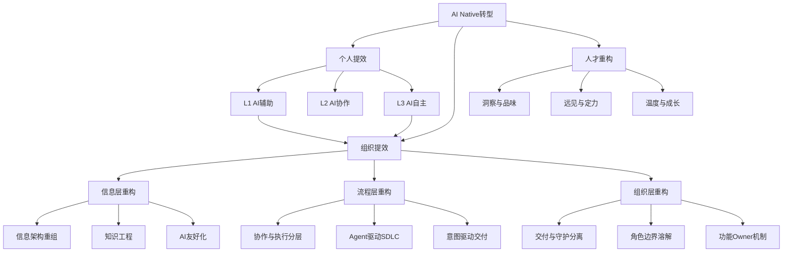

## 📋 文章信息

- **来源**: 微信公众号 - GIAC（整理自快手主站AIDevops负责人李思分享）
- **作者**: 李思（快手主站AIDevops负责人）
- **活动**: GIAC 2026·深圳站
- **阅读链接**: [原文链接](https://mp.weixin.qq.com/s/xtTD12A9KNEbROfNwHDh6Q)

---

## 🎯 核心摘要

快手主站千人级工程师团队的AI Native转型实录。核心发现：89%企业已投入AI但生产力提升仅0.29%，代码生成率从17%涨到30%交付周期却没变——因为只有不到10%工程师真正改变了工作方式。文章提出"个人提效≠组织提效"的关键洞察，将AI研发范式分为L1辅助、L2协作、L3自主三阶段，围绕信息、流程、组织三层重构研发体系，最终实现L2交付周期缩短20%-30%。同时深度探讨了组织进化中的人才重构、角色边界溶解以及工程师的洞察、远见与温度。

## 📊 核心观点

### 1. AI Native的宏观判断：换了引擎却未重构流水线

**背景/现状**：
- NBER调查：89%企业已将AI投入实际业务，生产力提升仅0.29%
- DORA 2025报告：个体效能显著提升，组织效能未变

**核心论述**：
- 历史类比：19世纪末工厂换电动引擎后30年生产力没起色，直到1920年代重组流水线才实现质变
- 当前同样局面：给工程师装上AI工具，但底层研发体系仍是老样子
- 必须围绕AI重新设计研发体系和组织协作

### 2. 个人提效≠组织提效：两个关键不等式

**背景/现状**：
- 快手24年下半年代码生成率从17%提升到30%，交付周期几乎没变
- 约90%工程师几乎没有发生明显变化

**核心论述**：
- 真正的差异不在于有没有使用AI工具，而在于有没有改变工作方式
- 不是推动AI工具使用，而是推动研发范式升级——让不到10%工程师的高效工作方式系统性地扩散
- L1辅助→L2协作→L3自主三阶段范式划分
- 两条演进路径：L1→L2主航道大规模推进，L1→L3快速路在特定场景突破

### 3. 协作摩擦：AI越快摩擦越大

**背景/现状**：
- 个体编码效率提升，但端到端周期没缩短

**核心论述**：
- **洞察一**：AI越快，人与人协作摩擦越明显。工程师一天写代码约占30%，剩下时间花在需求对齐、协作沟通、任务交接上
- **洞察二**：人机协作本身成为新隐性成本
- **四类摩擦**：人工补位（AI与系统未打通时人当桥梁）、上下文对齐（人充当信息搬运工）、验证与纠偏（AI几分钟生成代码，验证需几小时）、能力边界判断（高估低估AI都导致损耗
- **两层约束**：能力性约束（AI能力边界不确定，会随模型提升改善）和结构性约束（围绕人设计的研发体系卡住了AI）

### 4. 三层重构：信息·流程·组织

**背景/现状**：
- 研发基础设施和协作体系围绕"人如何协作"设计，而非"AI如何协作"

**核心论述**：
- **信息层**：让AI能拿到知识——信息架构重组、私域基础设施AI友好化、知识工程
- **流程层**：从串行协作到Agentic模式——协作层（人对齐、决策冻结）与执行层（Agent高自主）分离，通过工具让产出被Agent消费
- **组织层**：交付与守护分开——交付层抹平前后端职能为"功能Owner"，守护层由架构师定标准、建机制、守门禁；产研边界溶解，研发从默认承接方变成复杂问题承接方

### 5. 工程基座：AI内化不了的是事实、判断和责任

**背景/现状**：
- AI能力持续涌现，但企业内的事实、判断和责任是AI无法内化的

**核心论述**：
- **事实**：模型不知道系统真实状态，需要让模型看到正确的世界
- **判断**：定义什么是对的好的，通过验证工程和评测驱动固化为系统能力；应把最高绩效工程师放在评测体系
- **责任**：AI能力越强，守底线越重要——通过约束可见、回滚、应急预案等兜底机制确保底线
- 三个层面：工程卓越性（技术水位）、工程保障（质量安全）、持续工程治理（兜底响应）

### 6. 人才重构：底层特质×能力基座×核心杠杆

**背景/现状**：
- AI时代需要重新定义什么样的工程师有价值

**核心论述**：
- AI时代工程师价值 = 底层特质 × 能力基座 × 核心杠杆
- "玻璃隐喻"：AI像玻璃，可以当杯子（替代工作），也可以做显微镜和望远镜（发现新价值）
- 直播礼物案例：方向剧本、分镜、美术制作、评审验证全部由Agent完成，人只定目标，上新周期从20天压到4天以内

## 🧠 概念图谱

## 🏗️ 技术架构

### 架构概述

快手AI Native研发体系围绕三层框架构建：信息层（AI可获取的知识基座）、流程层（Agent驱动的SDLC）、组织层（交付与守护分离的新组织形态）。协作与执行分层是核心设计——人在上层完成意图对齐和决策冻结，Agent在下层执行结构化确定性任务。

### 核心组件

| 组件 | 职责 | 关键设计 |
|------|------|----------|
| 效能度量体系 | 三阶段建设：平台化→可归因→AI维度 | 交叉验证、AI渗透率、AI成熟度 |
| 信息架构 | 让AI获取正确知识 | 知识工程、AI友好化基建 |
| 验证评测体系 | 定义判断力、保障质量 | 高绩效工程师参与评测 |
| 工程保障体系 | 守底线 | 约束可见、回滚、应急预案 |
| Agent驱动SDLC | 协作与执行分层 | 意图对齐→决策冻结→Agent执行 |
| 功能Owner机制 | 抹平技术栈边界交付 | AI协同完成前后端交付 |
| 先锋队模式 | 千人规模渐进推广 | 试点验证→规模化复制 |

## 🔑 关键洞察

### 1. "换了引擎"与"重构流水线"的区别——AI落地的最大误区

**分析**：
- 19世纪电动引擎的历史类比极为精准。当前企业普遍犯的错误就是只换工具不改体系——给每个工程师装上Copilot/Cursor，但需求拆分、代码审查、测试部署、发布流程全部沿用人肉设计的老体系。文章揭示的"代码生成率翻倍但交付周期不变"是行业普遍现象，根源在于结构性摩擦消耗了所有AI带来的局部效率提升。

### 2. 结构性约束比能力性约束更难解

**分析**：
- 能力性约束（AI不够聪明）会随模型迭代自然改善，但结构性约束（围绕人设计的体系）需要主动重构。文章将四类协作摩擦归结为结构性问题，这意味着单纯等模型变强不会自动解决组织提效问题。这也是Harness Engineering、知识工程等基建投入的核心价值所在。

### 3. 协作与执行分层是最务实的渐进路径

**分析**：
- 直接到L3的端到端交付在大多数场景不现实。将"人擅长的事"（模糊沟通、创造性决策）和"Agent擅长的事"（结构化执行）分层，人先把协作摩擦消化完，冻结决策后交给Agent纯执行，这个设计在千人社群里具有极高的可操作性。

### 4. 直播礼物案例：4天替代20天的深层逻辑

**分析**：
- 这个案例不是简单的"AI加速"，而是整个流程的重新设计——从"人构思→AI生成→人审稿"的增强模式，变成"AI做方向+分镜+制作+评审，人只定目标和标准"的Agent原生模式。这验证了L3在结构清晰场景中可以跳过L2直接实现。

## 🚧 不足与局限

### 1. 验证规模化仍是未解难题
- 文章坦承C端场景的验证能力规模化是当前挑战，缺乏具体解决方案。

### 2. 先锋队模式的标准化矛盾
- 先锋队灵活性与规模化标准化之间的平衡点尚未找到方法论。

### 3. 度量体系的前置依赖
- 三年效能度量积累是前提条件，对大多数组织来说这个前置投入门槛很高。

### 4. 组织变革的惯性与阻力
- 虽然提出了交付与守护分离等方案，但千人级组织变革的实际阻力处理未深入展开。

## 🔮 延伸思考

### "结构性损耗"是否适用于所有AI落地场景
- 快手案例聚焦软件研发，但同样的"个人快了组织没快"现象在教育、医疗、金融等领域同样存在。围绕AI重新设计组织协作结构，可能是一个跨行业的通用命题。

### 评测体系是否成为AI时代的新核心竞争力
- 文章提出"把最高绩效工程师放在评测体系"——如果AI的判断力需要人来定义和固化，那么评测能力可能成为AI工程化的关键壁垒。

### 交付与守护分离对职业发展的影响
- 当交付被AI抹平技术栈边界，守护（架构设计、标准制定）成为工程师核心价值时，传统的技术成长路径（初级→中级→高级）可能需要重新定义。

## 💡 实践启示

### 1. 先度量再提效，没有度量就没有改进

**要点**：
- 效能度量体系是AI Native转型的前提。至少需要三阶段建设：活动在线化→可归因指标→AI维度扩展。连"快没快"都量不出来，就谈不上AI提效。

### 2. 区分能力性约束和结构性约束，针对性投入

**要点**：
- 不要把所有问题都归咎于"模型不够强"。AI能力边界导致的问题会自然改善，但结构性摩擦（体系设计问题）必须主动重构。先识别哪些摩擦是结构性的，优先投入。

### 3. 协作与执行分层，而非试图消灭协作

**要点**：
- 不要试图用AI消灭人与人之间的协作（目前做不到），而是把协作和执行分层——人在上层松散沟通、冻结决策，Agent在下层确定性执行。工具要能把人的产出转化为Agent可消费的结构化Spec。

### 4. 先锋队模式：小团队验证再规模化复制

**要点**：
- 千人规模的组织变革不能一刀切。先用先锋队蹚路、验证范式，再规模化复制。先锋队的灵活性与标准化之间需要动态平衡。

### 5. 给年轻人"慢慢生长"的机会

**要点**：
- AI抹平了入门门槛，Junior工程师上手就能出活。但代码手感、设计审美、系统敬畏这些"古典工程师"的底层特质，需要试错空间和时间积累。组织在追求效率的同时，必须为工程师成长留出空间。

## 📝 关键金句

> "不是推动AI工具的使用，而是推动研发范式的升级。"

> "个人提效≠组织提效——AI越快，人和人之间的协作摩擦反而越明显。"

> "我们给每个工程师装上了AI的伙伴，但底层的研发体系仍然是老样子——这可能也是在重复历史的故事。"

> "AI的能力在持续涌现，但它内化不了的是事实、判断和责任。"

> "AI让组织更强，而好的组织进化，也能让人的洞察、远见和温度更充分地生长。"

## 🏷️ 标签

AI Native、组织变革、研发效能、Harness Engineering、范式跃迁、快手技术、Agent驱动SDLC、人才重构、知识工程、效能度量

---

## 🔗 相关资源

- **活动来源**: GIAC 2026·深圳站
- **参考报告**: NBER AI企业调查、DORA 2025 AI辅助软件开发现状报告
- **历史类比**: 19世纪末电动引擎→1920年代流水线重组
- **相关概念**: Harness Engineering、Loop Engineering、Agent SDLC
