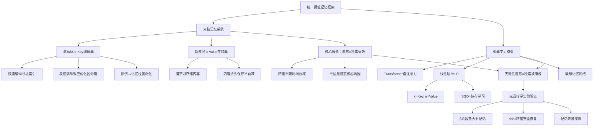

## 📋 文章信息

- **来源**: 微信公众号 - 追问nextquestion（天桥脑科学研究院）
- **原文论文**: Gershman et al., "Key-value memory in the brain", Neuron (2025)
- **作者机构**: 哈佛大学Samuel J. Gershman、MIT Ila Fiete等
- **阅读链接**: [原文链接](https://mp.weixin.qq.com/s/bVyQBZ3rCqdXGc7tBFttOA)
- **论文链接**: https://doi.org/10.1016/j.neuron.2025.02.029

---

## 🎯 核心摘要

2025年发表于Neuron的观点论文提出了一套贯通人工与自然智能的统一记忆框架。核心假说：人类大脑的记忆系统本质是键值（Key-Value）记忆架构——海马体编码用于寻址的Key，新皮层存储记忆内容的Value。通过数学推导证明任何经标准梯度下降训练的线性层/MLP都可等价重写为键值记忆形式，MNIST模拟实验表明灾难性遗忘的根源是检索干扰而非记忆擦除——放大旧记忆的键值权重即可在不重新训练的情况下完全恢复性能。AI与生物大脑在记忆机制上惊人收敛。

## 📊 核心观点

### 1. 经典记忆模型的根本矛盾：存储与检索的表征冲突

**背景/现状**：
- 经典模型（如Hopfield网络）基于相似度驱动的自联想记忆，存储与检索复用同一套表征

**核心论述**：
- 存储需要最大化内容还原度和细节保留，检索需要最大化记忆间区分度
- 两个优化目标相互冲突，同一套表征无法同时满足
- 键值记忆的核心创新：彻底分离存储（Value）与检索（Key）的表征，让两套表征独立优化
- 类比：书籍的索引（Key）仅负责寻址，正文（Value）仅负责内容存储

### 2. 键值记忆的通用数学形式

**背景/现状**：
- 从Transformer自注意力到RAG到联想记忆网络，KV架构已是AI领域通用基础设计

**核心论述**：
- **写入**：赫布学习构建关联矩阵M，键向量转置与值向量外积累加——对应神经元间突触权重增强
- **读取**：查询向量q与关联矩阵M内积，等价于所有存储值的加权和，权重由查询与键的匹配度决定
- **对偶形式**统一了几乎所有主流记忆模型：σ为恒等函数→线性化注意力，σ为softmax→Transformer自注意力，σ为阈值函数→稀疏分布记忆
- Transformer自注意力是键值记忆最典型实现，注意力输出本质就是值向量的加权和

### 3. 海马体=Key编码器，新皮层=Value存储器

**背景/现状**：
- 经典CLS（互补学习系统）框架认为海马体快速编码情景记忆，新皮层慢学习语义规律
- 但未用计算逻辑精确定义二者分工的本质

**核心论述**：
- 海马体的核心功能不是存储记忆内容，而是编码用于寻址的Key
- 记忆的具体内容（Value）全部存储在新皮层中
- **证据1：海马体损伤→记忆过度泛化**。大鼠实验：海马体损伤后恐惧记忆被任意线索激活，丧失场景特异性——因为Key索引消失，Value被随机激活
- **证据2：海马体表征排斥效应**。大鼠区分重叠路线时，海马体位置细胞表征主动向相反方向分离，排斥强度与区分准确率正相关——Key的表征被优化到相互分离的位置，最大化检索区分度

### 4. 遗忘的本质：检索失效而非记忆丢失

**背景/现状**：
- 经典记忆衰退理论认为遗忘是记忆痕迹逐渐衰退被擦除的过程

**核心论述**：
- 核心假说：记忆一旦编码就永久保存在新皮层中，遗忘是海马体Key索引失效导致系统无法匹配查询
- **证据1：记忆精度不随时间衰减**。Berens实验：单词-空间位置配对记忆中，随时间推移可访问性显著下降，但回忆成功的精度完全没有衰减——Value完整保存，只是Key匹配效率下降
- **证据2：记忆干扰是遗忘核心诱因**。Shiffrin序列列表实验：回忆准确率仅取决于被回忆列表长度，与后续列表无关——遗忘来自同列表内Key相互干扰导致检索失败，非新记忆擦除旧记忆
- 这也为ML灾难性遗忘提供了统一解释：旧任务性能暴跌并非记忆被擦除，而是新任务的Key-Value对干扰了旧任务的检索通路

### 5. MLP本质是天然键值记忆系统

**背景/现状**：
- 键值记忆是否仅存在于Transformer、联想记忆等专门设计的模型中？

**核心论述**：
- 通过严格线性代数推导（Irie等人2022），证明标准SGD训练的线性层与键值记忆100%数学等价
- 训练样本x天然承担Key的角色（地址索引），训练误差信号e天然承担Value的角色（记忆内容）
- MLP由多个线性层+激活函数堆叠，每个线性层都是独立键值记忆系统，因此MLP本身就是多层键值记忆架构
- 这意味着"所有ML方法的成功或局限，都源于其作为Key-Value System的本质"

### 6. MNIST模拟实验：沉默记忆的光遗传学"复活"

**背景/现状**：
- 灾难性遗忘在连续学习中是经典问题，但成因一直有争议

**核心论述**：
- **实验设计**：单隐藏层MLP，先训练MNIST 0/1分类（99%精度），再训练Fashion-MNIST服饰分类（95%），训练后任务1精度暴跌至9%
- **关键发现**：根据数学等价性，任务1的所有键值对完整无损地保存在权重中，任务2仅新增键值对未修改任务1的记忆
- **光遗传学干预**：引入β系数仅放大任务1的键值记忆分量（无重训练），β=1.8时精度从9%恢复至接近99%
- **结论**：灾难性遗忘=旧记忆被干扰淹没为沉默记忆，而非被覆盖擦除。放大操作能恢复性能，证明记忆本身完整存在

## 🧠 概念图谱

## 🏗️ 技术架构

### 架构概述

论文建立了两层统一框架：计算层面，所有键值记忆系统共享同一数学形式——记忆检索=所有存储值的加权和，权重由查询与键的匹配度决定；生物层面，海马体-新皮层系统天然实现了这套键值分工。两种Key-Value计算架构分别对应Transformer风格（输入经Q/K/V映射后通过赫布学习更新M）和经典前馈风格（输入层权重=K，隐藏层激活=注意力权重，输出层权重=V）。

### 核心组件

| 组件 | 职责 | 对应关系 |
|------|------|----------|
| Key（键） | 记忆寻址索引，优化目标是区分度 | 海马体/输入x/相似度计算 |
| Value（值） | 记忆内容存储，优化目标是保真度 | 新皮层/误差信号e/输出内容 |
| 关联矩阵M | 通过赫布学习编码键值关联 | 突触权重/训练后的权重矩阵W |
| 分离算子σ | 放大权重差异，提升检索区分度 | softmax/恒等函数/阈值函数 |
| 查询向量q | 触发记忆检索的输入线索 | 当前输入/检索线索 |

## 🔑 关键洞察

### 1. "所有ML方法的成功或局限，都源于其作为KV系统的本质"

**分析**：
- 这是一个极其大胆的论断。论文不仅证明Transformer和联想记忆网络是KV系统，还证明最基本的MLP也等价于KV系统。这意味着KV架构不是某个模型的特征，而是整个深度学习的底层逻辑。理解了这一点，就能从记忆检索的视角统一理解所有神经网络的行为——包括学习、泛化、干扰和遗忘。

### 2. 遗忘理论从"衰退"到"检索失效"的范式转换

**分析**：
- 如果这个假说成立，将从根本上改变我们对记忆和学习的理解。"遗忘不是丢了，而是找不到了"——这与我们日常的体验完全吻合（比如突然想不起来的名字，被提醒后立刻想起来）。光遗传学实验的MNIST类比更是精彩：不重训练仅调整检索权重就能恢复99%精度，直接证明记忆从未丢失。

### 3. AI与生物大脑在记忆机制上的"终极收敛"

**分析**：
- 论文揭示了一个令人震撼的收敛性：人工神经网络通过梯度下降训练得到的权重矩阵，与大脑通过赫布学习形成的突触连接，在数学形式上等价。这不是类比，而是严格的数学等价。这暗示进化可能找到了某种计算上的最优解，而深度学习无意中复现了这条路径。

### 4. 对灾难性遗忘问题的全新解决思路

**分析**：
- 如果灾难性遗忘是检索干扰而非记忆擦除，那么抗遗忘策略的重点不应是防止记忆被覆盖（如EWC正则化），而应改进检索机制——让旧记忆的Key在新记忆干扰下仍能被有效匹配。这可能为连续学习开辟全新的技术路径。

## 🚧 不足与局限

### 1. 实验规模较小
- MNIST模拟实验使用的是最简单的单隐藏层MLP和二分类任务，与现代深度学习模型（深层网络、复杂任务）的差距很大，结论的普适性有待更大规模验证。

### 2. 生物类比存在简化
- "光遗传学系数β"的类比在数学上成立，但真实的神经系统中是否存在类似的"放大旧记忆检索"机制，仍需更多神经科学实验验证。

### 3. 仅覆盖线性层
- 当前证明仅限于线性层，激活函数（ReLU、GELU等）和非线性变换如何影响KV等价性，文中未深入讨论。

### 4. 作为观点论文而非实证研究
- Neuron将此文归类为观点论文（Perspective），核心假说的验证更多依赖已有实验证据的理论重新解释，而非独立的实证研究。

## 🔮 延伸思考

### 对Agent记忆设计的启示
- 如果"遗忘=检索失效"同样适用于AI系统，那么当前Agent的Memory设计（RAG检索、长上下文、记忆窗口）可能需要重新审视。重点不应只是"存更多"，而应优化"检索更准"——分层索引、渐进召回、记忆分区可能是更重要的方向。

### 知识蒸馏与知识编辑的新视角
- 如果MLP中旧任务记忆完整保存在权重中，那么知识编辑（修改模型中的特定知识而不影响其他知识）可能不需要修改权重，而是修改检索通路。这为知识编辑提供了全新的技术路径。

### 人工与自然智能的统一理论是否正在形成
- 这篇论文与近年来"Transformers≈大脑"的研究趋势一致（如Hopfield网络与Transformer的等价性证明）。人工与自然智能在记忆、注意力、学习规则上的收敛性证据越来越多，一个统一的理论框架可能正在形成。

## 💡 实践启示

### 1. 从"记忆容量"转向"检索效率"思考AI系统设计

**要点**：
- 不要只关注模型能"记住"多少信息，更要关注检索机制能否在干扰环境下精准匹配。优化Key的区分度（类比海马体的表征排斥效应）可能比扩大上下文窗口更重要。

### 2. 连续学习的新方向：改进检索而非保护权重

**要点**：
- 如果灾难性遗忘是检索干扰，那么抗遗忘策略应从"保护旧权重"（如EWC）转向"改进检索通路"——设计更好的Key分离机制、检索路由或注意力掩码，让新旧任务的Key互不干扰。

### 3. MLP的KV视角可用于模型调试和可解释性

**要点**：
- 既然MLP等价于KV记忆，可以通过分析权重矩阵中各训练样本的贡献权重（β类比），诊断模型在特定输入上的行为来源，理解"模型为什么做出这个预测"。

### 4. 对"人工通用智能"的思考

**要点**：
- 如果AI和大脑共享同一套记忆计算逻辑，那么AGI的路径可能不是找到全新的架构，而是在KV框架内找到更高效的Key编码、Value存储和检索机制——生物大脑经过数亿年进化优化的方案值得深入研究。

## 📝 关键金句

> "海马体的核心功能不是存储记忆内容，而是编码用于寻址的键——记忆的具体内容，全部存储在新皮层中。"

> "遗忘的本质是检索失效而非记忆丢失——记忆一旦编码就永久保存在新皮层中，只是海马体的键索引功能失效了。"

> "所有ML方法的成功或局限，都源于其作为Key-Value System的本质——令笔者吃惊的是，甚至包括了最最基本的多层感知机。"

> "记忆本身始终完整存在，只是变成了无法被自然线索激活的沉默。"

> "人工与自然智能在记忆机制上的惊人收敛，为两个领域的交叉发展打开了全新思路。"

## 🏷️ 标签

Key-Value记忆、脑科学、Transformer、海马体、新皮层、遗忘机制、灾难性遗忘、Neuron、神经科学、MLP等价性、赫布学习

---

## 🔗 相关资源

- **原论文**: [Key-value memory in the brain (Neuron 2025)](https://doi.org/10.1016/j.neuron.2025.02.029)
- **论文代码**: [GitHub - kazuki-irie/kv-memory-brain](https://github.com/kazuki-irie/kv-memory-brain)
- **核心引用**: Irie et al., "The dual form of neural networks revisited", ICML 2022
- **经典理论**: 互补学习系统(CLS)、记忆索引假说、Hopfield网络
- **相关研究**: Transformer与Hopfield网络等价性、联想记忆网络、RAG系统
