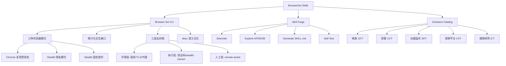

## 📋 文章信息

- **来源**: 微信公众号 - 山行
- **作者**: 山行
- **发布时间**: 2025年
- **阅读链接**: https://mp.weixin.qq.com/s/yD0gbU2NULKax_9l8X9QSg

---

## 🎯 核心摘要

BrowserAct Skills 不是对 Playwright/Puppeteer 的简单封装，而是面向 AI Agent 工作方式重新设计的浏览器自动化方案。它通过索引化文本交互替代传统 CSS selector，让模型能以极低 token 成本理解页面状态并执行操作；通过三层反封锁体系（环境层、执行层、人工层）分层应对反爬挑战；通过浏览器身份隔离支持多账号并行；并通过 Skill Forge 将一次性网站探索沉淀为可复用的长期技能。

## 📊 核心观点

### 1. 浏览器接口应服务模型推理，而非程序员脚本

**背景/现状**：
- 传统浏览器自动化工具（Playwright、Puppeteer）为"人写脚本"设计
- Agent 操作网页面临独特挑战：页面状态理解成本高、CSS selector 不友好、多 Agent 并发会互相污染

**核心论述**：
- BrowserAct 提供**索引化文本输出**，将可交互元素压缩为编号索引
- Agent 不需要解析 DOM 或猜测 selector，只需看见 `[2]` 是邮箱框、`[4]` 是提交按钮
- 操作循环被抽象为 `Open → State → Interact → State → ... → Close`
- 这是与传统脚本自动化的根本差异：接口首先服务"模型如何行动"

### 2. 三层反封锁：分层升级而非无脑绕过

**背景/现状**：
- 反爬机制日益复杂，验证码、TLS 指纹、行为检测层层递进
- 一次性"万能方案"不现实，需要按威胁等级分级应对

**核心论述**：
- **环境层**：指纹伪装、TLS 轮换、代理切换、headless 隐藏——在验证触发前吸收阻断
- **执行层**：`solve-captcha` 自动处理验证码、`stealth-extract` 提供增强版 WebFetch
- **人工层**：`remote-assist` 生成远程接管链接，人处理完后 Agent 接着跑
- 核心逻辑：普通任务用普通浏览器 → 触发反爬切 stealth → 需要验证码再升级 → 自动失败才交人

### 3. 浏览器即身份，Session 即工作空间

**背景/现状**：
- 多账号运营、竞品监控等场景需要严格身份隔离
- 简单开多个标签页无法满足 cookies、指纹、IP 的隔离需求

**核心论述**：
- 三种浏览器模式对应三种身份需求：Chrome 复用本地登录态、Stealth 隐私模式零残留、Stealth 固定身份长期运营
- 一个浏览器承载多个 session，共享登录态但执行独立；不同浏览器拥有独立 cookies、指纹、代理
- Session 名称全局唯一且显式指定，确保多 Agent 协作时不会抢同一页面或误操作

### 4. Skill Forge：探索一次，复用很多次

**背景/现状**：
- 每次让 Agent 抓同一网站都需要重新摸索页面结构，重复成本高
- 团队中工程师为每个采集需求手写 scraper 维护负担重

**核心论述**：
- Skill Forge 是"技能生成器"而非一次性抓取工具
- 流程：Describe（描述需求）→ Explore（探索 API/DOM）→ Generate（生成 SKILL.md + 脚本）→ Self-Test（端到端自测）
- 优先探索 API，找不到稳定 API 再 fallback 到 DOM
- 生成的 Skill 把业务参数变成命令行参数，支持规模化运行
- 对团队价值：从"手工写 scraper"转向"维护让 Agent 自助生成 Skill 的平台能力"

### 5. 安全边界：能力强但不是无约束

**背景/现状**：
- Agent 控制真实浏览器意味着获得账号、表单、文件上传、登录态等敏感权限

**核心论述**：
- Confirmation gating：创建/删除浏览器、导入 Profile、修改代理等敏感操作必须经用户明确确认
- Skill 层面的对话协议：Agent 需先说明做什么、影响什么、为什么需要，等待用户同意
- 数据隐私边界：所有数据本地保存，唯一例外是 solve-captcha 时上传验证码图片到云服务（不上传 cookies/URL）

## 🧠 概念图谱

## 🔑 关键洞察

### 1. 索引化交互是 Agent-浏览器接口的正确抽象层

**分析**：
- 传统自动化工具把浏览器状态暴露为 DOM 树，对 LLM 来说 token 消耗巨大且噪声高
- BrowserAct 的做法本质上是在 DOM 和 LLM 之间插入了一层"语义压缩"——只暴露可交互元素及其文本描述
- 这与游戏 AI 中常见的"观察空间抽象"思想一致：不暴露原始像素，而是暴露结构化状态
- 这种设计让任何 LLM 都能操作浏览器，不依赖特定的代码生成能力

### 2. "浏览器即身份"是 Agent 多账号场景的关键架构决策

**分析**：
- 将浏览器实例与身份绑定，而非与标签页绑定，是正确的问题建模
- 这使得身份隔离从"应用层逻辑"变成了"架构层保证"
- 对运营团队来说，这意味着可以给每个 Agent 分配独立的浏览器身份，像分配独立工位一样自然

### 3. Skill Forge 的真正价值不在生成，而在沉淀和自测

**分析**：
- 自动生成脚本不难，难的是生成后能持续可靠运行
- Skill Forge 的 Self-Test 环节才是核心竞争力：让子 Agent 做端到端测试，失败就修复
- 这实际上是在为"Agent 写的代码"建立 CI/CD 流水线——Agent 既是开发者，也是测试者
- 如果没有自测和重新探索机制，生成的 Skill 会从"重复探索成本"变成"重复维护成本"

## 🚧 不足与局限

### 1. 安全依赖对话协议而非技术强制

- Confirmation gating 是 Skill 层面的约定，不是 CLI 硬约束
- 如果 Agent 不加载 Skill 或绕过确认逻辑，安全机制即失效
- 对于生产环境中的敏感操作，可能需要更强制的技术保障

### 2. 云服务依赖风险

- stealth-extract、动态代理、solve-captcha 依赖 BrowserAct 托管服务
- 这意味着核心反封锁能力受制于第三方服务的可用性和定价

### 3. Solutions Catalog 的维护可持续性存疑

- 78 个预置方案覆盖面广，但网站结构变化频繁
- 需要持续的维护和更新机制才能保持可用性

## 🔮 延伸思考

### 1. 索引化交互的通用性

- 类似的"为模型设计接口"思路可应用于其他 Agent 操控的场景：数据库操作、API 调用、文件系统管理等
- 核心原则不变：把复杂系统状态压缩为模型可理解的索引化文本，降低 token 成本和决策复杂度

### 2. Skill 市场的可能性

- BrowserAct 的 Solutions Catalog 暗示了一个"浏览器自动化 Skill 市场"的方向
- 如果社区能贡献和维护 Skill，类似 npm 生态，这个工具的价值会指数级增长

### 3. Agent 原生浏览器 vs 人类浏览器

- 未来可能不需要"自动化"人类浏览器，而是直接设计 Agent 原生的浏览器环境
- BrowserAct 是过渡方案，最终形态可能是浏览器底层就为 Agent 提供结构化 API

## 💡 实践启示

### 1. 为 Agent 设计工具时，优先考虑 token 效率

- BrowserAct 的索引化交互是一个标杆案例：用结构化文本替代原始数据
- 在设计任何 Agent 工具时，都应该问：模型需要多少 token 才能做出正确决策？

### 2. 遇到重复性网页任务时，考虑 Skill 沉淀

- 不要每次都让 Agent 重新探索，用 Skill Forge 把验证过的探索结果固化为可复用资产
- 对团队来说，维护 Skill 比维护脚本更可持续，因为 Agent 可以自主修复

### 3. 分层应对反爬，不要追求"万能方案"

- 环境层吸收 → 执行层处理 → 人工层兜底，这种分层升级思路值得借鉴
- 大多数阻断应该在最底层解决，逐级升级而非一步到位

## 📝 关键金句

> "Agent 不缺'能点网页'的能力，缺的是在真实网页世界里稳定、可控、可复用地完成任务。"

> "BrowserAct 的安全策略不是假装风险不存在，而是让每一个高风险动作都被人类看见。"

> "如果目标站点已经提供稳定 API，优先用官方 API，KISS 原则更强。"

## 🏷️ 标签

AI、Agent、浏览器自动化、BrowserAct、LLM、反爬、Skill 系统

---

## 🔗 相关资源

- **项目仓库**: https://github.com/browser-act/skills
- **拓展阅读**: Playwright/Puppeteer 传统浏览器自动化、Agent 工具设计模式、LLM 观察空间抽象
