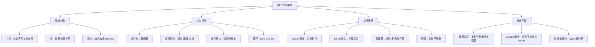

## 📋 文章信息

- **来源**: 微信公众号 - 山行AI
- **作者**: 山行
- **发布时间**: 2026年7月22日
- **阅读链接**: https://mp.weixin.qq.com/s/6xqI5LlOPM8_SQ6Emexz4w

---

## 🎯 核心摘要

本文提出一个核心转变：不要把 Agent 设计成一串提示词链，而是把工作设计成一张图。节点负责具体任务，边负责传递数据，代码负责调度。通过图拓扑结构的重新设计，可以实现任务的并行执行、失败隔离、条件路由和循环发现，从而突破线性 Agent 在上下文窗口和串行延迟上的瓶颈。文章以 Claude Code 的 dynamic workflows 为技术基础，系统性地介绍了 14 个图工程步骤。

## 📊 核心观点

### 1. 节点是任务，边是流动的数据

**背景/现状**：
- 大多数人第一次写多步 Agent，产出的是一条直线：第一步→第二步→第三步
- 很多步骤根本不需要等上一步完成，却被硬绑在一起

**核心论述**：
- 图只有两个基础对象：节点（一段有边界的工作）和边（依赖关系）
- 判断一条边是否真实的唯一标准：下一步是否读取上一步的输出
- "总结文件，然后查天气"——两件事没有真实依赖，是两个独立节点
- 把"然后"当成边是最常见的误区

### 2. 线性脚本是一种退化图

**背景/现状**：
- "先做A，再做B，再做C，再做D"是最常见的Agent编排方式
- 这类链条能跑，但慢且脆——C卡住，D永远不会发生

**核心论述**：
- 图工程的第一项能力是重画这条链
- 拿着每条箭头问：这里真的有数据依赖吗？
- 剪掉假边，线性链条就会变宽：独立节点可以同时跑，最后汇入需要全量结果的节点

### 3. 给每个节点一个契约

**背景/现状**：
- 节点输入输出说不清时，很难并行执行
- 很多Agent输出自由文本，下游需要手动解析

**核心论述**：
- 输入应该显式传入，不能假设能读到共享上下文
- 输出用 JSON Schema 验证，方便下游直接消费
- 验证层让不匹配的结果重试，而非把自由文本丢给下游
- "能被图接线的节点"和"只能让人读一遍输出的节点"之间的核心区别就在契约

### 4. 用 parallel() 扇出，在 barrier 处扇入

**背景/现状**：
- 面对N个独立来源，大多数实现是串行处理
- 串行处理不仅慢，还会让主会话上下文越来越长

**核心论述**：
- `parallel()` 启动多个 subagent 并发执行，是 barrier（等所有完成再返回）
- 某个 thunk 抛错变成 null，不会让整个批次失败
- 扇入节点做真正需要全量视角的事：跨来源去重、按影响排序、总结果为空则提前退出
- 只有某个阶段真的需要所有上游结果时，才设置 barrier

### 5. 钻石结构：拆分、工作、合并

**背景/现状**：
- 市场扫描、依赖审计、代码审查、研究报告等场景都有相似的工作模式
- 但大多数人每次都重新设计线性流程

**核心论述**：
- fan-out → reduce → synthesize 是最常见的拓扑
- 先扇出拿广度，用代码压缩结果，最后用Agent写答案
- 理解钻石结构后，问题从"怎样让Agent做更多步骤"变成"哪里应该拆，哪里应该合"

### 6. 验证器是图的真正杠杆

**背景/现状**：
- 单Agent容易漏掉问题，缺乏质量保障机制
- 线性流程中错误会向后级联

**核心论述**：
- 三种验证模式：对抗式验证（N个独立怀疑者反驳）、多视角验证（正确性/安全性/可复现性）、评委组（多候选并行打分）
- 验证节点只做一件事：试着推翻这个发现，能活下来就放行
- 真正的杠杆不是"更多Agent"，而是能在Agent周围包上可靠结构

## 🧠 概念图谱

## 🔑 关键洞察

### 1. "边"应该用数据命名，而非用执行顺序命名

**分析**：
- 当你用数据结构来命名边（"经过去重的Item列表"而非"B在A后面"），两个问题变得清晰：这条边是否真的有数据移动？数据结构不变时，节点是否可以替换？这种思维方式让工作流从"顺序脚本"跃升为"数据流管道"，是图工程思维的核心转折点。

### 2. Agent应该用来做判断，不该用来搬管道

**分析**：
- 文章明确指出：如果"合并结果"只是 flatMap 和 Set，就别启动一个Agent。边如果全是Agent，整张图就在为自己的接线付token。这是一个被广泛忽视的成本陷阱——很多人为了"统一用AI处理"，把简单的数据变换也交给模型，导致token浪费和延迟增加。

### 3. pipeline() 应该是默认选择，parallel() barrier 需要理由

**分析**：
- parallel() 的 barrier 会让所有节点等最慢那个。pipeline() 让每个 item 独立流过所有阶段，快 item 不必陪慢 item 等。默认应该先考虑 pipeline，只有确实需要前阶段全量结果时（跨集合去重、提前退出、需要比较其他发现的 prompt）才使用 barrier。"代码更整齐"不是 barrier 的理由。

### 4. 失败隔离比成功路径更重要

**分析**：
- 在线性链条里，一个节点失败会向后级联，C死了D就不会运行。图应该把失败限制在节点内部。更隐蔽的问题是并行Agent互相踩文件——需要用 git worktree 隔离工作区。这种"安全带思维"在分布式系统中很常见，但在Agent编排中常常被忽略。

## 🚧 不足与局限

### 1. 技术栈绑定
- 文章以 Claude Code 的 dynamic workflows 为技术基础，parallel()、agent()、schema 验证等都是 Claude 特有的 API。对于使用 LangChain、CrewAI、AutoGen 等其他框架的开发者，需要自行映射概念和实现。

### 2. 缺少复杂图的管理方案
- 文章聚焦在单文件、单次运行的图编排，对于生产环境中的图版本管理、可观测性、断点恢复、人工介入等运维问题未涉及。

### 3. 成本分析的量化不足
- 提到了模型分层可以降低成本，pipeline 可以减少延迟，但缺少具体的成本对比数据，读者难以量化收益。

## 🔮 延伸思考

### 1. 图编排框架的标准化趋势
- 文章描述的模式（扇出、扇入、条件路由、循环、验证）在数据工程中已是成熟范式（DAG调度器如Airflow、Prefect）。Agent编排正在重走这条路，未来很可能会出现标准化的Agent DAG框架，将Claude的workflow模式推广为跨模型的通用抽象。

### 2. 从"提示词工程"到"拓扑工程"的范式转移
- 文章标题"图工程"点出了一个深层趋势：当Agent能力足够强时，瓶颈不再是"怎么写好一个prompt"，而是"怎么设计任务的结构"。这类似于从"写好一个函数"到"设计好系统架构"的跃迁。

### 3. 自适应拓扑的可能性
- 文章最后提到让Claude自己画图（动态workflow），这暗示了一个更激进的方向：Agent不仅能执行图，还能根据任务特征自动选择最优拓扑。未来可能出现"元Agent"——专门负责为当前任务生成最优工作流图的Agent。

## 💡 实践启示

### 1. 审视现有Agent流程中的"假边"

**要点**：
- 拿出你当前的Agent工作流，画出每一步之间的数据流
- 对每条"然后"连线问：下一步是否真的读取上一步的输出？
- 剪掉假边后，识别出可以并行的节点，用 parallel() 重构

### 2. 为所有Agent节点定义输出Schema

**要点**：
- 给每个节点的输出定义 JSON Schema，不返回自由文本
- 验证失败时让节点重试，而不是让下游手动解析
- 这是从"对话式Agent"到"可组合的图节点"的关键一步

### 3. 在关键路径加入验证器

**要点**：
- 在发现类任务的输出后，加入对抗式验证节点
- 在生成类任务的输出后，加入多视角评审（正确性、安全性、完整性）
- 验证器的成本远低于发布错误结论的代价

### 4. 模型分层降本

**要点**：
- 重复性任务（抽字段、分类、格式化）用便宜模型
- 判断性任务（合成报告、裁决、最终审查）用强模型
- 这不改变图的形状，却能显著改变成本

## 📝 关键金句

> "提示词是一句话，循环是一种节奏，harness 是 Agent 站立的地板；真正决定 Agent 能跑多远的，是任务本身的拓扑结构。"

> "Agent 应该用来做判断，不该用来搬管道。边如果全是 Agent，整张图就在为自己的接线付 token。"

> "普通 prompter 会问一个问题，架构师会画一张图。"

## 🏷️ 标签

AI、Agent、工作流、图工程、Claude、多Agent、并行计算、架构设计

---

## 🔗 相关资源

- **拓展阅读**：Claude Code Dynamic Workflows 官方文档
- **拓展阅读**：DAG 调度器设计模式（Airflow、Prefect）
- **拓展阅读**：多 Agent 框架对比（CrewAI、AutoGen、LangGraph）