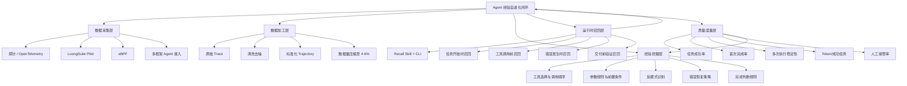

## 📋 文章信息

- **来源**: 微信公众号 - 阿里技术（阿里妹导读）
- **作者**: 阿里云 AgentLoop 团队
- **发布时间**: 2026年7月
- **阅读链接**: https://mp.weixin.qq.com/s/imwXP56r-llaQwD-qAQM6Q

---

## 🎯 核心摘要

本文介绍阿里云 AgentLoop 的"Agent 经验自进化"能力，核心思路是：Agent 每次运行产生的 Trace 经过清洗组装为 Trajectory，自动挖掘出有效路径、失败模式、恢复策略等结构化经验，在下次执行相似任务时按需召回注入。这套系统位于模型之外，不修改权重，通过运行时上下文注入生效，能够跨模型、跨框架复用，让多个 Agent 共享经验、共同进化。

## 📊 核心观点

### 1. Agent 的核心挑战是准确率和单位成功成本

**背景/现状**：
- 传统软件追求确定性，Agent 天然具有不确定性
- 同一问题连续运行多次，Agent 可能选择不同工具、走不同路径、给出不同答案
- 一次评测通过不代表下次仍通过，平均表现好不代表没有不可接受的质量低谷

**核心论述**：
- 企业真正关心两个问题：Agent 做得准不准（任务成功率、首次完成率、稳定性）？达到这样的准确率需要多少成本（Token、时间、工具调用、人工介入）？
- 很多 Agent 成本恰恰来自不确定性：方向选错后反复推理，工具调用失败后原样重试，没有完成判断导致执行链不断延长
- 合理的目标是在质量护栏下持续优化**单位成功成本**，而非单独追求最低 Token

### 2. 从人工数据飞轮到 Agent 自进化

**背景/现状**：
- 现有优化路径：收集 Trace → 人工分析 → 修改 Prompt/工具/流程 → 重新部署
- 这条路径有效但高度依赖专家，随着 Agent 数量和调用规模增长迅速成为瓶颈

**核心论述**：
- AgentLoop 构建自动进化路径：观测运行 → 清洗 Trace 为 Trajectory → 自动挖掘经验 → 运行时按需召回 → 新的运行再进入下一轮
- "自进化"不是修改模型权重，而是让 Agent 在模型通用能力之外，持续获得来自真实业务的行动经验
- 模型负责推理，工具负责执行，知识库提供事实，经验库帮助 Agent 判断应该优先做什么

### 3. 经验 ≠ 对单条 Trace 做摘要

**背景/现状**：
- 原始 Trace 包含大量基础设施 Span、重复消息，直接存储分析成本高且噪音大
- 清洗后的 Trajectory 可以降到原始 Trace 约 4%—6% 的数据量级

**核心论述**：
- 经验是从多个轨迹之间进行比较挖掘的，识别反复出现的有效动作和高风险路径
- 生成五类结构化经验：工具选择和调用顺序、参数规则与前置条件、容易失败的反模式、错误恢复策略、结果验证规则
- 召回时不只考虑文本相似度，还结合当前任务、工具、进度、错误状态排序过滤
- 目标不是返回更多历史内容，而是在真正影响决策的时刻提供少量能改变行动的经验

### 4. 经验库位于模型之外的六层能力定位

**背景/现状**：
- 市面上有 Memory、RAG、Workflow、Skill、微调、RL 等多种 Agent 优化手段，容易混淆

**核心论述**：
- 文章给出了清晰的分层定位：Memory 记得过去，RAG 找到知识，Workflow 提供固定流程，Skill 获得能力，微调/RL 改变模型本身，经验自进化在当前任务中复用真实执行验证过的方法
- 经验库的优势：服务不同模型和框架、按任务动态召回、快速更新不必重训、按团队权限控制、与评估结果结合持续验证
- 企业最终保留的不是某个模型版本偶然做对的结果，而是一套跨模型、跨客户端持续使用的业务行动经验

## 🧠 概念图谱

## 🔑 关键洞察

### 1. "单位成功成本"比"单次调用 Token"更有意义

**分析**：
- 文章反复强调这个观点，并且用实验数据佐证：PinchBench Token 增加 2.9% 但质量提升 18.3%，SWE-bench Token 增加 51% 但通过率提高 7.2pp。这说明在某些场景下，花更多 Token 换取更高成功率是合理的。企业应该关注的是"每完成一个成功任务消耗多少资源"，而非盲目压低单次调用的 Token 数。这个指标把质量和成本统一在一个分母下，是 Agent 生产化的关键度量。

### 2. 经验是"跨 Trajectory 的模式"，不是"单条轨迹的摘要"

**分析**：
- 这是一个容易被忽视的区分。很多系统把运行记录存下来，最多做个摘要，但真正的经验需要跨多次运行比较才能发现。比如"这类任务应该先查 A 再查 B"是模式，"上次运行查了 A 和 B"只是记录。只有模式才能在新任务中提供决策指导。AgentLoop 从多个轨迹中识别反复出现的有效动作和高风险路径，这才是"经验"而非"日志"。

### 3. Trace → Trajectory 的压缩是经验挖掘的前置条件

**分析**：
- 清洗后 Trajectory 降到原始 Trace 约 4%—6%，这不是简单的压缩，而是保留了任务目标、行动步骤、工具调用、观察结果、错误恢复和最终结果等高价值信息。这个环节决定了下游经验挖掘的质量——如果输入是噪音，输出也是噪音。这也解释了为什么很多企业的 Trace 数据堆积如山却无法产生价值：缺少从"日志"到"轨迹"的转化层。

### 4. 经验库与 RAG 的本质区别：经验是"怎么做"而非"是什么"

**分析**：
- RAG 检索的是事实和知识（规则在哪、文档说什么），经验自进化检索的是行动方法（先做什么、怎么恢复、哪里容易错）。前者是"信息检索"问题，后者是"决策支持"问题。文章的对比表清晰展示了这个差异。这也是为什么经验库能与 RAG 协同而非替代：RAG 提供事实，经验库提供方法。

## 🚧 不足与局限

### 1. 商业产品，技术细节有限
- 文章本质是阿里云 AgentLoop 的产品介绍，核心的"挖掘算法"和"召回排序"具体如何实现未公开，无法评估其技术深度。例如"结合当前任务、工具、进度、错误状态排序过滤"的具体算法细节缺失。

### 2. 实验数据不完整
- 提到了 5 个 Benchmark 的结果，但缺少置信区间、测试次数、对比基线细节。StarOps 从 7.1% 到 36.1% 的提升幅度巨大，但未说明数据规模和具体任务分布。

### 3. 经验质量退化问题未讨论
- 经验会过时：工具升级、业务规则变化、模型能力提升后，旧经验可能反而成为干扰。文章提到"与评估结果结合持续验证经验是否仍然有效"，但未详细说明过期经验的检测和淘汰机制。

### 4. 多 Agent 共享经验的权限和冲突问题
- 提到不同 Agent 可以共享经验库，但不同 Agent 可能对同一任务有不同最优路径。经验冲突时的仲裁机制未涉及。

## 🔮 延伸思考

### 1. 经验自进化是 Agent 工程化的必经之路
- 从 LLM 到 Agent，核心跳跃是从"单次推理"到"持续执行"。任何持续执行的系统都需要反馈循环——软件开发有 CI/CD，搜索引擎有 A/B 测试，推荐系统有在线学习。Agent 也不例外。AgentLoop 提出的"观测→轨迹→挖掘→经验→召回→运行"闭环，本质上是 Agent 领域的 CI/CD 等价物。

### 2. 经验的可移植性是关键差异化
- 微调和 RL 绑定在特定模型上，模型一换经验归零。AgentLoop 的经验库位于模型之外，这意味着企业积累的经验资产不受模型供应商切换的影响。在当前模型迭代极快的背景下，这种可移植性可能比短期准确率提升更有长期价值。

### 3. 与 Workflow 图工程的关系
- 上一篇文章讨论了图工作流（Agent 的拓扑结构设计），本文讨论的是经验自进化（Agent 的持续学习能力）。两者互补：图工程设计 Agent 的"骨骼"（哪些节点、怎样连接），经验自进化优化 Agent 的"肌肉记忆"（每个节点怎么做更好）。理想的 Agent 系统应该同时具备良好的拓扑设计和持续的经验积累。

## 💡 实践启示

### 1. 建立Agent的"单位成功成本"度量

**要点**：
- 不要只看单次调用的 Token 消耗，要追踪"每完成一个成功任务"的综合成本
- 同时度量：成功率、首次完成率、多次执行稳定性、Token/成功任务、人工接管率
- 质量和成本的权衡需要用业务目标来校准，而非追求单一指标最优

### 2. 从"存日志"升级为"建轨迹"

**要点**：
- 原始 Trace 噪音大、价值密度低，需要清洗为结构化 Trajectory
- 保留：任务目标、行动步骤、工具调用、观察结果、错误恢复、最终结果
- 去掉：基础设施 Span、重复消息、与决策无关的中间数据
- 这一步是后续所有经验挖掘的基础

### 3. 经验注入的时机选择

**要点**：
- 在任务开始时：提供经过验证的入口选择和行动顺序
- 在工具调用前：补充参数约束、数据范围、前置条件
- 在错误发生后：优先提供有效的恢复方法
- 在准备交付时：提醒验证结果是否满足业务目标
- 经验不是越多越好，而是在关键决策点提供少量能改变行动的信息

### 4. 经验资产的跨模型保护

**要点**：
- 将行动经验与模型权重解耦，避免模型切换时经验归零
- 经验库应支持版本管理、权限控制和效果回溯
- 通用经验可跨 Agent 共享，业务专属经验按团队隔离

## 📝 关键金句

> "企业衡量经验库时，不应只看一次运行是否成功，而应同时关注平均任务成功率、首次完成率、同类任务多次执行时的成功率、最低表现和结果波动。"

> "Agent 应该用来做判断，不该用来搬管道。"（注：此处引用自实践共识，非本文原文，但与本文"经验注入减少无效探索"的观点高度一致）

> "经验自进化不是又一个保存历史内容的知识库，而是一套面向企业 Agent 的持续质量优化系统。"

> "Memory 让 Agent 记得过去，RAG 让 Agent 找到知识，Workflow 提供固定流程，Skill 让 Agent 获得能力，微调和 RL 改变模型本身，而经验自进化让 Agent 在当前任务中复用真实执行验证过的方法。"

## 🏷️ 标签

AI、Agent、经验自进化、AgentLoop、阿里云、可观测性、RAG、企业级Agent、持续优化

---

## 🔗 相关资源

- **拓展阅读**：AgentLoop 控制台 - agentloop.console.aliyun.com
- **拓展阅读**：OpenTelemetry Agent 可观测性标准
- **相关对比**：LangSmith / LangFuse 等开源 Agent 可观测平台
- **相关对比**：Mem0 等记忆层方案