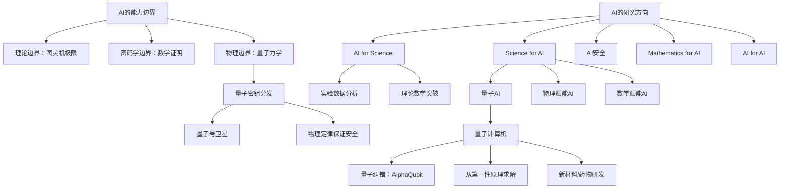

## 📋 文章信息

- **来源**: ZAKER新闻（转载自商学院）
- **作者**: 姚期智
- **发布时间**: 2026年7月19日
- **阅读链接**: https://www.myzaker.com/article/6a60252f8e9f094b4d106689

---

## 🎯 核心摘要

姚期智在2026年WAIC思想者论坛上发表主题演讲，从理论计算机科学视角系统论证了AI的能力边界——AI本质上是加装了数据的图灵机，无法解决停机问题，也无法破解基于数学证明的加密体系和量子密钥分发。他提出"Science for AI"是AI的下一个层次，特别看好量子AI方向，认为未来5-10年将取得巨大进展。演讲还分享了AI for Science的最新突破，包括AI做出理论数学突破的案例，以及对青年科研工作者的建议。

## 📊 核心观点

### 1. AI的本质是"加装数据的图灵机"

**背景/现状**：
- 机器学习将"从数据中学习"加入算法武器库，这是AI取得巨大进展的核心原因
- 机器学习框架分两步：表征问题（是否存在合适的θ）和学习问题（能否在合理成本内找到θ）

**核心论述**：
- AI本质上就是加装了一组数据的图灵机，哪怕增加了数据，它依然是图灵机
- 因此图灵机的理论边界就是AI的理论边界——停机问题等不可计算问题，AI同样无法解决

### 2. AI存在不可逾越的能力边界，但这恰恰是好事

**背景/现状**：
- 公众普遍担忧AI能力过强甚至失控
- 了解AI的局限对设计安全AI系统至关重要

**核心论述**：
- **密码学边界**：ElGamal等公钥加密体系在数学上可抵御所有经典攻击者，包括AI
- **量子密钥分发**：基于物理定律的安全通信，任何经典攻击都破解不了，除非推翻量子力学
- 利用这些局限可以设计更安全的系统和更好的算法

### 3. AI for Science已从"工具"进化到"理论突破者"

**背景/现状**：
- AI用于数据分析已是常态（如蛋白质折叠）
- 但最近AI开始做出真正的理论突破

**核心论述**：
- **天文学**：清华团队用Asterisk AI重构暗弱星系，将可观测时间线往前推1亿年
- **宇宙学**：Gemini DeepThink解决了40年开放问题"宇宙弦辐射功率谱"
- **数学**：OpenAI模型推翻了Erdős猜想（单位距离问题），证明用了深层分圆数论技巧

### 4. Science for AI才是"AI的下一个层次"

**背景/现状**：
- AI for Science 已被广泛讨论
- 但 Science for AI 更少被关注，却更具革命性

**核心论述**：
- 物理世界能获取知识的途径不止计算机处理逻辑
- 如果用量子机器替代图灵机做学习载体，可能做出AI做不到的事
- "量子AI"方向正在兴起，未来5-10年将取得巨大进展
- 量子计算机可从第一性原理出发求解，不像AI靠"猜"

### 5. 未来科研模式将从"个人"转向"人+AI团队"

**背景/现状**：
- AI写代码能力越来越强，初级编码工作将消失
- 大公司裁员本质是AI能力提升导致的工作流程优化

**核心论述**：
- 未来两三年科研将面临翻天覆地变化
- 竞争单位从"个人"变为"你+你的AI工具"组成的团队
- 人类的核心竞争力：抽象问题、创造新概念的能力
- AI暂时替代不了最优秀科学家"看到现象后抽象问题"的能力

## 🧠 概念图谱

## 🔑 关键洞察

### 1. "数据增强图灵机"的框架性认知

**分析**：
- 姚期智将AI精确定义为"加装了数据的图灵机"，这个框架看似简单，却能清晰解释AI的能力上限
- 很多AI从业者对AI能力的认知停留在经验层面，缺少这种底层理论框架
- 这个定义也暗示：要突破AI的边界，必须突破图灵机范式本身——这正是量子计算的意义

### 2. AI的理论突破标志着质变拐点

**分析**：
- AI从"分析数据的工具"到"做出数学证明"，这不是量的提升而是质的飞跃
- Gemini解决40年宇宙学问题、OpenAI推翻80年数学猜想，这些案例的意义远超应用层面的突破
- 姚期智坦言"开始担心自己的工作"，这种来自顶级科学家的自省极具信号意义

### 3. 量子AI vs 经典AI的本质区别

**分析**：
- 经典AI从数据中"猜"规律，量子AI从第一性原理出发
- 这个区别类似于经验科学与理论物理的区别
- 一旦量子计算机普及，药物研发、材料科学将从"大数据试错"转向"精确计算"

## 🚧 不足与局限

### 1. 量子AI的时间预测缺乏锚点

- 姚期智预测5-10年量子AI将有巨大进展，但类比AI突破"超出专家预料"，实际上无法给出可靠时间线
- 量子纠错目前仅实现1个逻辑量子比特，距离实用化仍有巨大工程差距

### 2. 对"AI替代论"的讨论偏向精英视角

- 以"像我这样的人"AI替代不了作为论据，对普通从业者参考价值有限
- 初级编码工作消失的判断准确，但对中层技术人员的转型路径探讨不足

## 🔮 延伸思考

### 方向1：量子AI的产业化路径

- 量子AI需要量子硬件、算法、AI三者的协同突破
- 谁能在"量子纠错+AI训练"的交叉点取得进展，可能主导下一个计算范式
- 中国在量子通信领域领先（墨子号），但在量子计算通用性上与美国仍有差距

### 方向2："人+AI团队"对科研教育体系的冲击

- 如果科研竞争单位从个人变为"人+AI团队"，传统的博士培养模式需要根本性调整
- 评价体系、论文署名、学术伦理都将面临重构
- 能否"抽象问题"将成为科研人员最核心的能力筛选器

## 💡 实践启示

### 1. 将"第一性原理思维"纳入个人能力建设

**要点**：
- 姚期智强调的核心竞争力——"看到现象后抽象问题、创造新概念"——本质就是第一性原理思维
- 在任何领域，能从表象提炼底层逻辑的能力将越来越值钱
- 日常练习：遇到问题时，多问"这背后的基本原理是什么"

### 2. 关注AI不可替代的"概念创造"能力

**要点**：
- 数据处理、编码实现等可标准化工作将快速被AI接管
- 定义问题、创造新框架、跨领域联想等能力短期内AI难以匹敌
- 职业规划上，应向"问题定义者"而非"问题求解者"方向倾斜

## 📝 关键金句

> "AI 本质上就是加装了一组数据的图灵机，哪怕增加了数据，它依然是图灵机，所以不可能解决停机问题。"

> "这套机制的基础是物理定律，所以原则上宇宙中没有任何事物能破解它，除非有人推翻量子力学。"

> "你的能力不再是传统的'掌握基础知识+独立思考'，而是'你+你用的AI工具'组成的团队的能力。"

> "AI 不是从第一性原理出发，更像是在'猜'。但量子计算机的好处是，它不仅比现在的 AI 做得更好，而且有严格的边界，因为它是从第一性原理来的。"

> "人生到最后，你的成绩单上写的，是你经历过多少这样的喜悦，感受到多少快乐。"

## 🏷️ 标签

AI、量子计算、姚期智、AI安全、Science-for-AI、机器学习、图灵机、第一性原理

---

## 🔗 相关资源

- **拓展阅读**：量子纠错与Shor定理——理解量子计算突破密码学的数学基础
- **拓展阅读**：AI for Science 最新进展——AlphaFold、Asterisk AI 等案例
- **延伸主题**：哥德尔不完备定理与AI能力边界的哲学讨论
