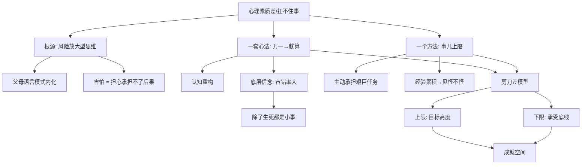

## 📋 文章信息

- **来源**: 知乎 - 问答回答
- **作者**: 少康日记
- **发布时间**: 2025年10月8日
- **互动数据**: 4898 赞同 · 617 评论 · 3834 关注者
- **阅读链接**: https://www.zhihu.com/question/1897540455295607480/answer/2053155877486698887

---

## 🎯 核心摘要

作者以自身经历切入，讲述一个从小内向、敏感、懦弱的"乖孩子"，如何在职场 8 年里修炼成同事眼中"抗压性强"的人、30 岁出任事业部总经理。核心给出了两条可落地的路径：**一套心法**——把脑内"万一……怎么办"的风险预设，改写成"就算……也无所谓"的后果承接；**一个方法**——王阳明所说的"人须在事上磨"，通过持续主动承担艰巨任务，把心性砺得沉稳。全文本质上是一套"认知重构 + 暴露疗法"的通俗表达，并以"人生容错率极大"作为底层信念。

## 📊 核心观点

### 1. "乖孩子"的本质是风险放大型的思维定式

**背景/现状**：
- 父母用"不要 XXX，万一 XXX 怎么办"的句式反复叮嘱
- 孩子内化同样的思维逻辑，面对任何事首先评估风险

**核心论述**：
- 这种性格有双重效应：上学守纪律、上班被领导觉得靠谱（收益面）；但魄力不足、扛不住事（代价面）
- 心理素质差的根源不在性格本身，而在**思维模式被训练成了"风险优先"**

### 2. 心法：把"万一"改成"就算"——认知重构

**背景/现状**：
- "万一出丑""万一被拒""万一完不成"——恐惧源于对后果的不可承受预期

**核心论述**：
- 把句式改写为"就算出丑，也不会掉块肉""就算被拒，我也没啥损失""就算完不成，我也收获了经验"
- 本质：**心理素质差 = 害怕 = 担心承担不了后果**；一旦确认"最坏结果在承受范围内"，恐惧就失去根基
- 底层信念：人生容错率极大，"除了生死，都是小事"
- 引用佛家语："即便明天就是世界末日，今夜我依然要在庭院中种满莲花。"

### 3. 方法：事儿上磨——行为暴露

**背景/现状**：
- 光有心法不够，心性必须在具体事件中反复锤炼

**核心论述**：
- 引王阳明："人须在事上磨，方立得住；方能静亦定，动亦定。"
- 作者本人从 22 岁毛躁小伙到 30 岁事业部总经理，靠的就是一次次主动承担艰巨任务（难缠客户、几百人游长城活动、风险创新业务）
- "很多事，因为见过，所以不惊讶；因为处理过，所以不慌乱"——经验的累积直接外化为沉稳

### 4. 职业成就的"剪刀差"模型

**背景/现状**：
- 作者总结职场成就的结构性规律

**核心论述**：
- 上边：奋斗目标有多高
- 下边：承受底线有多低
- **两个差值越大，成就空间越大**
- 内心豁达（抬高上限）+ 经验丰富（压低下限）= 自然不害怕

## 🧠 概念图谱

## 🔑 关键洞察

### 1. "句式替换"实为认知行为疗法的口语化版本

**分析**：
- 作者的"万一 → 就算"与 CBT（认知行为疗法）中的**灾难化思维识别与重评**几乎是同一套机制
- 真正有效的不是"积极思考"，而是**把模糊的恐惧具象化为可评估的最坏后果**，再用理性判断其可承受性
- 这也解释了为什么单纯"打气""别怕"无效——它们没有完成"后果量化"这一步

### 2. "乖孩子陷阱"是结构性的代际问题

**分析**：
- 父母的风险语言不是恶意，而是他们自身的焦虑投射
- "乖"在儿童期被奖励（听话、安全、成绩好），但在成年期被惩罚（决策回避、机会丧失）
- 这意味着解构过程必须主动发生——父母不会替你拆除他们植入的思维定式

### 3. "事上磨"揭示了一个反直觉规律：沉稳不是性格，是经验密度

**分析**：
- 我们常把"沉稳"当成天生气质，但作者点破：沉稳 = 经历的种类 × 处理过的次数
- "见过所以不惊讶，处理过所以不慌乱"——这是**模式匹配频率**的体现
- 推论：刻意选择高挑战任务的人，单位时间内的心性成长远超回避挑战者，差距会复利放大

### 4. "剪刀差"模型暗含容错与野心的协同

**分析**：
- 通常认为"野心大"和"能承受"是两件事，作者把它们放进同一个公式
- 真正限制成就的往往不是目标太低，而是**承受底线太高**（太怕失败、太要面子）
- 降低承受底线 ≠ 自暴自弃，而是**把失败重新定义为可消化的中间状态**——这正是心法部分做的事

## 🚧 不足与局限

### 1. 幸存者偏差明显

- 作者用"我做到了"反推方法有效，但同样践行此法而未成功的人不会被看到
- 30 岁当上事业部总经理，能力、机遇、行业红利等变量未被剥离

### 2. 对"性格内向"的病理化处理略显粗糙

- 全文将"内向、敏感、懦弱"并列，似乎内向是需要克服的缺陷
- 现代心理学（如《安静》Susan Cain）认为内向本身是中性的、有其优势
- 把内向和"心理素质差"绑定，可能强化内向者的自我否定

### 3. "除了生死，都是小事"作为通用基准有风险

- 对抑郁、焦虑、创伤后遗等临床群体，这种重构不仅无效，还可能引发"我连这点事都扛不住"的二次自责
- 作者的适用范围是**功能正常的职场人群**，但未明示边界

### 4. 缺乏对"过度承担"的警示

- "事儿上磨"被强调，但**过度挑战导致崩溃（burnout）**的反例未提及
- 没有给出"什么时候该拒绝"的判断标准——剪刀差的"下限"压太低也可能是灾难

## 🔮 延伸思考

### 方向1：心法可量化为"恐惧评估清单"

把"万一 X 怎么办"逐条写出，对每一条评估：①发生概率（0-10）；②最坏后果；③恢复周期；④可承受度。完成清单的过程，就是把模糊焦虑转成可决策数据的过程。这其实是作者心法的"工程化升级"。

### 方向2：王阳明"事上磨"与现代暴露疗法的呼应

- 现代暴露疗法（exposure therapy）的核心：分级、重复、真实情境下接触恐惧对象
- "事儿上磨"是社会化版本的暴露疗法——主动选择略超出当前能力的任务
- 二者都依赖一个机制：**恐惧的消退需要新经验覆盖旧记忆**，纯认知层面的"想通了"作用有限

### 方向3：代际传递的可中断点

- 父母"万一"句式塑造孩子思维——这是焦虑代际传递的微观证据
- 中断方式：在成为父母前完成自身的句式替换训练，从语言源头切断传递链
- 这比"等孩子长大自己悟"成本低得多

### 方向4：剪刀差模型的数值化推演

- 假设上限 U、下限 L，成就空间 S = U − L
- 多数人卡在 L 过高（承受底线高），而非 U 过低
- 提升 S 的边际效率：压低 L 比抬高 U 更容易、更可控——因为 L 是内在的，U 受外部机会约束

## 💡 实践启示

### 1. 建立"万一 → 就算"句式日志

**要点**：
- 每天记录 1-3 个冒出来的"万一"念头
- 用"就算……也……"逐条改写
- 坚持 30 天，句式会从刻意练习变成默认反应

### 2. 每周主动选择一件"略难"的事

**要点**：
- 不是挑战不可能，而是选**能力边缘 + 10%-20%** 的任务
- 完成后记录：最坏结果是什么？实际发生了什么？我的恐惧被验证了吗？
- 累积"恐惧未发生"的样本，重塑概率直觉

### 3. 给"剪刀差"做一次自评

**要点**：
- 写下未来 3 年的目标（上限 U）
- 写下当前最不能承受的 5 件事（下限 L）
- 问自己：哪些 L 是真实的不可承受，哪些只是面子/情绪/短期不适？

### 4. 警惕"乖孩子语言"在自己身上的延续

**要点**：
- 注意自己对他人（尤其下属、孩子）是否在用"万一"句式
- 语言习惯反过来也在固化自己的思维模式
- 把外部语言改成"就算……也可以……"，自身也会受益

## 📝 关键金句

> "心里素质差，扛不住事，本质上是因为害怕。害怕是因为担心自己承担不了后果。"

> "人须在事上磨，方立得住；方能静亦定，动亦定。" —— 王阳明

> "很多事，因为见过，所以不惊讶；因为处理过，所以不慌乱。"

> "一个人在职场能取得多大的成就，取决于一个剪刀差：上面是奋斗目标有多高，下面是自己的承受底线有多低。"

> "即便明天就是世界末日，今夜我依然要在庭院中种满莲花。"

## 🏷️ 标签

心理素质、抗压、认知重构、王阳明、事上磨、剪刀差、个人成长

---

## 🔗 相关资源

- **拓展阅读**：王阳明《传习录》中"事上磨"相关章节
- **拓展阅读**：Susan Cain《安静：内向性格的竞争力》—— 对"内向 ≠ 心理素质差"的补充视角
- **拓展阅读**：CBT 认知行为疗法相关普及读物（如伯恩斯《新情绪疗法》），对应"万一→就算"的专业版本
- **相关概念**：暴露疗法、灾难化思维、代际焦虑传递、容错率思维
