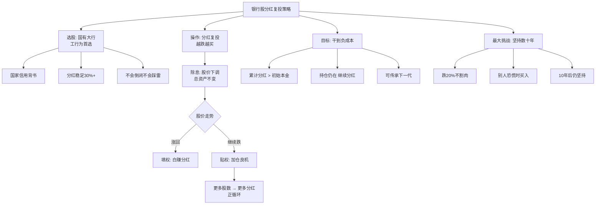

## 📋 文章信息

- **来源**: 知乎 - 问答
- **作者**: 千幻冰云
- **发布时间**: 2023年4月1日（最后修改：2026年5月28日）
- **阅读链接**: https://www.zhihu.com/question/443919043/answer/2070475245564204654

---

## 🎯 核心摘要

文章提出了一套以工商银行为核心的银行股分红复投养老策略：买入国有大行股票，分红后贴权加仓，越跌越买，坚持数十年直至累计分红覆盖本金（即"负成本"）。核心逻辑在于：国有大行不会倒闭，分红不会中断，股价下跌反而是低价买入"分红机器"的良机。作者以工行20年回测数据论证——48万投入，20年后持仓80万、累计分红52万，已实现负成本。策略最大的敌人不是市场，而是投资者自身的耐心和纪律。

## 📊 核心观点

### 1. 国有大行是A股最安全资产

**背景/现状**：
- 散户在A股频繁被"割韭菜"，寻找确定性高的投资标的
- 工商银行是全球资产规模最大、净利润最高的银行

**核心论述**：
- 工行2025年分红1105.93亿元，连续19年位居A股分红榜首
- 分红比例稳定在30%以上
- 财政部和中央汇金为前两大股东，等同于国家信用背书
- 买工行不会暴富，但永远不会踩雷

### 2. 贴权是买入良机而非风险

**背景/现状**：
- 分红除息后股价会下调，多数散户恐惧贴权（分红后股价下跌）

**核心论述**：
- 同样的资金，股价越低买到的股数越多
- 股数越多 → 下次分红越多 → 能买更多股数 → 正循环
- 真正的银行股玩家盼着贴权，因为可以用更便宜的价格买到更多"分红机器"
- "越跌越买"是策略的核心操作

### 3. "干到负成本"是终极目标

**背景/现状**：
- 普通投资者习惯用买卖差价衡量收益，忽视分红的长期积累效应

**核心论述**：
- 负成本 = 累计收到的分红超过初始投入本金
- 工行20年回测：投入48万 → 累计分红52万 → 已实现负成本
- 此时持仓仍在（约80万），每年继续贡献约2.5万分红
- 终极形态：本金永远在，分红永远拿，可传承给下一代

### 4. 最大的敌人是自己

**背景/现状**：
- 策略逻辑简单，但执行极难

**核心论述**：
- 能否在跌20%时不割肉
- 能否在别人恐慌时继续买入
- 能否拿了10年分红后还继续坚持
- "坚持数十年"是核心中的核心

## 🧠 概念图谱

## 🔑 关键洞察

### 1. 分红复投的本质是"时间套利"

**分析**：
- 银行股分红复投并非复杂的金融工程，其本质是用时间换取确定性收益
- 短期看股价波动剧烈，但拉长到20年维度，分红是唯一确定的回报
- 散户之所以被"割韭菜"，恰恰是因为试图在短期波动中博弈，而非利用长期确定性

### 2. "负成本"心理框架的巧妙之处

**分析**：
- "负成本"不是一个会计概念，而是一种心理锚定工具
- 一旦投资者认定自己的成本已经为负，就不再恐惧股价下跌
- 这巧妙地解决了银行股策略中最大的心理障碍——长期持有的耐心问题
- 类似于"已收回本金，剩下的都是利润"的心理账户效应

### 3. 策略的隐含前提被低估了

**分析**：
- 文章强调"工行不会倒"，但20年跨度内宏观环境的假设（利率水平、息差变化、经济周期）未被充分讨论
- 中国银行业目前面临息差收窄的长期趋势，未来分红水平能否维持30%比例是关键变量
- 策略实际依赖三个前提：国有体制不变、银行不被破产重组、分红政策不大幅下调

## 🚧 不足与局限

### 1. 回测数据过于理想化

- 2006-2026年是中国银行业发展的黄金时期，含多轮大牛市
- 未来20年能否复制同样的分红水平存疑
- 未考虑通胀因素：20年前的48万和今天的48万购买力完全不同

### 2. 忽视机会成本

- 资金锁定在银行股20年，无法用于其他投资
- 同期沪深300指数基金或标普500的回报可能更高
- "只买一只"的策略缺乏分散风险机制

### 3. 息差收窄的长期威胁

- 中国银行业净息差已从2010年代的2.5%+降至2025年的1.7%以下
- 息差收窄直接压缩利润空间，长期可能影响分红能力
- 文章对此只字未提

### 4. "负成本"概念可能误导

- 会计上持仓成本不会因分红变为负数
- 用"负成本"概念可能让新手忽视真实持仓的市值波动风险
- 若股价大幅下跌，即使"负成本"，总资产仍可能缩水

## 🔮 延伸思考

### 利率下行时代的银行股投资价值

- 全球进入低利率时代，银行息差普遍承压
- 但低利率环境下，银行股的股息率（5%+）相比债券更有吸引力
- 关键看银行能否在中间业务（非息收入）上弥补息差损失

### 与红利指数策略的对比

- 文章建议"只买工行"，但从分散化角度，红利低波指数（如中证红利低波）可能更优
- 指数自动优胜劣汰，避免单一银行暴雷风险
- 但指数策略缺少"越跌越买"的主动加仓 alpha

### 传承财富的现实障碍

- "传给孩子继续吃分红"的设想很美好，但需考虑遗产税、股权分散、后代投资意愿等现实问题
- 日本和欧洲的"收息族"经验表明，跨代财富传承需要制度保障

## 💡 实践启示

### 1. 银行股分红复投可作为养老底仓

**要点**：
- 用不超过可投资资产的40%配置国有大行（工行为主），作为确定性最高的底仓
- 设定每月定投金额，分红到账自动复投，不看盘不择时
- 明确"这笔钱20年不动"的心理预期

### 2. 建立分红复投的纪律机制

**要点**：
- 设定明确的加仓规则：贴权5%加一档，贴权10%加两档
- 每次分红后立刻复投，不等待"更好的价格"
- 记录累计投入和累计分红，用数据验证"负成本"进度

### 3. 分散配置但保持核心仓位

**要点**：
- 以工行为核心（50%+），搭配建行、农行、中行各一定比例
- 可适当配置红利低波指数基金作为补充
- 避免配置中小银行，它们不具备"大到不能倒"的安全边际

## 📝 关键金句

> "怕死就入宇宙第一大行，工行。发了股息没填权，就贴权买入，越跌越买，坚持数十年，干到负成本。"

> "贴权是给你的礼物，不是灾难。每一次贴权，都是市场在打折卖给你'分红机器'。"

> "这套策略最大的敌人从来不是股价下跌，而是你自己。"

## 🏷️ 标签

银行股、分红复投、工商银行、养老投资、负成本策略、价值投资

---

## 🔗 相关资源

- **拓展阅读**：红利低波指数投资、银行股息率历史数据、中国银行业息差变化趋势
