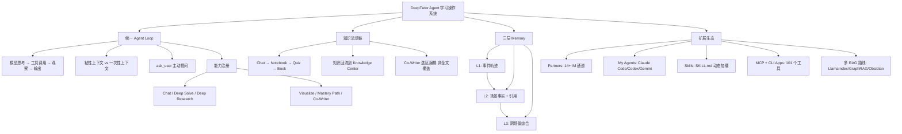

## 📋 文章信息

- **来源**: 微信公众号（山行AI）
- **发布时间**: 2026年8月11日
- **阅读链接**: https://mp.weixin.qq.com/s/fVCjdmzziz70yOVW4Q-h1g

---

## 🎯 核心摘要

DeepTutor（GitHub 34K+ Star，Apache-2.0）不是一个功能堆砌的"AI家教"，而是一套**本地优先的 Agent 学习操作系统**。它围绕统一的 Agent Loop，将聊天、研究、解题、写作、知识库、外部 Agent 和三层长期记忆编排到同一个工作台中。文章系统梳理了 DeepTutor 的九大模块、五层架构、多种 RAG 路线及安全边界，展示了 AI 学习产品从"聊天框"进化为"Agent 工作台"的完整架构路径。


## 📊 核心观点

### 1. 统一 Agent Loop 是整套产品的主干

**DeepTutor 的核心不是九个独立页面，而是一条连续的任务链。**

模型先思考 → 决定直接回复还是调用工具 → 工具结果返回 → 继续观察判断 → 输出最终消息。这个循环是所有功能（Chat、Deep Solve、Deep Research、Co-Writer、Book 等）的共同底座。

关键设计：
- **粘性上下文**：模型、知识库、Persona、语音、子 Agent 跨轮保留
- **一次性上下文**：临时挂载的文件、历史对话只影响当前轮
- **ask_user 工具**：Agent 可暂停并提出结构化问题，而非自行猜测


### 2. 知识不停留在问答里，而是流动的

传统 AI 学习产品的痛点：每次对话都是一个孤岛。DeepTutor 的设计让知识可以流动：

```
聊天 → 生成笔记 → 回存 Notebook → 变成测验题
 → 编译成 Book → 回流到知识库 → 支撑下一次聊天
```

同一段会话可以被放进后续任务，继续生成测验、笔记或章节。这是"学习操作系统"而非"问答工具"的本质区别。

### 3. Partners：不是简单的多平台接入

Partners 是带独立人格与工作区的长期角色，支持飞书、Telegram、Slack、Discord、钉钉等 14+ 通道。关键设计：

- Partner 有独立的 Memory 作用域，不会与其他角色混淆
- 外部消息经 Channel Adapter 归一化后进入共享的 ChatOrchestrator
- Partner 是"带人格、渠道和独立作用域的 DeepTutor Chat"，不是另起炉灶

代价：部署者需自行处理渠道凭证、平台限制和长期运维。

### 4. My Agents：让编码 Agent 成为学习上下文的一部分

DeepTutor 可以调用 Claude Code、Codex、Gemini、Kimi 等外部 Agent，也可以导入它们的历史对话。这解决了"学习和工作不能分开"的实际需求——阅读代码、验证公式、生成实验脚本时，专业编码 Agent 成为当前学习任务的子环节。

### 5. 三层 Memory：可审计、可追溯的长期记忆


Memory 设计是 DeepTutor 最有辨识度的部分：

| 层级 | 内容 | 特征 |
|------|------|------|
| L1 | 工作区镜像 + 事件轨迹 | 按场景、日期追加记录 |
| L2 | 场景事实（Chat/Notebook/Quiz/Book 等） | 带脚注引用上游来源 |
| L3 | 跨场景综合（Profile/Recent/Scope/Preferences） | 从综合判断可追溯到原始事件 |

关键特点：
- 使用 **Markdown 文件**保存，不藏在不可见的向量库里
- 每条记录有**稳定 ID**，支持更新、审计、去重、删除
- **引用必须存在**，无效引用会被丢弃——"可检查"是核心原则

代价：整理、审计与去重会消耗模型调用；来源质量差时，长期记忆只会更稳定地保留错误。

## 🧠 概念图谱



## 🔑 关键洞察

### 1. "学习操作系统"的核心判断标准是上下文复用

**分析**：
- 大多数 AI 学习产品是"一问一答"的孤岛模式——每次对话从零开始
- DeepTutor 的本质突破在于：一条任务链贯穿 Chat → Research → Co-Writer → Book → Memory
- 上下文复用消除了"在不同工具间复制粘贴"的摩擦
- 这也是它 34K Star 的根本原因——不是功能多，而是功能之间有连续性

### 2. Memory 可审计性比记忆能力更重要

**分析**：
- 业界 AI Memory 的主流做法是塞进向量数据库，用户无法检查系统记住了什么
- DeepTutor 用 Markdown + 脚注引用的方式，让记忆变得"可读、可查、可修正"
- 这个设计哲学接近 Obsidian/Roam Research 的"透明知识图谱"而非黑盒推荐
- 代价是更高的 Token 消耗——但这是一个值得的 trade-off

### 3. 工具表面动态生成是 Agent 架构的成熟标志

**分析**：
- DeepTutor 不是把所有工具一次性塞进 system prompt
- 而是根据当前上下文（Chat、Deep Solve、Research 等）动态挂载相关工具
- 某些能力使用独占工具集，避免无关工具干扰
- 这种设计思路值得所有 Agent 框架学习：**工具越多，越需要做工具的上下文管理**

### 4. Book 的"可维护性"设计

**分析**：
- Book 不是一次性生成的静态 PDF，而是由类型化区块组成的可编辑环境
- `deeptutor book health` 检查来源知识是否与编译页面漂移
- `deeptutor book refresh-fingerprints` 刷新指纹
- 这把 Book 从"生成物"提升为"可维护的知识产品"——类似软件工程的版本管理思路应用到内容

## 🚧 不足与局限

### 1. 配置成本不可低估

- 模型、Embedding、检索引擎、解析器、沙箱、IM 通道——每个都是独立的配置维度
- 文章推荐的"最短部署链路"（LlamaIndex + 文本解析）仍然需要 Python 3.11+ 和多个依赖
- GraphRAG、MinerU、多模态解析等高级能力需要额外模型下载或外部服务
- 对非技术用户来说，门槛远高于"打开网页就能用"的 SaaS 产品

### 2. Token 消耗可能成为瓶颈

- Memory 整理与审计需要模型调用
- Deep Research 和 Book 编译是多轮 Agent 任务
- 多 Agent 调用会放大 Token 消耗
- 本地部署用户如果使用商业 API（如 GPT-4），长期成本不可忽视

### 3. 多用户安全仍需谨慎

- 项目默认单用户、认证关闭
- 开启多用户后，MCP/CLI App 默认拒绝非管理员
- 但文章也承认"仍不是开启认证就自动安全的托管平台"
- 部署者需要自行配置沙箱、网络边界和密钥隔离

### 4. 文章本身的局限

- 文章由项目整理而来，本质是官方架构文档的中文解读
- 缺少与同类产品（如 Open WebUI、AnythingLLM、Dify）的横向对比
- 没有实际使用体验、性能数据或用户反馈
- 34K Star 的含金量（是否包含 star farming）未被审视

## 🔮 延伸思考

### DeepTutor vs 当前 AI 学习工具生态

| 维度 | DeepTutor | ChatGPT/Claude | Open WebUI | Dify |
|------|-----------|----------------|------------|------|
| 定位 | Agent 学习OS | 通用对话 | 本地 LLM 前端 | Agent 工作流平台 |
| 上下文复用 | ✅ 核心设计 | ❌ 每次独立 | 部分 | ✅ Workflow |
| 长期记忆 | ✅ 三层可审计 | ✅ 但黑盒 | ❌ | ❌ |
| 知识库 | ✅ 多 RAG 路线 | ✅ 封闭 | ✅ 基本 | ✅ |
| 外部 Agent | ✅ Claude Code 等 | ❌ | ❌ | 部分 |
| IM 通道 | ✅ 14+ | ❌ | ❌ | ❌ |
| 本地部署 | ✅ Apache-2.0 | ❌ | ✅ | ✅ |

### 对个人知识管理的启示

DeepTutor 的架构值得个人 PKM（个人知识管理）实践者学习：
1. **知识应该流动，而非堆积**——笔记→测验→Book→知识库的闭环
2. **记忆需要审计**——Markdown + 引用比向量黑盒更可信
3. **工具需要按需加载**——不是所有能力都需要同时在线
4. **Agent 是学习伙伴，不是答案机器**——ask_user 的设计体现了这一点

### Book 模式的潜力

Book 的"可维护知识产品"理念可能是未来教育内容的方向：
- 传统教材：静态、一次性、快速过时
- AI 生成的 PDF：质量不稳定、不可维护
- DeepTutor Book：类型化区块 + 来源追踪 + 健康检查 + 交互式组件
- 如果加上协作功能，可以成为团队知识库的编译系统

## 💡 实践启示

### 1. 如果想尝试 DeepTutor

```bash
# 最低成本起步
pip install -U deeptutor
deeptutor start
# 默认 http://127.0.0.1:3782

# 推荐起步顺序：
# 1. 配置一个 LLM → 验证 Chat
# 2. 配置 Embedding → 建一个 LlamaIndex 知识库
# 3. 验证引用和索引重建
# 4. 按需开启 Memory / 沙箱 / Partners
```

### 2. 从 DeepTutor 学到的 Agent 架构原则

- **统一上下文优先**：所有功能共享同一套上下文和工具
- **动态工具表面**：根据任务类型按需加载工具
- **记忆可审计**：用文件 + 引用替代黑盒向量
- **人保留最终决定权**：Co-Writer 的差异视图、Book 的用户确认大纲

### 3. 适合与不适合的场景

**适合**：
- 重度知识工作者，需要长期陪伴的学习环境
- 研究团队需要本地部署 + 可审计记忆
- 想把编码 Agent 纳入学习流程的开发者

**不适合**：
- 只需要对几份 PDF 做临时问答（过重）
- 不愿自行配置和维护的用户
- 追求开箱即用 SaaS 体验的用户

## 📝 关键金句

> "学习资料不会只停留在某个问答页面里。同一个知识库可以支撑聊天、研究、协同写作、Book 与 Partner。"

> "Memory 没有把个人状态藏在不可见的向量库里，而是使用文件化的三层结构。"

> "如果需求只是对几份 PDF 做临时问答，DeepTutor 可能过重；它真正有吸引力的场景，是你希望同一个系统陪伴数月甚至数年。"

> "系统越长期、越可扩展，配置、权限、成本与维护就越不能省略。"

## 🏷️ 标签

DeepTutor、Agent、AI教育、RAG、长期记忆、开源、本地优先、知识管理

---

## 🔗 相关资源

- **GitHub**: https://github.com/deeptutor
- **官网**: DeepTutor 官方网站
- **同类产品**: Open WebUI、AnythingLLM、Dify、Obsidian + AI 插件
