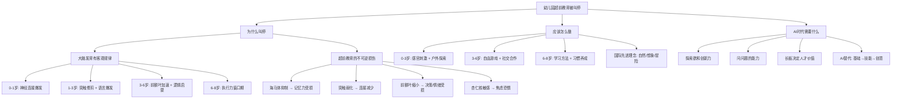

## 📋 文章信息

- **来源**: 知乎 - 问答
- **作者**: 漫非（科技数据行业从业者，新晋奶爸）
- **发布时间**: 2025年8月29日
- **赞同数**: 4987
- **阅读链接**: https://www.zhihu.com/question/398508625/answer/1944807607190651382

---

## 🎯 核心摘要

作者从职场精英的共同特质出发，结合脑神经科学的大脑发育规律，系统论证了幼儿园超前教育的危害。文章按年龄段（0-1岁、1-3岁、3-6岁、6-8岁）拆解大脑发育的客观规律，指出填鸭式死记硬背和高压超前教育会对孩子大脑造成不可逆损伤——抑制海马体发育、弱化神经突触连接、缩小前额叶皮层体积、放大杏仁核恐惧反应。作者认为，AI时代孩子的核心竞争力不再是知识储备，而是探索欲、创新力和提问能力，教育应聚焦于保护天性而非提前应试。

## 📊 核心观点

### 1. 职场精英没有"书呆子"

**观察基础**：作者在职场上接触大量顶级名校毕业的精英同事。

**核心论述**：
- 精英群体的共同特质：思想活跃、求知欲强、有自己的思维框架和思考体系
- 能拆解复杂问题，高效完成，有自我评价体系和正反馈机制
- 爱好广泛，精神属性强，有同理心，自信且情绪稳定
- "出社会混得好的，无一例外没有书呆子"
- 擅长考试的人在开卷环境中全都废了——"根本没有学习能力和判断力"

### 2. 大脑发育遵循不可逆的客观规律

文章按年龄段梳理了大脑发育的里程碑：

| 年龄段 | 大脑发育特征 | 教育重点 | 危险操作 |
|--------|-------------|---------|---------|
| **0-1岁** | 每秒形成100万个神经连接；感官和神经快速发育 | 黑白卡追视、早教音乐、抚触、户外感受 | — |
| **1-3岁** | 突触修剪启动；前额叶初步发育；语言爆发期 | 户外活动、积木涂鸦、亲近大自然 | 天天关在家里背古诗背单词 |
| **3-6岁** | 脑体积高速增长；前额叶皮质加速发育；逻辑思维启蒙 | 计划决策能力、情绪控制、社交合作、精细动作 | 超前应试、死记硬背、严厉惩罚辱骂 |
| **6-8岁** | 前额叶功能深化；神经信号传递加速；抽象思维接受期 | 学习习惯和方法、学科教育 | 前期拔苗助长导致此阶段暴露问题 |

### 3. 超前教育造成不可逆的大脑损伤

**核心论述**（3-6岁阶段的危害分析）：

- **海马体抑制**：在压力下进行超前教育，会抑制孩子海马体发育，影响记忆力
- **神经突触弱化**：缺乏感官刺激的枯燥死记硬背，造成大脑神经突触连接弱化
- **前额叶缩小**：严厉管教和频繁惩罚辱骂，使大脑负责决策和情绪调节的前额叶皮层体积显著缩小
- **杏仁核敏感**：负责恐惧调解的杏仁核异常敏感，孩子容易产生焦虑恐惧情绪
- **损伤不可逆**：以上四种损伤均被强调为不可逆

### 4. 优秀幼儿园的先进理念

文章列举了国际先进幼儿园案例：
- **丹麦森林幼儿园**：大部分活动在森林中进行，强调自然教育和冒险精神
- **巴黎Ecole Maternelle**：运用色彩心理学，环境本身激发快乐情绪和创造力
- **德国Taka-Tuku-Land**：像柠檬工厂，极致鼓励幻想和创造性游戏
- **日本富士幼儿园**：椭圆形无墙壁环形设计，鼓励自由奔跑攀爬
- **蒙氏/瑞吉欧/华德福**：殊途同归——保护孩子天性，激发想象力和探索欲

### 5. AI时代的核心竞争力

**核心论述**：
- AI将依次替代：基础类岗位（已替代）→ 技能类岗位（逐步替代）→ 创意类岗位（最难替代）
- 未来需要的是某领域突出的**专才**，不是什么都知道皮毛的**通才**
- 最核心竞争力：**探索欲 + 创新力 + 问问题的能力**
- "人工智能大模型需要在人类的智慧和创意的基础上去训练"
- 人才标准取决于**长板有多长**

## 🧠 概念图谱

## 🔑 关键洞察

### 1. "农耕模型"解释教育时机

**分析**：
- 作者用耕种类比教育：春天播种 → 阳光雨露 → 发芽 → 浇水 → 修枝剪叶 → 开花结果
- 这个类比的核心不是"顺其自然"，而是"在对的时间做对的事"
- 超前教育的错误不是"教了什么"，而是"在脑神经还没准备好时强制激活了一条低效路径"
- 类比脑科学：突触修剪机制意味着"经常使用的连接被强化，不使用的被修剪"——如果3岁时把神经资源用于死记硬背，探索和创造的突触就会被修剪掉

### 2. "擅长考试"在开卷环境中变成劣势

**分析**：
- 作者观察到一个反直觉现象：擅长考试的人在职场（"开卷考试"）中反而更迷茫
- 这不只是"高分低能"的老生常谈，而是揭示了一个结构性问题：
  - 考试能力本质是"在封闭系统中寻找唯一正确答案"
  - 职场需要的是"在开放系统中定义问题并找到路径"
  - 这两种能力使用的是不同的认知模式——前者依赖海马体（记忆），后者依赖前额叶（规划决策）
- 如果在3-6岁前额叶发育的关键期，把资源用于训练海马体（背诵），前额叶的发育窗口就被浪费了

### 3. "不可逆"论断的科学性与修辞

**分析**：
- 作者反复强调"不可逆"，这个说法有一定脑科学基础，但需要辩证看待：
  - **有依据的部分**：早期高压确实会影响杏仁核-前额叶回路的发育（神经科学有相关研究支持）
  - **过于绝对的部分**：大脑具有神经可塑性（neuroplasticity），"不可逆"一词忽略了后期的补偿机制
  - **修辞策略**：作者用"不可逆"制造紧迫感，说服家长停止超前教育——目的是好的，但科学表述不够严谨
- 更准确的说法应该是："早期不良教育环境会造成长期影响，增加后期矫正的成本"

### 4. AI时代论点的双刃剑

**分析**：
- 作者将"AI替代"作为论据来支撑"创造力比知识储备更重要"的观点
- 这个方向大致正确，但论证链条有几个跳跃：
  - AI确实在替代技能类工作，但"创意类最难替代"这个结论本身在2026年已经不那么确定了
  - "长板决定人才价值"忽略了社会协作的复杂性——一个"只有长板"的人可能难以融入团队
  - 更全面的表述应该是：AI时代既需要创造力的长板，也需要足够的底层素养来支撑长板发挥

## 🚧 不足与局限

### 1. 脑科学论述过于简化

- "每秒形成100万个神经连接"是广泛传播的数据，但来源和定义并未说明
- "前额叶体积缩小""杏仁核异常敏感"等结论引用了脑科学研究，但未标注任何具体文献
- 大脑发育存在巨大的个体差异，文章的"标准化时间表"可能让部分家长产生不必要的焦虑

### 2. 国际幼儿园案例缺乏深度

- 丹麦森林幼儿园、日本富士幼儿园等案例非常经典，但文章只是蜻蜓点水式列举
- 没有讨论这些理念在中国文化和教育资源环境下的适用性问题
- 蒙氏/瑞吉欧/华德福在中国的本土化实践挑战（师资、费用、规模）未被深入讨论

### 3. 作者权威性有限

- 作者自称"科技数据行业从业者，新晋奶爸"，并非教育或神经科学专业背景
- 文章带有强烈的个人观察和感悟色彩，虽然有脑科学概念的引用，但整体是"外行谈教育"
- 4987赞同说明引发了广泛共鸣，但共鸣不等于正确

### 4. "不可逆"的绝对化

- 反复使用"不可逆""损伤""扼杀"等极端词汇，制造焦虑
- 实际上大脑终身具有可塑性，"不可逆"的说法在科学上是过度简化的
- 这种"贩卖焦虑再给解药"的写作模式在知乎育儿话题中非常常见

## 🔮 延伸思考

### 中国学前教育的结构性困境

文章提到叫停超前教育是"国家智囊团站在更高维度"的决定，但未深入讨论：
- 中国学前教育资源分配极不均衡，公立园质量参差不齐
- 私立园以蒙氏/双语为卖点，但师资理解和执行水平普遍不足
- 叫停超前教育后，如何填补教育内容的真空？家长还是会转向课外班
- 根本问题不是"教不教"，而是"谁来教""怎么教"

### "玩耍就是学习"的脑科学证据

现代神经教育学（Educational Neuroscience）的研究支持作者的核心主张：
- Peter Gray 的研究：自由玩耍是哺乳动物学习的本能机制
- Adele Diamond 的研究：执行功能（EF）比IQ更能预测学业和人生成功，而EF通过自由游戏发展
- 但"自由玩耍"不等于"放任不管"——需要精心设计的环境和适度的成人引导（scaffolding）

### AI时代教育的真正悖论

- 作者说AI时代需要创造力，但"创造力"恰恰是最难被标准化培养的能力
- 中国教育体系以标准化考试为核心，与创新力培养存在结构性矛盾
- 短期内，考试仍然是大多数家庭的风险对冲工具——要求家长放弃超前教育，等于要求他们放弃安全感
- 除非社会评价体系和人才选拔机制发生根本变化，否则超前教育的需求不会消失

## 💡 实践启示

### 1. 各年龄段家长的行动参考

**0-3岁**：
- 优先提供丰富的感官环境（视觉、听觉、触觉）
- 多户外活动，让孩子自由探索
- 不需要刻意"教学"，孩子的大脑会自动学习
- 关注安全感和情绪稳定性

**3-6岁**：
- 不急于学科知识灌输（拼音、算术、英语）
- 优先选择以游戏和探索为核心的幼儿园
- 提供自由玩耍的时间和空间
- 关注社交合作、情绪管理、精细动作的发展
- 通过艺术、音乐、自然探索滋养创造力

**6-8岁**：
- 这才是学科教育的最佳窗口期
- 重点不是"学什么"，而是"怎么学"——培养学习习惯和方法
- 前期大脑发育良好的孩子，此阶段会展现出更强的理解力和记忆力

### 2. 避免"焦虑驱动"的教育决策

**要点**：
- 超前教育的驱动力是家长的恐惧（怕落后），而非孩子的需要
- 每次做教育决策前问自己：这是为了满足我的焦虑，还是为了孩子的发展？
- "别人家孩子在学"不构成你也要学的理由

### 3. 培养"问问题"的能力

**要点**：
- 作者强调"日后最重要的培养孩子问问题的能力"
- 具体做法：不急于给孩子答案，而是引导他们提出更好的问题
- 允许孩子质疑权威（包括父母）
- 好问题的标准：没有标准答案、需要思考才能提出、能打开新的探索方向

## 📝 关键金句

> "出了社会就是开卷考试，那些靠死记硬背拿结果的同学，只要开卷，全都废了。"

> "孩子的成才，和你提前学了哪些知识根本无关。甚至起反作用。"

> "如果刚发芽就想拔苗助长，甚至种子还没破土而出，你觉得还能活么？"

> "未来孩子的最核心竞争力，最重要的就是探索欲和创新力，人才的标准取决于长板有多长！"

> "日后最重要的培养孩子问问题的能力。家长们切记！"

## 🏷️ 标签

幼儿教育、大脑发育、超前教育、AI时代、创造力培养、蒙特梭利、育儿理念

---

## 🔗 相关资源

- **拓展阅读**：《Free to Learn》(Peter Gray)、《蒙特梭利教育法》、《Mind in the Making》(Adele Diamond)
- **相关概念**：神经可塑性、突触修剪、前额叶发育、执行功能（EF）、蒙氏教育敏感期
