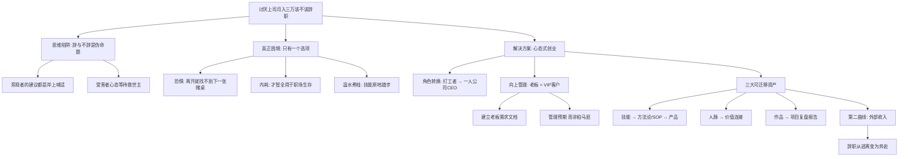

## 📋 文章信息

- **来源**: 知乎 - 问答
- **作者**: 阿凯本凯-修罗道
- **发布时间**: 2025年9月
- **赞同数**: 1073
- **阅读链接**: https://www.zhihu.com/question/1946003244842193947/answer/1955717131174942313

---

## 🎯 核心摘要

文章以"讨厌上司、月薪三万、快抑郁了、该不该辞职"为切入点，指出"辞与不辞"本身是个伪命题——真正的困境不是老板有多糟，而是你只有一个选项。作者提出"心态式创业"的核心方法论：不急于辞职，而是把公司当成"天使投资人"，把老板当成"VIP客户"，在工作中沉淀技能、人脉和作品三大"可迁移资产"，构建"第二曲线"收入。当你的外部价值足够强时，辞职就从"逃离"变成了"奔赴"。

## 📊 核心观点

### 1. "辞与不辞"是个思维陷阱

**核心论述**：
- 问别人"该不该辞"，等于把人生决定权交给了不用承担后果的旁观者
- 劝你辞的人不帮你还花呗，劝你忍的人体会不到你上班如上坟的痛苦
- 真正的痛苦不是"老板傻叉"，而是"我只有这一个选项"的无力感
- 你像赌徒把所有筹码压在一张赌桌上，不敢走是因为怕找不到下一张

### 2. 打工的本质是"续命"而非"生活"

**核心论述**：
- 一天24小时：睡觉8h + 通勤2h + 工作10h = 只剩4h
- 扣掉吃饭洗漱发呆，真正属于自己的时间不到1小时
- 用1小时的"自由"弥补10小时的"痛苦"，这不是生活，是"续命"
- 内耗的本质：聪明才智全用在"怎么在屎里游泳还不被淹死"
- 下班后的刷短视频不是"放松"，是"宕机"——CPU 100%后的强制关机

### 3. 最可怕的结局：离开后发现一无所有

**核心论述**：
- 如果每天只想着"怎么对付老板""怎么摸鱼"，所有技能点都加在"职场生存"而非"价值创造"上
- 几年后拿N+1走人，打开招聘软件发现：要么薪水腰斩，要么要求全能战士
- 面试官问你"行业趋势""方法论""从0到1的思路"，脑子里一片空白
- 三万月薪不是你能力的证明，而是公司购买你"忍耐力"和"时间"的价格

### 4. 核心方法论："心态式创业"

**理念**：不注册公司、不租办公室，而是把自己当成"一人公司"的CEO。

**角色转换**：

| 原来的视角 | 创业心态视角 |
|-----------|------------|
| 公司 = 牢笼 | 公司 = 天使投资人 |
| 老板 = 狱卒/恶魔 | 老板 = VIP大客户 |
| 同事 = 狱友 | 同事 = 陪练/NPC |
| 工作 = 忍受 | 工作 = 练级打怪 |
| 工资 = 卖命钱 | 工资 = 启动资金 |

### 5. 向上管理的操作框架

把老板当"产品"研究，建立"老板需求文档"：

- **用户需求**：喜欢看数据报告还是听结论？关注成本、效率还是创新？
- **决策风格**：独断专行还是需要多方案选择？
- **恐惧点**：怕担责任还是怕在上级面前丢脸？
- **操作策略**：他要细节就给日报周报；他要画饼就帮他翻译成可落地步骤
- **本质**：不是拍马屁，而是管理他对你的"预期"

### 6. 三大可迁移资产

| 资产 | 定义 | 具体做法 |
|------|------|---------|
| **技能** | 能脱离公司独立变现的能力 | 把工作技能打磨成可复制的方法论/SOP，变成"产品"对外销售 |
| **人脉** | 离职后仍跟随你的关系 | 用专业能力建立"价值连接"，而非虚头巴脑的社交 |
| **作品** | 能证明你能力的东西 | 每个项目都当"作品"打磨，复盘形成详细项目报告 |

## 🧠 概念图谱

## 🔑 关键洞察

### 1. "只有一个选项"是焦虑的根源

**分析**：
- 心理学中的"稀缺心态"（Scarcity Mindset）：当你觉得只有一个选择时，恐惧会让你做出最保守的决策
- 月薪三万看似是"好待遇"，但如果它锁住了你的所有时间和精力，实际上是一种"金手铐"
- 真正的职业安全感不来自当前工资的高低，而来自你手里有多少个"可以打的牌"
- 这解释了为什么高薪者反而更容易陷入职业困境——工资越高，沉没成本越大，越不敢离开

### 2. "内耗"的真实成本被严重低估

**分析**：
- 文章描述的"10小时痛苦 + 1小时自由"模式，本质上是慢性心理损耗
- 内耗不只是"心情不好"，它会直接侵蚀你的认知带宽（cognitive bandwidth）
- 当你的大脑每天消耗大量能量处理情绪、应对人际冲突时，留给学习、思考、创新的能力几乎为零
- 这就是为什么"在公司待了几年反而能力倒退"——不是没学到东西，而是失去了学习的能力

### 3. "创业心态"的本质是视角切换

**分析**：
- 作者提出的"心态式创业"并非新鲜概念（纳瓦尔的"产品化自己"、里德·霍夫曼的"The Startup of You"都讲过类似理念）
- 但文章的价值在于给出了具体操作框架：老板需求文档、技能SOP化、人脉价值化、作品项目化
- 关键转变：从"公司需要我做什么"到"我能从这家公司提取什么价值"
- 这个视角切换本身就是最好的"反内耗"工具——你不再是被动的受害者，而是主动的资源整合者

### 4. 文章末尾暴露了商业意图

**分析**：
- 文章最后突然引导读者去看作者的付费内容：《IP炼金术》、VIP信息源、资源跃迁/贵人路径等
- 这说明文章本身是一个"引流内容"，目的是建立信任后转化付费用户
- 这并不否定文章的观点价值，但读者需要意识到：作者写这篇回答的动机不仅是"帮助你"，也是在"经营他的一人公司"
- 讽刺的是，这恰恰印证了文章的核心方法论——把知识产品化，在平台建立个人品牌

## 🚧 不足与局限

### 1. "心态切换"被过度简化

- 文章暗示只要改变心态，工作就能从"受罪"变成"练级"
- 但现实中，有毒的职场环境（PUA、性骚扰、系统性压榨）不是靠心态调整就能应对的
- "把老板当客户"的前提是老板至少是个理性的人——如果老板是恶意的，这个策略完全不适用
- 心态调整是必要的，但不应成为忍受职场霸凌的借口

### 2. "第二曲线"的可行性被高估

- "把技能变成产品对外销售"听起来很美好，但实际执行门槛很高
- 大多数岗位的技能并不容易产品化（比如中层管理、行政、运营执行）
- 在996的工作强度下，下班后还有精力做副业的人是极少数
- 文章没有讨论时间管理和精力管理的现实挑战

### 3. 缺少对"真正应该立刻辞职"情况的讨论

- 如果已经出现严重心理问题（抑郁、焦虑症躯体化），首选应该是寻求专业帮助和离职休养
- 文章的"不要辞、先榨干价值"建议，对已经心理崩溃的人可能是有害的
- 健康永远是第一位的，任何职业建议都不应以牺牲身心健康为代价

### 4. 故事和案例过于泛化

- 文章通篇没有具体的真实案例，所有描述都是"你可能会遇到"的假设场景
- "禅师和牛"的开篇段子很精彩，但本质上是修辞手法而非论证
- 向上管理的操作建议虽然有启发性，但缺乏真实场景验证

## 🔮 延伸思考

### "金手铐"效应与中产阶级焦虑

- 月薪三万在中国大多数城市属于中高收入，但这个收入水平恰恰最容易陷入"金手铐"
- 高于市场平均的薪资 → 高于平均的生活开支（房贷、车贷、子女教育）→ 高度依赖当前收入
- 打破金手铐的唯一方式不是"等攒够了再走"，而是"持续降低对单一收入源的依赖"
- 这与投资中的"分散风险"原则一致：不要把人力资本全部配置在一家公司

### "一人公司"概念的知识谱系

| 来源 | 核心概念 | 与本文的关系 |
|------|---------|------------|
| 里德·霍夫曼《The Startup of You》 | 把自己当成创业公司来经营 | 文章核心理念的直接来源 |
| 纳瓦尔·拉维坎特 | "产品化自己"（Productize Yourself） | 文章"技能产品化"部分 |
| 《搞定》(GTD) | 关注"可交付成果"而非"忙碌" | 文章"作品集"理念 |
| 向上管理经典理论 | 管理老板的预期而非抱怨老板 | 文章"老板需求文档"部分 |

### AI时代的"一人公司"

- 文章没有提到但值得补充：AI工具（ChatGPT、Claude等）极大降低了"一人公司"的门槛
- 以前需要团队完成的工作（文案、设计、数据分析），现在一个人借助AI就能完成
- 这使得"第二曲线"的启动成本比文章写作时更低
- 但同时也意味着：如果你的技能可以被AI替代，那你的"技能资产"价值在缩水
- AI时代真正的"可迁移资产"应该是：审美判断、复杂问题拆解能力、人际信任——这些是AI难以替代的

## 💡 实践启示

### 1. 立即可做的事

**本周行动**：
- 写一份"老板需求文档"：花30分钟分析你上司的决策风格、关注点、恐惧点
- 做一次"技能审计"：列出你当前工作中的核心技能，标注哪些可以脱离公司独立变现
- 复盘最近一个项目：用STAR方法（情境-任务-行动-结果）写一份项目报告

### 2. 中期布局（1-3个月）

- 选择一项你最擅长的工作技能，开始把它体系化为方法论
- 在社交平台（知乎/公众号/小红书）发布第一篇专业内容
- 主动帮助一个跨部门同事解决问题，建立"价值连接"
- 评估你的时间结构：找出每天可以被重新分配的30分钟

### 3. 长期目标（6-12个月）

- 目标：让"第二曲线"产生第一笔收入（哪怕只有100元）
- 目标：完成3-5份高质量的项目复盘报告，形成"作品集"
- 目标：建立5个以上有深度交流的跨部门/跨公司人脉
- 评估"辞职时机"：第二曲线收入能覆盖基本开支的50%以上

### 4. 健康警示

**如果你已经出现以下症状，优先考虑离职和就医**：
- 严重的睡眠障碍（失眠或嗜睡）
- 持续的情绪低落、对任何事都提不起兴趣
- 躯体化症状（头痛、胃痛、心悸，但体检无器质性问题）
- 对上班产生强烈的恐惧或恶心反应
- 有自伤或自杀念头

**健康 > 职业 > 收入。这不是鸡汤，是排序。**

## 📝 关键金句

> "所有劝你辞职的，都不用帮你还下个月的花呗。所有劝你忍着的，都体会不到你每天上班如上坟的心情。"

> "你痛苦的根源，是你只有这一个选项。"

> "比傻叉老板更可怕的，是'我只能忍受这个傻叉老板'的无力感。"

> "三万月薪不是你能力的证明，而是公司购买你'忍耐力'和'时间'的价格。"

> "公司只是你用来'练级打怪'的'新手村'。老板是你要通关的第一个'大BOSS'。"

> "你不是在'逃离'，而是在'奔赴'。这才是成年人该有的，最帅的离职姿态。"

## 🏷️ 标签

职场、向上管理、创业心态、职业规划、第二曲线、一人公司、金手铐效应

---

## 🔗 相关资源

- **拓展阅读**：《The Startup of You》(Reid Hoffman)、《纳瓦尔宝典》、《搞定》(David Allen)
- **相关概念**：金手铐效应、稀缺心态、向上管理、可迁移技能、第二曲线
