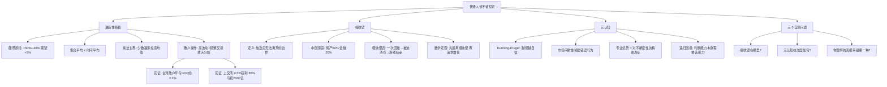

## 📋 文章信息

- **来源**: 知乎 - 问答
- **作者**: 墨苍离
- **发布时间**: 2026年1月17日
- **赞同数**: 596
- **阅读链接**: https://www.zhihu.com/question/407865356/answer/2020155381037442897

---

## 🎯 核心摘要

这是一篇罕见地将物理学遍历性概念（ergodicity）、行为心理学（Dunning-Kruger效应）和真实市场数据（台湾全量交易数据、上交所4000万账户）融合在一起的投资科普长文。文章的核心论点：**"平均回报"这个概念对个体投资者是系统性误导的**。在乘法动力学下，集合平均（所有人平行宇宙的均值）始终高于时间平均（你一个人实际经历的路径），而散户的操作方式（高波动、频繁交易）会把这个分裂放大。决定你该不该投资的不是"市场好不好"，而是你的**"吸收壁"在哪里**——即一次回撤是否会触发你被迫清仓的不可逆后果。

## 📊 核心观点

### 1. 硬币游戏：正期望值也能让你稳定变穷

**思想实验**：
- 硬币正面：财富+50%；反面：财富-40%
- 算术平均期望值 = (+50% + -40%) / 2 = +5%（看起来是好赌局）
- 但你一个人连续抛：100 × 1.5 × 0.6 = 90 → 81 → 72.9...
- **每一轮的期望都是正的，但你稳定地在变穷**

**来源**：2019年物理学家 Ole Peters 发表在 *Nature Physics* 的论文

### 2. 集合平均 vs 时间平均：遍历性断裂

| 概念 | 定义 | 你关心的 |
|------|------|---------|
| **集合平均** | 无数个平行版本的你的平均结果 | 不是这个 |
| **时间平均** | 你一个人反复做的实际结果 | **是这个** |

**核心数学性质**：
- 加法世界（每天固定赚/亏100元）：两者相等（遍历性成立）
- 乘法世界（涨10%、跌15%，收益是百分比）：遍历性断裂
- **分裂方向固定：集合平均总是高于时间平均**
- 少数极端赢家把集合平均拉高，大多数个体路径沉默地低于均值

**结论**："A股长期年化X%"、"沪深300过去十年涨了Y%"——这些数字描述的不是你将经历的回报

### 3. 散户的结构性亏损：不只是"水平差"

**实证数据**：

| 研究 | 数据 | 发现 |
|------|------|------|
| Barber & Odean (2009, RFS) | 台湾全量交易数据 | 散户年均亏损 ≈ 台湾GDP的2.2%，流向机构和交易成本 |
| An, Lou & Shi (2022, JME) | 上交所4000万账户 | 最大的0.5%账户获利，底部85%账户损失约2500亿 |

**关键洞察**：即使市场指数在涨，乘法动力学+波动性也会让大多数个体路径的终点落在均值以下。"水平差"只是放大效应，不是根源。

### 4. 长期持有能解决吗？——递归困境

**部分成立**：
- 真正的长期被动持有者，路径依赖影响会被拉长的时间稀释
- 遍历性问题对频繁交易者杀伤力最大

**但存在递归困境**：
- "声称自己能长期持有"和"实际上能长期持有"是两件事
- 绝大多数声称要"长期持有"的人，第一次30%回撤就卖了
- 判断自己是否具备长期持有的心理韧性，本身需要元认知能力
- **你不知道自己不知道什么**

### 5. Dunning-Kruger效应在投资中尤其凶猛

- 能力越低的人越倾向于高估自己（Kruger & Dunning, 1999）
- 投资领域更特殊：**市场会间歇性地奖励错误行为**
- 基于错误逻辑买入 → 恰好涨了 → 把随机正反馈编码为"我的方法有效"
- 几次之后，信心和能力的缝隙大到危险
- 专业投资者的核心优势：**对自己不确定性的精确表征**（元认知）

### 6. 吸收壁：你离"出局"有多远？

**概念**（来自 Taleb）：吸收壁 = 一旦触及就无法离开的边界

- 对应现实：爆仓、被迫清仓、因缺钱在亏损时卖出
- 触及吸收壁后，市场涨到天上与你无关

**中国家庭的资产结构**（央行2019年数据）：
- 户均总资产317.9万，住房占59.1%，金融资产仅占20.4%
- 真正可承受损失的"风险资本"可能只占个位数百分比
- 可投资资产薄、家庭负担重 → 吸收壁近在咫尺
- **同一个市场对不同的人是完全不同的游戏**

**数学定理**：在有吸收壁的随机过程中，最优策略首先是远离吸收壁，其次才是追求增长。

### 7. 不投资也有成本——但成本的性质不同

| | 通胀损耗 | 投资亏损 |
|--|---------|---------|
| 速度 | 缓慢、可预测 | 可能突然、超预期 |
| 吸收壁 | 不会触发 | 可能直接触发 |
| 性质 | 确定性的缓慢损耗 | 不确定性的剧烈损耗 |

**对吸收壁近的人**：选择确定的缓慢损耗 > 不确定的剧烈损耗

## 🧠 概念图谱



## 🔑 关键洞察

### 1. "平均回报"是一个系统性误导的指标

**分析**：
- 所有主流投资教育——基金宣传、理财课程、媒体分析——都建立在"集合平均"之上
- "过去五年年化15%"意味着所有平行路径的均值是15%，但你的单一路径几乎一定低于这个数字
- 这不是营销骗局，而是数学事实——但几乎没有人告诉你
- 文章引用 Peters 框架的价值正在于此：给非专业人士一个直觉上可抓握的思维工具

### 2. "吸收壁"比"回报率"更值得作为投资决策的第一变量

**分析**：
- 传统投资教育的提问框架："这个投资的预期回报是多少？风险有多大？"
- 文章提出的重新框架："如果这笔钱归零，我的生活会发生什么？"
- 这两个问题的优先级应该反过来：先问吸收壁，再问回报率
- 对于可投资资产只有二三十万的家庭，最优策略可能不是"找到好基金"，而是"远离股市，攒够流动性缓冲"
- 这个结论很反直觉，但在数学上是严格的

### 3. 市场间歇性奖励错误行为是投资教育最深层的困境

**分析**：
- 在大多数领域，错误的反馈是即时的：你不会游泳就会沉下去
- 但在投资中，随机性会把错误的行为包装成成功
- 这意味着：你无法用"过去的成功"来验证自己的方法论是否正确
- 唯一可靠的验证方式是：事前写下概率判断 → 事后用足够样本校准
- 但这件事需要极强的纪律和统计素养，大多数散户从未做过

### 4. "不投资"在数学上也是次优，但在实践中可能是个体最优

**分析**：
- 通胀确实在持续侵蚀现金购买力——这是确定的成本
- 但"确定的缓慢损耗"和"不确定的剧烈损耗"是两种性质完全不同的风险
- 对于吸收壁近的人，前者优于后者——这不是怯懦，而是约束条件下的数学最优
- 文章的诚实之处：没有给出"统一答案"，而是强调"答案取决于你的吸收壁"

## 🚧 不足与局限

### 1. Peters 框架的学术争议被一笔带过

- 文章承认"Peters的遍历性框架在学术经济学界并非无争议"，但没有展开
- 主流经济学的反驳：期望效用理论中的对数效用函数天然处理了路径依赖和破产风险，Peters的"发现"并非新东西
- Peters 论文的真正贡献是概念性的（教育层面）而非定理层面的——文章说了这一点，但可以更深入

### 2. 硬币游戏参数过于极端

- +50%/-40%的参数是为了让数学结构可见，但真实市场远没有这么极端
- 文章虽然做了声明（"真实市场的分裂没这么夸张"），但读者可能仍会过度反应
- 更有教育意义的做法：用真实市场的波动率（如年化15-20%）算一遍集合平均与时间平均的实际差距

### 3. "长期持有"的反驳处理得不够充分

- 文章承认长期持有能降低遍历性问题，但用"递归困境"（你不知道自己能不能拿住）一笔带过
- 这个反驳虽然成立但不够公平：指数定投+20年的策略，已经有大量实证数据支持
- 关键变量不是"能不能拿住"，而是"定投机制本身是否能对抗心理偏差"——自动扣款的定投恰恰解决了"第一次回撤就卖"的问题

### 4. 缺乏建设性的操作建议

- 文章的结论本质上是"不确定就别投"——这对很多人来说等于"永远别投"
- 但"通胀确定在侵蚀你的现金"这个事实也需要应对方案
- 文章没有讨论：如果吸收壁太近不能投股票，那应该投什么？（货币基金？国债？黄金？）
- 给出了一个框架但没有给出路径

## 🔮 延伸思考

### 遍历性与凯利公式

- 文章的核心数学思想——乘法动力学下时间平均低于集合平均——与凯利公式（Kelly Criterion）直接相关
- 凯利公式给出的最优下注比例，恰好是使时间平均增长率最大化的比例
- 凯利公式的一个重要推论：**永远不要全押**——全押时遇到一次反面就可能触及吸收壁
- 这与文章的"远离吸收壁"结论完全一致
- 如果读者想深入理解，凯利公式是从数学上最优雅的入口

### 吸收壁概念与个人财务规划的融合

| 吸收壁距离 | 资产特征 | 最优策略 |
|-----------|---------|---------|
| 极近（可投资资产<10万年收入） | 无缓冲 | 优先积累3-6个月应急金，不碰任何风险资产 |
| 中等（可投资资产1-3年年收入） | 有一定缓冲 | 核心-卫星策略：80%无风险+20%宽基指数定投 |
| 较远（可投资资产>5年年收入） | 缓冲充裕 | 可以追求更积极的资产配置，包括个股、行业基金 |
| 极远（资产>10年年收入且稳定） | 几乎无吸收壁 | 可以使用杠杆策略（但仍需元认知校准） |

### 元认知训练的实际操作

文章指出"没有人做元认知训练"，但实际可以做：

1. **预测日记**：每周写下3个市场预测 + 概率估计
2. **事后校准**：每月回顾，对比实际结果与概率估计
3. **Brier Score**：用数学方法衡量你的预测准确度
4. **参考类预测（Reference Class Forecasting）**：不做独特性预测，而是问"类似情况的历史基率是多少"

## 💡 实践启示

### 1. 立即可做：计算你的吸收壁位置

**具体步骤**：
- 计算家庭总资产和总负债
- 区分：流动资产（可随时变现）、半流动资产（3个月内可变现）、固定资产
- 计算"风险资本" = 流动资产 - 6个月家庭开支 - 未来2年确定的大额支出
- 如果"风险资本" < 0，你不应该投资任何风险资产

### 2. 如果选择投资：降低遍历性损耗

**策略**：
- **降低波动率**：宽基指数 > 行业基金 > 个股
- **拉长持有期**：遍历性损耗随持有期增加而降低
- **定投而非择时**：自动扣款对抗行为偏差
- **不加杠杆**：杠杆直接把吸收壁拉到面前
- **分散配置**：多资产类别降低单一路径的波动

### 3. 元认知校准：开始写预测日记

**格式**：
```
日期：2026-08-14
预测：沪深300在未来12个月将上涨
概率：60%
理由：估值处于历史低位区间，政策面偏暖
```
12个月后回顾，如果你的60%概率预测的实际命中率远偏离60%，说明你的校准度需要调整。

### 4. 对于不同人群的建议

| 人群 | 建议 |
|------|------|
| 可投资资产 < 年收入 | 不投资风险资产，优先积累应急金 |
| 可投资资产 1-3倍年收入 | 定投宽基指数，不超过风险资本的30% |
| 可投资资产 > 5倍年收入 | 可以考虑资产配置，核心+卫星策略 |
| 试图选股的散户 | 先做一年的模拟盘+预测日记，看看自己的校准度 |

## 📝 关键金句

> "你不是那一万个人。你是其中的一个。你不活在平均值里。你活在自己这条唯一的时间线上。"

> "市场不会告诉你你的逻辑是错的。你会把随机的正反馈编码为'我的方法有效'。"

> "一把枪交给不知道自己不会开枪的人，比交给知道自己不会开枪的人更危险。"

> "同一个市场、同一个投资品种，对不同的人意味着完全不同的东西。对前者，波动是机会。对后者，波动是生存威胁。"

> "在有吸收壁的随机过程中，最优策略首先是远离吸收壁，其次才是追求增长。这是数学定理。"

> "不确定的时候不做不可逆的决定，这不是什么深刻的智慧，只是基本的概率意识。"

## 🏷️ 标签

遍历性、吸收壁、投资、散户、元认知、Dunning-Kruger效应、凯利公式、资产配置

---

## 🔗 相关资源

- **拓展阅读**：Ole Peters (2019) "The Ergodicity Problem in Economics" (*Nature Physics*)、Taleb《黑天鹅》《反脆弱》、Kelly (1956) 凯利公式原始论文
- **相关概念**：遍历性（Ergodicity）、吸收壁（Absorbing Barrier）、元认知（Metacognition）、集合平均 vs 时间平均、凯利公式（Kelly Criterion）
