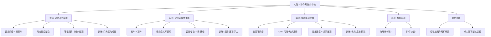

## 📋 文章信息

- **来源**: 知乎 - 问答
- **作者**: 韬韬
- **发布时间**: 2026年6月27日
- **阅读链接**: https://www.zhihu.com/question/2013546356183150719/answer/2059441995295240269

---

## 🎯 核心摘要

作者从"聪明是用进废退的"这一理念出发，用脑科学的网络视角拆解了三类常见工作能力——沟通、设计、编程——分别训练大脑的哪些系统，并给出针对性锻炼方案。核心观点：大脑不是一块"多用就整体变强"的单一肌肉，而是一套按任务临时组队的协作系统。沟通是动态开放系统（训练语言网络+前额叶），设计是受约束的视觉生成系统（训练枕叶+顶叶），编程是规则驱动的逻辑系统（训练前顶叶网络）。要提升哪方面能力，就需要在工作之外选择能激活对应网络的爱好和活动。

## 📊 核心观点

### 1. 大脑是协作系统，不是单核处理器

**基础分工**：

| 脑区 | 主要功能 |
|------|---------|
| 额叶 | 计划、组织、问题解决、语言产出、执行控制 |
| 顶叶 | 空间、感觉整合、注意 |
| 颞叶 | 听觉、语言理解、记忆 |
| 枕叶 | 视觉信息处理 |
| 海马体 | 记忆形成与提取 |
| 小脑/扣带回/岛叶 | 运动协调/冲突监测/内感受 |

**关键认知**：脑科学越来越强调"网络"而非单个脑区——区域按任务临时组队。一个人设计反应快，不代表会议沟通也能立刻总结；代码写得快，不一定能听懂复杂的人际意图。

### 2. 三类工作能力的脑网络差异

| 能力 | 系统性质 | 主要网络 | 核心训练点 |
|------|---------|---------|-----------|
| **复杂沟通** | 动态开放系统 | 语言网络 + 前额叶执行控制 + 工作记忆 + 海马体提取 | 动态信息整合 |
| **交互/视觉设计** | 受约束的视觉生成系统 | 枕叶 + 顶叶 + 前额叶（方案选择） | 视觉模式库调用 |
| **程序解题** | 规则驱动的逻辑系统 | 前顶叶网络（逻辑、规则、抽象关系） | 抽象建模 + 关系推理 |

### 3. 沟通的本质：动态信息整合

**核心论述**：
- 复杂沟通不是"会说话"，而是：一边听、一边判断对方真正关心什么、一边对齐新旧信息、一边准备回应
- 会议中大脑在不断更新一个临时模型：谁在说事实、谁在表达风险、谁在暗示优先级、谁在保护责任边界
- **笔记的陷阱**：记笔记可能把你带回"信息收集模式"——以为写下来了就等于处理了
- **正确做法**：把笔记从"记录内容"改成"捕捉结构"——结论、理由、风险、行动
- 领导能自动总结不是记忆力神奇，而是脑中已有高阶框架，可快速归类信息

### 4. 设计的本质：视觉模式库的调用

- 问题被定义清楚后，大脑大量工作转向视觉加工、空间布局、模式识别和经验调用
- 资深设计师调用的是长期积累的视觉模式库：信息层级、组件关系、留白、对齐、节奏、交互路径
- fMRI 研究：代码理解更多共享形式逻辑推理的前顶叶资源，**而不是自然语言网络**——读代码不是"读英文"，而是在运行一种规则系统

### 5. 针对性锻炼方案

| 目标能力 | 训练活动 | 训练机制 |
|---------|---------|---------|
| **复杂沟通** | 日常聊天、讲故事、会后recap、Table Topics、播客口头总结三句话 | 语言提取、工作记忆压缩、情境判断、表达速度 |
| **设计能力** | 摄影、速写、拼贴、手工、看展描述、搭积木、做饭摆盘 | 比例、层级、秩序、质感、空间关系 |
| **逻辑推理** | 棋类、桌游、数独、拆装机械、修家电、分析游戏机制 | 因果链、状态转换、约束满足、多步推演 |
| **记忆导航** | 地图、徒步、城市探索、无导航找路、旅行规划 | 环境建模、记忆检索、路线压缩、错误修正 |
| **整体状态** | 快走、跑步、游泳、骑车（有氧运动） | 心血管供血、海马体健康、执行功能 |

### 6. 性价比最高的训练：口头三句总结

每天听完会议/播客/聊天后，强迫自己不用笔记，口头说出三句：
1. 对方核心意思是什么
2. 背后的担忧是什么
3. 我下一步要问什么

**关键**：真实会议不会等你慢慢把认知炖熟。笔记只服务于提取，不替代提取。

## 🧠 概念图谱

## 🔑 关键洞察

### 1. "聪明"不是一个单一维度

**分析**：
- 职场常把所有能力混成一句"这个人 sharp 不 sharp"——这是认知上的懒惰
- 三种能力需要不同形态的"聪明"：沟通快的人不一定设计细，设计强的人不一定会议反应快
- 这解释了很多职场困惑：为什么技术大牛在会议上表现平平？为什么设计师写不了代码？
- 不是智力差异，而是**训练历史不同**——各自的脑网络在不同任务上被强化了

### 2. 笔记的悖论：外部记忆可能抑制内部加工

**分析**：
- 认知科学中有"认知卸载"（cognitive offloading）概念：把信息存在外部媒介会减少大脑的深度加工
- 作者的观察非常精准：记笔记容易变成"信息收集模式"，产生"写下来=处理了"的错觉
- 但作者没有走向极端（完全不用笔记），而是重新定义笔记的功能：**服务于提取，不替代提取**
- 这与"主动回忆"（active recall）的学习科学结论一致：提取练习比重复阅读有效得多

### 3. "读代码不是读英文"有重要教学意义

**分析**：
- fMRI 研究发现代码理解走的是形式逻辑推理通路，与自然语言处理分离
- 这解释了为什么语言学习方法和编程学习方法不能互相迁移
- 也解释了为什么"英语好"不能预测"编程好"
- 对编程教育的启示：教编程应该更像教逻辑/数学，而不是教语言

### 4. "把娱乐变成训练"需要警惕

**分析**：
- 作者提出"打游戏时分析 build、资源、路径，接近系统设计训练"——方向正确但有陷阱
- 关键区分：主动分析（训练）vs 被动消费（自动驾驶模式）
- 一旦分析变成机械重复，大脑会进入省能模式，训练效果消失
- 这与刻意练习（deliberate practice）理论一致：需要在舒适区边缘持续保持主动调整

## 🚧 不足与局限

### 1. 脑区定位的表述偏简化

- 文中"额叶负责计划、顶叶负责空间"等描述是教科书式的粗略分工
- 现代脑科学（如网络神经科学）恰恰反对这种"一个区域一个功能"的定位论
- 作者虽然提到了"网络"视角，但后面的训练建议又回到了区域定位逻辑（"锻炼枕叶"）
- 事实上，任何复杂认知任务都是全脑网络协作，不存在"只练一个区域"的活动

### 2. "用进废退"的证据强度参差

- 伦敦出租车司机研究（海马体后部增大）是观察性研究，存在自我选择效应：可能本身空间记忆好的人才去做出租车司机
- 有氧运动增加海马体体积的 RCT 研究是真实存在的（Erickson et al., 2011），但样本是老年人，向年轻人外推需谨慎
- "针对具体脑区的业余锻炼能提升具体工作能力"这个因果链，目前证据薄弱

### 3. 缺乏"训练迁移"问题的讨论

- 认知科学的核心难题：训练效果能否迁移到真实任务？
- 著名的"大脑训练"研究（如 Lumosity 的脑训练游戏）显示：练什么就提升什么，但迁移到其他认知任务的效果几乎为零
- 摄影能提升设计审美吗？数独能提升编程能力吗？——这些迁移假设大多缺乏证据
- 文章的实用性建议（口头总结训练沟通）之所以靠谱，恰恰因为它是**直接训练目标技能本身**，而非通过"爱好"间接迁移

### 4. 行文风格对严肃性的双刃剑

- 幽默的比喻（"人类版 CPU 跑分""资本主义含泪鼓掌"）增加了可读性
- 但也稀释了论证的严谨性，让读者难以区分"有证据的结论"和"听起来合理的推测"

## 🔮 延伸思考

### 刻意练习 vs 脑区训练：两种框架的融合

- 文章的框架是"脑网络"（神经科学视角），但更实用的框架可能是"技能成分"（认知心理学视角）
- 融合方案：先用文章的方法做**能力拆解**（沟通=提取+压缩+情境判断），再用刻意练习的原则做**针对性训练**（每项成分单独练+即时反馈+难度递增）
- 神经科学告诉你"为什么不同能力不同"，心理学告诉你"怎么练才有效"

### 远程办公时代的大脑训练缺口

- 文章的沟通训练方案（饭桌复述、朋友聚会、Table Topics）都依赖线下场景
- 远程办公者的沟通训练：会议主动开麦总结、语音消息练习即时表达、线上即兴讨论
- 值得警惕：文字沟通（异步、可修改）与口头沟通（即时、不可撤回）训练的是不同网络——纯文字远程工作者可能在"即时组织表达"上退化

### AI 时代还需要训练这些能力吗

- AI 能替你写总结、做设计、查 bug——那还值得训练这些脑网络吗？
- 关键区分：AI 替代的是**产出**，训练保留的是**判断**
- 会议中判断"谁在暗示什么"需要你的社会认知网络，无法外包
- 审美判断（设计方案的取舍）需要你自己的视觉模式库，AI 生成再多方案，选择仍依赖你的判断力
- 结论：产出类训练价值下降，判断类训练价值上升

## 💡 实践启示

### 1. 立即可做：口头三句总结法

**每天选一段输入**（会议/播客/谈话），合上笔记，口头说出：
1. 核心意思（一句话）
2. 背后担忧（一句话）
3. 下一步追问（一句话）

坚持 2-4 周，会议中的即时反应会有可感知的提升。

### 2. 笔记改造：从内容记录到结构捕捉

**改造前**（内容模式）：
> 领导说：Q3要做新功能，资源不够，先保A项目...

**改造后**（结构模式）：
> - 结论：Q3优先A项目
> - 理由：资源约束
> - 风险：新功能延期
> - 待确认：资源缺口多大

### 3. 为你的能力短板配一个爱好

| 短板 | 配对爱好 | 关键心态 |
|------|---------|---------|
| 会议反应慢 | 即兴聊天、讲故事 | 训练即时组织，不是变油滑 |
| 审美薄弱 | 摄影、看展并口头描述 | 主动分析构图，不是被动看 |
| 逻辑混乱 | 桌游、拆装东西 | 抽象出规则，不是机械玩 |
| 记性差、方向感差 | 无导航步行探索新路线 | 主动建模环境 |

### 4. 别忘了底座

- 每周 150 分钟中等强度有氧运动（快走、慢跑、游泳）
- 不是为了"变聪明"，而是维持大脑的供血和海马体健康
- 它是所有其他训练的地基

## 📝 关键金句

> "大脑不是一个单核处理器，而是一套协作系统。"

> "笔记可能把你带回'信息收集模式'，让你以为写下来了就等于处理了。"

> "读代码不是'读英文'，而是在运行一种规则系统。"

> "沟通快的人，不一定设计细；设计强的人，不一定会议反应快；这不是谁高级谁低级，而是训练历史不同。"

> "笔记只服务于提取，不替代提取。"

> "人类一旦能把娱乐也变成训练，资本主义都要含泪鼓掌。"

## 🏷️ 标签

大脑训练、脑科学、认知能力、用进废退、刻意练习、沟通能力、设计思维、编程认知

---

## 🔗 相关资源

- **拓展阅读**：《刻意练习》(Anders Ericsson)、《认知卸载》相关研究、Erickson et al. (2011) 有氧运动与海马体研究、Maguire (2000) 伦敦出租车司机研究
- **相关概念**：网络神经科学、认知卸载（Cognitive Offloading）、主动回忆（Active Recall）、刻意练习（Deliberate Practice）、脑可塑性
