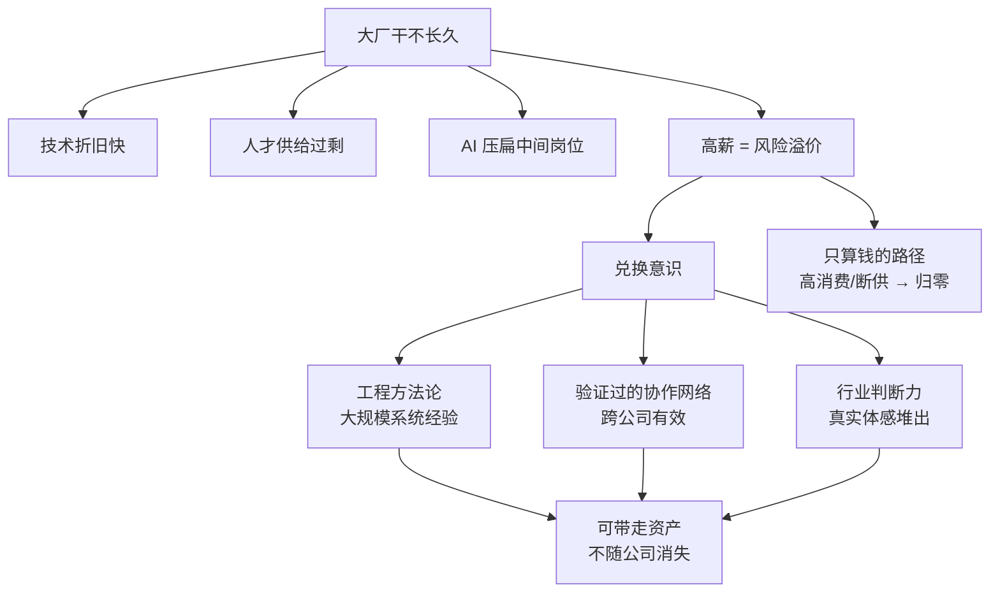

## 📋 文章信息

- **来源**: 知乎 - 问题「很多程序员都清楚，大厂干不长久为什么还要去呢？」下的回答
- **作者**: 阿菊
- **发布时间**: 2026年7月16日
- **阅读链接**: https://www.zhihu.com/question/827750075/answer/2072119408743522923

---

## 🎯 核心摘要

作者指出「大厂干不长久」不是个别公司的良心问题，而是技术高折旧、人才供给过剩、AI 压扁中间岗位这三大结构性因素决定的行业规律。正因为不长久、不确定性高，大厂薪资里才内置了一块「风险溢价」——拿高薪与抱怨不稳定不能同时成立。既然注定待不长，去大厂的账就不能只算钱（钱是最容易消散的资产），而应带着「兑换意识」，把平台机会主动兑换成三种耐用资产：工程方法论、验证过的协作网络、行业判断力。核心结论：你在一个地方待多久不由你决定，但你从那里带走什么由你决定。

## 📊 核心观点

### 1. 大厂不长久是结构性的，不是道德问题

**背景/现状**：
- 技术折旧极快：三年前稀缺的架构标准，培训视频一多就烂大街
- 人才供给源源不断：985 本硕博每年固定大量投放市场
- AI 浪潮把中间层岗位价值直接压扁

**核心论述**：
- 把大厂短命当成个别公司黑心，会在错误的层面纠结；当成行业规律，才能开始认真想对策
- 高薪里含着对不确定性的补偿，这是薪资结构的固有设计

### 2. AI 提效让问题从「能待多久」变成「攒够资本了没」

**背景/现状**：
- 各大厂财报电话会无一不提 AI 提效，提效 = 同样产出用更少的人
- 中低层级的活被自动化，中间层开发岗首当其冲

**核心论述**：
- 这不是哪家公司心狠，是行业整体成本结构在变
- 大厂的问题已经不是你能待多久，而是你待的期间能不能攒够出去的资本

### 3. 钱是最容易消散的资产，真正值得兑换的是三种耐用资产

**背景/现状**：
- 高消费、梭哈买房、被裁断供，任何一环没踩对，十年白干
- 能严格执行储蓄和投资计划的人凤毛麟角

**核心论述**：
- **工程方法论**：在大规模系统上摔过跤、扛过事故、做过迁移，方法论是经验压缩出来的，规模越大压缩率越高
- **验证过的协作网络**：清楚知道谁在哪个领域靠谱、谁干活利索，是干活干出来的、跨公司有效的资产
- **行业判断力**：看过真实流量、事故、成本的人对能否落地有直觉，只能靠真实项目体感堆出来

### 4. 资产不会自己长出来，分野在「兑换意识」

**背景/现状**：
- 同样在大厂待五年，有人换回方法论加创业圈子，有人只换回职级和加班记录

**核心论述**：
- 平台只给展示机会，不替你完成转换
- 作者亲历的两个案例：一个只琢磨周报漂亮、评审少担责任，三年后优化名单第一个；一个主动啃硬骨头（迁移、复盘、带新人），出来直接做技术合伙人
- 分野从来不在工资高低，在有没有兑换意识

## 🧠 概念图谱

## 🔑 关键洞察

### 1. 高薪与稳定在定价上是互斥的

**分析**：
- 「如果一份工作能安稳干三十年，它一定不会付给你现在这个数」——大厂薪资里含有一块不确定性补偿
- 想通这层，心态就从「拿钱抱怨」转为「如何把溢价兑换成更耐用的东西」，这是对薪资结构的正确理解而非自我安慰

### 2. 能力是否「长在平台里」是隐性分水岭

**分析**：
- 只会调接口、只会写 PPT 的人，离开平台基本归零，因为能力长在平台给的流程里
- 在大厂做成事一多半是平台的功劳（基础设施、数据、流量都是平台给的），分不清平台能力与个人能力的人，离开后的第一课就是摔跤

### 3. 越资深越不看钱，是因为知道「钱会散，有些东西不会」

**分析**：
- 刚工作的人倾向于把去大厂等同于赚钱，干了十几年的人更看重可积累资产
- 这个现象本身佐证了资产观：随着职业年限增长，估值体系从现金流转向资产负债表

## 🚧 不足与局限

### 1. 「三种资产」的兑换路径偏理想化
- 工程方法论、协作网络、判断力都高度依赖岗位机会（是否在核心系统、是否有硬仗可打），非核心业务线的员工可能根本没有接触大规模系统的机会，文中未讨论「没机会兑换怎么办」

### 2. 案例存在幸存者偏差
- 「主动啃硬骨头的人成了技术合伙人」是成功样本；同样主动啃硬骨头但行业下行期被裁的人不在叙事里

### 3. 软广嫌疑
- 文末推荐「字节大模型算法岗面试手册」，带有引流性质，削弱结论的中立性

### 4. 对「不去大厂」的代价论证薄弱
- 作者说「不去的代价和大厂的问题要分开算」，但没有正面展开小公司/创业路径的资产积累可能性

## 🔮 延伸思考

### AI 时代「兑换窗口」可能比预想的更短
- 如果中间层岗位持续被压缩，能接触大规模系统、真实事故的岗位会越来越少——这意味着「用平台换方法论」的机会本身在缩水，兑换窗口或许只有行业重构完成前的这几年

### 资产观可迁移到其他高折旧行业
- 金融、游戏、内容行业同样存在「高薪含风险溢价 + 技术折旧快」的结构，「兑换意识」框架对这些行业的从业者同样适用

### 兑换意识对个体创业者的反向应用
- 文中「每两三年盘点一次资产」的做法，本质是个人的 OKR/资产负债表管理，可推广为职业生涯的常态化审计机制

## 💡 实践启示

### 1. 每年做一次个人资产盘点

**要点**：
- 检查三问：方法论长了什么？网络扩了谁？判断力有没有变强？
- 哪块弱就主动补哪块，把盘点固化为年度仪式

### 2. 主动接硬仗

**要点**：
- 越难的活越要上，难活才长方法论，顺风顺水的活只长工龄
- 系统迁移、事故复盘、新人培养这类「没人抢」的事恰恰是资产积累入口

### 3. 把每件事沉淀为可复用资产

**要点**：
- 文档、模板、复盘——这些是离职时真正能带走的东西
- 简历上的一行 + 与面试官十分钟的对话，就能证明你「见过什么」

### 4. 区分平台能力与个人能力

**要点**:
- 定期自问：这件事离开平台的基础设施、数据、流量还能做成吗？
- 只把「离开平台还能带走的」计入个人资产清单

## 📝 关键金句

> "你在一个地方待多久，不由你决定，你从那里带走什么，由你决定。"

> "大厂的薪资结构里，本来就有一块是给不确定性的补偿，你拿的每一分高薪里都含着一部分风险溢价。"

> "它只会筛掉那些把十年当成无限期的人，留下那些把十年当成本钱、精打细算兑换资产的人。"

## 🏷️ 标签

职业发展、大厂、程序员、职业资产、AI 提效

---

## 🔗 相关资源

- **拓展阅读**：职业风险管理、技能折旧（skill decay）、平台经济下的个体职业策略、AI 对软件工程岗位结构的影响
