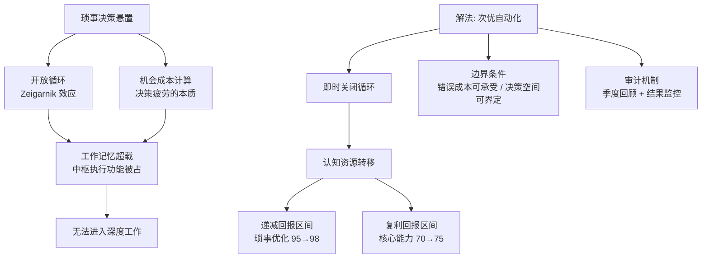

## 📋 文章信息

- **来源**: 知乎 - 问题「建议减少对日常琐事的决策时间，这一做法能带来哪些改变？」下的回答
- **作者**: 墨苍离
- **发布时间**: 2026年8月17日
- **阅读链接**: https://www.zhihu.com/question/2072424069971161682/answer/2072733652736274744

---

## 🎯 核心摘要

文章从认知科学角度解释了「为什么有时间却进不了深度工作状态」：根据 Zeigarnik 效应，每个悬而未决的琐事决策都会在工作记忆中开启一个「开放循环」，持续占用中枢执行功能，十几个循环就让认知系统超载。决策疲劳的本质不是能量耗尽，而是大脑在持续做机会成本计算。作者由此推出反直觉结论：对价值随时间快速衰减的琐事，次优但立即执行的决策比拖延中的最优决策更有价值——它即时关闭循环，把认知资源从递减回报区间转移到复利回报区间。最后给出自动化决策的两个边界条件（错误成本可承受、决策空间可界定）和季度审计机制。

## 📊 核心观点

### 1. 琐事的成本不在决策本身，而在悬置状态

**背景/现状**：
- Zeigarnik 效应（1927）：未完成的任务会在工作记忆中持续占据执行功能
- 现代人面对的琐事数量远超祖先环境，每个悬置决策都是一个后台运行的开放循环

**核心论述**：
- 问题不在于你需要做出多少决策，而在于你有多少个开放的循环
- 「有时间却无法专注」的真相：不是意志力问题，是工作记忆已被二十个琐事循环占满
- 深度工作需要完整的中枢执行功能（注意力投入、干扰抑制、任务切换），与开放循环直接竞争同一资源

### 2. 决策疲劳的本质是持续的机会成本计算

**背景/现状**：
- 纠结「中午吃什么」时，大脑实际在评估：继续思考的收益是否值得放弃当下可做的其他事

**核心论述**：
- 这个计算本身就是认知负荷
- 琐事类决策中，继续思考的边际收益极低——选 A 餐厅还是 B 餐厅的长期差异微不足道
- 两分钟做出的次优决策，认知成本远低于思考两小时才做出的最优决策

### 3. 次优解的系统性价值：复利原则优于完美主义原则

**背景/现状**：
- 琐事决策的价值随时间衰减极快：三天后不记得吃了什么，三个月后累积效应接近零

**核心论述**：
- 悬置成本是持续性的，而选择质量的边际收益差异是一次性的
- 认知预算模型：花 30 单位把琐事从 95 分提到 98 分（三天后归零），不如花 30 单位把核心能力从 70 分提到 75 分（复利放大）
- 把预算给前者，等于用未来的 20 分换当下的 3 分，数学上就是亏损

### 4. 自动化不等于放弃质量控制：边界条件 + 审计机制

**背景/现状**：
- 承认次优解的价值，不等于对所有决策一刀切

**核心论述**：
- 边界条件一：错误成本可承受——涉及健康、财务安全、重要人际关系的决策不自动化
- 边界条件二：决策空间可界定——工作日午餐可三方案轮换，商务宴请不在此范围
- 审计机制：每季度回顾自动化清单；某规则连续三次引发不适或手动干预，就重新审视其前提

## 🧠 概念图谱

## 🔑 关键洞察

### 1. 「循环数量」比「决策数量」是更好的诊断指标

**分析**：
- 通常我们统计「今天做了多少决定」来衡量决策疲劳，但真正决定认知负荷的是未关闭的循环数
- 一个已经做完的决策（哪怕是错的）不再消耗资源；一个拖着没做的决策（哪怕再小）持续计费——这解释了为何「清空待办 inbox」本身就有即时的轻松感

### 2. 时间折现偏差在琐事场景中被「反直觉地翻转」

**分析**：
- 行为经济学认为人普遍高估即时回报、低估延迟回报（非理性），但作者指出在琐事决策里「快速了结」恰恰是理性的
- 因为琐事的回报结构特殊：质量增量迅速归零，而悬置成本持续累积——通用的「别冲动、想清楚」建议在此场景失效

### 3. 文章实质是把「心理熵」问题转化为预算分配问题

**分析**：
- 把「心累、专注不了」这类模糊感受，重构成可操作的会计问题：认知预算 100 单位，每个开放循环是固定开销，决策是投资选择
- 一旦问题被量化，解法（关闭低价值循环、投资复利资产）就变成显而易见的算术题，不再依赖意志力

## 🚧 不足与局限

### 1. 关键论据的文献基础表述过强
- Zeigarnik 效应的复制研究历史上争议不小，效应强度和边界条件在学界并无定论；文中将其作为坚硬基石使用，未提及任何不确定性

### 2. 认知预算模型是比喻而非实证
- 「100 单位预算」「30 单位投入」是修辞装置，不存在这样的可测量单位；复利倍数（5 分变 20 分）是假设而非数据，结论方向可能对，但数字无支撑

### 3. 缺少「怎么落地」的具体方案
- 开头承诺「一套可操作的决策架构设计方法」，但正文实际只给出原则（次优解、边界条件、审计），没有给决策清单模板、预设规则示例等具体工具，虎头蛇尾

### 4. 未区分琐事焦虑与真实情绪信号
- 有些「悬置小事」背后是回避情绪（拖着不回的消息可能承载人际焦虑），机械地「快速关闭」可能压制了重要信号

## 🔮 延伸思考

### 与 GTD「清空大脑」的殊途同归
- David Allen 的 GTD 第一原则「大脑用来思考，不是用来存储」与本文的开放循环理论互为印证：GTD 靠外部系统承接循环，本文靠快速次优决策关闭循环——前者是转移，后者是消灭，可组合使用

### AI 时代琐事自动化的新解
- 「预设三个午餐方案轮换」是工业时代的自动化；如今可以让 Agent 代为执行比价、预约、回复确认类琐事——循环由外部系统真正承接，认知资源的释放幅度可能更大

### 复利原则的适用边界
- 文章把认知资源全部分配给「核心能力复利」，但生活满意度研究中「微小愉悦的当下体验」贡献不小——把所有琐事压缩到次优，可能牺牲了过程质量本身的价值

## 💡 实践启示

### 1. 盘点你的开放循环数量，而非待办数量

**要点**：
- 自问：此刻后台挂着多少件「还没定」的小事（没回的消息、没约的时间、没选的方案）
- 以「循环数」为指标做认知体检，超载时优先批量关闭最轻量的几个

### 2. 给高频琐事预设次优自动化规则

**要点**：
- 工作日午餐、日常通勤、快递处理、固定性回复，预设 2-3 个轮换方案，触发即执行、不再比较
- 记住判断式：质量差异三天后归零的决策，都不值得二次思考

### 3. 用两个边界条件筛选不可自动化项

**要点**：
- 错误成本高（健康、财务、重要关系）→ 保留完整认知投入
- 场景不可界定（如商务宴请）→ 移出自动化范围

### 4. 建立季度审计 + 三次干预熔断

**要点**：
- 每季度回顾一次自动化清单，淘汰失效规则、补充新高频琐事
- 某规则连续三次引发不适或手动干预，立即触发重新审视

### 5. 「进不了状态」时先查后台，再怪意志力

**要点**：
- 时间充裕、环境安静却无法专注时，先花 5 分钟集中关闭 2-3 个悬置循环，再回到深度任务

## 📝 关键金句

> "问题不在于你需要做出多少决策，而在于你有多少个开放的循环。"

> "一个在两分钟内做出的次优决策，比一个思考了两小时才做出的最优决策，认知成本要低得多。"

> "认知资源的分配应该遵循复利原则，摒弃完美主义原则。"

## 🏷️ 标签

认知迭代、决策疲劳、Zeigarnik 效应、深度工作、认知资源

---

## 🔗 相关资源

- **拓展阅读**：GTD（Getting Things Done）、《深度工作》（Cal Newport）、决策疲劳（decision fatigue）、Ego Depletion 争论、Baddeley 工作记忆模型
