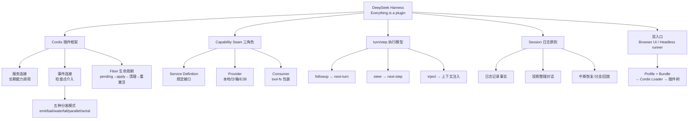

## 📋 文章信息

- **来源**: 微信公众号 - 叶小钗
- **作者**: 叶小钗
- **发布时间**: 2026年8月18日 09:00
- **阅读链接**: https://mp.weixin.qq.com/s/gB9FgNZTvNpPG6PtiEDudw
- **开源项目**: https://github.com/deepseek-ai/deepseek-harness

---

## 🎯 核心摘要

8月13日 DeepSeek 开源了 DeepSeek Harness（dsh），其最鲜明的设计哲学是「Everything is a plugin（万物皆插件）」——模型接入、文件系统、沙箱、会话日志，甚至驱动 Agent 运转的主循环本身都是插件。文章系统拆解了这套架构：基于 Cordis 插件框架管理依赖与生命周期（每个插件一个 Fiber，服务/事件两种连接方式，五种事件分发模式），用 Capability Seam 三角色（Service Definition / Provider / Consumer）实现能力可替换，用 turn/step 模型驱动执行，并以「进入模型请求的内容必须能从 Session 日志重建」作为核心原则。作者用一个真实接口性能 bug 做实测：Codex 9 分钟给出最符合预期的合并接口方案，DeepSeek V4 Flash 20 分钟把接口普遍优化到 800ms 以下，而 V4 Pro 两轮约 20 分钟无有效产出。结论：dsh 是一份正在演进的优秀工程样本，但 developer preview 阶段不宜直接引入生产。

## 📊 核心观点

### 1. Agent = Model + Harness，dsh 把 Harness 的每个角落都插件化了

**背景/现状**：
- 业内早有「Agent = Model + Harness」的说法，harness 核心是上下文管理、工具治理、Agent Loop
- DeepSeek 此前公开招聘 Agent 团队，业界预期其推出对标 Claude Code / Codex 的产品

**核心论述**：
- dsh 不是在任务处理范式上创新，而是给出一种新的**工程范式**：harness 涉及的所有模块皆可设计为插件
- 模型接入是插件、文件系统是插件、沙箱和会话日志是插件，连主循环也由插件提供——系统没有一块永远不能替换的巨大核心
- 「连主循环都是插件」的实际含义：主循环在 Cordis 看来仍是普通插件，会等待服务、可被卸载清理

### 2. Cordis 框架：用依赖声明 + Fiber 生命周期托住插件体系

**背景/现状**：
- dsh 建在 Cordis 插件框架上，几十个插件按服务依赖连接启动，而非按配置顺序

**核心论述**：
- 每个插件声明「需要什么服务、提供什么服务」；依赖未满足时 Fiber 保持 pending，不调用 apply
- 服务被替换/卸载时，Cordis 先清理依赖它的插件，新实现就绪后再重新激活
- 插件间两种连接方式：**服务**回答「我现在依赖哪项能力」（如 tool-fs 调 ctx.fs，不关心 Provider 是本地磁盘还是 E2B）；**事件**处理「当这件事发生时谁想参与」（如模型请求前压缩插件检查上下文长度、工具执行前策略插件返回 allow/ask/deny）
- 五种事件分发模式：emit（通知）、bail（同步逐个）、waterfall（顺序传递可截住）、parallel（并发全等）、serial（异步逐个）

### 3. Capability Seam：可替换能力的三角色分离

**背景/现状**：
- 一项能力要可替换，需要把「规定」「实现」「使用」三层解耦

**核心论述**：
- **Service Definition** 规定可调用什么（如 FileSystem 接口）；**Provider** 完成实际工作（本地/沙箱/E2B 各有实现）；**Consumer** 把能力交给上层（tool-fs 包装成模型可用的 read/edit/write 工具）
- FsTarget 这类 Provider 交出的引用让环境差异（realpath vs 远程路径）始终留在 Provider 内部
- 更换文件系统只改变 ctx.fs 背后的实现，Consumer 与主循环零修改——模型接入同理，不同厂商是不同 Provider

### 4. 执行模型：turn/step 结构 + 消息三通道 + 日志重建原则

**背景/现状**：
- 用户消息如何驱动插件体系协同运转，是架构落地的关键

**核心论述**：
- **step** = 一次模型请求 + 其调用的工具；**turn** = 从接下任务到确认无需继续的零个或多个 step
- 执行中收到新消息不用语义判断分流，而由发送方指定时机：`followup()` 进 next-turn（排队开新回合）、`steer()` 进 next-step（当前回合下一拍插入）、`inject()` 补充上下文（空闲时留存 Inbox 等后续消息）
- 核心原则：**凡是进入模型请求的内容，都必须能从 Session 日志重建**——日志记录事实，投影整理出当前对话，缓存避免重复计算，请求前校验一致性；日志支持中断恢复、分支复制与界面回放
- 空 assistant 消息（达到输出上限）写入日志但不进入后续模型历史
- 工具执行链：tools/pre-execute 可放行/询问/拒绝，单调守卫只拒不放（守卫拒绝不可被宽松策略翻案），tools/execute 统一挂超时重试指标，结果经 tools/result 通知 + tool/result 日志再交模型

### 5. 实测：Harness 好不等于模型行

**背景/现状**：
- 用同一提示词（创作台卡片进入慢、约 10 个接口各耗时 3 秒左右，排查并修复）测试三个组合

**核心论述**：

| 组合 | 耗时 | 方案 | 效果 | 消耗 |
|------|------|------|------|------|
| Codex | ~9 分钟 | 合并多接口为新增详情接口 | 接口数明显减少，新接口仍 ~1.3s | 周额度 ~2% |
| V4 Flash + dsh | ~20 分钟 | 不合并，逐个优化现有接口 | 普遍降到 800ms 以下 | 0.82 元 |
| V4 Pro + dsh | 两轮 ~20 分钟 | 提出合并方案后执行 | 无有效产出 | 1.33 元 |

- Pro 表现反而不如 Flash，作者提及传闻「8月13日发布的 pro 版本发错了」，真伪未知

## 🧠 概念图谱

## 🏗️ 技术架构

### 架构概述

dsh 分为 Node Host 与 Browser 两个运行区域加一个命令行入口：Browser UI 经 HTTP/API/转发事件连到 Web Host 送入 Node Host；命令行模式不启动 Browser，由 Headless runner 直接送入同一套 agent 核心。两种入口共享模型、工具、会话与主循环。组合管理用 Profile（选用哪几组）+ Bundle（搭配好的插件组），最终由 Cordis Loader 把配置变成运行中的插件树。

### 核心组件（dsh-base 基础组合）

| 组件类别 | 职责 | 关键机制 |
|------|------|----------|
| 模型接入 | 连接不同模型、默认模型选择、重试与 token 统计 | Provider 插件适配各家请求格式 |
| 本地工具 | 文件、Shell、搜索、后台任务 | tool-fs 等经 ctx.fs 调用能力 |
| agent 编排 | 主循环、子 agent、工作流、计划模式 | 主循环本身是普通插件 |
| 上下文管理 | 项目指令组装、技能加载、超长压缩 | agent/pre-step 检查点介入 |
| 权限与策略 | 审批、沙箱、执行超时 | 单调守卫（只拒不放） |
| 会话与配置 | 会话、附件、设置、凭据、观测 | 追加式日志 + 投影 + 缓存 |

### 工具执行链

## 🔑 关键洞察

### 1. 「万物皆插件」的真正价值是把 Agent 运行时变成可组合系统

**分析**：
- 传统 harness（含 Claude Code、Codex）的上下文管理、工具治理、主循环是硬编码的骨架，扩展点是预留的钩子；dsh 把骨架本身也降级为插件，理论上任何层都能被替换或重组
- 这为「Agent 根据任务类型自主选择插件组合」打开了想象空间——运行时可组合性是前提条件
- 代价同样明确：选对插件与配置、处理依赖关系、排查日志的复杂度都上升了——组合自由度与系统可运维性存在结构性张力

### 2. 消息分流靠发送方声明而非语义判断，是被低估的设计决策

**分析**：
- 「执行中新消息是插队还是排队」若靠模型/规则做语义判断，既消耗 token 又不可靠；dsh 让 `followup()/steer()/inject()` 三个 API 由调用方显式指定时机，把模糊问题变成确定性问题
- 这与 Unix 哲学同构：机制与策略分离——harness 提供机制（next-step/next-turn 两个队列），策略（何时用哪个）交给调用方

### 3. 「Session 日志可重建一切」是 Agent 可观测性与可恢复性的根

**分析**：
- 日志（事实）、投影（当前对话）、缓存（避免重算）、一致性校验（请求前比对）四层结构，让中断恢复、分支、回放全部成为日志的衍生功能而非独立子系统
- 「空 assistant 不入历史」的细节体现了关键区分：日志保存事实，模型历史只选后续请求需要看到的部分——这为上下文压缩、历史重写留出了空间而不破坏事实层

### 4. 实测揭示了「模型能力 × Harness 质量」的乘法关系

**分析**：
- 同一 harness、同一提示词，Flash 有效而 Pro 无产出，说明瓶颈在模型侧的规划/执行一致性，而非工具链
- 评测 Agent 产品时必须拆开两个变量：Harness 决定能力上限（工具好不好用、流程稳不稳），模型决定兑现率；单次实测（尤其 n=1）对模型版本的结论要极度谨慎，作者自己也标注了「版本发错」传闻的不确定性

## 🚧 不足与局限

### 1. 实测样本量过小，结论不稳
- 每个组合只测一次，Agent 任务随机性大；Pro 的失败可能是个案，也可能是模型/版本问题，无法区分

### 2. 测试基准不对等
- Codex（闭源商业产品+自家模型）与 dsh（developer preview + DeepSeek 模型）在成熟度、模型适配深度上都不同，9 分钟 vs 20 分钟的对比更多是产品成熟度差异而非架构差异

### 3. 文章对架构的代价面着墨少
- 插件化带来的启动依赖图复杂、调试链路变长、性能开销等只以一句「排查日志比较烦杂」带过

### 4. dsh 本身处于 developer preview
- 官方明确提醒可能出现不兼容变化，文中结论基于 8月13日 版本，时效性风险高

## 🔮 延伸思考

### 插件化 Harness 与 MCP 的关系值得追踪
- MCP 标准化了「工具接入」这一层，而 dsh 把插件化推到了主循环与会话日志层；若「Agent 运行时可组合」成为行业共识，MCP 之上是否会出现「harness 组件交换协议」？

### 国产开源生态的卡位策略
- DeepSeek 没有直接发「DeepCode」付费产品，而是先开源 harness——用架构样本换生态位，让社区在自己模型上组装 Agent，这是模型厂商做平台的标准打法

### 对个人 Agent 使用者的启示
- 作者吐槽「每个 harness 出来都折腾一番，没啥鲜明区别」——对非内核开发者，harness 差异感知确实有限；真正影响体验的是模型质量与默认工具链打磨，选型时不必为架构美学付费

## 💡 实践启示

### 1. 设计 Agent 系统时借鉴 Capability Seam 三角色

**要点**：
- 把能力的「接口定义 / 实现方 / 消费方」显式分离，环境差异（本地/沙箱/远程）封在 Provider 内
- 更换实现时 Consumer 与主循环零修改，这是可测试性与可移植性的基础

### 2. 用事件检查点而非硬编码实现横切关注点

**要点**：
- 上下文压缩挂在模型请求前、策略审批挂在工具执行前，通过 waterfall/serial 等分发模式组合多个监听器
- 安全守卫设计成单调的（只能拒绝不能翻案放行），避免宽松策略覆盖严格策略

### 3. 日志优先：先记录事实，再派生视图

**要点**：
- 会话数据建模采用追加式事件日志 + 投影，而非直接存「当前对话」
- 回放、分支、恢复、压缩全部构建在日志之上，避免多份真相

### 4. 引入 dsh 需谨慎，学习它正当时

**要点**：
- developer preview 阶段不急于上生产；作为 Agent 架构设计的学习样本，重点读 Cordis 的依赖管理与事件分发、Session 日志的分层

## 📝 关键金句

> "Agent = Model + Harness。如今 DeepSeek 把 Harness 开源，再配上自家的模型，本质上已经构成了一个完整的 Agent 体系。"

> "这就是连主循环都是插件的实际含义，系统没有一块永远不能替换的巨大核心，核心能力由一组有明确关系的插件共同组成。"

> "凡是进入模型请求的内容，都必须能从 Session 日志重建。"

> "它更适合作为一份正在演进的工程样本……不要急于把它这个基础架构引入项目中。"

## 🏷️ 标签

AI与Agent、DeepSeek、Agent Harness、插件化架构、Cordis、Agent 工程

---

## 🔗 相关资源

- **开源项目**: [deepseek-ai/deepseek-harness](https://github.com/deepseek-ai/deepseek-harness)
- **拓展阅读**: Claude Code / OpenAI Codex 架构分析、MCP 协议、Cordis 插件框架、事件溯源（Event Sourcing）与 Agent 会话设计
