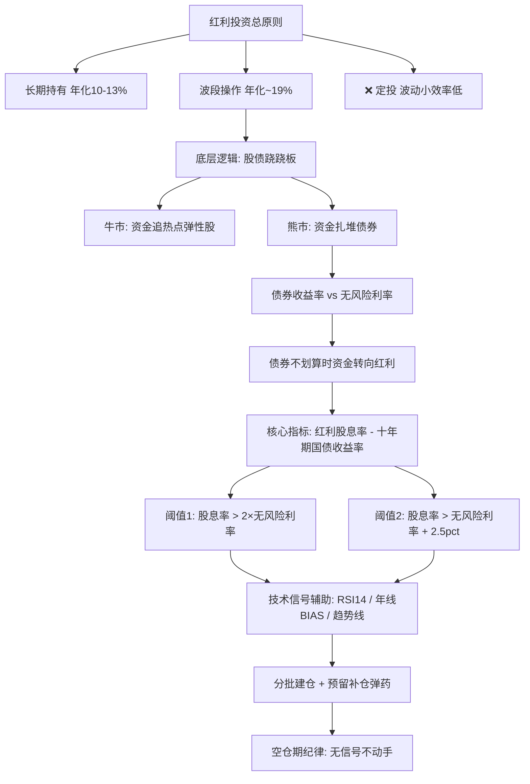

## 📋 文章信息

- **来源**: 知乎 - 问题「红利低波基金是陷阱么?」下的回答
- **作者**: 1524603（自称 2002 年入市，2019 年起专做红利）
- **发布时间**: 2026年2月首发，持续更新至 2026年7月7日
- **阅读链接**: [原文](https://www.zhihu.com/question/1922064284617269314/answer/1995574714383475871)

---

## 🎯 核心摘要

一位 24 年股龄、2019 年起专注红利资产的投资者，系统阐述了他的红利波段方法论。核心是**资金在股债之间的跷跷板轮动**：熊市资金扎堆债券，当债券收益率相对无风险利率失去吸引力时，"聪明资金"会转向高股息资产。因此**红利股息率与十年期国债收益率（无风险利率）的利差**是判断红利买点的第一指标——利差足够大时才是"狙击位置"。作者主张红利要么长期持有（年化约 10-13%）、要么做波段（自称六年年化 18%+），但**千万不要定投**，因为红利波动小、定投效率低。文章还给出了两类 ETF 的差异化打法（国企红利做网格、红利低波做波段）以及空仓期纪律这一"最难的一课"。

## 📊 核心观点

### 1. 总原则：长期持有或做波段，不要定投

**背景/现状**：
- 红利类资产波动小，与成长股相比弹性不足

**核心论述**：
- 长期持有：像银行定期存款一样放着不动，年化约 10-13%，考验的是耐心而非技术
- 做波段：年化约 19%（作者六年实测 18%+），但需要底层逻辑支撑，不能只看技术指标低位就杀进去
- 定投不可取：波动小导致定投摊薄成本的效果差、"太耽误事"；每月只有工资结余的小资金，作者建议改定投沪深300

### 2. 底层逻辑：股债跷跷板与无风险利率锚

**背景/现状**：
- 市场资金总量相对固定，牛市涌入高弹性热点，红利涨幅有限

**核心论述**：
- 股票熊市时资金扎堆债券（股债跷跷板效应），但大资金买债前会做性价比评估
- 评估基准是**无风险利率**（十年期国债收益率）：债券价格太高、收益率太低时，风险收益比不划算
- 此时资金转而比较**红利股息率 vs 无风险利率**：
  - 股息率低于/持平/略高于无风险利率 → 风险大于收益，无人问津
  - 股息率远大于无风险利率 → 热钱涌入，红利上涨

### 3. 量化买点：利差阈值进入"狙击区间"

**背景/现状**：
- 光有方向判断不够，需要可操作的数值标准

**核心论述**：
- 两个经验阈值（满足其一即进入投资区间）：
  1. **红利股息率 > 2 × 无风险利率**
  2. **红利股息率 > 无风险利率 + 2.5 个百分点**
- 前提条件：股市整体不向好（股市向好时资金不会光顾红利）
- 反例验证：2015 年红利股息率仅 2.17%、无风险利率 3.61%，完全不满足条件，此时买入后红利下跌 42%、历时 9 年才回本——"拿射程1200米的枪去狙杀2000米外的目标，再优秀的狙击手也得失败"

### 4. 实盘案例：2026年中的建仓过程

**背景/现状**：
- 作者以 515100（红利低波 ETF）为例完整展示了建仓节奏

**核心论述**：
- 6月11日以 1.401 元买入 6 成仓，留 4 成待跌补仓
- 6月30日再补 1.5 层至 7.5 成仓，收盘浮亏 -4.46%；计划再跌 3-4 个点买入剩余仓位
- 买入依据三信号叠加：**股债利差（剪刀差）≈ 3.5**、**RSI14 ≈ 15**、**年线 BIAS 超过 10%**（跌幅超过 2024年"924行情"前）
- 仓位管理哲学：做红利最大回撤 7.6%，当前 4 个多点回撤在计划内；"你知道未来一年一定有一场大雨"，追求大概率的确定性

### 5. 不同红利 ETF 用不同打法

**背景/现状**：
- 编制规则和选股逻辑不同，红利 ETF 走势千差万别

**核心论述**：
- **国企红利 510720**：价格长期在 0.9-1.05 元箱体震荡 → 做小网格，跌破年线分批买入、超过 1 元分批卖出，"利不在多，胜在安全"
- **红利低波 515100**：沿趋势线一路上行、跌破也能快速收回 → 做波段，在利差和技术指标到位时重仓
- **空仓期是最难的一课**：获利卖出后持币等待"比被套还难受"，忍不住追热点可能一天亏掉红利几个月的收益——没有信号之前必须耐住寂寞

## 🧠 概念图谱

## 🔑 关键洞察

### 1. 红利买点的本质是"类债券比价"

**分析**：
- 作者把红利资产放在大类资产轮动框架里理解：它不是与成长股竞争，而是与债券竞争"避险资金"的青睐。当十年期国债收益率被打到低位，红利股息率的相对吸引力凸显，配置盘（保险、固收+等）会被动增持高股息资产。这与机构"资产荒"逻辑一致，是文中散落表述背后真正的定价机制。

### 2. 利差阈值是经验参数而非定律

**分析**：
- "2 倍"和"+2.5pct"两个阈值来自作者六年盘感，本质是对历史上几轮红利行情起点（如 2024 年初利差走阔）的事后归纳。利差中枢会随无风险利率长期下行而系统性抬升——在 2% 无风险利率时代，"+2.5pct"意味着股息率需达 4.5%，而"2 倍"只需 4%，两个阈值会给出矛盾信号，说明参数需要随利率环境动态校准。

### 3. "只输时间不输钱"的前提是标的永续向上

**分析**：
- 红利指数长期向上依赖成分股盈利与分红持续，这是作者口中的"道"（企业盈利能力），技术指标只是"术"。这一区分是全文最有价值的部分：任何择时系统的置信度都建立在标的底层现金流之上，换成高波动成长股，同样的 RSI/BIAS 信号随时失效。

### 4. 空仓期纪律是被普遍低估的难点

**分析**：
- 多数教程讲"何时买"，很少讲"卖出后怎么办"。手持现金面对其他板块暴涨的焦躁，是波段策略收益回吐的主要泄漏点。作者把它提到"决定资金能否稳健增长"的高度，属于真实的实战经验而非纸上谈兵。

## 🚧 不足与局限

### 1. 无法验证的业绩宣称
- 六年年化 18%+ 仅为自述，无交割单或第三方验证；作者也承认小红书上"红利年化 25%"的回测是理论统计，实际不可能——同样的怀疑也应适用于他自己的数字。

### 2. 样本内叙事与事后归因
- 对 2015 年反例的解释（股息率 2.17 vs 无风险 3.61）是用当前框架回望历史；对 6 月建仓节奏的辩护（"谁知道 1.282 是不是最低点"）本身也承认了操作中的运气成分。单一投资者的个案不构成统计证据。

### 3. 未讨论策略拥挤与风格风险
- 红利低波近年大幅跑赢后，策略拥挤度、估值抬升（股息率被动下降）、以及若进入成长牛市红利可能长期跑输的风险，文中均未涉及。"红利长期向上"被当作不证自明的前提。

### 4. 口径不严谨处
- "资金总量固定"是不准确的说法（信用扩张下资金并非零和）；"巴菲特早年年化五六十"等论证与主论关联弱，属于情绪性辩护。

## 🔮 延伸思考

### 利差模型可用数据验证
- 文章的核心主张——股息率与国债收益率的利差领先于红利资产的表现——完全可以用中证红利（000922）股息率与 10 年期国债收益率的历史数据回测：检验"利差 > 2 倍无风险利率"或"利差 > 2.5pct"之后的 6-12 个月收益分布是否显著优于随机入场。个人已有的红利指数股息率-国债利差数据正好可以做这件事。

### 阈值的利率环境适应性
- 在无风险利率长期下行（如从 3.5% 降至 2%）的过程中，绝对利差阈值和倍数阈值会给出分化信号。可以尝试用**利差的历史分位数**（如滚动 5 年 z-score）替代绝对阈值，检验是否更稳健。

### 红利内部的策略分化
- 作者区分了箱体型（国企红利 510720 做网格）与趋势型（红利低波 515100 做波段），提示"红利"并非同质资产：不同编制规则（股息率加权 vs 股息率×低波加权）在牛熊中的表现差异显著，值得做横向对比回测。

## 💡 实践启示

### 1. 建立自己的"利差仪表盘"

**要点**：
- 定期跟踪红利股息率与十年期国债收益率的利差，标记历史极值区间，形成自己的"狙击位置"参照系
- 把利差信号与技术指标（RSI、年线 BIAS）做交叉验证，单一信号不作为买入依据

### 2. 仓位管理先于择时

**要点**：
- 分批建仓（如首批 6 成、预留补仓弹药），接受"买早被套 5 个点"是常态而非失误
- 为自己设定最大回撤容忍线（作者的参考值是 7.6%），超出计划才触发补仓或转换动作

### 3. 把空仓期当成策略的一部分

**要点**：
- 卖出后的持币等待是波段策略的必修课，"没有信号之前一定要耐住寂寞"
- 可用货币/短债 ETF 作为空仓资金泊位，降低现金闲置的心理压力

### 4. 补齐基础知识再重仓

**要点**：
- 清单化学习：红利分类、全市场基金/ETF 数量与规模、费率、成分股与行业占比、调仓周期、选股逻辑、股息率与分红机制、股债双杀、戴维斯双击
- "只有把基础的东西弄懂才有重仓的底气"——认知深度决定仓位上限

## 📝 关键金句

> "投资红利的总原则是要么长期持有，要么做波段，千万不要定投。"

> "如果红利股息率远大于无风险利率，热钱就会涌入红利，受到资金的追捧，红利就会涨起来。"

> "买之前的第一原则就是看看股息率和无风险利率比较，到没到狙击位置，然后再决定什么时候扣动扳机。"

> "最难的是在你获利卖出以后空仓时期的等待……资金能不能稳健增长，空仓期可以说起了决定性的因素。"

## 📎 原文配图

按原文出现顺序（已转存，点击可放大）：

## 🏷️ 标签

红利低波、股债利差、指数基金、波段操作、资产轮动

---

## 🔗 相关资源

- **拓展阅读**：中证红利指数估值与股息率历史数据；股债性价比（FED 模型 / ERP）相关研究；红利低波 vs 红利指数编制规则对比
