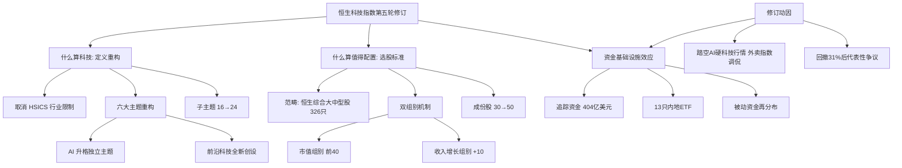

## 📋 文章信息

- **来源**: 微信公众号 - 21世纪经济报道（21财经客户端）
- **作者**: 石恩泽（记者）/ 张星（编辑）
- **发布时间**: 2026年8月（文内提及8月10日晚咨询启动、8月11日行情）
- **阅读链接**: https://mp.weixin.qq.com/s/7nq38VwewL__Z5clyiTePw

---

## 🎯 核心摘要

恒生指数公司于8月10日晚就恒生科技指数修订方案启动市场咨询，这是该指数2020年7月推出以来力度最大的一次修订。修订围绕一个核心命题展开：在科技与传统行业边界日益模糊的当下，什么才算"港股科技股"。具体举措包括取消行业分类限制、重构六大科技主题、成份股由30只扩至50只、引入"市值+收入增长"双组别选股机制。修订的深层推力在于：追踪资金已膨胀至404亿美元量级（增长近26倍），而指数权重集中于互联网平台、踏空本轮AI硬科技行情，被调侃为"外卖指数"——配置锚一旦失真，数百亿美元被动资金就会产生真实定价扭曲。按时间表，方案将于9月底公布、2026年12月生效。

## 📊 核心观点

### 1. 五维修订：重新定义"港股科技股"

**背景/现状**：
- 现行机制要求候选公司必须归类于恒生行业分类系统（HSICS）的指定行业，导致消费、金融、制造等领域"含科量"高的公司被排除在外
- 恒生指数公司在咨询文件中直言：科技创新已融入各行各业，不受传统行业分类所限

**核心论述**：
- **取消行业要求**：凭实质业务而非行业标签进入候选池
- **六大主题重构**：数码平台及解决方案、人工智能、先进硬件、机器人及自动化、云端、前沿科技——AI由子主题升格为独立主题（下设基础设施/平台/应用三个子主题），"前沿科技"全新创设（航天卫星、量子计算、脑机接口、新食品技术、先进材料）
- **子主题由16个扩至24个**：为特专科技公司预留指数入口
- **选股范畴收窄至恒生综合大中型股指数成份股**（326只、总市值64.84万亿港元）：放宽科技属性、收紧交易属性，守住可投资性底线
- **双组别选股机制**：市值组别选前40位，另设收入增长组别补入高增长标的，成份股由30只增至50只

### 2. 指数功能定位的跃迁：从行情表征工具到资金配置基础设施

**背景/现状**：
- 指数推出之初只是行情表征工具，如今追踪资金达404亿美元、通过13只内地ETF深入普通投资者配置组合
- 规则制定者容错空间随之收窄，指数与市场共识的每次偏离都被被动资金放大为定价扭曲

**核心论述**：
- 本轮修订是五轮修订中第一次同时触动"什么算科技"（主题与行业定义）和"什么算值得配置的科技"（选股标准）两个根本问题
- 此前四轮修订（2020.9快速纳入、2021主题5→6、2023.7外国公司+权重上限、2026.3子主题清单）均为技术性补丁，始终落后于市场结构变化

### 3. 修订矫正力度：模拟数据验证"硬科技转向"

**背景/现状**：
- 指数自2025年10月2日高点6715.46点深度回调，2026年3月30日最低4619.67点，最大回撤约31%
- 以互联网平台为权重主体的结构，难以反映硬科技产业的爆发

**核心论述**（以2026年6月30日数据测算）：
- 前十大权重股集中度由70.6%降至66.3%
- 先进硬件成份股由5只增至15只，人工智能由3只增至6只，两大硬科技主题合计占比由26.7%提升至42%
- 收入增长组别新增的10只成份股，收入增长中位数高达82%，远高于市值组别新增的23.4%和现有成份股的13.8%

### 4. 机构激辩：修订之后能否等来行情配合

**背景/现状**：
- 咨询启动后首个交易日（8月11日），恒生科技指数低开低走收跌1.93%，市场未给热烈回应

**核心论述**：
- **乐观派**：国泰海通资管认为悲观预期已充分定价，指数处于"中高赔率+高胜率"窗口；中信证券提出中国AI资产有望重估；摩根士丹利视7月底至8月为持续性修复关键窗口；花旗将中国股票调升至"超配"
- **审慎派**：中金认为大幅向上仍需新催化（类比一季度Anthropic在编程领域的突破）；国元香港提示中报业绩期管理层展望与资本开支是关键变量
- **结构共识**：AI应用层的商业化兑现是主线，华泰柏瑞认为恒生科技指数与AI中下游应用端高度关联，有望率先受益于定价逻辑重构
- **资金效应**：修订落地后被动资金沿新主题架构重新分布，"入指"预期将成为高增长中小市值科技公司新的交易变量

## 🧠 概念图谱

## 🔑 关键洞察

### 1. 指数编制是"共识的代码化"，滞后性是其固有属性

**分析**：
- 五轮修订的演进逻辑清晰呈现一条主线：规则迭代始终落后于市场结构变化，修订表现为一次又一次的追赶
- 这不是恒生指数公司独有的问题，而是所有市值加权赛道指数的通病——指数天然反映"已经发生的故事"，而资本市场定价"正在发生的故事"
- 对指数投资者的启示：不要把任何单一指数默认为行业全景，需主动审视其编制规则与产业趋势的偏离度

### 2. 被动资金的规模悖论：指数越成功，规则越难改

**分析**：
- 追踪资金增长26倍本是成功标志，但404亿美元的锚定效应使每次规则变动都牵动真金白银，规则制定者的容错空间被急剧压缩
- 修订方案公布（9月底）到生效（12月）之间留出缓冲期，本质是给被动资金调仓时间——"入指预期"本身成为可交易的变量
- 这解释了为何收入增长组别（中位数82%增速的10只新股）值得重点关注：确定性调仓买盘+高成长属性的双重催化

### 3. "放宽科技属性、收紧交易属性"的一体两面设计

**分析**：
- 表面矛盾（范畴收窄）与实质扩容（30→50只）并存，体现指数工程学中"代表性"与"可投资性"的平衡
- 限定大中型股成份股是为了避免指数纳入难以承载大资金进出的标的——数百亿美元被动资金对小市值股的冲击成本是真实的
- 前沿科技主题（航天、量子、脑机接口）目前"相关公司尚未大规模上市"，更多是为港交所18C特专科技上市潮预留的接口，属于前瞻性布局

## 🚧 不足与局限

### 1. 模拟数据的局限性
- 文中引用的矫正效果（硬科技占比26.7%→42%）基于2026年6月30日单日数据的静态模拟，实际生效时市值结构可能已变化
### 2. 咨询方案存在不确定性
- 文章默认咨询方案将按稿通过，未讨论市场反馈可能导致的方案修改（9月18日才截止征求意见）
### 3. 定量论证深度有限
- 未提供修订对指数估值（PE/PS）、股息率、换手率等关键投资属性影响的测算，"利好"更多停留在叙事层面

## 🔮 延伸思考

### 对港股通/ETF投资者的影响
- 恒生科技ETF（如513130等13只内地ETF）的持仓风格将在2026年12月被动切换，持有者需意识到自己买的"科技"定义即将改变
- 先进硬件（5→15只）与AI（3→6只）主题的新纳入名单，可能在方案公布（9月底）与生效（12月）之间产生套利窗口

### 指数革命的行业镜像
- 六大主题重构（网络/电子商贸 → AI与硬科技）本质是港股科技叙事五年迭代的官方确认
- 若"前沿科技"接口成功承接18C特专科技公司，恒生科技指数可能成为中国版"纳斯达克100"的真正起点

### 与A股科技指数的对照
- 科创50、创业板指同样面临"硬科技含量"的争议，恒生科技的双组别选股（市值+收入增长）机制若运行良好，可能成为境内指数改革的参照系

## 💡 实践启示

### 1. 关注三个时间节点

**要点**：
- 9月18日：咨询截止（观察市场反馈是否导致方案修改）
- 9月底：最终方案公布（新纳入名单首次明确，"入指预期"交易窗口开启）
- 2026年12月：调整生效（被动资金确定性调仓）

### 2. 深挖收入增长组别的候选池

**要点**：
- 新增设的收入增长组别将补入约10只高增长标的（收入增长中位数82%），可提前在恒生综合大中型股指数成份股中筛选"先进硬件+AI"主题、收入高增的中小市值公司

### 3. 用编制规则审视手中基金

**要点**：
- 检查自己持仓的恒生科技类ETF跟踪的具体指数及版本，12月规则切换后组合的行业暴露（互联网平台 → 硬科技42%）将发生实质变化，需重新评估与其投资目标的匹配度

## 📝 关键金句

> "当一个'赛道基准'成长为数百亿美元被动资金的配置锚，其成份股名单的每一次变动都直接牵动真金白银的流向——配置锚一旦'失真'，便构成了本轮'大修'最直接的推力。"

> "指数的规则迭代，始终落后于市场结构的实际变化，修订于是表现为一次又一次的追赶。"

> "放宽科技属性、收紧交易属性，构成此次修订的一体两面。"

## 🏷️ 标签

港股、恒生科技指数、指数编制、被动资金、AI硬科技

---

## 🔗 相关资源

- **拓展阅读**：恒生指数公司咨询文件原文（恒生官网）；港交所18C特专科技公司上市制度；恒生综合大中型股指数成份股名单；中金/中信证券关于中国AI资产重估的系列研报
