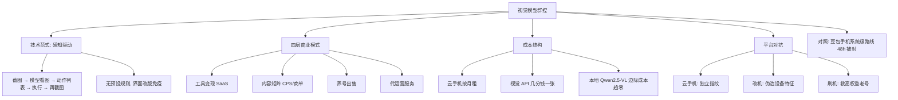

## 📋 文章信息

- **来源**: 知乎 - 问题「有哪些业余赚钱的途径？」下的回答
- **作者**: 乙醇的冰
- **发布时间**: 2026年8月21日
- **阅读链接**: https://www.zhihu.com/question/27182640/answer/2074149396657215199

---

## 🎯 核心摘要

这篇回答把一个存在二十年的灰产——手机群控——放在大模型视角下重新拆解。核心论点是：视觉大模型把群控生意里最贵的成本「能写脚本的操作员」直接消除了，新的范式是「截图 → 模型看图 → 返回动作 → 执行 → 再截图」的闭环，不依赖预设规则，界面改版免疫。作者用豆包手机 48 小时被全平台封杀（系统级整合路线身份暴露）与视觉群控的「便衣路线」对比，说明隐蔽性才是这条路线的生存前提；再用智谱 AutoGLM 自主运营小红书账号 14 天涨 5000 粉、收到商单的案例证明商业价值真实存在。随后拆出工具变现、内容矩阵、养号出售、代运营四层商业模式，并给出成本结构（云手机 + 几分钱一张截图的 API，规模化后本地部署 Qwen2.5-VL 让边际成本趋零）。结论：技术门槛已经塌陷，年入百万是规模化运营问题，护城河是账号池、内容池、指纹池的运营体系，而不是那个会看屏幕的模型。

## 📊 核心观点

### 1. 视觉模型终结了「脚本维护」这一群控核心成本

**背景/现状**：
- 传统群控靠预设脚本驱动：打开 App → 点击 → 输入 → 提交，页面一改版脚本全部报废
- 隐性大头是维护成本，且必须养一个能写脚本的人，构成行业门槛

**核心论述**：
- 新范式是视觉 Agent 闭环：截图 → 发给模型 → 模型看图 → 返回动作列表（点哪里、输什么）→ 执行 → 再截图
- 模型自己看屏幕、自己决策，界面改版后继续看、继续判断，「像雇了一个真人远程操控手机，只是便宜很多」
- 本质是把「规则驱动」换成「感知驱动」，把对人形操作员的需求换成了对 API 的调用

### 2. 豆包手机的死亡反而验证了「便衣路线」的价值

**背景/现状**：
- 2025 年 12 月字节与中兴联合发布豆包工程机，3499 元、首批 3 万台 24 小时售罄，被媒体称为「第一部真正意义上的 AI 手机」
- 上线第二天被微信、淘宝、美团、银行 App 集体封禁，字节紧急下线微信操作能力，二手价当天闪崩

**核心论述**：
- 豆包走「系统级整合」路线（中兴开放 OS 底层 INJECT_EVENTS 权限），权限高、操作丝滑，代价是身份暴露——平台一眼认出、精准屏蔽
- 视觉群控不申请系统权限、不依赖厂商合作，平台风控看到的是「一个用手指点点点的人」
- 制服刺客 vs 便衣刺客的比喻：能力相同，可见性决定了生死

### 3. AutoGLM 实验证明「无人运营」已经跑通

**背景/现状**：
- 智谱 2026 年 3 月公开演示：AutoGLM 注册小红书账号，完全由 Agent 自主调研、生成、发布、互动

**核心论述**：
- 14 天 5000 粉，收到商单邀请，当天赚 500 元；全程无人参与、24 小时不间断，成本仅 API 调用费
- 意义不在 500 块，在于「跑起来了，而且没有人知道是机器在跑」——隐蔽性与商业变现同时得到验证

### 4. 四层商业模式，门槛与上限各不相同

**背景/现状**：
- 这套能力可以卖给商家，也可以自己跑，模式可叠加

**核心论述**：
- **工具变现**：做成 SaaS 按月收费，面向商家/MCN/代运营公司，卖的是「运营账号的基础设施」，定价参考 RPA 行业
- **内容矩阵**：自跑 10~100 个账号养权重，权重起来后接 CPS 或商单，靠账号数量堆出数量级
- **养号出售**：垂直标签的活跃账号本身是资产（小红书 5000 粉素人号几百到几千元），利润在工厂化运营的效率差
- **代运营服务**：帮甲方做签到、抢券、定时发布，按月收费，客户买确定性，是最稳、最容易续费的模式

### 5. 真正的护城河是运营体系，不是模型

**背景/现状**：
- 技术门槛过去一年大幅下降：视觉模型够用、开源方案成熟、本地部署不再是门槛（Qwen2.5-VL 7B 只要 6GB 显存，RTX 3090 本地跑 500 张图的成本远低于云端）

**核心论述**：
- 平台封的不只是账号，是设备指纹，成熟团队靠云手机、改机、刷机混用来维持账号池供给
- 「年入百万不是技术问题，是规模化运营问题」——账号池、内容池、设备指纹池、收益分配这套体系才是壁垒
- 豆包 48 小时被封杀，说明平台对 AI 自动化是认真的，也说明这件事真的动到了平台的利益

## 🧠 概念图谱

## 🏗️ 技术架构

### 架构概述

整条链路是一个以视觉模型为决策核心的自动化闭环：设备层提供屏幕，感知决策层看图产生动作，执行层把动作落回屏幕，循环往复。与传统群控最大的区别是决策逻辑从「预先写死的脚本」迁移到「运行时看图即时生成」，因此不维护任何页面规则。部署上采用两段式：小规模走云端 API（国内主流几分钱一张截图），规模化后切本地部署（Qwen2.5-VL 开源、7B 版本 6GB 显存可跑），框架上 Ollama 适合小规模入门、vLLM 适合高并发生产；本地部署还有个隐性好处——截图不出本地网络。

### 核心组件

| 组件 | 职责 | 关键技术 |
|------|------|----------|
| 设备层 | 提供可批量扩张的设备身份 | 二手安卓机 / 云手机（独立 IP 与设备指纹） |
| 感知决策层 | 看图决定下一步动作 | 视觉大模型（云端 API 或 Qwen2.5-VL 本地部署） |
| 执行层 | 把动作列表落回屏幕 | 截图-执行循环，模拟人类触控，无固定脚本 |
| 部署与调度 | 控制成本与并发 | Ollama（入门）/ vLLM（高并发），本地化避免流量外泄 |
| 运营层 | 规模化管理与供给 | 账号池、内容池、设备指纹池管理（作者认定的真护城河） |

## 🔑 关键洞察

### 1. 「身份可见性」正在成为 AI 自动化的第一变量

**分析**：
- 豆包与视觉群控能力相当，结局相反，唯一的分野是「平台能否识别你是机器」
- 这预示 Agent 产业会分化出两条路线：与平台签约合作的白名单自动化（身份公开、走官方协议），与模拟人类的灰/黑盒自动化（身份隐藏、走像素级操作）
- 未来平台竞争的关键设施可能不是内容审核，而是「人类行为证明」——区分指尖背后是人还是模型

### 2. 成本结构的两次坍缩改变了生意性质

**分析**：
- 第一次坍缩：操作员从人变成 API，把群控从「人力密集型」变成「调用密集型」
- 第二次坍缩：云端 API 换成本地开源模型（一次性硬件投入），边际成本趋近于零
- 当单账号运营成本趋零，竞争就完全转移到「账号供给」（指纹、注册、养号）和「运营管理」上——这正是作者说护城河不在模型的原因

### 3. 群控是 GUI Agent 技术的灰产镜像

**分析**：
- 「截图 → 看图 → 动作 → 执行」正是 2025 年以来 Anthropic Computer Use、各类 GUI Agent 的通用范式，技术栈完全同源
- 同一个范式，在白名单场景是无障碍助手、自动化测试，在对抗场景是群控灰产——技术中性，分野只在使用者的授权状态
- AutoGLM 案例说明头部模型厂商自己也在用同一能力做增长实验，「正规军」与「草台班子」用的其实是同一把枪

## 🚧 不足与局限

### 1. 系统性回避法律与合规风险

- 「懂的都懂」一段明示存在黑色地带用途却拒绝展开，全文把改机、伪造设备指纹、批量养号当作中性「运营手段」叙述
- 实际上伪造设备特征批量注册、买卖账号、模拟人类欺骗平台风控，在国内已涉及违反平台协议、《反不正当竞争法》，帮他人跑量还可能触及帮助信息网络犯罪活动罪的边缘；文章对「入局者的法律敞口」只字未提

### 2. 收入数字是单点样本，缺乏可持续性验证

- AutoGLM 的 500 元商单是官方演示的理想条件；小红书 5000 粉素人号「几百到几千」的出价是行情高点叙述，未计入平台对 AI 内容的持续清剿
- 豆包 48 小时被封杀恰恰证明平台风控在快速升级，而文中「封号了怎么办」的三板斧是静态方案，低估了对抗的动态成本

### 3. 规模化叙事低估运营复杂度

- 「100 个账号是另一个数量级」的收入线性外推忽略了内容池、指纹池、收益分配的管理成本随规模超线性增长
- 承认「管得住」是关键，却没给出任何规模化运营失败率、人力配置的现实数据，整体是幸存者视角的商业模式推演

## 🔮 延伸思考

### 平台风控的下一轮军备竞赛

- 视觉群控模拟的是「人类的手」，但模型产生的是「没有人类生物特征的手」：滑动加速度分布、打字节奏、注意力停留、错误模式都是可检测信号
- 可以预期平台会从「设备指纹检测」升级到「行为生物特征 + 内容生成指纹」检测，攻防焦点从「你是谁」转向「你是不是人」

### 对 AI Agent 行业的产品启示

- 豆包之死说明系统级 Agent 绕不开「身份协议」问题：要么拿到平台官方授权（Apple Intelligence 路线），要么继续被逐平台封杀
- 合规的 AutoGLM 们（官方合作的自运营账号、商家授权的代运营）是同一技术的白名单出口，商业上可能比灰产更持久

### 白帽场景的迁移价值

- 「截图-决策-执行」闭环在自动化测试（跨 App 回归测试）、无障碍辅助、个人设备助手（用户授权自己的设备）等场景完全合法且需求真实
- 文章描述的本地部署成本数据（RTX 3090 跑 500 张图的成本对比）对做端侧 Agent 的正规团队同样有价值

## 💡 实践启示

### 1. 把「视觉闭环」当作通用 Agent 工程范式来学

**要点**：
- 截图 → 视觉模型 → 结构化动作列表 → 执行 → 再截图的循环，可直接迁移到自动化测试、RPA、设备助手等合规场景
- 部署选型经验可复用：原型期 Ollama + 小模型，生产期 vLLM 高并发；对成本敏感的场景尽早测算「本地 vs 云端」的盈亏平衡点

### 2. 评估 Agent 产品时把「平台态度」当作一等变量

**要点**：
- 做跨 App 产品前先回答：目标平台是欢迎、默许还是封杀自动化？有没有官方 API 或合作通道？
- 豆包案例说明即使巨头也无法用市场地位强行打通平台身份，初创产品更应优先选择官方协议路线

### 3. 对灰产叙事保持「研究视角」而非「入局视角」

**要点**：
- 这篇文章的价值在于理解技术如何重塑一门生意的成本结构，以及平台对抗的博弈逻辑，而非行动指南
- 文中被轻描淡写的改机、指纹伪造、批量养号在国内均已触碰法律与平台协议红线，了解其机制用于防御（反爬、风控设计）远比参与其变现更安全

## 📝 关键金句

> "你是世界上最强的刺客，但你穿着印有自己名字的制服去刺杀。"

> "年入百万不是技术问题，是规模化运营问题。机器跑得动，但你要管得住。"

> "真正值钱的东西，从来不是被无视的。"

## 🏷️ 标签

视觉模型、手机群控、GUI Agent、灰产、商业变现、平台对抗

---

## 🔗 相关资源

- **拓展阅读**：GUI Agent 与 Computer Use 范式（Anthropic Computer Use、智谱 AutoGLM）；豆包手机与中兴合作工程机事件；平台风控与设备指纹检测
