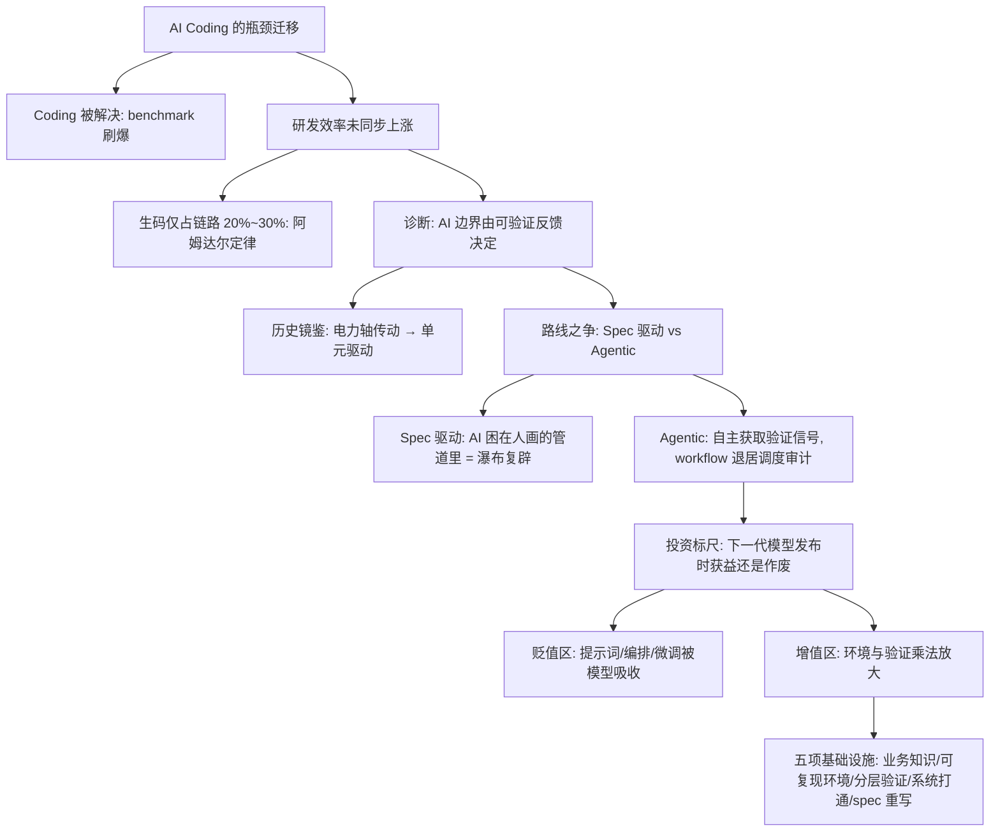

## 📋 文章信息

- **来源**: 微信公众号 - 大淘宝技术
- **作者**: 永霸（淘天集团 · 营销&交易技术团队）
- **发布时间**: 2026年8月24日
- **阅读链接**: https://mp.weixin.qq.com/s/8hyL92kt5TjnmsaDKDqodQ

---

## 🎯 核心摘要

这篇来自淘天交易团队的思考指出一个错位：SOTA 模型已把 HumanEval、SWE-bench Verified 等 coding benchmark 相继刷爆（SWE-bench Pro、Terminal-Bench 2.1 也冲到 80% 上下），「Coding 已经被解决」，但研发整体效率并未同步上涨——生码在整个研发链路里只占 20%~30%，作者自己的案例是改码加本地验证 1 小时搞定，上线却用了 3 周。诊断是：AI 的能力边界由「可验证的反馈」决定，coding 之所以最先被突破，是因为它的对错机器自己就能判；而企业内部答案藏在各研发系统里，验证成本高。作者用电气化革命「电力轴传动 → 单元驱动」的历史类比，批判当前把 AI 嵌进固定流程（PRD → 方案 → 拆解 → 生码 → 测试）的 Spec 驱动路线是在 AI 时代重演瀑布模型，主张转向「环境与验证驱动」：把内部构建、部署、测试、数据、日志、监控链路改造成 AI 可调用的工具，让 Agent 自主获取验证信号。投资判断标准浓缩成一个问题：「下一代 SOTA 模型发布时，我正在做的这件事，是获益，还是作废？」——围绕生成的投入会被模型升级吸收，围绕环境的投入与模型能力形成乘法效应。

## 📊 核心观点

### 1. Coding 正在被解决，但研发效率没有跟上

**背景/现状**：
- 2026 年 7 月快照下，头部模型在 SWE-bench Pro、Terminal-Bench 2.1 上已到 80% 上下，分数差距小于口径差距
- Claude Code 作者 Boris 说「Coding 已经被解决」，团队内部 AI 生码占比快速提升

**核心论述**：
- 生码只占研发链路 20%~30%，按阿姆达尔定律，把三成环节压到零，整条链路上限也只有三成
- 作者亲历：「顺买」交互实验需求，编码 1 小时、上线 3 周（跨平台关联发布 + 618 封网），编码占比不足 1%
- 另两个常被提及的原因（模型缺业务领域知识、benchmark 高分不等于生产能干活）指向同一方向：瓶颈在 Coding 之外

### 2. AI 的能力边界由「可验证的反馈」确定

**背景/现状**：
- coding 和数学最先被突破，不是因为简单，而是它们是少有的「对错机器自己就能判」的领域

**核心论述**：
- 企业级生产环境里答案藏在内部研发系统中，没有公开反馈、单次验证成本高，这才是 AI 暂时进不来的原因
- 引 Jack Reeves《Code as Design》：源代码才是软件真正的设计，文档只是会丢信息的摘要——AI 时代的新读法是：生成代码近乎免费，值钱的是把模糊业务意图变成精确表达并**验证它符合预期**
- 结论：既然边界由可验证反馈确定，就该主动把内部工作流改造成「有反馈、可验证」的环境

### 3. 历史镜鉴：电力轴传动与单元驱动

**背景/现状**：
- 电气化初期工厂只是用大电动机替换蒸汽机，传动轴布局原样保留（「电力轴传动」），旧系统的能耗、联动停工问题依旧
- 受既有资本约束，1899~1919 年美国制造业电力占机械动力比例才从约 5% 升到 50%，扩散用了约二十年

**核心论述**：
- 真正的跃升发生在「单元驱动」：每台机器独立电机，按原材料→加工→装配→输出重新布局，单层开阔厂房、流水线成为可能
- 电力最大的收益不是蒸汽机与电动机的效率差，而是生产流程、厂房结构、管理制度的整体重构；美国制造业生产率跃升主要出现在互补改造普及的 20 世纪 20 年代
- 对应到 AI：把 AI 塞进旧流程（轴传动）有现实价值但不是终态，要让 coding 这个工位先独立转起来

### 4. Spec 驱动有结构性天花板，Agentic 的本质是自主获取验证信号

**背景/现状**：
- 主流做法是把 AI 嵌进人类设计的固定流程，每个节点局部提效，节点间验收流转照旧（SDD、Agent Skills、Superpowers 类插件同属此路线）

**核心论述**：
- 这条路线优化的是「人使用 AI 的方式」而非「AI 使用环境的方式」：AI 困在人画的管道里，本质是 AI 时代重新引入瀑布模型
- 真实开发中一次测试失败可能来自实现、环境、数据、架构假设或需求理解的任何一层，固定流程的回退会把已做对的判断一起推倒
- Agentic 路线里 workflow 不消失，而是退到该待的位置：调度、权限控制、状态保存、审计和高风险检查

### 5. 投资账：贬值区与增值区，红利是乘法不是加法

**背景/现状**：
- 所有 AI 投入可用一个问题筛选：「下一代 SOTA 模型发布时，我正在做的这件事，是获益，还是作废？」

**核心论述**：
- **贬值区**：微调提生码质量、囤提示词技巧、精细编排生码流程——昨天的脚手架变成今天模型的内置能力，等于和模型厂商军备竞赛对赌
- **增值区**：把内部构建、部署、测试、数据、接口、日志、监控、发布链路做成 AI 可调用的工具——厂商替你做不了，模型越强这些资产越值钱
- 分界线在于和模型能力的关系：凡替代/补偿模型推理能力的（拆步骤、设计提示词、编排流程）会被下一代模型吸收；凡提供模型自己造不出来的信息的（真实状态、构建结果、日志、测试反馈）持续增值，「关于世界的信息只能从世界里来，不可能从权重里长出来」
- 红利 ≈ 模型能力 × 环境能力：模型是租来的因子自己上涨，环境是自有因子只涨不跌；workflow 化收益线性（给环节加常数），环境投入收益复利（在乘法里占住一个因子）

### 6. 环境与工具是 Agent 的核心基础设施

**背景/现状**：
- 主张落地为五项建设，目标是把「只有人会操作的内部系统」翻译成「AI 可调用的工具」

**核心论述**：
- 业务领域知识构建：业务域 SKILL、本体知识库
- 可复现、可调用的研发环境：Agent 能独立构建项目、启动服务、准备数据、调用接口、操作浏览器/APP、看日志链路和监控
- 分层验证体系：秒级反馈（编译、类型、单测）支撑高频自主迭代；分钟级（集成、契约、浏览器自动化）覆盖更真实行为；人工只保留给业务价值、用户体验、伦理边界
- 端到端研发系统打通：发布、实验、监控平台改造成 AI Friendly
- spec 新写法：区分「约束」（数据不出域、接口向后兼容、延迟阈值——长期保存并自动检查）与「假设」（微服务还是单体、缓存策略——允许 AI 根据反馈调整）；spec 划定「什么算对」，不规定实现路径
- 解剖「顺买」麻雀：编码只占 1 小时，那么影响面分析、联调环境、发布编排、灰度验证、封网合规检查的工具化价值远大于继续挤压编码

## 🧠 概念图谱

## 🏗️ 技术架构

### 架构概述

目标形态是一个「环境即基础设施」的 Agent 研发体系：workflow 层收缩为调度、权限、状态、审计与高风险检查；coding 工位像单元驱动的电机一样独立运转，Agent 在可复现环境内跑「构建 → 启动 → 测试 → 看日志 → 调整」的自主循环，由分层验证体系供给不同频率的反馈信号，人工判断只保留在机器无法可靠裁决的价值层。spec 的角色从「规定实现路径」改为「划定什么算对」，约束自动检查、假设允许推翻。

### 核心组件

| 组件 | 职责 | 关键技术 |
|------|------|----------|
| 业务域 SKILL / 本体知识库 | 注入公开语料里没有的领域知识 | 业务知识结构化、SKILL 封装 |
| 可复现研发环境 | 让 Agent 独立构建、启动、准备数据、调用接口、操作浏览器/APP、读日志与监控 | 内部系统工具化（AI 可调用接口） |
| 分层验证体系 | 按反馈频率分层供给验证信号 | 秒级（编译/类型/单测）、分钟级（集成/契约/浏览器自动化）、人工（价值/体验/伦理） |
| 端到端研发系统 | 发布、实验、监控平台对 AI 友好 | 内部平台 AI Friendly 改造 |
| spec 新写法 | 区分约束与假设 | 约束自动检查、假设随反馈演进，spec 划定对错边界而非实现路径 |

## 🔑 关键洞察

### 1. 「可验证性决定 AI 边界」是对能力崇拜的祛魅

**分析**：
- AI 不是先攻克最难的领域，而是先攻克反馈最闭环的领域——这个规律把投资视角从「模型多强」扭转为「我们的反馈回路通不通」
- 组织里真正稀缺的不是模型调用权，而是机器可读的验证信号：测试、日志、监控、构建结果
- 这也解释了为什么同一模型在不同团队的产出差距巨大：差异不在提示词，在环境给不给得出信号

### 2. 乘法公式把「买模型还是建环境」变成资产配置问题

**分析**：
- 模型是租来的因子、自己往上涨；环境是自有因子、只能自己建——红利 = 模型 × 环境，任何一端为零结果为零
- 这个框架的实践价值是给投入分类：与模型厂商军备竞赛对赌的（编排、提示词工程）是消耗性支出，环境工具化是资本性支出
- 模型每强一代，同一套环境的价值被重新放大一遍——这是「复利」的真正含义

### 3. 电气化类比提供了 AI 提效的时间尺度校准

**分析**：
- 电力从 5% 到 50% 用了二十年，生产率跃升出现在互补改造（单元驱动、厂房重构、管理重组）普及之后，而非换发电机时
- 对应判断：给现有流程「换电机」（节点加 AI）的收益是过渡性的，值得做但别当终态押注
- 类比的冷静剂作用：组织流程、岗位分工、验收制度的重构速度远慢于模型迭代，AI 研发效能的真实曲线大概率比模型能力的曲线平缓得多

### 4. 「Spec 驱动 = 瀑布复辟」点中了 Agent 编排热的最痛处

**分析**：
- 每个节点等人验收的 pipeline，把给人协作设计的流程固化成 Agent 的执行顺序，忽略了失败原因可能出现在任何一层
- 大量「Agent 工作流」产品的实质是把人肉流程电子化，AI 只是更快地卡在同样的验收节点上
- 文章给出的解法克制且具体：workflow 不删除，退到调度、权限、审计、高风险检查——这些恰是机器循环里必须由制度兜底的部分

## 🚧 不足与局限

### 1. 类比是修辞武器，不是因果论证

- 软件重构的边际成本远低于厂房搬迁与产线重排，AI 时代「单元驱动」的滞后期可能远短于二十年；用电气化史预言节奏，方向有感召力但精度存疑
- 电力是同质化能源，模型能力却在快速改变「什么值得工具化」——类比未处理两个系统的这层差异

### 2. 乘法公式是启发性框架，不是可度量的模型

- 「环境能力」如何度量、两个因子是否独立（强验证环境可能降低对模型能力的要求，即因子间有替代性）均未讨论
- 缺少投入产出的量化案例：文中「顺买」麻雀解剖了瓶颈，但没有展示环境工具化之后 3 周被压缩到多少的对照数据

### 3. 对组织与人的变革阻力着墨不足

- 电气化跃升的最后一环是管理制度重构；文末团队介绍提到「从职能岗位分工走向面向业务价值交付」，这恰恰是最难、最慢的部分，正文却只谈了技术侧
- 验收权从人交给分层验证体系，涉及质量责任、审计合规、技能转型的重新分配，文章对此几乎空白

### 4. 关键数据为孤例与粗估

- 「生码占 20%~30%」是团队粗略统计；「1 小时 vs 3 周」含 618 封网特殊因素，用孤例支撑结构性论断，说服力打了折扣

## 🔮 延伸思考

### 个人开发者与小团队如何套用这套框架

- 没有内部平台资产的个体，环境投资等价于把本地开发环境 agent-ready：可复现的构建脚本、秒级单测、结构化日志、浏览器自动化——这恰好解释了 Claude Code 与 MCP 工具生态的爆发：它们本质是在给所有人卖「环境因子」
- 「下一代模型测试」同样适用于个人：花一周写的提示词编排，可能在下个版本发布当天贬值

### 「环境即护城河」对大厂竞争的意味

- 内部研发系统是模型厂商拿不到的私有数据与私有资产；大厂的 AI 红利上限取决于平台工具化进度，而不是模型选型
- 这也划出了模型厂商与企业软件的楚河汉界：厂商卷生成因子，企业卷环境因子，双方的接口（工具协议、MCP、可观测性标准）会成为下一个争夺点

### 约束与假设分离的 spec 观可以推广

- 「spec 划定什么算对，不规定实现路径」本质是把验收标准形式化、把探索自由还给 Agent，与形式化方法、IaC、契约测试一脉相承
- 往前一步是让「假设」显式携带验证方式：每条架构假设标注被什么信号推翻——spec 从静态文档变成随运行反馈演进的活文档

## 💡 实践启示

### 1. 用「下一代模型测试」审计现有 AI 投入清单

**要点**：
- 把团队正在做的 AI 相关投入逐项过一遍：下一代模型发布时是获益还是作废
- 归类出贬值区（提示词技巧、精细编排、为提生码质量的微调）并压缩，把资源转投增值区

### 2. 先测量，再优化：给自己算一笔阿姆达尔账

**要点**：
- 统计生码在本团队研发链路的真实占比，找到自己的「3 周」在哪（联调、发布、灰度、合规？）
- 对占比最大的非编码环节优先做工具化，而不是继续挤压编码环节

### 3. 分层验证体系是性价比最高的第一块基建

**要点**：
- 秒级反馈（编译、类型、单测）让 Agent 有高频自主迭代的燃料，成本最低、见效最快
- 人工判断只保留给机器无法可靠裁决的价值层，其余尽量编译为可自动执行的检查

### 4. 重写 spec：把约束与假设拆开

**要点**：
- 约束（数据不出域、兼容性、延迟阈值）写成长期保存、可自动检查的规则
- 假设（架构选型、技术策略）显式标注为待验证，允许 AI 依据实现与运行反馈推翻

## 📝 关键金句

> "下一代 SOTA 模型发布时，我正在做的这件事，是获益，还是作废？"

> "Agentic 的本质不是'AI 主导决策'，而是'AI 能否自主获取验证信号'。"

> "关于世界的信息只能从世界里来，不可能从权重里长出来。"

> "企业从 AI 拿到的红利，约等于模型能力与环境能力的乘积，而不是和。"

## 🏷️ 标签

AI Coding、Agent、环境驱动、分层验证、研发效能、技术投资

---

## 🔗 相关资源

- **拓展阅读**：Jack Reeves《Code as Design》；阿姆达尔定律；Paul David 对电气化生产率悖论的经典研究；Anthropic Claude Code 与 MCP 工具生态；SWE-bench Pro / Terminal-Bench
