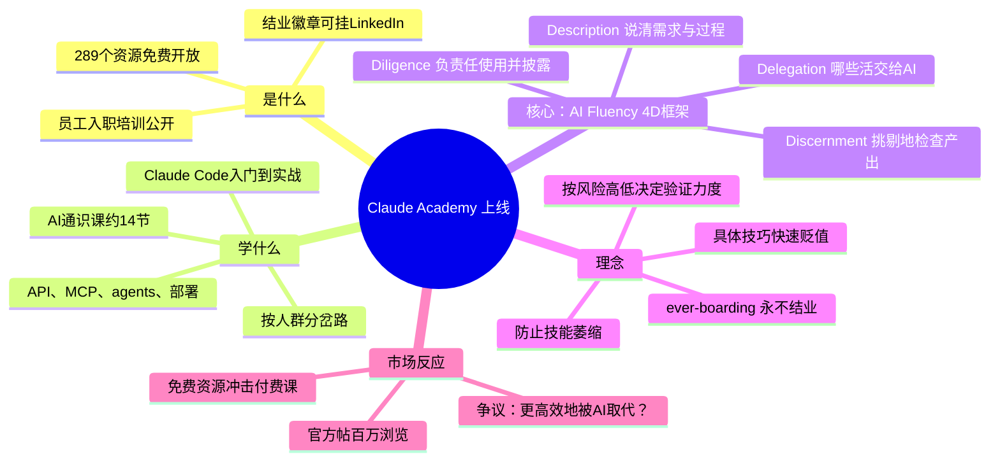

## 📋 文章信息

- **来源**：微信公众号 - 新智元
- **作者**：ASI启示录（编辑：所罗门）
- **原文链接**：[刚刚，Anthropic把员工入职第一课给公开了！](https://mp.weixin.qq.com/s/RHvM8mKN--uNzysHFgUpYw)
- **收藏日期**：2026年8月24日

---

## 🎯 内容摘要

Anthropic 把原本用于新员工入职培训的课程全部免费公开为 Claude Academy：289 个资源覆盖从 AI 通识、Claude Code、API、MCP、agents 到生产级部署，注册免费账号即可学习并获可公开验证的结业徽章。核心是 AI Fluency 4D 框架（Delegation、Description、Discernment、Diligence），教的不是提示词技巧，而是如何判断哪些活交给 AI、如何验证与负责任地使用——因为具体技巧随模型进化快速贬值，「今天的 AI 是你这辈子会用到的最差的 AI」。

---

## 🗺️ 思维导图

---

## 📄 原文内容

新智元报道

Anthropic把自家员工入职培训的那套课程，原样搬到了网上。免费。

就在昨天，Claude Academy正式上线。

289个资源：课程、教程、真实用例全在里面，从「AI到底是什么东西」一路到Claude Code、API、MCP、agents和生产级部署。

最重要的是，注册一个免费Claude账号就能看，学完发结业徽章，可以公开验证，也能挂到LinkedIn上。

按照博客上的说法，本来这些内容原本是给新员工入职培训上的。

### 从零通关Claude Code

Anthropic 表示每天有数百万人跑到他们的官网上学习怎么使用 AI，公司为此还专门养了一支教育团队。

Claude Academy就是这支教育团队的总入口。

零基础的可以先搞清楚 AI 能干什么，然后上手对话、Cowork这些。

想写代码的更直接。Claude Code从入门到实战课都摆在那儿，再往后就是API、MCP、agents，一路到把东西部署上线。

课程还按人群分了岔路，写代码的、老师的、搞公益的、开店的，各走各的。底下有一门通识课大概14节，相当于整个体系的地基，不管你是谁都建议先过一遍。

装上Claude Academy Skill，它还会照着你的习惯和进度，直接告诉你下一步该看哪个。

### 最硬的一块：入职第一天学的4D框架

整个Academy最核心的东西，是Anthropic和Rick Dakan、Joseph Feller两位教授一起开发的 AI Fluency 4D框架。

简单说就四件事：

Delegation——哪些活交给AI，哪些自己干。

Description——把需求和过程说清楚。

Discernment——挑剔地检查AI交回来的东西。

Diligence——用得负责任，并且告诉别人AI在里面做了什么。

Anthropic 的新员工入职第一天就要学习这个框架。它练的不是怎么写 Prompt，而是怎么判断哪些活该给 AI，哪些要自己干。还要学习 AI 最容易在哪些地方犯蠢，免得被带到沟里。

入职之后这些培训也不会停，他们管这叫「ever-boarding」。说白了就是没有「结业」这回事，因为AI的能力边界一直在变，人的认知也得跟着刷新。

活到老，学到老。

教育团队讲了一件挺反常识的事：具体技巧正在快速贬值。

以前你得先告诉Claude这份东西是写给法务同事看的，现在它自己就会来问你了。模型在进化，昨天的最佳实践今天可能就是多余动作。

所以他们把重心从教动作挪到了「养心智」，翻来覆去就这两句话——

今天的AI，是你这辈子会用到的最差的AI。

按风险高低决定验证力度。

课程还专门提醒，别把自己在意的本事全交出去，那会使技能萎缩。

比如，敏感的内容还是要自己写，汇总幻灯片丢给AI；探索性的数据分析交给Claude跑，但最后的核对还是要自己来。

这已经不是教你怎么使用工具那么简单了。这是在学习如何跟一个越来越强大的非人类队友相处、配合。

### 竞争已经换了赛道

官方@claudeai那条帖子发出去几小时，点赞过万，转帖上千，浏览量冲到百万级。

网友@hiro44_pino连夜写了长帖，说289个资源不用全啃，每天看一点，立刻拿来实践。先用官方免费教材就够了，比买高价课划算得多。

实用派给了更短的路线：先看7分钟的The 4 Properties of AI，再拿手上的活试一个具体的场景，卡住了再回来补长课程。

有网友表示课程还是很实用的，自己连续 6 个月每天使用 Claude，还是能在高级课程中学习到新的技巧。

开发者 Kadam 认为，这种免费资源是一种巨大的胜利。像 Claude Code 这样的工具教程对优化很有用。

当然也少不了阴阳怪气的声音，说这是教你如何更高效地被AI取代自己。

### 模型在往前跑，人得跟上

这件事真正值得琢磨的地方在于：它动摇的不只是AI培训市场，而是整个「学习」这件事的逻辑。

传统教育体系是先花四年打基础，再用经验慢慢长。但AI的能力边界每几个月就刷新一次，你半年前学的prompt技巧可能下个版本就内置了。

知识的保质期从没这么短过。

Anthropic的解法是，不教你记招式，教你练心法。不教你按哪个按钮，教你判断什么时候该按、什么时候该自己来。

4D框架的底层逻辑说穿了就一句话：人要永远比工具多想一步。

Anthropic把新人第一天的课免费放出来，其实是在说一件事：光是模型变强没用，用的人跟不上，白搭。

那句「今天的AI是你这辈子会用到的最差的AI」，反过来读更扎心：

它明天一定会更强，而大多数人的用法，还停在昨天。

参考资料：

- https://x.com/claudeai/status/2090518650251804742
- https://academy.claude.com
- https://claude.com/blog/anthropics-approach-to-teaching-and-learning-ai

编辑：所罗门

