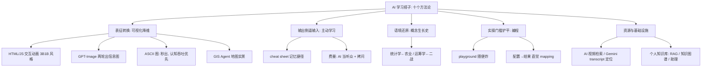

## 📋 文章信息

- **来源**: 知乎 - 问题「当 AI 成为我们的『学习搭子』，学习是变得更容易，还是更困难？」下的回答
- **作者**: 星雨月虹
- **发布时间**: 2026年8月23日
- **阅读链接**: https://www.zhihu.com/question/2072749333951117184/answer/2074893172489172842

---

## 🎯 核心摘要

作者把自己从 2022 年 ChatGPT 问世以来积累的 AI 学习方法论浓缩成十条干货。核心思想是：AI 最有价值的作用不是替你学，而是把知识在不同表征之间自由转换——生成 3Blue1Brown 风格的可交互动画、GPT-Image 信息图、秒出的 ASCII 图、GIS 地图标注，直到找到认知阻抗最低的那一种；同时把费曼学习法的「听众问题」解决掉，让 AI 拷问你、纠正你，变被动学习为主动学习。此外还包括还原知识被发明时的原始语境（统计学源于农业、运筹学源于二战）、用 AI 铲平编程学习的初学者坑、建立「配置→结果」直觉，以及最终沉淀为 RAG 驱动的个人知识库。整个清单隐含的回答是：AI 降低的是学习的外部摩擦，理解的苦功仍要自己走。

## 📊 核心观点

### 1. 可视化降维：把抽象知识变成看得见、可交互的形态

**背景/现状**：
- 理科与抽象概念最大的学习障碍是无法「看见」——教科书静态插图的表达力有限

**核心论述**：
- 让大模型用 HTML + JavaScript 配合动画框架，做出 3Blue1Brown 风格的可交互示意动画（prompt 里明确要求风格即可）
- 用 GPT-Image 生成信息图：第一轮让模型详细概要全书重点，第二轮直接生成 5 幅高信息量图表——小红书图文博主基本都这么出图
- ASCII 图是被低估的选项：树状图、条形图、思维导图、空间布局图都能画，在 System Prompt 里加一句「解释复杂概念时自动画 ASCII 图」；图片质量高但要等 5 分钟，ASCII 秒出，认知速度快得多

### 2. 从被动输入到主动输出：cheat sheet 与费曼拷问

**背景/现状**：
- 费曼学习法（扮演老师讲给别人听）被公认为最有效的理解加速器，但苦于找不到听众

**核心论述**：
- 让 AI 给一套课、一本书制作 cheat sheet（即用即查的记忆力捷径），看书、速查公式、做题都好用
- 把自己的理解写出来丢给大模型——有误解也没关系，模型会纠正你；甚至让它拷问书里的知识点，要求必须结合实际例子，确保真的理解
- 亲测能有效变 passive learning 为 active learning，以输出倒逼输入、有针对性地学习

### 3. 还原知识的原始语境：理解概念的生长过程

**背景/现状**：
- 学新概念常常「知其然不知其所以然」，根源是不知道它当年被开发出来的 original context

**核心论述**：
- 统计学最初是为提高农作物产量而发明；运筹学是二战时美国为优化士兵生存率、物流与工业生产效率而诞生
- 把抽象概念还原回当时的情境，看「古人」怎么笨拙但实在地解决问题，再让大模型讲清技术如何一步步迭代成今天的样子
- 看到前人试错、一代代优化的全过程，对理解概念的生长过程大有裨益

### 4. GIS Agent 让地理类学科身临其境

**背景/现状**：
- 地理、历史、经济、政治、城市、物流等学科依赖空间与实景想象

**核心论述**：
- 用 Google Earth GIS Agent 在地图上做各种标注，还能还原各时代的 photo-realistic 地面样貌
- 农田、地貌、地质特征、城市布局、街景在 Google Earth 上都有实拍，学习有真实感、仿佛身临其境

### 5. 编程学习的时代红利：playground 与「配置→结果」直觉

**背景/现状**：
- 初学者要踩的坑（读文档、debug、环境配置）现在基本都能被 AI 打磨得非常丝滑

**核心论述**：
- 学习者只需专注最能泛化、最能付诸实践的架构与底层原理、编程哲学；project-based learning 和 learning by doing 变得极其简单
- 让 AI 搭一个试验田/playground，在里面随便炸、随便魔改——魔改的细节代码不重要，重要的是对「设置配置 → 结果表现」建立起直观的 mapping
- AI 能帮你非常顺滑地建立这种直觉

### 6. 资源检索升级与个人知识基础设施

**背景/现状**：
- 有些知识自己讲不利落、必须看着实际场景才能懂（计算机图形学、渲染原理、大量物理内容）

**核心论述**：
- 让 AI 检索高质量 YouTube 视频、Reddit 讨论、知乎教程，比自己随机点开高播放量视频更有针对性；Gemini 甚至能读 YouTube transcript，直接告诉你几分几秒的片段值得看
- 有了编程技术栈后，打造个人知识库、个人图书馆、个人论文集：RAG 应用、个人知识图谱、个人知识助理、日常与项目管理，一切变得灵活——这是前九个方法的收敛点

## 🧠 概念图谱

## 🔑 关键洞察

### 1. 十个方法共享同一底层逻辑：表征转换的成本降到近零

**分析**：
- 文字 ↔ 图像 ↔ 动画 ↔ 地图 ↔ 代码 ↔ 对话，AI 让知识可以在任意表征间切换，学习者不断变换视角直到「看见」为止
- 过去做一张可交互动画需要前端技能，做一张信息图需要设计技能——现在只是几句 prompt 的事
- 「学习的认知阻抗」第一次变成可优化的变量：哪个表征卡住就换下一个

### 2. 回答隐含地划出了「容易」与「困难」的分界线

**分析**：
- AI 消除的是外部摩擦：找资源、读文档、debug、画图、找费曼听众——这些确实变得无比容易
- 但十个方法里真正产生理解的步骤（被拷问、还原语境、建立配置-结果直觉）依然必须学习者自己走完，AI 只是陪练
- 对原问题的真正答案是：用 AI 的人分两种——把 AI 当答案贩卖机的人学习变得更困难（幻觉式熟练），把 AI 当陪练的人变得更容易；分水岭在用法而非工具

### 3. ASCII 图偏好揭示学习场景的「速度经济学」

**分析**：
- 图片质量远高于 ASCII，但作者仍推荐 ASCII 常驻 System Prompt，理由是等待 5 分钟会打断认知流
- 学习场景优化的不是渲染保真度而是认知吞吐量：即时反馈 > 精美呈现
- 这个取舍对所有学习工具选型都成立：能立刻出现在对话流里的粗糙图，胜过要切出去等待的精图

### 4. 方法 10 是前九个的收敛点：学习闭环变成基础设施

**分析**：
- 前九个方法产生的是散落的理解与产物，方法 10 把它们沉淀为可检索、可对话的个人知识资产
- RAG + 知识图谱让「第二大脑」从存储范式（卡片、标签）走向对话范式（问答、引用），知识的复利第一次可以自动运转
- 这也意味着学习搭子的终极形态不是「帮你学完一门课」，而是持续积累的个人认知基础设施

## 🚧 不足与局限

### 1. 只回答了问题的一半

- 原问题是「更容易还是更困难」的二选一，通篇只论证了「更容易」的一面，对 AI 学习的已知代价（依赖、认知外包、幻觉固化错误理解）完全未提
- 作为方法论清单这是合理的取舍，但作为对原问题的回答存在系统性偏差

### 2. 无优先级、无适用边界、无失败经验

- 十个方法平铺直叙，没有说明哪些是「装了就受益」的（ASCII 图、费曼拷问），哪些有较高门槛（交互动画的质量高度依赖 prompt 功力与模型版本）
- 没有成本核算（图像 API 费用、时间投入）与反面案例；89 赞的个人经验样本，可复现性未知

### 3. 幻觉风险被「模型会纠正你」一笔带过

- 费曼拷问环节模型自己也可能错——尤其在专业细分领域，错误的「纠正」比不纠正更危险，会固化错误心智模型
- 对初学者恰恰最缺乏甄别能力这一点，是方法论里最大的隐患，作者未给出任何校验手段

### 4. 部分 method 已被产品快速迭代覆盖

- 视频检索、transcript 定位、图像生成这些「技巧」正在被模型与产品的原生能力吸收——方法论本身的半衰期问题没有被讨论（昨天的技巧可能是明天的内置功能）

## 🔮 延伸思考

### 认知外包的双刃剑：cognitive offloading 的研究警示

- 认知科学早有共识：外包记忆与推理会削弱相应能力（GPS 与空间记忆、计算器与心算）——Anthropic 的课程也提醒「别把在意的本事全交出去，那会使技能萎缩」
- 十个方法里真正抗外包的是费曼拷问与语境还原（必须自己输出），最容易退化成外包的是信息图与资源检索（AI 全代劳）
- 学习者的元任务变成：给每类知识决定「保留给自己」与「放心外包」的边界

### 教材形态的可能演进

- 「3Blue1Brown 风格的可交互动画 + prompt 即得」暗示了下一代教材的形态：不再是静态 PDF，而是可执行、可交互、按需生成的页面
- 当任何概念都能在 30 秒内变成可把玩的动画，「教材」与「练习场」的界限会消失

### 个人知识库的重心从「存」转向「问」

- RAG 驱动的个人图书馆让知识管理的瓶颈从卡片整理术（命名、链接、标签）转移到检索与问答质量（切块、索引、上下文组装）
- 对普通学习者，这意味着第二大脑的门槛从「坚持记卡片」降到「坚持把材料丢进去」——剩下的问题是如何问出好问题

## 💡 实践启示

### 1. 最低成本的两个常驻改造：ASCII 图 + 拷问者

**要点**：
- System Prompt 加一句「解释复杂概念时自动画 ASCII 图」，立刻提升全部对话的可理解性
- 加第二句「每讲完一个概念，结合实际例子拷问我，检验我是否真正理解」——把日常使用变成费曼训练场

### 2. 建立「两轮出图」的榨书工作流

**要点**：
- 第一轮：把书/论文丢给模型，要求详细概要重点与精华
- 第二轮：直接要求生成 5 幅高信息量图表，用于复习与分享；再让模型产出 cheat sheet 供即用即查

### 3. 每学一个概念先问「它当年为了什么问题而生」

**要点**：
- 让模型还原概念被发明时的原始场景与前人的试错路径，再看它如何迭代至今
- 理解了生长过程，抽象定义就不再是孤立符号

### 4. 给学习闭环装上「沉淀端」

**要点**：
- 学完的产物（笔记、cheat sheet、代码、对话精华）统一入库到个人知识库，配 RAG 检索
- 学习不再是线性消费，而是资产积累：下次遇到相关问题，先问自己的知识库

## 📝 关键金句

> "变 passive learning（消极学习）为 active learning（积极学习），能够真的以输出倒逼输入。"

> "把一个看似抽象的概念、知识或技术还原回它当时的情境里，看所谓的古人当年是怎么笨拙但实在地把问题解决的。"

> "重要的是你需要知道这些魔改出来的设置会通向什么样的结果，对『设置配置』到『结果表现输出』建立起直观的感受。"

## 🏷️ 标签

AI学习、费曼学习法、可视化、认知外包、个人知识库、RAG

---

## 🔗 相关资源

- **拓展阅读**：3Blue1Brown 数学动画；费曼学习法；Google Earth；Anthropic《AI Fluency 4D 框架》（技能萎缩警示）；RAG 检索增强生成
- **作者相关回答**：[什么样的读书方法才能快速榨干一本书的所有知识](https://www.zhihu.com/question/377547324/answer/2041006853094642953)、[真正爱读书的人是怎么看书的](https://www.zhihu.com/question/502804915/answer/2072385485285102003)、[你在搞科研这件事情上都养成了什么样的好习惯](https://www.zhihu.com/question/60944537/answer/2024845208173454912)
