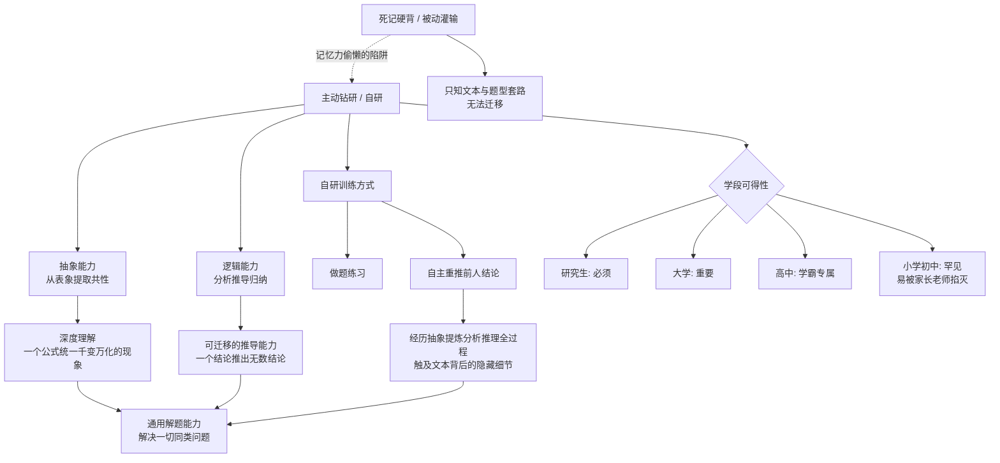

## 📋 文章信息

- **来源**: 知乎 - 问题「最好的学习方法是什么？」下的回答
- **作者**: rq cen（新知答主，清华基科 / 巴黎综合理工背景）
- **发布时间**: 2025年9月7日（编辑于 2025年9月8日）
- **阅读链接**: [原文](https://www.zhihu.com/question/628484507/answer/1948278846035071269)

---

## 🎯 核心摘要

作者基于在清华基科班和巴黎综合理工的观察提出：最好的学习方法不是被动"学习"，而是"主动钻研"（自研）——除了最基本的数学、物理定义和实验规律，课本上次一级的公式、结论、理论几乎都应该靠自己推导出来，学完之后甚至能把课本从头重写一遍。支撑这种学习方式的两大引擎是**抽象能力**（从千变万化的表象中提取共性）和**逻辑能力**（从结论推导出可靠结论），学习能力的差异不在记忆力，而在于是否训练和使用这两种能力。自己独立重推前人结论，与从书上直接看结论，是截然不同的两种学习：前者透彻、牢靠、可迁移，后者浮于文本表面。作者还按学段划分了自研的可得性——研究生阶段必须、大学阶段重要、高中阶段是学霸专属、小学初中几乎不可能——并指出主动研究的习惯大多源自童年生活、玩耍与寂寞中被"逼迫"出来的锻炼。

## 📊 核心观点

### 1. 顶尖学习者的真相：不是"学习"，而是"自研"

**背景/现状**：
- 作者在清华基科和巴黎综合理工接触到大量学习极好的人，发现一个共同模式。

**核心论述**：
- 几乎所有学习很好的人，课本上的大部分知识都是靠自己推出来的；学完之后能从头推到尾，甚至能自己把课本重新写出来。
- 这解释了为什么很多学霸说自己"从不上辅导班""没有刷数不清的题"——研究式的思考已经抵得上大量刷题的效果。

### 2. 抽象能力 + 逻辑能力 = 学习的两大核心引擎

**背景/现状**：
- 人类总结知识、创造文明，靠的是两种能力；后人学习前人的知识，用的也是同两种能力。

**核心论述**：
- **抽象能力**：从看上去各不相同、千变万化的表象中提取共性的抽象概念。
- **逻辑能力**：一套几乎百试百灵的分析、推导、归纳事物关系的方法论。
- 知识是对客观世界精炼、通用、有预见性的描述——一个公式描述千变万化的现象。只有用抽象思维理解公式如何统一不同表象，用逻辑从一个结论推出无数结论，才能"通用且万能地解决一切同类问题"，这是死记硬背给不了的。

### 3. 记忆力是低等能力，依赖它反而形成学习的陷阱

**背景/现状**：
- 很多人把"记性好"当作学习天赋，作者直接推翻了这一点。

**核心论述**：
- 记忆力跟"没有智慧和文明的动物"没有区别，普通人的记忆力完全足以掌握知识。
- 真正拉开差距的是抽象能力和逻辑能力的使用。
- 陷阱在于：记性越好的人越容易用记忆力"偷懒"，跳过抽象与逻辑的训练；能死记成百上千个结论，也比不过掌握了"相当于无穷多结论"的推导能力。

### 4. 自己重推一遍，与看书看一遍，是两种学习

**背景/现状**：
- "这些知识前人早推出来了，自己再推一遍不是浪费时间吗？"——作者正面回应了这个质疑。

**核心论述**：
- 自己独立总结推理，经历了抽象、提炼、分析、推理的完整过程，必须对知识的方方面面认真考虑，相当于透彻、全面、严格地剖析了概念。
- 直接看书只是接收文本信息，无从得知简略文本背后隐藏的大量细节，容易浮于表面。
- 这就是"主动研究得来的知识"远比"从别人那里听来的知识"更详细、更牢靠的原因。

### 5. 自研能力按学段分层：越早形成，优势越大

**背景/现状**：
- 作者给出了一个从小学到研究生的自研可得性阶梯。

**核心论述**：
- **研究生**：自研是必须的——任务就是学习细分领域知识并作出独创性成果。
- **大学**：知识原理性、逻辑性、系统性极强，不能自己推一遍很难真正掌握；很多名校本科生能做出突出科研成果，正因为大学学习与科研本就无缝衔接。
- **高中**：知识已有原理、逻辑、体系的雏形，用自研方法学习能"吊打"被动汲取和死命刷题的同学，且看上去轻松——实际是把努力花在了刀刃上。
- **小学初中**：极难见到自研的学生，小孩天性使然；过度焦虑、灌输知识的家长和老师，即使有苗头也容易被掐灭。

## 🧠 概念图谱

## 🔑 关键洞察

### 1. "自研"的本质是知识的重演，与认知科学的实证结论惊人吻合

**分析**：
- 作者描述的"自己从头推到尾、把课本重新写出来"，在认知科学中有对应概念：**生成效应（generation effect）**——自己生成的信息比被动接收的信息记得更牢；**自解释效应（self-explanation effect）**——学习者向自己解释"为什么这一步成立"能显著提升理解；以及费曼技巧（能把知识讲清楚/写出来才算懂）。
- 一线学霸的实践观察与实验室结论相互印证：学习深度取决于**认知加工的深度**，而不是接触信息的次数。这篇回答相当于用亲历者视角给"建构主义学习理论"做了白话翻译。

### 2. 公式是知识的压缩包，理解是解压算法——作者点破了学习的本质是压缩与解压

**分析**：
- "简短的一个公式能描述千变万化的具体现象"——知识本质上是人类对海量经验的高压缩编码。死记硬背相当于只存了压缩包文件名，抽象与逻辑能力才是解压算法。
- 这个视角也解释了为什么死记硬背无法迁移：没有解压能力，遇到新的表象（新题型、新情境）就打不开压缩包；而掌握解压算法的人面对任何新表象都能重新编码。

### 3. AI 时代重读这篇回答，"自研"恰恰是最难被替代的学习方式

**分析**：
- 当 ChatGPT/DeepSeek 能秒回答案、AI 能直接给出完整推导时，"从别人那里听来的知识"的获取成本趋近于零，被动学习者与 AI 之间的能力差距被进一步抹平——也意味着只会被动接收的人价值被稀释。
- 但抽象能力（从新现象中提取共性）和逻辑能力（在新约束下重新推导）恰恰是 AI 短板所在、也是指挥 AI 的元能力。作者 2025 年写这篇回答时未必想到 AI，但它为"AI 时代该学什么"提供了答案：学"推导的过程"，而不是"推导的结果"。
- 需要警惕的反面：AI 让"用记忆力偷懒"升级为"用 AI 偷懒"——跳过推导直接要结论，是同一陷阱的新形态。

### 4. "把努力花在刀刃上"——生成式学习的投入产出比远高于重复式学习

**分析**：
- 学霸"不刷题也成绩好"不是天赋，而是单位时间认知投入的杠杆率不同：一次彻底的自主推导，同时完成了理解、记忆、迁移三件事；而一道题的低质量重复只完成"熟悉"。
- 这与刻意练习（deliberate practice）的核心一致：决定水平的不是练习时长，而是练习时是否处于"持续自我推导—反馈—修正"的加工状态。

## 🚧 不足与局限

### 1. 样本存在明显的幸存者偏差
- 观察对象集中在清华基科、巴黎综合理工的优等生，这是"自研成功者"的样本；那些同样尝试自研但失败、最终被动的学生不可见。自研与成绩好的因果关系可能是双向的（学有余力才敢自研），而非单向。

### 2. 对记忆力的贬低与认知科学结论相悖
- 现代研究（如检索练习 testing effect、组块化 chunking）表明，记忆与理解是相互促进而非对立的：扎实的基础知识组块恰恰是高效推导的前提，专家的直觉依赖大量自动化记忆。
- 把记忆力贬为"跟动物没有区别的低等能力"在修辞上有力，但在科学上站不住——更准确的说法应该是：**记忆应当是理解的副产品，而不是学习的替代品**。

### 3. 缺少从"被动学习者"到"自研者"的过渡路径
- 作者承认"自发的主动性很难有固定的培养路径"，但这恰恰是普通读者最需要的部分。对一个已被应试训练多年、丧失推导习惯的大学生/成年人，如何低门槛地开始第一次"自研"，文中没有答案。

### 4. 学段分层是经验断言，缺乏实证支持
- "小学初中极难见到自研学生"“高中自研能吊打刷题”等论断来自个人观察，教育学上并无此定论；小学阶段儿童的自发探究（如对昆虫、机械的痴迷）其实相当普遍，只是不被算作"学习"。

## 🔮 延伸思考

### 与 AI 协同的"新自研"
- 自研不等于拒绝外部资源。未来更现实的形态可能是"对话式推导"：让 AI 只给提示不给答案，自己完成关键推导步骤，AI 充当苏格拉底式陪练。这保留了生成效应的认知收益，又降低了自研的门槛——值得每个学习者为自己设计这样的 AI 使用规则。

### 组织层面的启示
- 这套逻辑不只适用于应试：工程师读源码 vs 读文档、医生跟诊 vs 背指南，本质都是"自研 vs 被动汲取"的差别。团队里成长最快的人，往往是在没人要求时自己去把系统从头推一遍的人。

### 教育制度的悖论
- 自研见效慢、前期成绩可能落后于刷题同伴，而升学体系奖励短期分数——制度在系统性地惩罚自研。家长若认同作者观点，需要有承受"早期成绩不领先"的心理准备，这是文中未言明的隐含成本。

## 💡 实践启示

### 1. 用"合书重推"作为理解的金标准

**要点**：
- 学完一章后合上书，凭基本定义把核心公式、结论重新推导一遍；推不出来的地方就是没懂的地方。
- 终极检验：能否不看目录，把这一章的知识结构（主线 + 关键推导链）默写出来。

### 2. 做题从"刷量"转向"刷深"

**要点**：
- 每道题先问"这个结论我自己能不能推出来"，而不是急着套题型。
- 一道题的自主多解 > 十道题的重复套路。

### 3. 警惕"记性/资料/AI"带来的偷懒舒适区

**要点**：
- 定期自查：这个知识我是"推出来的"还是"看来的"？如果是看来的，花 20 分钟重推一次。
- 用 AI 时明确规则：先自己推，卡住只问提示，推完再对答案。

### 4. 家长/教育者：保护孩子的"研究苗头"

**要点**：
- 孩子对某个问题刨根问底时，不急着给答案，陪着一起推——保护的过程比结论重要。
- 克制"赶紧记住"式灌输，那正是作者所说掐灭苗头的方式。

## 📝 关键金句

> "几乎所有学习很好的人与其说是在'学习'，不如说是'自研'，课本上的大部分知识都是靠自己推出来的。"

> "真正导致学习能力差异的就是使用抽象能力和逻辑能力的人。"

> "通过主动研究得来的知识远比从别人那里听来的知识要更详细和牢靠……不仅成绩突出还看上去很轻松（实际上是把努力花在了刀刃上）。"

## 🏷️ 标签

主动钻研、抽象能力、逻辑能力、自学、学习方法

---

## 🔗 相关资源

- **拓展阅读**：费曼技巧（以教代学）、生成效应与自解释效应的认知科学研究、刻意练习（Anders Ericsson《刻意练习》）
- **相关主题**：建构主义学习理论、AI 时代的学习能力重构
