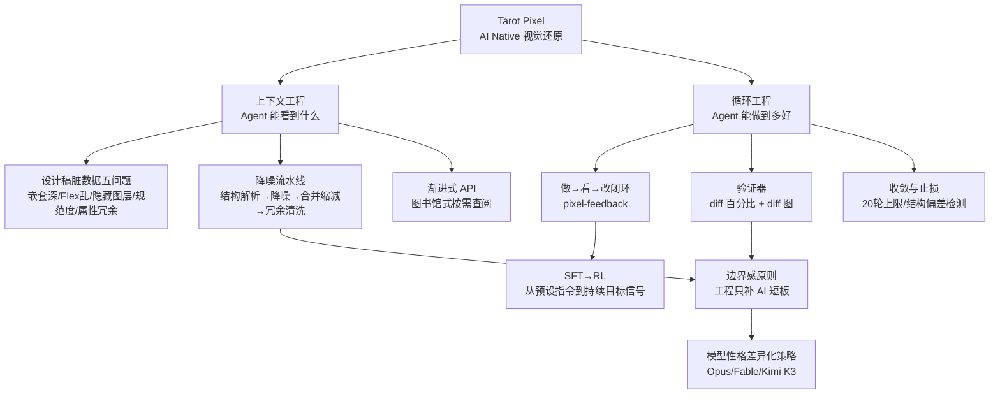

## 📋 文章信息

- **来源**: 微信公众号 - 阿里技术（阿里妹导读）
- **作者**: 陆幼祥（那达）
- **发布时间**: 2026年8月28日
- **阅读链接**: [原文](https://mp.weixin.qq.com/s/cEqRXbamIofa0W93sMVtYg)

---

## 🎯 核心摘要

这是 Tarot Pixel（一个让 Coding Agent 自己看懂设计稿、而非替它写代码的系统）三个月迭代后的复盘。作者从一份"混乱设计稿"翻车出发，发现 Agent 视觉还原失败的根源不在提示词或模型能力，而在上下文被设计稿的"脏数据"填满。团队用一个月 50+ 次提交建了一条降噪流水线，把节点深度从 8-12 层压到 3-5 层、API 调用减半；但上下文干净后输出仍不稳定（注意力涣散），于是引入 Loop Engineering（循环工程）：在 Skill 中内置"做 → 看 → 改"闭环，用像素级 diff 作为可量化的目标信号驱动收敛。全文的落脚点是一条 AI Native 边界原则：工程只补 AI 的短板，AI 已胜任的领域不侵入，且这条边界随模型进化而移动。

## 📊 核心观点

### 1. Agent 翻车的第一嫌疑人是上下文里的"脏数据"，不是模型

**背景/现状**：
- 一份真实业务设计稿让 Agent 彻底暴露问题：关键区域元素缺失/偏移、不可见图层被还原出来、10 分钟的模块跑了 30 多分钟
- 团队最初反复调整 Skill 提示词，几乎无改善

**核心论述**：
- 设计稿存在五个结构性问题：层次嵌套过深（一个"价格"文字被 8 层空分组包裹）、Flex 布局声明与子节点实际尺寸语义不一致、大量隐藏图层（历史版本穿透了原有 5 层深度降噪防线）、图层规范度问题（"价格字体"宽 156px 但实际文字只需约 100px，对齐语义不明）、属性冗余（父子节点重复白色背景）
- Agent 查阅设计稿本质是在一棵树上做检索：树越深 API 调用越多、节点越冗余噪音越多、结构越混乱语义推断越难——"不是 Agent 不够聪明，而是图书馆管理得不够好"

### 2. 上下文工程的深水区：在信息到达 Agent 之前治理源头数据

**背景/现状**：
- 此前对上下文工程的理解停留在"信息如何分层暴露给 Agent"
- 一个月 50+ 次提交，绝大多数不是加功能，而是降噪

**核心论述**：
- 插件侧建立多阶段降噪流水线：结构解析（蒙版/矢量/坐标归一化）→ 降噪（深度裁剪、不可见图层清除、伪 Flex 矫正）→ 合并缩减（装饰单元合并）→ 冗余清洗（跨节点重复背景色、无效圆角描边）
- 降噪不改变渲染效果，但平均节点深度 8-12 层 → 3-5 层、不可见节点占比 ~35% → 0%、单模块 API 调用 15-25 次 → 5-10 次、耗时 30+ 分钟 → 10-15 分钟
- 关键取舍：曾想预计算布局上下文（"这里用 Flex，gap 12px"），测试发现模型布局推断已经够用，预计算是多余的——**工程应该补足 AI 的短板，而非侵入 AI 已经胜任的领域**

### 3. 上下文干净 ≠ 一次做对：从 SFT 式指令转向 RL 式目标信号

**背景/现状**：
- 降噪后复杂设计稿输出仍不稳定：同样的 Skill 跑两次结果质量不同；用户一指出 Agent 几乎总能立刻改对——说明是注意力没聚焦，不是不会做
- 降噪解决了信息的"纯度"，没解决信息的"体量"

**核心论述**：
- 三种应对方式的类比：写更好的提示词、完成后人工反馈，本质上都是 SFT（监督微调）——指令在执行前固化，覆盖不了执行中的所有情况；给 Agent 持续的目标信号对应 RL（强化学习）——反馈发生在执行之后且每轮更新
- Loop Engineering（循环工程）的基本结构：执行 → 验证 → 反馈 → 修正 → 再执行，目标不是一次做对而是逐步收敛
- 呼应 Karpathy 实验（630 行代码、700 次实验自动优化他调了二十年的模型）：人类在第 12 个实验后就疲劳了，循环不会
- Addy Osmani 的 Agentic 自主性层级将其归为 Level 3（目标驱动自主性），前提是停止条件必须可自动化测量；其提出的运行"契约"六要素（目标、范围、停止条件、证据、升级机制、预算）直接成为 Skill 文档骨架

### 4. 验证器是循环的心脏：pixel-feedback 闭环的设计细节

**背景/现状**：
- Claude Code 团队关于"投入度（Effort）"的解读指出：投入度控制的是模型总共愿意做多少工作；目标信号不精准，投入度再高也是白费
- 没有真正的输出门控，得到的不是循环，而是"Agent 永远在给自己的作业打分"

**核心论述**：
- "做 → 看 → 改"闭环：做（首次实现）→ 看（pixel-feedback 工具取设计稿截图"标准答案"、Playwright 截实现页"答卷"、像素级 diff 图"哪里答错了"）→ 改（读 diff 图和 diff 百分比，双边取证定位偏差，定向修复）直到收敛或 20 轮上限
- 验证器以 diff 百分比为核心指标（确定性算法逐像素比对，而非模型判断"差不多像了"）；element-diff 模块作为储备——Opus 常忽略 diff 图细节时有用，Kimi K3 直接读图就够，且 element-diff 识别不了背景差异、在重复列表中还会产生干扰
- 终止条件双出口：收敛出口（所有红/绿差异可解释 + Task 清单关闭）、止损出口（20 轮上限交人工）；连续两轮 diff 无明显下降视为结构性偏差，应重审思路而非继续微调
- 硬规则：diff 图只用于定位，修改必须以 API 精确数值为准；只改被定位节点，禁止整体重写

### 5. 模型性格与 AI Native 边界感

**背景/现状**：
- 不同模型在循环中表现出截然不同的"性格"，直接影响收敛方式

**核心论述**：
- Opus 思考强但"有主见"（忽略某些 diff、主动纠正设计稿不合理处）；Fable 提升的是"合理的完成度"（在遵循设计稿与代码质量间平衡）；Kimi K3 严格 1:1 复刻、想法少
- 完全复刻有时是"过拟合"——把设计师的 1px 偏差也忠实还原，反而违背设计意图；循环策略要按模型性格定制（对 Opus 用更严验证，对 Kimi K3 加设计意图引导）
- AI Native 思维四条：谦虚（Agent 输出不对先问"我给的信息是否充分"）、耐心（看 thinking 过程定位是执行问题还是上下文引导偏了）、目标驱动（给目标而非指导做事）、边界感（降噪必要因为脏数据模型解决不了；布局推断不必要因为模型够用；边界随模型进化移动，今天的方案明天可能多余）

## 🧠 概念图谱

## 🏗️ 技术架构

### 架构概述

Tarot Pixel 不替 Agent 写代码，而是把设计稿整理成干净、分层、持续在线的视觉上下文（"不建管道，建图书馆"），再由 Coding Agent（Qoder + Kimi K3 / Opus 等）通过渐进式 API 按需查阅并自主实现；Skill 内置 pixel-feedback 反馈闭环，在浏览器链路（Web/PC，Playwright/CDP 截图 + HMR）和真机链路（DX/Muise/Weex，3eye 真机截图）上执行同一个"改代码 → 截图 → diff → 修复"循环直到收敛。

### 核心组件

| 组件 | 职责 | 关键技术 |
|------|------|----------|
| 插件侧降噪流水线 | 把设计师原始图层树转为 Agent 可高效消费的结构化数据 | 深度裁剪、不可见图层清除、伪 Flex 矫正、跨节点冗余清洗 |
| 渐进式 API | 图书馆式按需查阅，Agent 在节点树上自主检索 | 分层暴露、按需加载 |
| pixel-feedback 工具 | 循环的"看"：取标准答案 + 答卷 + diff | 设计稿截图、Playwright 截图、像素级对比 |
| @ali/tarot-pixel-match | 图像对比算法（本身也是用循环开发的） | 差异化优化目标 + 不可见测试集 + steps.md 实验日志 |
| element-diff（储备） | 元素级差异识别 | 依赖模型视觉理解能力，按需启用 |

## 🔑 关键洞察

### 1. 上下文工程的前置化：治理发生在 Agent 看到之前

**分析**：
- 多数上下文工程讨论聚焦"暴露策略"（分层、摘要、检索），本文的增量在于把战场前移到源头数据治理——设计稿的图层树本身就是一份需要数据治理的"脏数据集"
- 这与数据工程的 Garbage In Garbage Out 完全同构：降噪流水线本质是 ETL，五阶段对应抽取转换清洗的精细化版本；对任何上下文源（API 文档、代码库、Schema）都可复用这套思路

### 2. SFT/RL 类比给了"该不该写提示词"一个判断框架

**分析**：
- 提示词优化的天花板不在文笔而在范式：它是执行前固化的指令，天然覆盖不了长尾情况；反馈循环把"人的经验"换成"结果的信号"，让修正发生在系统内而非人身上
- 判断标准因此变得清晰：如果你在反复修补提示词来堵某个案例的漏洞，这通常是该建循环（或该治理上下文）的信号

### 3. 验证精度 = 系统上限

**分析**：
- Addy Osmani 的"验证永远是最终的瓶颈"与本文实践互为印证：diff 百分比让"差不多"变成可测量的数字，Agent 才能自我验证
- 反过来看投入度经济学：目标信号模糊时，高投入度只会烧 token 在来回反复上；先把验证器做精准，投入度才有杠杆

### 4. 工程边界是动态的，要随模型能力移动

**分析**：
- 布局预计算被放弃（模型够用）、element-diff 降级为储备（模型读图变强）——两个案例都说明：为模型已有的能力做工程是负资产
- 隐含的工程纪律是定期"撤销"：今天的降噪规则、验证增强，明天可能整体多余，系统应设计成可拆卸而非耦合

### 5. 用循环开发循环系统本身（自举）

**分析**：
- tarot-pixel-match 图像算法由 AI 循环优化而非算法专家手写；提示词设计三要点（"保持稳定"防顾此失彼、不可见测试集逼泛化、steps.md 留实验日志）本质是把 ML 训练方法论翻译成 Agent 任务设计
- 有趣的观察：不需要定义精确终态，测试用例集足够大就能持续迭代——用例集就是训练数据

## 🚧 不足与局限

### 1. 验证场景有限，泛化能力未证实
- 作者自认降噪与循环策略主要在有限业务场景（电商营销会场类）验证，大规模评测体系（多行业/多设计风格/多技术栈）尚在计划中。

### 2. 关键超参缺少方法论支撑
- 20 轮上限、"连续两轮 diff 无明显下降判结构性偏差"等阈值是经验值，文中未给出标定过程，迁移到其他场景时需要重新试错。

### 3. 效果数据以定性为主
- 降噪前后有量化对比表，但最终视觉还原质量多为"肉眼无限接近交付态"式描述，缺独立的大规模量化评分（如视觉相似度分布、人工评审通过率）。

### 4. 模型性格观察的时效性
- 对 Opus/Fable/Kimi K3 的性格刻画基于特定版本快照，模型迭代后结论可能失效；文中虽承认边界会移动，但未给出持续重评机制。

### 5. 完全复刻 vs 合理还原的评判标准未闭环
- 文章指出"过拟合设计稿"的风险并依赖模型性格（如 Fable 的平衡），但这意味着结果质量部分取决于不可控的模型倾向，缺少显式的"设计意图"校验手段。

## 🔮 延伸思考

### 方向1：验证器投资是 Agent 工程的复利
- 与其无限堆提示词技巧，不如为每个 Agent 场景找一个"diff 百分比"级别的可量化验证器；验证器的精度直接决定系统能收敛到哪，值得作为独立的一等工程资产来建设（版本化、评测化）。

### 方向2：降噪流水线的泛化
- "上下文源的数据治理"可以推广：混乱的 API 文档、无 Schema 的数据库、历史包袱的代码库，都可以有对应的"降噪流水线"（去噪、合并、冗余清洗），让 Agent 检索成本大幅下降。

### 方向3：定时循环与业务指标
- 文中正在探索的方向——基线指标 + 周期性分析/优化/实施/对比——是把 Agent 从"完成任务"推向"持续经营指标"的路径；与目标式循环的区别在于没有终态，只有方向。

### 方向4：模型性格作为调度维度
- 既然不同模型在遵循度、自主性上差异巨大，多模型系统可以按子任务性格匹配路由（复刻型任务给 K3 类、需要纠偏的任务给 Opus 类），把"性格"从干扰变成可编排的参数。

## 💡 实践启示

### 1. 排障顺序：上下文 → 提示词 → 模型

**要点**：
- Agent 输出不对时，第一反应问"我给的信息是否充分、是否有矛盾"，而非"模型不行"；若 Agent 在"猜"，去找它为什么会猜（通常是上下文缺口或矛盾信号）

### 2. 给 Agent 的任务写"契约"六要素

**要点**：
- 目标、范围、停止条件、证据、升级机制、预算；停止条件必须可自动化测量（"diff < X%"而非"更好看"）

### 3. 先建验证器，再堆投入度

**要点**：
- 反馈信号不精准时，提高模型投入度只会放大浪费；把"差不多"翻译成确定性算法的数字，循环才有意义

### 4. 循环要有止损和方向判断

**要点**：
- 设轮次上限；连续无进展时判定为结构性偏差，重审思路而非继续微调；修改只针对被定位的差异，禁止整体重写

### 5. 用实验日志换可追溯的迭代

**要点**：
- 让 Agent 把每轮优化思路和效果写进 steps.md；配合"不可见测试集"防过拟合，把单次任务沉淀为可复盘的实验资产

## 📝 关键金句

> "不是 Agent 不够聪明，而是图书馆管理得不够好。"

> "验证器是循环的心脏。没有一个真正的输出门控，你得到的不是循环，而是让 Agent 永远在给自己的作业打分。"

> "上下文工程提高起点，循环工程保证终点。两者缺一不可。"

> "你能验证到什么精度，系统就能收敛到什么精度。"

> "AI 能做好的事就让 AI 做，做不好的才用工程去帮助。今天的工程方案，可能在明天因为模型进步而变得多余。"

## 🏷️ 标签

上下文工程、循环工程、AI Coding、视觉还原、Tarot Pixel、验证器

---

## 🔗 相关资源

- **拓展阅读**：
  - 原文参考 [1] Karpathy 循环优化实验：https://x.com/hanakoxbt
  - 原文参考 [2][5] Addy Osmani Agentic 自主性层级：https://x.com/addyosmani/status/2072885435312042327
  - 原文参考 [3] Claude Code 投入度（Effort）解读：https://x.com/ClaudeDevs/status/2074900291062034618
  - 原文参考 [4] Claude Code 循环入门指南：https://x.com/ClaudeDevs/status/2074208949205881033
  - 前作《AI Native 的视觉稿还原》（"不建管道，建图书馆"思路的出处）

## 🖼️ 原文关键配图

**设计稿的五个结构性问题**（1.2 节）：

**节点树检索示意**（1.3 节）：

**"做 → 看 → 改"闭环**（4.1 节）：

**两条链路**（4.4 节）：

**架构全景**（5.1 节）：

**还原效果案例**（5.2 节，节点数 245 → 113）：

