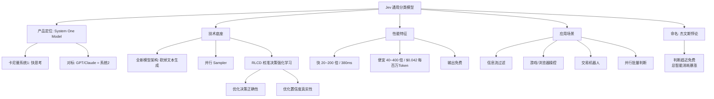

## 📋 文章信息

- **来源**: 微信公众号 - 数字生命卡兹克
- **作者**: 卡兹克
- **发布时间**: 2026年9月18日
- **阅读链接**: https://mp.weixin.qq.com/s/Nj7Y3DXibE28up0SvhJ67Q

---

## 🎯 核心摘要

TypeSafe AI（创始人 Diogo Almeida，前 OpenAI，RLHF/InstructGPT 参与者）在隐身两年后推出 Jev——一个**不会聊天、不会写代码、完全不能生成文字**的大模型，它只做一件事：高频决策判断，是一个通用分类器。它把 GPT 们"努力回答人类"的方向掉转 180 度，去回答"如果最终消费这个答案的只是一段代码呢"。代价换来的是：平均 380ms 的响应（快 20~200 倍）、$0.042/百万 Token（便宜 40~400 倍）、输出免费、支持一次并行回答多个判断题。作者将其定位为卡尼曼《思考，快与慢》里的"系统1"，配合自研 RLCD（面向校准决策的强化学习）让置信度变得真实可信，从而成为 Agent 自动化系统里可执行的"超级 if"。名字取自杰文斯悖论，赌的是：当一次智能判断便宜到接近免费，全世界的智能总消耗会暴涨。

## 📊 核心观点

### 1. 只做判断的模型：把生成能力砍掉，换速度和成本

**背景/现状**：
- 现有大模型（含 JSON Output、Reasoning 模式）做一个"要/不要"的判断可能要十几秒甚至几十秒
- 大量自动化场景（信息过滤、游戏操控、交易）根本不需要长文本，只需要 Yes/No、A/B、继续/停止

**核心论述**：
- Jev 是 2026 年 9 月发布的全新模型，来自 Diogo Almeida（前 OpenAI，RLHF/InstructGPT 参与者）创立的 TypeSafe AI，没有对话和生成能力，是完完全全的通用分类器
- 速度：判断 380ms，打游戏一秒决策 10 次；比传统 LLM 快 20~200 倍
- 成本：$0.042/百万 Token，便宜 40~400 倍；输出 Token 因为太少干脆免费
- 实测案例：Marcel Pociot 的浏览器插件用 Jev 过滤 X 时间线（引战、加密货币、政治争论），命中即折叠；还有玩马里奥（按键判断）、操控浏览器 7 秒查完航班、交易机器人（买/卖判断）

### 2. System One Model：卡尼曼双系统理论的模型产品化

**背景/现状**：
- 现在的 GPT、Claude 尤其各类 Reasoning Model，越来越像一套超强的"系统2"（慢思考：数学证明、复杂代码）
- 但世界上存在海量根本不需要长篇推理的智能任务

**核心论述**：
- Jev 自定义为 System One Model，对应《思考，快与慢》中的系统1：自动的、直觉的快思考（"1+2 等于几"不需要沉思三分钟）
- 人类世界绝大多数东西本质都是决策判断：买不买、格挡还是闪避、Token 用完重置还是摆烂
- 系统1（Jev 式高频判断）与系统2（推理大模型）形成互补而非替代

### 3. RLCD：真正核心不是快和便宜，而是"校准"

**背景/现状**：
- RLHF 优化"人类更喜欢哪个回答"；RLVR 优化"答案能不能被验证"（数学、代码因此大跃进）
- 把 AI 塞进自动化系统，概率必须是有意义的

**核心论述**：
- RLCD（Reinforcement Learning for Calibrated Decisions，面向校准决策的强化学习）优化两件事：决策对不对；模型说"我有 90% 把握"时是不是真的接近 90%
- 可执行的置信度分层路由：>0.90 自动执行；0.7~0.90 交给更强的大模型复核；<0.7 交给人决策
- 支持并行判断：一条新闻可以同时问"是不是 AI 相关？是不是广告？是不是融资？归哪个类？值不值得推？"，一口气全部做掉

### 4. 杰文斯悖论的命名野心：赌智能消耗的总爆发

**背景/现状**：
- 19 世纪蒸汽机效率越来越高，理论上该少烧煤，结果全社会煤炭消费量反而上升
- 效率提高 → 单次消耗下降 → 总消耗暴涨

**核心论述**：
- 模型取名 Jev 正是致敬提出者 William Stanley Jevons，TypeSafe 赌"智能也会发生杰文斯悖论"
- 当一次拥有不错语义理解能力的判断便宜到接近不要钱，会有海量今天不值得智能化的判断被智能化
- 作者由此收束到世界观层面：智能不一定用来生成，也可以只用来判断——这是 Agent 时代被 ChatGPT 的成功掩盖的重要拼图

## 🧠 概念图谱

## 🏗️ 技术架构

### 架构概述

Jev 的架构选择是一次激进的"减法"：去掉自回归文本生成头，把模型全部容量投入到语义理解 + 分类决策上，配合并行 Sampler 实现一次输入多判断并发输出，再由 RLCD 训练保证决策正确性与置信度校准。使用侧则通过置信度阈值把 Jev 嵌入自动化管道，成为大模型系统里前置的路由/守门层。

### 核心组件

| 组件 | 职责 | 关键技术 |
|------|------|----------|
| 模型主体 | 只输出决策/分类，不生成文本 | 全新架构，砍掉生成能力换速度与成本 |
| 并行 Sampler | 一次输入并行回答多个判断问题 | 多判断并发输出，不再逐 Token 生成 |
| RLCD 训练 | 让决策又准又"自知" | Reinforcement Learning for Calibrated Decisions：优化决策正确性 + 置信度校准 |
| 置信度路由（使用侧） | 按置信度分流执行 | >0.90 自动执行；0.7~0.90 大模型复核；<0.7 人工决策 |

## 🔑 关键洞察

### 1. "超级 if" 是 LLM 应用管道里缺失的路由层

**分析**：
- 过去两年 AI 应用的成本痛点多在"用生成式大模型做判断式工作"：分类、审核、路由、筛选都在为不需要的生成能力付钱和等待
- Jev 把这一层抽出来做成专用组件，等于给 Agent 系统补上了 CPU 之外的"门电路"：理解世界，但只输出开关信号
- 作者自己的 AIHOT 管道就是典型架构：Jev 式便宜模型做预筛，贵的大模型做精选——判断与品味分层定价

### 2. 校准概率是进入自动化系统的入场券

**分析**：
- "我有 90% 把握" 是否真的对应 90% 的正确率，决定了概率能否直接映射为执行策略（自动执行/复核/人工）
- 这把模型输出从"文本"升级为"可编程的决策信号"，是对接期望值计算、风控阈值、降级策略的前提
- RLCD 与 RLHF/RLVR 的谱系对照清晰地展示了优化目标的迁移：讨人喜欢 → 答案可验证 → 决策可信赖

### 3. 作者实测透露的选型逻辑：没有全能王，只有分层组合

**分析**：
- 100 道 AI 相关性预筛题：GLM-5.3 Flash 唯一全对但最慢最贵；Jev 准确率第二、显著便宜（受国内网络延迟拖慢了耗时）；Qwen 3.7 Flash 最便宜但准确率差 7 个点"没法用"
- 同事件聚簇判定：Jev 第二准确、因批量大反而速度最快；十题并行的判断任务：Jev 最高准确率 + 最快 + 第二便宜
- 结论：追求精度的分类判断场景 Jev 是当前性价比最优解；但精度天花板仍由大模型持有——工程选型应是组合而非二选一

## 🚧 不足与局限

### 1. 样本与基准单一
- 文中实测均为作者自有任务（100 道预筛题、聚簇判定、并行判断），题量小、领域窄，缺少公开基准与失败案例分析
- 文章是体验驱动的推荐文，对 Jev 的边界条件（长上下文、多语言、对抗样本）没有触达

### 2. 网络与工程现实
- 国内访问延迟明显拉高了 Jev 的实测耗时，"380ms" 的体验依赖网络环境
- 第一代模型，校准性能否长期稳定、是否会随分布漂移退化，尚无数据

### 3. 系统性风险未被讨论
- 错误判断以低成本、高频次、自动执行的方式嵌入管道后，单点错误的放大效应与回滚机制是真实工程问题
- 置信度阈值（0.90/0.70）的设定缺乏方法论支撑，更多是示例值

## 🔮 延伸思考

### 判断成本趋零之后的产品形态
- 杰文斯悖论推演：当每次判断近乎免费，"实时过滤"会从功能变成默认基线——信息流、邮件、代码 Review、客服、风控都会内嵌一个永远在线的判断层
- 游戏 NPC 实时决策、交易系统毫秒级风控、浏览器级个人代理，这些今天因成本不可能的产品会重新成立

### 对 Prompt 工程范式的反噬
- 判定式任务的 prompt 会从"请分析并给出理由"收敛为声明式谓词："命中则 1，未命中则 0，附置信度"
- 判断模型 + 生成模型的组合可能催生新的编排 DSL：路由规则写置信度，生成模型只在被叫到时工作

### 系统1/系统2 的终局组合
- Jev 们负责吞吐量（海量高频判断），Reasoning 模型负责难度（低频深度推理），人负责价值排序
- 真正的变量是两者之间的接口标准：如果置信度成为通用货币，模型间的分工协作可以像微服务一样组合

## 💡 实践启示

### 1. 给信息管道加"预筛层"而不是换更贵的模型

**要点**：
- 审计自己的 AI 工作流里哪些调用本质是判断（分类/过滤/路由），把它们从生成式模型剥离出来
- 采用作者的成本结构：便宜判断模型预筛（剔除无关）+ 贵模型精选（保证品味），中间省下的是数量级级别的成本

### 2. 落地置信度分层路由模式

**要点**：
- >0.90 自动执行、0.7~0.90 交大模型复核、<0.7 交人工——这个三分法可直接作为任何 AI 自动化系统的降级策略模板
- 前提是先验证所用模型的置信度是否校准（说 90% 就真的接近 90%），否则阈值形同虚设

### 3. 把串行提问改造成并行批量判断

**要点**：
- 对同一输入的多个判断需求（相关？广告？分类？推送？）合并成一次并行调用，速度和成本同时优化
- 适合内容审核、标签系统、监控告警分流等高频场景

### 4. 上手路径

**要点**：
- 官网申请：https://typesafe.ai/ （审批较快）
- 急测可用 Vercel 集成平台（已首发接入 Jev）

## 📝 关键金句

> "一个拥有世界知识和语义理解能力的超级if。"

> "智能当然可以用来创造。那，也可以只用来判断。"

> "效率提高，单次消耗下降，总消耗却暴涨，这就是杰文斯悖论。"

## 🏷️ 标签

Jev、分类模型、System One、RLCD、杰文斯悖论

---

## 🔗 相关资源

- **官方入口**: [TypeSafe AI](https://typesafe.ai/)（Jev 资格申请）；Vercel AI 集成平台已首发接入
- **理论源头**: 丹尼尔·卡尼曼《思考，快与慢》（系统1/系统2 双系统理论）
- **命名出处**: 杰文斯悖论（William Stanley Jevons，19 世纪煤炭效率与总消耗的经典悖论）
- **谱系对照**: RLHF（人类偏好）→ RLVR（可验证性）→ RLCD（校准决策）
