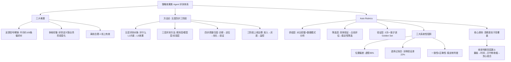

## 📋 文章信息

- **来源**: 微信公众号 - 大淘宝技术
- **作者**: 叱干、王菲（淘天集团业务技术-营销&交易技术团队）
- **发布时间**: 2026年9月18日
- **阅读链接**: https://mp.weixin.qq.com/s/gOCMe2lrO8PFGfZoKhUmfA

---

## 🎯 核心摘要

策略效果类 Agent（商品营销策略生成）规模化后，真正的难题不是"能不能生成策略"，而是质量如何持续保证：反馈信号稀缺（半个月仅约 100 条偏好对）、评估是多维权衡、离线合理不等于线上有效。淘天团队提出**"五层、四步、三阶段"方法论**：五层评测对象（Prompt 约束→业务效果）回答"评什么"，四步质量归因（诊断→定位→优化→验证）解决"评完怎么办"，三阶段上线治理（准入→灰度→监控）回答"如何上线"。针对最难的对齐问题，他们用 **Auto Rubrics**（从偏好对数据自动挖掘评估规则）+ 三层筛选架构构建可解释的业务效果 Judge，并诚实复盘了 LLM-as-Judge 的三大系统性陷阱——位置偏差制造过 96% 的虚假准确率、选择过拟合让换一批样本就选出完全不同的规则、"稳定地判错"比不稳定更危险。全文最有价值的一句忠告：**评估器本身也需要被评估**，未经校准的 Judge 带来的虚假信心，比没有 Judge 更危险。

## 📊 核心观点

### 1. 策略效果类 Agent 的评测，本质不是判断对错，而是"谁更值得上线"

**背景/现状**：
- 问答、摘要、代码类 Agent 的输出是可静态判定的"答案"；策略类 Agent 的输出是进入真实业务执行、影响大盘指标的策略配置
- 输入每天刷新（效果数据、预算约束、historyBest 帕累托最优策略、实验桶数据），输出没有唯一标准答案
- 线上 A/B 实验资源极稀缺：每天 3 组对照、T+1 收数据，半个月仅约 100 条偏好对

**核心论述**：
- 三大难题：反馈信号稀缺且延迟；"好"的定义随业务阶段变化（ROI/GMV/访购率/预算安全的优先级不固定）；离线评估合理不等于业务线上有效
- 因此评测不能套用传统测试范式，也不能简单"LLM-as-Judge 打个分"——它要回答该评什么、怎么评、怎么把离线判断和线上效果建立连接

### 2. 五层、四步、三阶段：把评测从静态判断变成动态闭环

**背景/现状**：
- 一个策略类 Agent 出错，根因可能散布在 Prompt 约束、经验召回、工具调用、策略推理、线上效果任一层，失败模式、优化动作、责任方都不同

**核心论述**：
- **五层评测对象**回答"评什么"：L1 Prompt 约束 → L2 知识/经验召回 → L3 工具执行 → L4 策略推理 → L5 业务效果；层级间存在级联风险（L1 不稳定则 L2-L5 的结果都不可信），单层通过率会掩盖结构性问题
- **三层评测方法**按确定性分工：规则层拦截硬错误（字段合法、预算越界可 100% 自动化）、模型层判断策略合理性（校准过的 LLM 评估器）、实验层验证业务效果（任何离线评分无法替代）
- **四步质量归因**：分层诊断（先定位哪层异常，总分会掩盖结构性问题）→ 根因定位（同为推理层低分，根因可能是约束冲突/召回不准/工具异常/Judge 过拟合）→ 路由优化（不同根因进不同通道）→ 回归验证（不闭环的优化不算完成）
- **三阶段上线治理**：准入（门禁）→ 灰度（对照桶/实验桶/稳定性验证桶三桶并行，稳定性桶跑旧版本策略，用于区分"策略问题"和"环境噪声"）→ 监控（数据回流归因闭环）

- **评测数据集**按失败模式覆盖而非数量：常规/回归/Bad Case 集是上线最低门槛，边界对抗/红队/安全集二轮补充，**Judge 验证集专门监控评估器自身退化**——文中实测某版 Rubric Judge 准确率从测试集 86% → 验证集 68% → 泛化验证集 55% 的逐级衰减

### 3. LLM-as-Judge 的三个系统性陷阱（全文最有含金量的部分）

**背景/现状**：
- 团队用 LLM 对比 good case / bad case 来筛选有判别力的 Rubric，第一次实验训练集准确率高达 96%

**核心论述**：

- **位置偏差（虚假的 96%）**：chosen 恒放 A 位、rejected 恒放 B 位，LLM 学到的不是"哪个更好"而是"A 总是更好"。做 50/50 train-val 分割后验证集准确率仅 50%——与随机猜测无异。引入 A/B 位置随机化后训练准确率回落到 69.3%，"数字更低了，但这才是真实的信号"
- **选择过拟合**：从 330 条候选中贪心选出 9 条（69.3%），但 Stability Selection 诊断显示 200 次 Bootstrap 子采样中**没有任何一条规则选中频率超过 80%**（最高仅 30-40%）——换一批偏好对就会选出完全不同的组合；5-Fold 交叉验证暴露训练/验证准确率差距高达 22%（78% vs 56%）
- **一致性 ≠ 正确性**：三个模型 3 轮独立验证中，model A 一致率 16.7%（结论随 seed 反转）；model B 一致率高达 80% 但投票准确率仅 55%——**它在稳定地判错**，只看一致性会得出"很可靠"的错误结论；model C 在 3 轮一致时 100% 正确——多轮一致性可以作为天然的置信度过滤器

### 4. Auto Rubrics：用可解释规则替代黑盒 RM，用"高精度优于高覆盖"换可信

**背景/现状**：
- 训练 Reward Model 打分的路线局限明显：冷启动依赖大量标注、黑盒不可解释、换场景要重训、规则变化难响应
- 直接让业务同学打分的方案有三个根本问题：分数有天花板、业务目标一变整套失效、Judge 无法在上线前还原依赖线上指标的分数

**核心论述**：
- **范式转换：从"打分"到"比较"**——把分数回归转化为二元偏好判断（chosen/rejected），构建 DPO 偏好数据集
- **三层架构**：供给层（Rule Miner 从偏好对挖隐性规则 + 数据统计分析先行防 LLM 编造，1500+ 条语义去重到约 44 条）→ 筛选层（三方案递进：双侧违反率验证解决方向问题 → 比较评估 + 位置交换一致性把自我判断一致率从 46% 提升到 84% → Stability Selection + 5-Fold 交叉验证贪心解决泛化问题）→ 验证层（3 次独立判断 + 位置随机化，仅 3 次一致且方向正确的偏好对进入 Golden Set 供 DPO 训练）
- **同一方法论延伸到策略收敛判断**：四层漏斗（量级过滤砍九成 → 时间一致性再砍八成 → 贝叶斯收缩评分，数据少则向行业均值收缩 → 贪心组合验证，像投资组合一样让个体噪声相互抵消）；与 Rubric 筛选复用同一原则——**高精度优于高覆盖，宁可覆盖率低，也不让不可信的数据混进来**

## 🧠 概念图谱

## 🏗️ 技术架构

### 架构概述

整个体系是一条"从业务目标出发、经过多层质量判断、最终驱动 Agent 持续优化"的闭环链路：五层评测对象把问题拆到可定位的层次，三层评测方法按确定性分工，评测数据集按失败模式覆盖；发现的异常经四步归因路由到 Prompt/数据/算法/经验库四条优化通道，回归验证闭环后经三阶段治理上线，线上数据再回流。Auto Rubrics 是其中离线-线上对齐的核心组件。

### 核心组件

| 组件 | 职责 | 关键技术 |
|------|------|----------|
| 五层评测框架 | 把"Agent 出错"拆解到 Prompt/召回/工具/推理/效果五层 | 层间级联风险分析，避免总分掩盖结构问题 |
| 三层评测方法 | 规则层判对错、模型层判合理性、实验层判效果 | 按问题可客观验证程度分工 |
| 四步质量归因 | 异常 → 根因 → 优化通道 → 回归 | 分层诊断 + 路由优化 |
| 三阶段上线治理 | 准入门禁、灰度放量、线上监控 | 对照/实验/稳定性三桶设计分离环境噪声 |
| Auto Rubrics | 自动挖掘、筛选、验证评估规则 | Rule Miner + Stability Selection + 5-Fold CV + Golden Set |
| 收敛判断漏斗 | 判断策略何时可固定不再迭代 | 量级过滤、时间一致性、贝叶斯收缩、贪心组合验证 |

### Auto Rubrics Pipeline（7 步）

Step 0 数据模式分析（先让数据说话，注入客观统计规律防 LLM 编造规则）→ Step 1 多轮采样生成（8 轮 temperature=0.9，产出 1500+ 候选）→ Step 2 语义去重（压缩至约 44 条）→ Step 3 交叉验证（每条 Rubric × 每组偏好对，保留跨样本泛化的）→ Step 5 端到端验证 → Step 6 Memory 增量更新（active/degraded/remove/recover 四态演化，版本快照可回溯）→ Step 7 运行报告。

## 🔑 关键洞察

### 1. 评测的第一性原理：先问"这是 Agent 问题还是结构性问题"

**分析**：
- 线上异常进入归因的第一个判断不是"Agent 哪里错了"，而是"所有实验桶下同一商品都持续劣化 → 结构性问题（环境/数据/大盘）"，误归因为模型能力不足会让优化动作完全打偏
- 稳定性验证桶（跑旧版策略）是精妙的设计：它把"实验环境噪声"从"策略质量"里剥离出来，避免大促/货盘变化期间的误熔断
- 这本质是把因果推断（对照组思维）内建到评测基础设施，而不是靠人的经验

### 2. "评估器也需要被评估"是 LLM 评测的元问题

**分析**：
- 文中三处证据链完整：Judge 准确率 86%→68%→55% 的分布漂移衰减；96% 假准确率来自实验设计缺陷；model B 的高一致性掩盖低正确率
- 解法不是追求更强的 Judge，而是给 Judge 建立独立的验证体系：Judge 验证集、多轮一致性过滤（model C 模式：3 轮一致时 100% 正确）、与人工/业务专家判断定期对齐
- 对所有用 LLM-as-Judge 做自动化的人都是直接警告：你的 Judge 可能正在"稳定地判错"，且分数越高你越不会怀疑它

### 3. 高精度优于高覆盖：贯穿两个不同问题的同一原则

**分析**：
- Rubric 筛选（容忍部分偏好对无法判断）和策略收敛判断（容忍大量商品不进 Clean Set）表面无关，背后同构：稳定性筛选 + 贪心组合验证
- 这与上一篇文章 Jev 的"校准置信度"惊人地呼应——都在把"输出可信度"变成系统的可编程属性：多轮一致性≈天然的置信度过滤器
- 落地含义：评测数据宁缺毋滥，Golden Set 的价值在精确而非规模

### 4. 从"打分"到"比较"是被低估的范式转换

**分析**：
- 绝对打分有三个死结（天花板、目标漂移、上线前不可得），二元偏好判断全部绕开：A/B 指标对比在实验结束后即可获得，且天然适配 DPO 训练
- "哪个更好"对模型和人类都远比"这个几分"更稳定——文章数据：绝对判断一致率 46% → 比较判断 84%
- 这与 RLHF 偏好对的底层逻辑一致，但用在了评测器构建侧

## 🚧 不足与局限

### 1. 数据规模的天花板
- 全文实验建立在约 100 条偏好对/半月 的极小数据量上；Stability Selection 本身需要足够样本支撑，Bootstrap 子采样的置信区间在百条量级下仍然很宽，文中未给出置信区间

### 2. 泛化性证据有限
- 文中承认核心难题"离线合理≠线上有效"只是缓解未解决；筛选出的约 10 条强规则跨业务品类（文中背景是复制到更多品类）是否仍然强，没有给出迁移数据
- 与人工/业务专家判断的一致性只提及"需要验证"，未给出量化对齐结果

### 3. 工程成本被轻描淡写
- 每 330 条 Rubric × 每组偏好对 = 一次 Judge 调用，加 200 次 Bootstrap × 贪心 × 5-Fold 交叉验证，筛选层计算成本可观；文中的 44 条、170+、330 条等数字在不同章节口径不完全一致（去重前后），阅读时需自行对齐

## 🔮 延伸思考

### Judge 的元验证会成为一个独立工程领域
- 当 LLM-as-Judge 成为评测基础设施，"Judge 的持续校准"（类似模型监控的 drift detection）需要专门的系统：验证集、一致性抽检、与人工锚点定期对齐
- 多轮一致性作为置信度过滤器的思路，与上一本精读的 Jev（校准置信度分层路由）殊途同归——可信度分层（高置信自动执行、低置信交人工/强模型复核）正在成为 AI 系统通用模式

### Auto Rubrics 是"经验数字化"的通用模板
- 从偏好对中挖掘"心知肚明但从未写下来"的隐性规则，本质是把业务专家的判断力沉淀为可执行的自然语言规则库
- 该模板可迁移到任何有隐性经验的领域：内容审核、客服质检、代码 Review、投资决策——只要有好/坏样本对，就能启动 Rule Miner

### 评测体系与 RSI（递归自我改进）的关系值得追踪
- 团队介绍中提到以 RSI 为核心技术主线；评测体系正是自改进飞轮的"损失函数"——没有可信评测，自我改进就是自我欺骗
- 五层框架中 L1 Prompt 与 L4 推理的解耦，为"改进哪一层"提供了路由依据，这是 Agent 自迭代的前提设施

## 💡 实践启示

### 1. 给自己的 LLM 评测加"防伪三层"

**要点**：
- 任何 Pairwise 对比评测必须做 A/B 位置随机化（最低要求），严格场景做双向评估取一致结果
- 汇报评测准确率时强制附 train-val 分割或交叉验证结果——训练集准确率什么都不说明
- 给 Judge 建独立验证集，监控其准确率随数据分布变化的衰减

### 2. 把评测问题按确定性分流

**要点**：
- 能写规则的（字段合法、越界、格式）不要用 LLM——规则层 100% 可靠且零成本
- 需要推理判断的才上 LLM Judge，且要校准；只有真实业务指标能回答的（ROI/GMV）老老实实跑实验
- 别用 LLM 判断正则能判断的事，也别用离线分数预测线上效果

### 3. 用"偏好对"而不是"分数"积累评测资产

**要点**：
- 业务目标的定义会变，但"A 比 B 好"的相对判断可以长期复用，且直接服务 DPO 训练
- 每次线上实验都是一次偏好对积累机会，从第一天就结构化沉淀（输入、双策略输出、指标对比）

### 4. 小数据场景照抄"稳定性筛选 + 贪心组合"

**要点**：
- 规则/特征/样本筛选一律用 Bootstrap 子采样看选中频率，频率低的就是在拟合噪声
- 单个结论不可信时做组合验证（逐个加入、整体达标才保留），个体噪声在组合层面对冲

## 📝 关键金句

> "评测的目标不是衡量指标绝对值，而是衡量策略相对于基准的增量贡献。"

> "训练准确率什么都不说明；交叉验证是最低要求，稳定性筛选是更强的保障。"

> "一个未经校准的 Judge 带来的虚假信心，比没有 Judge 更危险。"

## 🏷️ 标签

Agent评测、LLM-as-Judge、AutoRubrics、稳定性选择、偏好对

---

## 🔗 相关资源

- **主题关联**: 前一篇精读《Jev 只会做选择题的通用分类模型》——置信度校准与多轮一致性过滤的思路在此文再次出现，两篇互为印证
- **方法源头**: Stability Selection（Meinshausen & Bühlmann）、5-Fold 交叉验证、贝叶斯收缩（Empirical Bayes）、DPO（Direct Preference Optimization）
- **理论背景**: 位置偏差（Position Bias）是 LLM-as-Judge 文献（如 MT-Bench、Judging LLM-as-a-Judge）中的经典系统性偏差
- **同厂延伸**: 淘天团队以 RSI（递归自我改进）为技术主线，评测体系是其自迭代飞轮的质量底座
