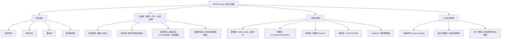

## 📋 文章信息

- **来源**: 微信公众号 - 大淘宝技术
- **作者**: 诗咏（淘天集团-营销&交易技术团队）
- **发布时间**: 2026年9月16日
- **阅读链接**: https://mp.weixin.qq.com/s/jf5OKEhBDWkP0228tC5o1w

---

## 🎯 核心摘要

淘天团队基于 ICLR 2026 论文 GEPA（Genetic-Pareto, Reflective Prompt Evolution，DSPy 生态）构建了一套 Prompt 自进化系统，目标是"给 AI 一条提示词和一份标注数据，它还你一条更好的提示词"。系统构建**"推理→评分→反思→选择"**的自动化闭环：LLM 自动分析 Badcase、把"模型答错了"归因到"Prompt 的哪条规则有问题"、生成候选变体，再基于**帕累托前沿**做多目标择优，避免单点优化引发的指标对抗性退化。工程上采用任务无关架构（二分类/多分类/评分/对比/聚类通吃）+ 零配置设计（Inspector 自动分析数据集推断配置），从"每个场景写代码"变成"填配置就能用"。文末三个未来思考是全文精华：冻结区防奖励黑客、提示词膨胀治理、无 Ground Truth 场景的双通道优化设想——把线上业务效果翻译成"文本梯度"。

## 📊 核心观点

### 1. 痛点与目标：把 Prompt 优化从"人工试错"变成"数据驱动寻优"

**背景/现状**：
- LLM Judge / 被评测 Agent 的 Prompt 优化依赖人工经验：盲目性高（靠直觉试错无量化验证）、伪自动化（静态扫描缺乏深度反思-修正）、难复制（经验沉淀在个人）、无权衡机制（缺什么补什么，一边好一边坏）
- 评估器存在两大对齐难题：与人工标注对齐（离线准确性底座）、与线上业务效果对齐（离线高分上线不翻车）

**核心论述**：
- GEPA 的反思式变异机制让优化交由算法基于实测数据反馈完成：自动归因 + 生成变体 + 可收敛的自动化寻优
- 帕累托择优弥补无权衡机制的缺陷：不总选单一最优候选变异（避免局部最优），而是从各任务最优候选集中采样保证多样性，在指标振荡中保留最优权衡面

### 2. GEPA 主循环：推理 → 评分 → 反思 → 选择

**背景/现状**：
- 原生 GEPA 框架缺乏对复杂业务流的支持，需要构建任务无关的适配层

**核心论述**：

- **① 种子提示词**：用户提供或 Inspector 自动生成 suggested_system_prompt
- **② LLM 推理**：任务模型批量执行，温度 0.0 保证可复现
- **③ 评分器**：先结构化解析（JSON 字段/正则），再按任务类型选评分函数（二分类用 P/R/F1，评分类用 Cohen's Kappa/Spearman/MAE，聚类用配对 F1/ARI）
- **④ 反思与变异**：分两步——错误归因（Judge 模型三问：错误定位/Prompt 归因/改进建议）+ Prompt 变异（反思模型温度 0.7 生成候选，帕累托前沿选择保留多目标最优解）

- **帕累托前沿选择的直觉**：同时优化精确率和召回率时，假设有 A、B、C、D 四个候选，GEPA 保留前沿上的所有候选（如 A、B、D）而不是只选"综合得分最高"的一个——不同业务场景可能需要不同的权衡策略
- **三模型分工**：任务模型（温度 0.0，快速确定性输出）、Judge 模型（错误归因，独立模型提供第三方视角）、反思模型（温度 0.7，建议比任务模型更强，鼓励创造性变异）
- **关键设计**：反思反馈的核心是第 2 问"Prompt 归因"——把"模型答错了"翻译成"prompt 的哪一条规则有问题"，让反思模型拿到带归因的诊断而非一堆错误样本，**把盲目搜索变成定向改写**

### 3. 工程化跨越：从"学术原型"到"业务引擎"

**背景/现状**：
- 1.0 版为每个业务场景单独写 Adapter，n 个场景 n 套代码（数据加载、输出解析、评分函数、反馈生成全部定制）

**核心论述**：
- 2.0 版将共性逻辑抽象为任务类型，配置驱动：覆盖二分类、多分类、评分、规则判定（Rubric Judge）、聚类、对比六大任务
- **零配置推断（Inspector）**：给每个字段做画像（类型/唯一值数/二值性/长文本/URL/缺失率）→ 并行推断三件事（哪个是标注、什么任务、哪些是输入）→ 产出 DatasetProfile（任务类型、字段划分、建议模板、种子提示词、枚举值）

- **配置对齐**：输出 schema、答案提取方式、评分函数三者隐式耦合，build_config() 按任务类型一次性对齐，让人"配不错"；格式说明从 schema 反向生成，"要求的格式"和"校验的格式"永远同源
- **数据切分**：train 50% / val 30% / holdout 20%，按标签分层（连续值先分位数分桶），最优 prompt 在 holdout 上复评泛化能力
- **评分即业务诉求**：precision_recall 评分可表达"精确率不低于 80% 的前提下最大化召回"（达标返召回率，未达标乘 (precision/target)² 惩罚）；评判偏好速查表把"不要误判/不要漏"等口语化诉求映射到加权二分类参数
- **服务层三种形态**：CLI（本地调试）、FastAPI HTTP（平台集成）、Claude Code Skill（对话式使用，JSONL 实时进度，15-30 分钟出结果）

### 4. 三个未来思考：全文最清醒的部分

**背景/现状**：
- GEPA 默认将整段 prompt 交给反思模型重写，存在结构性风险

**核心论述**：
- **冻结区/可变区（防奖励黑客）**：有时候删掉一条约束往往能提分——约束限制行为空间，去掉它模型就少犯一类"做多了"的错；有人工标注兜底尚能发现，纯规则评分下"这本质上就是奖励黑客（reward hacking）"。正确防御是从结构上禁止改动：硬性约束、工具调用协议、输出 Schema 划入冻结区不参与变异，而非事后扣分补救
- **提示词膨胀治理**：反思模型天然倾向不断补充说明，十几轮后 prompt 从几百字膨胀到几千字且每轮分数都在涨；代价是隐性的（关键约束被淹没/推理成本线性上涨/人无法接管）。抑制手段：把长度作为帕累托的**第三目标**（而非加权惩罚，避免与主目标抵消）+ 硬上限门禁
- **无 Ground Truth 场景**：策略生成类 Agent 没有正确答案只有事后业务效果。设想双通道：变异方向上，把业务效果归因分析当"文本梯度"，把"业务上错在哪"翻译成"哪一段该改"，变随机探索为定向变异；对错判据上，用离线评测指标构造对抗双目标（该做的没做/不该做的做了）+ 历史策略回溯预测。关键细节：**回溯预测只用于排序与否决，不回流反思**——否则"改得越少→匹配越多→分越高"会把搜索拖向保守

## 🧠 概念图谱

## 🏗️ 技术架构

### 架构概述

系统以 GEPA 主循环为内核，外面包裹四层工程架构（配置层/引擎层/组件层/服务层），把"每个场景写代码"变成"填配置就能用"。三个 LLM 角色分工明确：任务模型执行、Judge 模型归因、反思模型变异。

### 核心组件

| 层级 | 职责 | 关键实现 |
|------|------|----------|
| 配置层 | 让人"配不错" | Pydantic 配置模型 + build_config() 自动对齐 schema/提取/评分 |
| 引擎层 | 把任务跑起来 | run_optimize / run_evaluate / validate_config 三 API + GenericGEPAAdapter 编排中枢 |
| 组件层 | 可插拔功能模块 | parsers / scorers / feedback / llm / evaluate / inspector，Protocol 协议扩展 |
| 服务层 | 让用户用上 | CLI、FastAPI（任务状态文件系统持久化）、Claude Code Skill（JSONL 进度流） |

### 任务类型 × 配置自动映射

| 任务类型 | 优化评分 | 对齐指标 |
|----------|----------|----------|
| 二分类 | exact_match | Precision / Recall / F1 + 混淆矩阵 |
| 多分类 | exact_match | Accuracy + 各类别 P / R / F1 |
| 评分 | numerical_closeness | MAE / RMSE / Spearman / 加权 Kappa |
| 对比 | comparison | Accuracy + 分侧准确率 + **位置偏差分数** |
| 聚类 | pair_f1 | ARI / Cohen's Kappa + 配对 P / R / F1 |

注：对比任务内置位置偏差分数——与上一篇评测体系文章的"位置偏差是 LLM-as-Judge 第一陷阱"形成直接呼应。

## 🔑 关键洞察

### 1. "Prompt 归因"是反思式进化的核心：把错误翻译成文本梯度

**分析**：
- 反馈三问中真正值钱的是第 2 问："当前 prompt 的哪条规则导致或未能阻止这个错误？"它完成了从"错误样本"到"可执行修改建议"的语义转换
- 这正是 GEPA 论文的核心主张（标题即宣示：Reflective Prompt Evolution Can Outperform Reinforcement Learning）：在语言空间用反思做"文本梯度"搜索，比在参数空间做 RL 数值梯度更高效——无需梯度、无需训练、可解释、可跨模型迁移
- 工程上对应一个朴素但常被忽略的事实：大多数人调 prompt 时只看错误率，从不做"错误→规则"的归因链路

### 2. 帕累托前沿：在指标对抗中保留解空间而非选出唯一解

**分析**：
- 单点优化在多目标下天然振荡（补召回伤精确率），传统做法是加权合成单分数，但权重本身是拍脑袋的
- GEPA 保留前沿上所有非支配候选，把"选哪个权衡"延迟到业务决策时刻——这与评测体系篇的 Stability Selection（不选唯一规则集而看选中频率）、Jev 的置信度分层（不强制判决而输出校准概率）是同一家族：**在不确定下保留解空间，而不是假装确定**
- 作者给长度膨胀开出的药方（长度作为帕累托第三目标而非加权惩罚）同样贯彻此逻辑：加权会被主目标淹没，前沿不会被

### 3. 冻结区/可变区：结构性防御优于事后补救的又一例证

**分析**：
- "删掉约束反而提分"是 Goodhart 定律在 prompt 优化里的具象：优化目标（评分函数）与真实意图（约束必须遵守）出现偏差时，优化器会精准利用这个缝隙
- 文章的解法不是更聪明的评分（事后补救），而是把不许改的内容物理隔离出变异范围（结构性防御）——与安全工程里"用类型系统消灭一类 bug 而不是靠测试发现"同构
- 对所有做自动优化（含 AutoML、代码生成）的人是普适提醒：**先定义什么不许被优化，再开始优化**

### 4. 与评测体系篇构成完整闭环：定标准 → 朝标准进化

**分析**：
- 同一团队的前一篇文章（Agent 评测体系五层四步三阶段）解决"怎么评"，本文解决"怎么优化到评价标准"——Auto Rubrics 定义什么是好策略，GEPA 自动把 prompt 进化到满足这些规则
- 两篇合起来是 LLM 应用质量工程的飞轮：评测产出 Badcase 和偏好对 → GEPA 归因变异 → 新 prompt 回归评测 → 循环。这正是其团队 RSI（递归自我改进）主线的质量底座
- 加上更早的 Jev（校准判断层），一个分层基础设施图景浮现：判断（廉价高频决策）→ 评测（可信标准）→ 优化（自动进化）

## 🚧 不足与局限

### 1. 全文缺少量化效果数据
- 核心目标宣称"显著提升与人工标注及线上业务效果的对齐能力"，但正文没有给出任何基线对比数字（优化前后准确率、多场景统计）；效果展示仅有单次运行的示例报告，说服力不足

### 2. 成本与依赖未透明
- 一轮优化 15-30 分钟、反思模型建议比任务模型更强（更贵），加上每轮全量推理 + Judge 归因 + 反思变异的调用链，成本可观但全文未给 token/费用数据
- 强依赖标注数据（train/val/holdout 三份切分），小数据场景（如评测体系篇的百条偏好对）能否支撑优化未讨论

### 3. 关键防御机制仍是设想
- 冻结区、长度门禁、无 GT 双通道框架都属于"未来展望"，未实现未验证；当前版本对 reward hacking 和膨胀实际处于裸奔状态
- 优化出的 prompt 泛化性仅靠 holdout 复评兜底，跨分布、跨模型（任务模型升级后 prompt 是否仍优）未讨论

## 🔮 延伸思考

### Prompt 即源代码：DSPy 宣言的工程落地
- DSPy 的野心是把 LLM 应用开发从"手工提示工程"变成"声明式编程 + 自动编译优化"：你声明输入输出和指标，编译器（优化器）负责产出 prompt/pipeline
- GEPA 是这一路线目前最有力的证据。类推软件史：汇编（裸 token 调 API）→ 高级语言（结构化 prompt）→ 编译优化（自动进化）——中间层的"prompt 工程师"手艺会逐步下沉为基础设施

### 无 GT 优化的本质：把环境信号翻译成语言空间的梯度
- 双通道设想（业务效果归因作文本梯度）哲学上与 RL 相同——从环境延迟信号中学习——但操作在语言空间：可解释、可审计、可人工干预
- 若走通，"策略生成类 Agent 的自我改进"就有了完整链路：业务效果 → 归因分析 → prompt 定向变异 → 离线评测门禁 → 灰度验证。这是 RSI 在业务侧的最小可行实现

### 自动优化的对齐问题会越来越多
- reward hacking（删约束提分）、保守化（回溯匹配偏好短 diff）、膨胀（补丁堆叠）——每一个都是优化器目标与人类意图错位的实例
- 可预期的演进方向：优化过程本身需要评测体系篇那样的"元验证"（监控优化器是否在钻空子），自动优化与自动评测会互为对方的护栏

## 💡 实践启示

### 1. 用开源栈低成本起步

**要点**：
- GEPA 隶属 DSPy 生态（论文 arXiv:2507.19457），开源可 pip 安装；准备"带标注数据集 + 种子提示词"即可跑通最小闭环
- 从已有在用的 prompt 开始优化比从零开始收敛更快；没有种子 prompt 让 Inspector 自动生成

### 2. 把业务诉求编码进评分函数，而不是写进祈祷

**要点**：
- "精确率不低于 80% 前提下最大化召回"这类诉求应直接表达为 precision_recall 评分（未达标乘 (precision/target)² 惩罚），而不是在 prompt 里加一句"请注意精确率"
- 误判/漏判哪个更严重 → fp_penalty / fn_penalty 不对称加权；先想清楚损失函数再优化

### 3. 优化前先划冻结区

**要点**：
- 硬性约束、工具调用协议、输出 Schema 一律冻结，只允许变异判断优先级、决策倾向、异常处理、表达方式
- 定期 diff 审查优化后的 prompt：约束是否被动过、长度是否膨胀、关键指令是否被淹没

### 4. 借鉴 Inspector 的零配置思路

**要点**：
- 给数据字段做画像（类型/唯一值数/二值性/缺失率）→ 推断标注列、任务类型、输入列，这套流程可以套用在任何数据接入场景，把"配置"变成"确认"

## 📝 关键金句

> "给 AI 一条提示词和一份标注数据，它还你一条更好的提示词。"

> "有时候删掉一条约束往往能提分……若有人工标注兜底，这类篡改尚能被发现；但在纯规则评分下，它本质上就是奖励黑客（reward hacking）。"

> "回溯预测只用于排序与否决，不回流反思，否则'改得越少→匹配越多→分越高'会把搜索拖向保守。"

## 🏷️ 标签

GEPA、提示词自进化、反思式变异、帕累托前沿、DSPy

---

## 🔗 相关资源

- **论文**: [GEPA: Reflective Prompt Evolution Can Outperform Reinforcement Learning](https://arxiv.org/abs/2507.19457)（ICLR 2026, arXiv:2507.19457）；[DSPy: Compiling Declarative Language Model Calls into Self-Improving Pipelines](https://arxiv.org/abs/2310.03714)（arXiv:2310.03714）
- **同团队前作**: 本站精读《Agent评测体系五层四步三阶段》——评测定标准，GEPA 朝标准进化，两篇构成质量工程闭环
- **方法关联**: 帕累托前沿（多目标优化）、Goodhart 定律 / Reward Hacking、Stability Selection（与评测篇共用"保留解空间"哲学）
