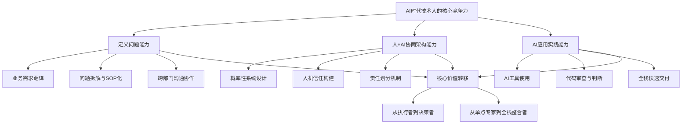

## 概念图谱

## 核心观点摘要

本文来自阿里9年算法架构师的深度观察，揭示了一个残酷的现实：**AI不是在慢慢取代程序员，而是在静悄悄地淘汰**。采购团队从2天工作压缩到1小时，没有任何人觉得意外——因为AI的能力已经理所当然。

### 三大核心竞争力

1. **定义问题的能力** > 解决问题的能力
   - AI擅长解题，但极度依赖清晰的问题定义
   - 真正的价值在于把模糊的业务需求翻译成可执行的SOP
   - 最安全的位置在需求文档上游——决定"做什么"而非"怎么做"

2. **人+AI协同架构能力**
   - 不是设计确定性系统，而是设计概率性系统与人类的协作界面
   - 关键决策节点必须留给人确认
   - 需要设计兜底机制、灰度策略、责任划分

3. **AI应用实践能力**
   - 别学Transformer原理，去用AI解决真实业务问题
   - 你的价值不在于写多少行代码，而在于做"终审法官"
   - 会用AI的技术人效率是10倍，公司自然知道该留谁

---

## 深度解读

### 一、背景：静悄悄的淘汰

#### 真实案例：AI建品工具

阿里内部推行的AI建品工具，将采购团队的工作时间从**2天压缩到1小时**——不是提升20%、30%，而是**48倍的效率提升**。

更令人震动的是：**没有任何人觉得意外**。采购那边没人欢呼，技术这边也没人庆祝。大家理所当然地接受了——AI就是能干掉这些活。

> **淘汰你的时候，连个通知都没有。**

#### 招聘需求的剧变

去年校招和社招的JD已经清一色变成了：
- Agent开发工程师
- 大模型应用开发工程师

传统开发岗位虽然没有消失，但缩得很厉害。拿着一手"调参炼模型"简历来面试的人，竞争力已经大不如前。

#### 工作方式的强制转型

现在技术团队**明确要求**技术同学**优先用AI Coding**去解决业务需求。注意，不是"鼓励尝试"，是**"要求优先"**。

这意味着：
- 以前你是后端工程师，写好后端就行了
- 现在你得能用AI工具把前端也撸出来，数据也处理了，部署也搞定了
- **单点专家正在被全栈选手取代**
- AI就是那个让"全栈"门槛暴降的东西

还在纠结"学Java还是Go"的同学，这个问题的重要性已经远不如"你能不能用Cursor三天撸一个完整应用"。

---

### 二、第一点：最值钱的能力变了

#### 从"解决问题"到"定义问题"

这句话很反直觉，但你仔细想想：

- **AI最擅长**：你告诉我问题，我给你答案
- AI解题的速度、广度、成本都碾压人类
- **但AI极度依赖一个前提**：你得把问题定义清楚

#### 采购AI建品案例的深度解析

技术上最难的部分：
- ❌ 不是接大模型的API
- ❌ 不是写Prompt
- ✅ **而是把采购那些模糊的、经验驱动的、半口头半邮件的业务流程，梳理成严格的SOP**

这一步纯靠AI做不了。采购老师傅自己都说不清楚自己的决策逻辑，你怎么让模型学？

#### 具体的磨砺过程

作者不得不自己带人去跟采购团队一轮一轮地磨：

1. 坐在会议室里
2. 听他们讲"这种情况一般这么处理，但有时候也不一定"
3. 把"不一定"翻译成**决策树**和**规则引擎**

**这个过程没有任何AI能帮你，全靠你对业务的理解和跟人打交道的耐心。**

#### 阿里的残酷规律

在阿里这种大体系里，技术做得最好的人往往：
- ❌ 不是代码最强的人
- ✅ **而是最能"翻译"的人**

能把业务那些乱七八糟的需求翻译成技术方案，反过来也能把技术上做不了的事情用业务方听得懂的方式讲明白。

#### 警惕信号

如果你现在还在一个"需求文档写好了，你来实现"的岗位上，你要警惕了。

真正安全的位置是在**需求文档的上游**——你是那个决定"做什么"的人，而不是"怎么做"的人。

---

### 三、第二点：架构能力没过时，但架构的对象变了

#### 传统架构 vs 新型架构

**以前**：
- 系统架构：微服务怎么拆、数据库怎么选、缓存策略怎么定
- 重要吗？重要
- 但这类决策AI辅助起来越来越轻松了

**现在**：
- 你能不能设计一个**"人+AI"协同工作的系统**？

#### AI建品工具的踩坑经历

第一版方案：
- 很激进，想让模型端到端自动处理整个建品流程
- 上线之后炸了——不是技术炸了，是**业务方炸了**
- 采购同学完全不信任模型的输出
- 觉得"这玩意儿胡说八道我还得给它擦屁股"
- 直接绕过工具手动干活

#### 改进后的架构思路

后来改了架构思路：
1. **关键决策节点必须留给人来确认**
2. 模型只做辅助建议和信息聚合
3. 每一步都展示推理依据让业务方可以追溯

信任度才慢慢建立起来。

#### 新型架构的核心能力

这件事教会我一点——你不再是在设计一个"确定性系统"，你是在设计一个：

- **"概率性系统"**和人类的协作界面

需要考虑：
- 模型会犯错，你得想清楚怎么兜底
- 业务方会抵触，你得想清楚怎么灰度
- 出了问题责任怎么划分，你得提前想好

**这种能力市面上几乎没有成熟方法论，全靠实战积累。但恰恰因为稀缺，所以值钱。**

---

### 四、第三点：别"学"AI了，去"用"AI

#### 两条不同的学习路径

**路径一：学术路线**
- 刷论文、学Transformer原理、跑Hugging Face上的模型
- 有用吗？有用
- 但这条路的竞争者是**全球顶尖高校的博士**
- 你一个工程背景的人去卷这个，**性价比极低**

**路径二：实战路线**
- 你能不能用现成的AI工具，端到端地解决一个真实的业务问题？

#### 作者团队的实践路径

现在就是这个路子：

1. 拿到一个业务需求，别急着写代码
2. **先用AI Coding工具生成一版**
3. 再在这个基础上改

**你的价值不在于你写了多少行代码，而在于你能不能做那个"终审法官"**——判断AI生成的东西哪里能用、哪里有坑、哪里会在凌晨三点把你炸醒。

#### 基本功的新定义

这里有个容易误解的地方：不是说基本功不重要了。

恰恰相反，**基本功的定义变了**：

- ❌ 不是你能手写一个红黑树
- ✅ 而是你能一眼看出AI生成的代码里藏着什么并发问题

**你得有足够的经验和判断力，才有资格坐在驾驶座上。**

#### 效率的残酷现实

说白了，会用AI的技术人效率是不会用的10倍。

这个差距拉到一定程度，不需要谁来"取代"谁，公司自然知道该留谁。

---

### 五、三类不同命运的技术人

#### 第一种人：停留在执行层

特征：
- 工作五六年了
- 还是停留在"给我一个明确的需求，我保证高质量交付"的状态
- 在2020年之前是团队骨干，是靠谱干将

**在2026年，你的核心竞争力正在被AI蚕食**——因为"明确需求+高质量交付"这件事，AI做得越来越好了。

#### 第二种人：焦虑不行动

特征：
- 天天转发AI焦虑文章
- 但自己一行Prompt都没写过
- 一个AI工具都没真正用过

**焦虑不产生竞争力，实践才产生。**

#### 第三种人：能力贬值的痛苦

特征：
- 技术能力很强
- 过去几年靠手艺吃饭吃得很好
- 突然发现自己引以为傲的东西正在贬值

**这种落差感是最难受的。**

作者自己也经历过这个阶段——做了这么多年算法，眼看着很多以前需要精心调优的工作现在一个API就搞定了。

#### 释然后的认知升级

想通了之后反而释然了：

**技术人最大的资产从来不是某个具体技能**，而是：
- 学习能力
- 解决问题的思维方式

语言会过时，框架会迭代，连算法范式都在变，但：

> **"面对一个模糊的问题，你能把它拆解、定义、推进到落地"这个底层能力，无论AI怎么发展，都不会过时。**

---

### 六、行动建议

#### 核心建议

与其每天刷"AI要取代程序员"的文章焦虑，不如：

**今天就打开Cursor，用它去做一个你想了很久但一直没动手的项目。**

- 做出来了，就是你的新竞争力
- 做不出来，那才是你真正该焦虑的地方

#### 能力升级清单

1. **提升定义问题的能力**
   - 主动参与需求分析
   - 跟业务方多沟通，理解他们的真实痛点
   - 把模糊需求转化为清晰的SOP

2. **学习人+AI协同架构**
   - 研究如何设计信任机制
   - 理解概率性系统的设计原则
   - 掌握灰度发布和兜底策略

3. **成为AI工具的重度使用者**
   - 不要只是"尝试"，要"优先使用"
   - 培养代码审查能力，做"终审法官"
   - 用AI快速全栈交付项目

4. **保持技术敏锐度**
   - 不需要跟顶尖高校卷底层算法
   - 但要关注AI工具的能力边界
   - 理解什么AI做不了

---

## 原文完整内容

**标题**：技术人该积累什么，才能避免被AI淘汰？
**回答者**：凯迪手记（阿里9年技术人，算法架构师）
**发布时间**：2026-03-31 11:11

### 正文内容

阿里9年，算法架构师，说点不好听的真话。

我们部门最近在推一个AI建品工具，做的事情不复杂——把采购的日常流程梳理成SOP，接入大模型。结果：原来采购同学要花两天干完的活，现在一个小时搞定。

不是提升了20%、30%，是直接从2天压到1小时。

但这还不是最让我震动的。最让我震动的是，这事发生之后，没有任何人觉得意外。采购那边没人欢呼，技术这边也没人庆祝。大家就好像理所当然地接受了——哦，AI就是能干掉这些活。

淘汰你的时候，连个通知都没有。

再说说我们技术团队自己的变化。

去年校招和社招的JD，我特意翻了一下，清一色变成了"Agent开发工程师""大模型应用开发工程师"。传统的开发岗位不是说没有了，但缩得很厉害。你要是还拿着一手调参炼模型的简历来面试，竞争力已经大不如前了。

更狠的变化是：我们现在明确要求技术同学优先用AI Coding去解决业务需求。注意，不是"鼓励尝试"，是"要求优先"。

这意味着什么？以前你是后端工程师，写好后端就行了。现在不行。你得能用AI工具把前端也撸出来，数据也处理了，部署也搞定了。单点专家正在被全栈选手取代，而AI就是那个让"全栈"门槛暴降的东西。

有些同学还在纠结"我该学Java还是Go"，说句扎心的，这个问题的重要性已经远不如"你能不能用Cursor三天撸一个完整应用"。

好，讲完背景，说说我的判断。

第一，最值钱的能力变了：不是"解决问题"，是"定义问题"。

这句话很反直觉，但你仔细想想——AI最擅长的就是"你告诉我问题，我给你答案"。它解题的速度、广度、成本都碾压人类。但AI极度依赖一个前提：你得把问题定义清楚。

回到我们那个采购AI建品的案例。技术上最难的部分，不是接大模型的API，不是写Prompt，而是——把采购那些模糊的、经验驱动的、半口头半邮件的业务流程，梳理成严格的SOP。这一步纯靠AI做不了。采购老师傅自己都说不清楚自己的决策逻辑，你怎么让模型学？

我不得不自己带人去跟采购团队一轮一轮地磨。坐在会议室里，听他们讲"这种情况一般这么处理，但有时候也不一定"——然后我们把"不一定"翻译成决策树和规则引擎。这个过程没有任何AI能帮你，全靠你对业务的理解和跟人打交道的耐心。

在阿里这种大体系里，我看到的一个残酷规律是：技术做得最好的人，往往不是代码最强的人，而是最能"翻译"的人。能把业务那些乱七八糟的需求翻译成技术方案，反过来也能把技术上做不了的事情用业务方听得懂的方式讲明白。

所以，如果你现在还在一个"需求文档写好了，你来实现"的岗位上，你要警惕了。真正安全的位置是在需求文档的上游——你是那个决定"做什么"的人，而不是"怎么做"的人。

第二，架构能力没过时，但架构的对象变了。

以前我们说架构师，说的是系统架构——微服务怎么拆、数据库怎么选、缓存策略怎么定。这些东西重要吗？重要。但说实话，这类决策AI辅助起来越来越轻松了。

现在真正稀缺的是：你能不能设计一个"人+AI"协同工作的系统？

我们做那个AI建品工具的时候，踩过一个大坑。第一版方案很激进，想让模型端到端自动处理整个建品流程。上线之后炸了——不是技术炸了，是业务方炸了。采购同学完全不信任模型的输出，觉得"这玩意儿胡说八道我还得给它擦屁股"，直接绕过工具手动干活。

后来我们改了架构思路：关键决策节点必须留人来确认，模型只做辅助建议和信息聚合，同时每一步都展示推理依据让业务方可以追溯。信任度才慢慢建立起来。

这件事教会我一点——你不再是在设计一个"确定性系统"，你是在设计一个"概率性系统"和人类的协作界面。模型会犯错，你得想清楚怎么兜底；业务方会抵触，你得想清楚怎么灰度；出了问题责任怎么划分，你得提前想好。这种能力市面上几乎没有成熟方法论，全靠实战积累。但恰恰因为稀缺，所以值钱。

第三，别"学"AI了，去"用"AI。

我知道很多技术同学在"学AI"，但学法有区别。

一种是去刷论文、学Transformer原理、跑Hugging Face上的模型。有用吗？有用。但这条路的竞争者是全球顶尖高校的博士，你一个工程背景的人去卷这个，性价比极低。

另一种是：你能不能用现成的AI工具，端到端地解决一个真实的业务问题？

我们团队现在就是这个路子——你拿到一个业务需求，别急着写代码。先用AI Coding工具生成一版，再在这个基础上改。你的价值不在于你写了多少行代码，而在于你能不能做那个"终审法官"——判断AI生成的东西哪里能用、哪里有坑、哪里会在凌晨三点把你炸醒。

这里有个容易误解的地方：不是说基本功不重要了。恰恰相反，基本功的定义变了——不是你能手写一个红黑树，而是你能一眼看出AI生成的代码里藏着什么并发问题。你得有足够的经验和判断力，才有资格坐在驾驶座上。

说白了，会用AI的技术人效率是不会用的10倍。这个差距拉到一定程度，不需要谁来"取代"谁，公司自然知道该留谁。

最后说几句得罪人的话。

我见过不少技术同学，工作五六年了，还是停留在"给我一个明确的需求，我保证高质量交付"的状态。这种人在2020年之前是团队骨干，是靠谱干将。但在2026年，你的核心竞争力正在被AI蚕食——因为"明确需求+高质量交付"这件事，AI做得越来越好了。

还有一种人，天天转发AI焦虑文章，但自己一行Prompt都没写过，一个AI工具都没真正用过。焦虑不产生竞争力，实践才产生。

但其实最让我感慨的，是第三种人——那些技术能力很强、过去几年靠手艺吃饭吃得很好的人，突然发现自己引以为傲的东西正在贬值。这种落差感是最难受的。我自己也经历过这个阶段，做了这么多年算法，眼看着很多以前需要精心调优的工作现在一个API就搞定了。

想通了之后反而释然了：技术人最大的资产从来不是某个具体技能，而是学习能力和解决问题的思维方式。语言会过时，框架会迭代，连算法范式都在变，但"面对一个模糊的问题，你能把它拆解、定义、推进到落地"这个底层能力，无论AI怎么发展，都不会过时。

与其每天刷"AI要取代程序员"的文章焦虑，不如今天就打开Cursor，用它去做一个你想了很久但一直没动手的项目。做出来了，就是你的新竞争力。做不出来，那才是你真正该焦虑的地方。

---

## 精华金句

1. **"淘汰你的时候，连个通知都没有。"**
2. **"不是提升20%、30%，是直接从2天压到1小时。"**
3. **"真正安全的位置是在需求文档的上游——你是那个决定'做什么'的人，而不是'怎么做'的人。"**
4. **"技术做得最好的人，往往不是代码最强的人，而是最能'翻译'的人。"**
5. **"你不再是在设计一个'确定性系统'，你是在设计一个'概率性系统'和人类的协作界面。"**
6. **"焦虑不产生竞争力，实践才产生。"**
7. **"与其每天刷'AI要取代程序员'的文章焦虑，不如今天就打开Cursor。"**
8. **"做出来了，就是你的新竞争力。做不出来，那才是你真正该焦虑的地方。"**

---

## 关键洞察总结

| 维度 | 传统认知 | AI时代新认知 |
|------|---------|-------------|
| 核心能力 | 解决问题能力强 | 定义问题能力强 |
| 工作方式 | 需求→实现 | 需求上游参与→定义问题 |
| 技术价值 | 手写高质量代码 | 判断AI代码质量和风险 |
| 职业定位 | 单点专家 | 全栈整合者+决策者 |
| 学习重点 | 底层原理（Transformer） | AI工具实战应用 |
| 架构对象 | 确定性系统设计 | 概率性系统+人机协作 |

---

## 相关问题

- 如何定义业务问题才能让AI有效解决？
- 全栈技能在AI时代有何新要求？
- 技术人如何提升定义问题的能力？
