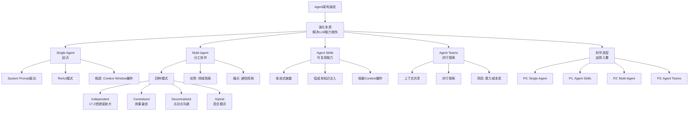

# Agent/Skills/Teams 架构演进过程及技术选型之道

## 一、元信息

- **作者/来源**：飞樰 | 阿里云开发者
- **发布时间**：2026年3月17日
- **文章类型**：技术介绍 / 架构演进 / 技术选型

---

## 二、一句话总结

Agent架构的演进本质是为了解决大模型无法完美内化领域知识和高效管理长期记忆的问题，通过从Single Agent到Multi-Agent、Agent Skills、Agent Teams的演化路径，逐步提升知识注入效率和协同能力，但选型需遵循"由简入繁、按需升级"的原则。

---

## 三、核心观点

**核心论点**：Agent架构的演化史，就是在大模型无法完美内化"领域知识"和高效复用"长期记忆"的背景下，不断尝试"外挂"这些能力的过程。架构复杂度必须与问题复杂度相匹配，盲目追求Multi-Agent的"高大上"往往会陷入通信泥潭和错误放大的陷阱。

---

## 四、架构演进概念图谱



---

## 五、各架构模式详解

### 1. Single Agent（单智能体）

**特点**：
- 基于System Prompt驱动
- 串行调用工具
- ReAct模式自主运行

**优势**：
- 实现成本低
- 开发效率高

**瓶颈**：
- Context Window爆炸
- 知识承载有限

**解决方案**：引入RAG检索增强生成
- 新瓶颈：检索准确率（"垃圾进，垃圾出"）

### 2. Multi-Agent（多智能体）

**四种模式对比**：

| 模式 | 特点 | 错误放大倍数 |
|------|------|-------------|
| Independent | 独立处理不沟通 | 17.2倍 |
| Decentralized | 点对点网状结构 | - |
| Centralized | 中心辐射模型（Orchestrator调度） | 4.4倍 |
| Hybrid | 结合层级监督和点对点 | - |

**优势**：
- 降低复杂度
- 独立调优
- 领域隔离

**痛点**：
- 通信带宽损耗
- 路由准确率压力
- 局部最优导致上下文割裂
- 信息有损压缩

### 3. Agent Skills（代理技能）

**核心机制**：
- System Prompt恒定 + User Prompt动态注入
- **渐进式披露（Progressive Disclosure）** - 核心精髓

**价值**：
- 低成本知识注入
- 全局上下文一致性
- 规避Context爆炸

### 4. Agent Teams（代理团队）

**适用场景**：
- 高度不确定的决策难题
- 探索性任务

**关键特性**：
- 上下文共享
- 并行探索
- 动态协同
- 目标一致

**风险**：
- 算力成本成倍增加

---

## 六、科学选型方法论

### 关键实证结论（Google研究）

1. **模型越强效果越好**，但Agent数量与效果非线性
2. **沟通成本会降低系统整体效果**
3. **单Agent 45%阈值法则**：成功率超过45%时，增加Multi-Agent反而降低效果
4. **任务类型决定最佳架构**：
   - 规划类 → Single Agent
   - 工具使用类 → 去中心化Multi-Agent
   - 垂类场景 → 中心化协作

### 选型优先级

```
P0 → P1 → P2 → P3
```

| 优先级 | 架构 | 使用时机 |
|--------|------|----------|
| P0 | Single Agent | 优先选择，快速验证 |
| P1 | Agent Skills | 遇到知识瓶颈时 |
| P2 | Multi-Agent | 追求极致效果时 |
| P3 | Agent Teams | 探索性任务 |

### 易错点警示

1. **"长上下文不等于长记忆"** - 输入数据量达到阈值时会出现"Lost in the Middle"问题
2. **"垃圾进，垃圾出"** - RAG架构高度依赖检索准确率
3. **"刚毕业就失业"困境** - 耗时训练专属领域模型时，新一代基座模型可能已超越
4. **"局部最优"导致的上下文割裂**
5. **"认知冲突"问题** - 动态修改System Prompt会导致模型困惑
6. **"一着不慎，满盘皆输"** - 主Agent错误路由会导致后续所有努力南辕北辙

---

## 七、架构对比速查表

| 架构类型 | 核心逻辑 | 优势 | 劣势 | 适用场景 | 优先级 |
|---------|---------|------|------|---------|-------|
| **Single Agent** | System Prompt驱动，串行调用工具 | 实现成本低、开发效率高 | 上下文窗口爆炸，知识承载有限 | 简单场景、快速验证 | P0 |
| **Multi-Agent** | 多Agent分工协作，Orchestrator调度 | 领域隔离、独立调优 | 通信损耗、路由压力、上下文割裂 | 领域知识严格隔离、效果极致追求 | P2 |
| **Agent Skills** | 动态加载技能包，渐进式披露 | 低成本注入、全局一致、规避爆炸 | 频繁切换仍可能导致上下文变长 | 企业级场景、海量知识、高稳定性 | P1 |
| **Agent Teams** | 并行探索、上下文共享 | 处理复杂未知问题、多维试错 | 算力成本高、共享状态管理难 | 探索性任务、复杂调试、创意生成 | P3 |

---

## 八、通俗解读

假设你是一家高科技公司的项目经理，需要组建一个团队来解决各种技术难题。

**大模型就像一个聪明的新员工**，他学习能力很强（通过训练掌握了基础知识），但遇到你的特定业务领域（比如阿里云ECS故障诊断、金融交易规则），他就"记不住"那么多专业知识了。

**Single Agent就像让这个新员工边干边学**。你把操作手册（System Prompt）塞给他，让他自己查资料、做决策。刚开始还行，但问题一复杂，手册太厚，他就晕头转向了（上下文爆炸）。

**Multi-Agent就像建了一个专业团队**。你招了各种专家（ECS专家、数据库专家、网络专家），再配个项目经理（Orchestrator）来分配任务。这样分工明确，但问题来了：专家之间沟通不畅（通信损耗），项目经理分错任务大家一起白忙活（路由错误）。

**Agent Skills就像给员工配备了一个可随时查阅的"技能图书馆"**。不需要招那么多专家，还是那个聪明员工，但他需要哪本手册就随时查阅哪本，看一点用一点。这样既保持了全局一致性，又不用把所有手册都背下来。

**Agent Teams就像组建了一个"特种小队"**。面对一个完全没见过的问题，你派几个不同背景的专家同时去尝试不同方案。虽然成本高，但对于没有标准答案的难题特别有效。

**科学选型就像"奥卡姆剃刀"**：能用一个员工解决的绝不动用团队，能用手册解决的绝不用多人协同。

---

## 九、行动指南

### 适用场景判断

**✅ 适合用 Single Agent**：
- 场景复杂度较低，不需要多步推理
- 知识体量可控（2万Token以内）
- 检索质量有保障
- 快速构建Demo或原型验证

**✅ 适合用 Agent Skills**：
- 追求高稳定性、低维护成本
- 需要处理海量领域知识
- 希望保持全局上下文一致性
- 企业级场景落地

**✅ 适合用 Multi-Agent**：
- 领域知识需要严格隔离
- 不同任务模块独立性强
- 对效果有极致追求，愿意投入调优成本

**✅ 适合用 Agent Teams**：
- 高度不确定的探索性任务
- 极度复杂的研发调试
- 开放式创意生成
- 多因素耦合的故障根因分析

### 落地建议

1. **起步阶段**：从Single Agent开始，快速验证想法，ROI最高
2. **遇到知识瓶颈**：优先引入Agent Skills机制，通过渐进式加载扩展能力
3. **效果天花板**：仅在上述方案失效时，再谨慎启动Multi-Agent架构
4. **探索性任务**：针对高度不确定的问题，叠加Agent Teams的并行协作
5. **持续优化**：根据实际效果数据，遵循"由简入繁、按需升级"原则调整架构

---

## 十、延伸思考

### 值得验证的点

1. **Agent Skills在实际大规模场景下的性能表现** - 缺少大规模生产环境的量化数据
2. **Agent Teams的并行效率上限** - 算力成本与收益的平衡点在哪里？
3. **混合架构的实际落地案例** - 不同架构模式的组合使用是否有最佳实践？

### 未来展望

如果某天LLM基座模型天生具备完美的领域知识注入和自主记忆能力，今天的RAG、Multi-Agent、Skills等架构模式可能都将失去意义。

Agent技术正在从"凭感觉调优"转向"系统工程"。

---

> "Less structure, More intelligence."（更少的结构，更多的智能）—— Manus AI
>
> "Agent技术架构没有绝对的'最好'，只有'最合适'。"
