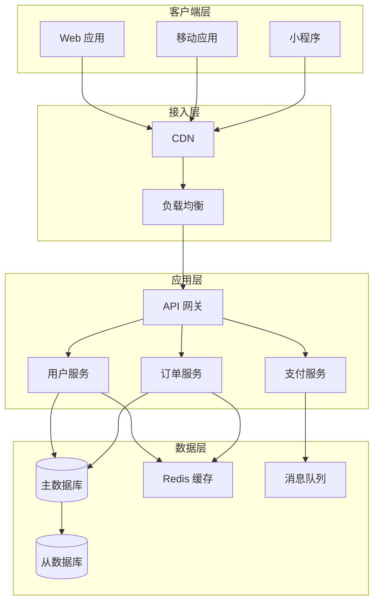
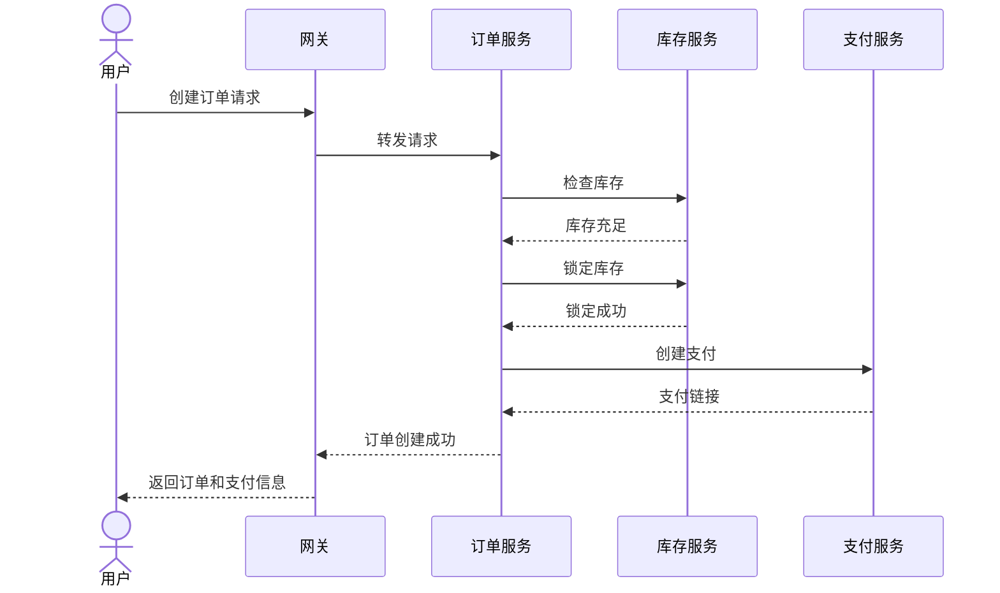
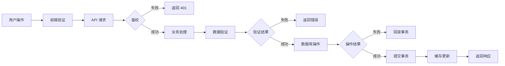
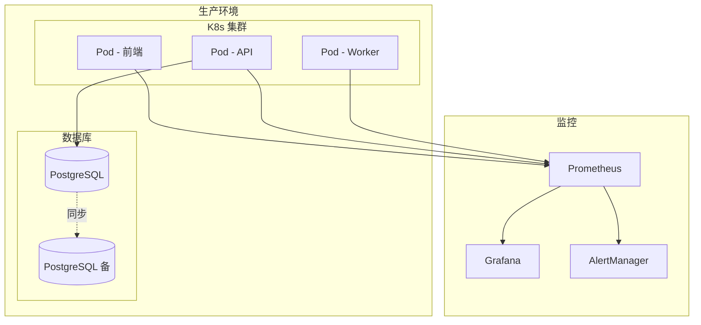

## 系统架构设计

本文展示了一个典型的现代 Web 应用架构设计。

## 整体架构

## 微服务交互流程

## 数据流转

## 部署架构

## 关键设计原则

1. **高可用性**
   - 服务多副本部署
   - 数据库主从备份
   - 故障自动转移

2. **可扩展性**
   - 水平扩展支持
   - 无状态服务设计
   - 缓存分层

3. **安全性**
   - API 网关统一鉴权
   - 服务间通信加密
   - 敏感数据脱敏

4. **可观测性**
   - 全链路追踪
   - 日志集中收集
   - 指标监控告警
