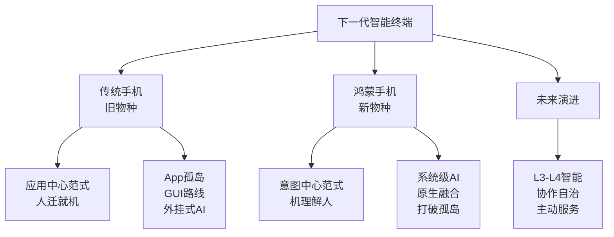
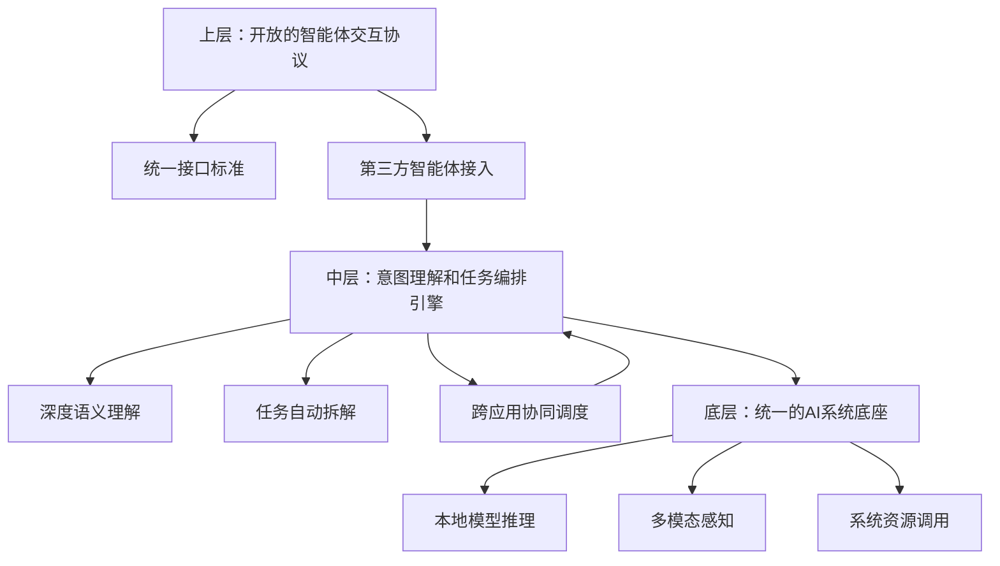
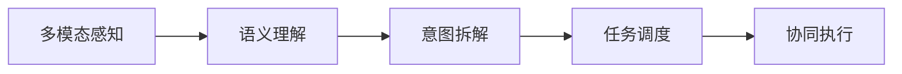
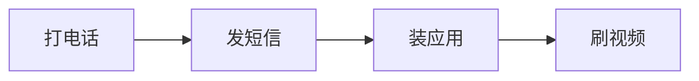
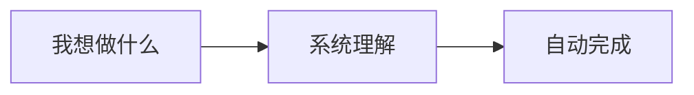

# AI杀死「旧手机」，鸿蒙孕育「新物种」

> 来源：36氪 | 日期：2026年3月25日

---

## 一、核心观点摘要

**一句话总结**：鸿蒙通过将AI能力从应用层下沉到操作系统内核，打破传统手机"应用中心"的范式，推动终端设备向"意图驱动型智慧"演进，重新定义人机关系。

---

## 二、核心概念图谱



---

## 三、关键问题与鸿蒙的答案

### 问题1：AI智能体如何在手机上落地？

**现状困境**：
- 传统手机采用GUI路线：视觉识别 + 模拟点击
- 7款手机智能体测试，成功率仅20%
- 39%任务中断，24%降级为信息问答
- API授权问题：AI在App外转，数据在App内困

**鸿蒙的解法**：

| 传统方式 | 鸿蒙方式 |
|---------|---------|
| AI App → 屏幕识别 → 第三方App | 用户意图 → 系统AI能力 → 原生融合 |
| 外挂式旁观者 | 系统级调度者 |

### 问题2：为什么必须由操作系统来做？

1. **中立性**：操作系统没有"私心"，不与应用争利
2. **调度能力**：是所有应用的共同底层和硬件设备的天然调度者
3. **打破孤岛**：只有系统能真正打破应用之间的壁垒

**对比**：
- AI App调用另一个App：商业竞合关系，谁都想做"超级入口"
- 操作系统调度：天然的中立协调者

### 问题3：万物互联时代的入口是什么？

**旧范式（应用中心）**：
```
需求 → 找App → 打开 → 操作
打车 → 滴滴   → 点叫车
订餐 → 美团   → 选外卖
```

**新范式（意图中心）**：
```
需求 → 表达意图 → 理解意图 → 系统调度
"我要去北京" → 系统理解 → 调度日历/天气/订票/酒店
```

---

## 四、鸿蒙的技术架构

### HMAF（鸿蒙智能体框架）三层架构



### 实际应用示例

**用户说**："我有点冷了"

**系统处理流程**：


1. **多模态感知**：感知环境温度、用户心率、设备数据
2. **语义理解**："冷" = 需要保暖
3. **意图拆解**：关窗 + 开启暖风 + 调节空调
4. **任务调度**：联动窗帘、空调、地暖等设备
5. **协同执行**：自动完成所有操作

---

## 五、从"对话智能"到"行动智能"的演进

| 维度 | 对话智能（现状） | 行动智能（鸿蒙） |
|------|----------------|----------------|
| **核心能力** | 听懂话 | 办成事 |
| **交互方式** | 问答式 | 意图驱动 |
| **任务执行** | 用户手动操作 | 系统自动拆解 |
| **应用协同** | 需要切换App | 后台跨App调度 |
| **设备协同** | 单设备操作 | 多设备无缝流转 |
| **服务模式** | 被动响应 | 主动服务 |

---

## 六、鸿蒙生态现状与数据

- **开发者**：超1000万注册开发者
- **应用数量**：超5万个鸿蒙应用及元服务落地
- **企业覆盖**：鸿蒙办公应用覆盖3800万家企业
- **平台适配**：超100个通用办公平台完成鸿蒙适配
- **电脑生态**：超10000款融合应用、250+款桌面应用深度适配
- **终端设备**：搭载鸿蒙OS5及以上的设备突破5000万台

---

## 七、行业趋势与预测

### 终端智能化等级（至2030）

| 等级 | 能力描述 | 预计时间 |
|------|---------|---------|
| L0-L1 | 任务辅助型智能 | 现在-2027 |
| **L3** | **协作自治** | **2026-2028** |
| L4 | 专业指导 | 2028-2030 |

**2026年被认为是端侧智能体大规模商用的元年**

### 座舱领域：MoLA混合大模型Agent架构

- **能力**：记住用户通勤习惯、主动创建场景
- **核心**：长期记忆、模糊意图理解
- **跨越**：从被动响应到主动服务

---

## 八、范式跃迁：从"人迁就机"到"机理解人"

### 过去二十年：功能叠加史



每一次升级都在问："还能做什么？"
用户必须"学会"使用手机

### 鸿蒙时代：意图驱动史



每一次升级都在问："为什么不让手机适应我们？"
手机开始"学会"理解用户

---

## 九、关键金句摘录

1. **AI的核心跃迁**：让AI从"听得懂话"进化为"办得成事"
2. **鸿蒙的本质**：从应用中心向意图中心演进
3. **系统的价值**：只有系统没有"私心"，才能打破应用孤岛
4. **新物种的诞生**：手机不再是应用容器，而成为"智能系统节点"
5. **范式的改变**：从"人迁就机"到"机理解人"

---

## 十、总结与洞察

### 1. 技术范式转移

从应用中心的GUI操作 → 意图中心的系统智能
这是从移动互联网时代到AI时代的关键转折

### 2. 竞争格局重构

- **旧竞争**：硬件参数、跑分、应用生态数量
- **新竞争**：系统AI能力、意图理解深度、跨端协同体验

### 3. 鸿蒙的战略定位

- 不是在Android/iOS的基础上做增量
- 而是从底层重新定义操作系统
- 为AI时代而生，面向万物互联

### 4. 时间窗口

- 2026年：端侧智能体大规模商用元年
- 2026年：鸿蒙的"超越之年"
- 2030年：终端智能化达到L3-L4级别

---

## 附录：核心概念解释

### 1. GUI路线
- **原理**：视觉识别 + 模拟操作
- **局限**：外挂式、成功率低、API授权问题

### 2. 意图优先
- **核心**：理解用户想做什么，而不是关键词匹配
- **实现**：语义理解 + 任务拆解 + 系统调度

### 3. 系统级AI
- **特点**：原生融合、打破孤岛、中立调度
- **优势**：真正的跨应用协同能力
