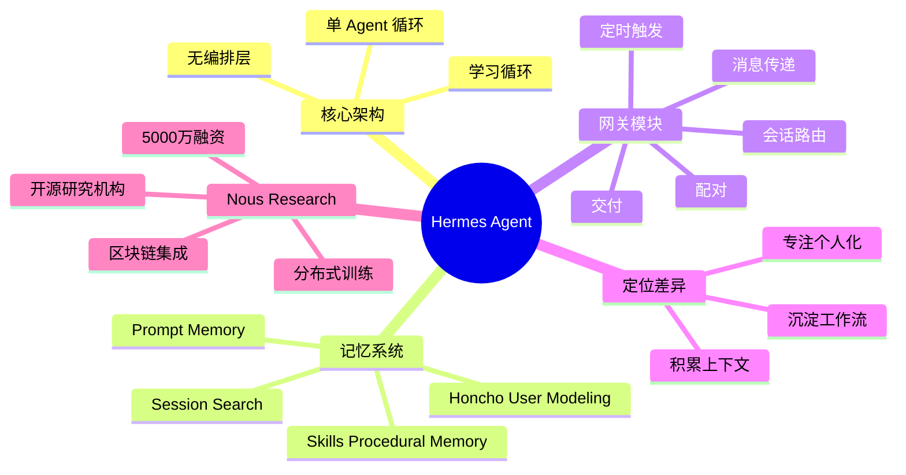

## 摘要

本文深度解析了近日爆火的开源 AI Agent 项目 Hermes Agent，对比其与主流多 Agent 编排框架 OpenClaw 的架构差异，探讨了单 Agent 架构的学习循环、四层记忆系统、网关路由等核心设计理念，以及背后的 Nous Research 公司如何通过去中心化技术挑战 OpenAI 等巨头。

## 思维导图



## 核心要点

### 1. Hermes Agent 爆火现象

- **GitHub Stars**：从 2 月开源以来获得超 3.9 万 stars
- **用户反馈**：对比 OpenClaw（文章称"龙虾"），Hermes 的持久记忆能力更强
- **实际应用**：
  - Mac M3 本地运行 Qwen 3.5-35B，24 小时持续运行
  - 整合日历、Gmail、Todoist 信息，分派给 Claude Code
  - Hermes Agent 之间自主协同完成商业任务
  - 2.5 小时完成《百战天虫》克隆版

### 2. 架构对比：Hermes vs OpenClaw

| 维度 | OpenClaw | Hermes |
|------|----------|--------|
| 架构类型 | 多 Agent 编排 | 单 Agent 循环 |
| 核心目标 | 通用场景工作 | 越来越懂你的工作方式 |
| 编排层 | 中央枢纽路由调度 | 无编排层，单一循环 |
| 记忆方式 | 会话间维护上下文 | 四层记忆系统 |
| 技能积累 | 手动配置 | 自动"蒸馏" skill |

### 3. Hermes 核心设计

#### 3.1 学习循环（Self-Distillation）

```
输入 → 推理 → 工具使用 → 记忆 → 输出
         ↓
    评估处理过程
         ↓
    提炼可复用 skill
         ↓
    写入 ~/.hermes/skills/
```

**关键点**：
- 自动评估任务是否值得保留
- 只保留真正有效的方法
- 下次直接执行保存的工作流，而非重新走一遍步骤

#### 3.2 四层记忆系统

1. **Prompt Memory（提示记忆）**
   - 包含：MEMORY.md 和 USER.md
   - 每次会话自动加载
   - 限制：3,575 字符（逼系统只留关键信息）

2. **Session Search（会话检索）**
   - 所有 session 存入 SQLite
   - 通过 FTS5 建立全文索引
   - 按需检索，而非全量加载
   - 检索结果经 LLM 摘要处理

3. **Skills Procedural Memory（技能程序性记忆）**
   - 保存"该怎么做"，而非"发生了什么"
   - 默认只加载 skill 名称和摘要
   - 完整内容按需加载，控制 token 成本

4. **Honcho Layer User Modeling（用户建模）**
   - 跨 session 被动追踪用户偏好
   - 记录沟通风格和知识背景变化

#### 3.3 记忆更新机制

**定期提醒（Periodic Nudge）**：
- 系统定期发送内部系统级提示
- 让 Agent 回顾并判断哪些内容值得写进记忆
- 不依赖用户输入，自动触发
- 确保记忆始终保持"经过整理"的状态

### 4. 网关架构

#### 4.1 核心职责

1. 消息传递
2. 会话路由
3. 交付
4. 配对
5. 定时触发

#### 4.2 单次交互流程

```
消息进入
  ↓
生成任务 ID
  ↓
加载/构建提示词
  ↓
预检压缩检查（Preflight Compression Check）
  ↓
调用模型
  ↓
执行工具
  ↓
写入结果
  ↓
网关推送响应
```

#### 4.3 上下文管理

- **对话过长**：辅助模型总结中间轮次，但保留溯源链
- **提示缓存**：稳定的系统提示可被服务提供商缓存
- **缓存失效**：切换模型、修改记忆或上下文文件时

#### 4.4 会话路由

- 绑定用户 ID，而非具体平台
- 实现**真正的跨平台连续性**
- 示例：Telegram 开启对话 → 切换到终端 → 不丢失上下文

### 5. 定时自动化任务

- **定位**：一级 Agent 任务，非外部套层
- **流程**：解析指令 → 存入 cron/ 目录 → 定时触发 → Agent 循环执行 → 推送结果
- **特点**：带着完整记忆和 skill 执行

### 6. 状态管理

- **数据库**：SQLite（hermes_state.py）
- **WAL 模式**：预写日志，确保多会话并发稳定性
- **索引**：FTS5 全文检索
- **存储**：
  - 对话、工具调用、结果：SQLite
  - 原始对话记录：JSONL
  - 定时任务定义：单独存储

### 7. 产品定位

**Hermes 适用场景**：
- 日常使用
- 跨多个平台
- 任务具有重复性
- 会不断演化的系统
- 需要持续运行和维护的基础设施

**不适用场景**：
- 使用场景较狭窄
- 生命周期较短
- 临时处理小任务

**对比总结**：
- OpenClaw：模块化 + 多 Agent 协同
- Hermes：随时间积累上下文 + 沉淀工作流的单 Agent

## Nous Research 背后的故事

### 1. 公司背景

- **定位**：开源研究机构
- **成立时间**：2023 年
- **团队规模**：约 30 人
- **核心目标**：打造可与 OpenAI、DeepSeek 抗衡的开源 AI 模型
- **融资情况**：
  - A 轮：5000 万美元（Paradigm 独投）
  - 种子轮：累计约 2000 万美元

### 2. 创始团队

| 成员 | 背景经验 |
|------|----------|
| Jeffrey Quesnelle（CEO） | 密歇根大学计算机硕士，18 年车载网络与嵌入式工具经验，加密行业背景 |
| Karan Malhotra（行为负责人） | 亚马逊生成式 AI 部门，NLP 机器学习与深度模型开发经验 |
| Teknium（后训练负责人） | Stability AI 工作经历，大语言模型后训练、对齐与通用能力构建 |
| Shivani Mitra | 2024 年 5 月已离职 |

### 3. 技术成果

- **Hermes 系列**：基于 Llama、Mistral 迭代开发
- **下载量**：HuggingFace 上超过 5000 万次
- **开源程度**：
  - 权重
  - 训练数据集
  - 训练方法
- **学术论文**：
  - 与 OpenAI 创始团队成员 Diedrick P. Kingma 合作的 "DeMo: Decoupled Momentum Optimization"
  - YaRN 语言模型方法（被 109 篇论文引用，被 Meta 和 DeepSeek 采用）

### 4. 开源理念

**Jeffrey 的观点**：
- 认可 Linux 路径：源代码完全公开，内核驱动全部透明
- 黑客精神：信息天生应该自由流动
- 避免"建在纸牌上的房子"：不依赖单一大型企业
- 全面开源：从预训练、中期训练到强化学习

**关键转折**：担心 Llama 5 闭源，将所有训练 100% 自己掌控

### 5. 区块链与分布式训练

#### 5.1 动机

- **算力需求**：模型训练需要巨量资源
- **资本约束**：避免依赖传统风投（如财富基金融资）
- **去中心化**：突破单一数据中心的限制

#### 5.2 核心思路

**传统路径**：
- 单一数据中心训练
- 单一实体控制
- 中心化体系

**Nous 方案**：
- 跨多个数据中心
- 全球范围内调用 GPU 资源
- 动态加入/退出训练
- 代币激励闲置算力
- 兼容工业级与消费级 GPU

#### 5.3 关键技术

- **资本形成能力**：加密基础设施提供
- **去中心化能力**：无需许可的跨境支付
- **拜占庭容错**：防范恶意参与者上传无效数据
- **区块链层**：防范数据污染，容错性保障

#### 5.4 实用主义

**Jeffrey 强调**：
- "我们是一家 AI 公司，但用加密技术不是因为它时髦，而是因为它正好能解决我们面临的技术问题"
- 核心价值：容错性和去中心化
- 无国界、去中介的跨境支付：加密货币是最好的解决方案

### 6. 投资方 Paradigm

- **联合创始人**：Fred Ehrsam（Coinbase）、Matt Huang（红杉资本）
- **定位**：全球规模最大的原生加密风投之一
- **战略调整**：2023 年后部分重心转向 AI 与加密融合赛道
- **估值**：Nous 代币估值达 10 亿美元

### 7. 行业态度

**AI 对加密行业的质疑**：
- 投机炒作与虚假项目过多

**Nous 的回应**：
- 团队本身具备加密原生背景
- 在分布式训练取得突破前保持谨慎
- 区块链是实现大规模、民主化模型训练的唯一路径
- 本质是严谨的学术型研究实验室

## 原文完整内容

---

# "同事.skill"不用写了，爱马仕 Hermes 主动"蒸馏"你，还让开发者集体抛弃 "龙虾"？！

**原创** | 褚杏娟 | InfoQ | 2026年4月9日 15:30 | 北京

整理 | 褚杏娟

从 OpenClaw 切换到爱马仕 Hermes，你跟了吗？

近日，Hermes Agent 在国内突然爆火。Hermes Agent 从 2 月份开源以来，现已获得超 3.9 万 stars，目前还在快速增长。

"准备放弃龙虾转爱马仕了，龙虾记忆太差了，爱马仕无论怎么重开，过多久都能记住，太香了！"有网友说道。谷歌高级 AI 产品经理 Shubham Saboo 发推称赞其好用。

有用户在 Mac M3 上通过 LM Studio 本地运行 Qwen 3.5-35B，并把 OpenRouter 作为备用后端，Hermes 则 24 小时持续运行。

Hermes 可以把日历、Gmail 和 Todoist 的信息先汇总到一个分析步骤里，再把任务分派给 Claude Code，持续跟踪进度，同时回写到用户的 Obsidian vault。X 上还有人提到，他们的 Hermes Agent 会自主给商业伙伴的 Hermes Agent 发消息，协同完成某项任务，全程没有人工介入。

有位开发者用 Hermes Agent 花费 2.5 小时做出了 《百战天虫》克隆版。他用的是持久 shell 模式、并行子 agent、通过 /rollback 实现文件系统检查点，以及借助 CDP 进行实时 Chrome 调试。而且，这个 gent 还自己把物理引擎逻辑整理成了一个可复用的 skill 插件。

还有用户在发现每次 API 调用里有 73% 都是固定开销后，做了一个开源仪表盘。其中特别大的开销来自：工具定义占 46%，system prompt 占 27%。现在大家也在分享一些降本方法，比如按平台拆分工具集，或者按需懒加载 skill。

Hermes 可以自托管在 5 美元的 VPS 上，将其与 Ollama 结合使用，即可实现本地推理，成本几乎为零。

"我试过 OpenClaw、Nanobot、Nanoclaw 等等，但 Hermes Agent 是我最喜欢的。它把我真正关心的功能都做进去了，同时又没有那些臃肿累赘的东西。"有用户表示。

该用户进一步解释道，"在我看来，它更容易审计、也更安全，和我本地跑的模型配合得也很好。我把 Hermes 装在一台始终在线的 Mac mini 上，这台机器可以通过预共享密钥 SSH 访问我的 Ubuntu 服务器。对我来说，这台 Mac mini 就是整个编排体系里的中枢。我平时要么直接在 Mac mini 上用它，要么从 MacBook SSH 连到 Mac mini 去用，要么通过 Telegram 来操作。完全不需要多节点部署。至于一些更轻量的任务，我最近在测试 pi.dev 和 opencode 的效果对比，不过到目前为止，我还是挺喜欢它更省 token 的用法。

官方还给了从 OpenClaw 迁移到 Hermes 办法。不过也有使用过用户表示，"我大概不会直接替换掉现有的 Claude Code 工作流，但把 Hermes 并行挂在旁边，专门负责常在线消息处理和个人助理这一层，确实很有吸引力。"

## 同是智能体，与 OpenClaw 有何不同？

这款 Agent 的核心目标，不是"在通用场景下更擅长工作"，而是"越来越懂你的工作方式"。

目的不同，产品底层设计也就不同，爆火后，Mr. Ånand 拆解分析了 Hermes 的架构。和围绕多 Agent 编排（Multi-Agent Orchestration）来设计的 OpenClaw 不同，Hermes 回归了单 Agent（Single-Agent）架构。

Hermes 的架构核心并不复杂。它是一个运行在持久循环中的单 Agent 系统。没有编排层，也没有多 Agent 集群。每个任务都会经过同一套循环：输入 → 推理 → 工具使用 → 记忆 → 输出。真正的区别在于，任务结束之后会发生什么。

Hermes 的核心是学习循环。它不只是存储对话，而是会对已经完成的任务进行评估，判断这套处理过程是否值得保留。如果值得，它就会把一次任务里真正有效的方法提炼出来，写成可复用的 skill，并这套可复用的"skill"写入磁盘，保存到 ~/.hermes/skills/。下一次再遇到类似任务时，它不会重新把步骤走一遍，而是直接执行已经保存下来的工作流。

相比之下，OpenClaw 这类 Agent，通常会在不同会话（session）之间维护上下文，并通过一个中央枢纽（central hub）进行路由调度，这对"记住发生过什么"并不友好。官方团队认为，这种能力提升不是靠频繁改配置、加规则堆出来的，而是在使用中"长出来"的。

为了避免记忆越积越乱，Hermes 把记忆拆成了四层，而不是全部塞进同一个记忆存储里。

1. **第一层是提示记忆（Prompt Memory）**，也就是 MEMORY.md 和 USER.md。这部分内容会在每次 session 一开始自动加载，属于常驻上下文。两份文件一共只允许 3,575 个字符，限制得很紧，目的就是逼系统只留下真正重要、值得长期保留的信息。

2. **第二层是会话检索（Session Search）**。所有 session 都会写进 SQLite，并通过 FTS5 建立索引。agent 只有在判断过去某段上下文和当前任务有关时，才会主动去搜，而不是把整个旧 session 一股脑重新塞回窗口。检索结果在进入当前任务前，还会先经过 LLM 摘要，只保留相关部分。

3. **第三层是技能程序性记忆（Skills Procedural Memory）**。它保存的不是"发生了什么"，而是"这件事该怎么做"。默认情况下，系统提示词只加载 skill 的名字和摘要，完整内容只有在当前任务确实需要时才会读进来。这样，即便系统里已经积累了大量 skill，也不会把 token 成本一起推高。

4. **第四层是 Honcho 层用户建模（Honcho Layer User Modeling）**。它会跨 session 被动追踪用户偏好、沟通风格和知识背景的变化。

Mr. Ånand 认为，正是这种分层结构真正承担了大部分关键工作。"发生了什么"和"该怎么做"不会混在一起，完整上下文也只会在需要时才加载。这就是它能在不把 token 成本推高的情况下实现扩展的原因。

在记忆管理上，大多数 Agent 要么全盘记录，最终只留下一堆无法复用的日志；要么完全不记录，每个会话都需从零开始。Hermes 为规避这两个问题，将"哪些内容值得留存"的判断权直接交给 agent 自身，具体通过"定期提醒（periodic nudge）"机制实现。

在会话过程中，系统会定期向 Agent 发送一个内部系统级提示（system-level prompt），让它回头看刚刚发生了什么，并判断哪些内容值得写进记忆文件。这个过程不依赖用户输入，而是系统自动触发。这种设计让记忆始终保持"经过整理"的状态，而非沦为每次交互的"垃圾场"，确保记忆的实用性。

学习循环和记忆系统的价值，只有在 agent 能够随时响应调用时才能体现，而这正是网关的核心作用。

在 OpenClaw 中，网关的主要职责仅为交付，skill 创建、记忆写入、定时自动化输出等功能均采用独立机制实现，与网关不在同一个循环中。而在 Hermes 中，网关本身就是同一个循环的一部分：收到一条消息可直接触发 skill 创建；定时自动化任务的输出，也会通过同一个网关层反馈给用户。之所以能实现真正的跨平台连续性，核心原因就是会话路由被直接集成到整个系统中，而非后续额外拼接。

网关模块主要负责五件事：消息传递、会话路由、交付、配对和定时触发。一个会话绑定的是用户 ID，而非具体平台，这意味着用户在 Telegram 开启了一段对话，再切换到终端后继续操作，也不会丢失任何上下文。

Hermes 的单次交互也十分直接：每条消息进入系统后，Agent 会先生成任务 ID，再加载缓存的系统提示或重新构建提示；随后进行预检压缩检查（preflight compression check），确认当前对话历史未逼近上下文限制；之后调用模型、执行工具、写入结果，最终由网关推送响应。

若对话过长，系统会在触发上下文硬限制前，由辅助模型完成总结，压缩中间轮次但保留溯源链，即总结内容与原始对话的引用关系，既避免上下文溢出，又保证操作可追溯。

此外，由于 Hermes 的系统提示大多稳定，多数服务提供商可对其进行提示缓存（prompt caching），这样可以大幅降低后续调用的延迟和成本。仅在切换模型、修改记忆文件或上下文文件时，缓存才会失效。

Hermes 将定时自动化任务视为一级 Agent 任务，而非"外部套一层定时任务，顺带调用 AI"。用户安排定时任务后，系统会先解析指令，将任务存入 cron/ 目录；到点后，由网关的定时触发启动任务，再由 Agent 循环带着完整记忆和 skill 执行，最终将结果推送至指定平台。

Hermes 的所有核心能力，包括学习循环、记忆分层、网关路由、定时自动化，都依赖一个核心前提：状态可跨会话留存。这一功能由 hermes_state.py 管理的 SQLite 数据库实现：每轮交互结束后，对话、工具调用及结果都会写入数据库，并通过 FTS5 建立索引，供后续按需检索；原始对话记录会额外写入 JSONL 文件，定时任务定义则单独存储。数据库启用预写日志（WAL）模式，确保多会话并发时的稳定性。

Mr. Ånand 表示，Hermes 并非用于临时处理小任务的轻量配置，更像是一套需要持续运行和维护的基础设施。如果你的使用场景较狭窄、生命周期较短，那么它的复杂度可能显得冗余；但如果你的需求是搭建一个日常使用、跨多个平台、任务具有重复性且会不断演化的系统，那么 Hermes 会是一个值得选择的方案。

他强调，OpenClaw 提供的是模块化和多 Agent 协同能力，而 Hermes 提供的是一个能随时间积累上下文、沉淀工作流程的单 Agent。

不过，研发团队成员 Jeffrey Quesnelle 在最近的分享中提到，团队现在还没有特别成熟、真正完善的长期规划研究。这里说的长期规划，是那种 AI 可以连续工作很多很多天，不是只完成一个短期任务，而是能在更长的时间里稳定推进工作。但他认为，长期规划能力是一个非常值得研究的方向。

## 团队要打造与 OpenAI、DeepSeek 等抗衡的开源 AI 模型

随着被关注越来越多，Hermes Agent 背后的公司 Nous Research 也进入了人们视野。

创始团队将 Nous 定位为开源研究机构，最初是 2022 年由一群通过 Discord、GitHub、Twitter 等社交及技术平台结识的志愿者组建。而 Nous Research 成立于 2023 年，由 CEO Jeffrey Quesnelle、行为负责人 Karan Malhotra、后训练负责人 "Teknium" 以及 Shivani Mitra （领英显示其在去年 5 月已离职）共同创立。

Jeffrey 密歇根大学迪尔伯恩分校计算机科学硕士学位，曾在车载网络与嵌入式工具提供商 Intrepid Control Systems 工作超 18 年，后进入加密行业；Malhotra 曾在亚马逊生成式 AI 部门工作，在面向自然语言处理应用的机器学习与深度学习模型开发及部署方面拥有丰富经验；Teknium 则之前在 Stability AI 工作，并参与了很多开源项目，目前专注于大语言模型的后训练、对齐与通用能力构建。

公司目前有 30 人左右，目标是打造可与 OpenAI、DeepSeek 等企业抗衡的开源 AI 模型。

团队初期基于 Meta 的 Llama、Mistral 等主流大语言模型进行迭代实验，开发自研版本，并以 Hermes 为名发布了一系列模型，在 HuggingFace 上的下载量已超过 5000 万次。

"只要我们取得技术突破，就会把实现方法一并公开，让大家知道我们到底是怎么做到的。"Jeffrey 说道。Hermes 是开源的，包括权重、训练数据集、训练方法等。此外，团队取得的研究成果会发表到学术期刊上。

"该公司已发表多篇研究论文，包括 Jeffrey 在 2024 年与 OpenAI 创始团队成员 Diedrick P. Kingma 合作的"DeMo: Decoupled Momentum Optimization"论文，以及 2023 年发表的 YaRN 语言模型方法。该方法已被 109 篇学术人工智能论文引用，并被 Meta 和 DeepSeek 的模型所采用。"

Jeffrey 很认可 Linux 的路径：源代码完全公开，内核驱动全部透明。虽然公开之后可能会出现一些严重的零日漏洞，但这反而成了打造真正安全操作系统的最佳方式。"源代码全部可见，在公开环境中不断迭代优化，这才是黑客精神的核心。信息天生就应该自由流动，任何试图把它彻底封锁起来的行为，本质上都是逆潮流而动。"

事实上，从 Hermes 2 开始到 Hermes 4，团队底层用的就是 Llama。但当时团队很担心 Llama 5 闭源，"扎克伯格随时都可以收回这个权限。"所以，团队现在已经推进所有训练都 100% 由自己掌控，并搭建训练基础设施。

"依靠别人的善意，永远只能走到某个程度。就像是建在一堆纸牌上的房子，随时都可能塌掉。正因为如此，我们意识到，我们必须把整个训练流程全面开源。从预训练，到中期训练，再到强化学习，整个链条不能依赖某一家大型企业心情好时给你一个基础模型。"Jeffrey 说道。

## 主动引入区块链

当前 AI 模型训练对算力的需求已达到惊人规模，无论是模型训练本身，还是其相关配套环节，都需要消耗巨量资源，这成为很多 AI 研发团队面临的核心问题，Nous 也不例外。

Jeffrey 在密歇根大学读硕士期间，曾研究过加密货币项目 Zcash。在创办 Nous 后，这段经历重新变得重要起来。他想找到一条能够直接跳出原有约束的新路径，"如果你做和 OpenAI 这类公司一样的事情，最后就得跑去找财富基金融资，规模大到离谱，得想办法绕开这件事。"

为此，Nous 开始将目光转向去中心化技术。在他看来，加密基础设施提供了两个最关键的能力：一是资本形成能力；二是实现真正去中心化的可能性。

按照传统路径，一次常规的大模型训练通常发生在单一数据中心内，整个过程由单一实体控制。从算力调度到训练执行，再到资源管理，几乎都依赖中心化体系完成。

而 Nous 想推动的，则是另一种训练范式：让模型训练跨越多个数据中心，在全球范围内调用不同地点的 GPU 资源共同参与。这些 GPU 不必固定绑定在单一集群之中，而是可以动态加入训练，也可以在需要时退出训练。同时，可以用代币激励人们贡献闲置算力。

"我们借助加密行业的激励机制，推动人们充分利用闲置算力。这并非无偿捐赠，更像是一种价值交换。"Malhotra 表示。该方案兼容工业级与消费级 GPU，不过初期仅对可接入数据中心资源的参与者开放。

"我们是一家 AI 公司，但我们用加密技术，不是因为它时髦，而是因为它正好能解决我们面临的技术问题。"Jeffrey 表示，他们需要一种去中心化、去中介化的基础技术。

"你可以想象一个场景：过一段时间，也许每个数据中心都需要牌照，每个节点都会被管控。所以我们现在就得把这件事做好，让系统本身具备容错能力。它更核心的价值，其实就是容错性和去中心化，而不只是资本的组织方式。"他解释道，"如果那张 GPU 在加拿大、墨西哥，或者其他任何国家，我们就需要一种无需许可的支付方式。说真的，无国界、去中介的跨境支付，目前来说加密货币就是最好的解决方案。所以我们只是把加密技术的基础组件用在它真正适合的地方，用来解决一个技术问题：怎么做出一种真正为所有人服务的开源 AI。"

据悉，在分布式训练模式中，区块链层不可或缺，能够有效防范恶意参与者。若无此机制，用户可能上传无效或错误数据，污染整个训练流程。这依托于区块链的拜占庭容错特性，即便部分节点出现故障，系统仍可正常运行。不过，Nous 的方案能否在保证与中心化数据中心同等训练效率的同时，彻底杜绝数据污染，目前仍有待验证。

Malhotra 去年表示，Nous 尚未确定未来参与者的奖励形式，是发行项目专属代币，还是采用 Solana 原生加密货币。

值得注意的是，过去两年，Nous 大多保持低调运营，直到去年凭借一笔 5000 万美元的 A 轮融资正式走进大众视野。该轮融资几乎全部由加密领域顶级风投 Paradigm 出资。此前该项目的投资者称，这使该项目尚未推出的代币估值达到 10 亿美元。

Paradigm 由 Coinbase 联合创始人 Fred Ehrsam 与红杉资本合伙人 Matt Huang 联合创立，是全球规模最大的原生加密风投之一。2022 年底其投资企业 FTX 暴雷、加密行业陷入寒冬后，Paradigm 曾宣布将部分重心转向 AI 相关投资。这一调整一度引发质疑，Matt Huang 2023 年澄清，Paradigm 仍会持续布局加密领域，同时探索 AI 与加密的融合赛道。

在此之前，Nous 已完成多轮种子轮融资，累计募资约 2000 万美元，投资方包括 Distributed Global、North Island Ventures 及 Delphi Ventures 等机构。

Malhotra 坦言，整个 AI 行业对加密领域长期持怀疑态度，很大原因是该领域"投机炒作与虚假项目过多"。但他表示，创始团队本身具备加密原生背景，只是在分布式训练研究取得实质性突破前，团队一直对加入区块链层持谨慎态度。

"我们不想被外界对加密行业的固有负面印象拖累，毕竟我们本质上是一家严谨的学术型研究实验室。但归根结底，区块链是唯一能实现如此大规模、民主化模型训练的路径。"Malhotra 解释道。

## 参考链接：

- https://github.com/nousresearch/hermes-agent
- https://mranand.substack.com/p/inside-hermes-agent-how-a-self-improving
- https://fortune.com/crypto/2025/04/25/paradigm-nous-research-crypto-ai-venture-capital-deepseek-openai-blockchain/
- https://www.youtube.com/watch?v=8pUKjOTR9ns
- https://www.youtube.com/watch?v=aYrXndUy6hA

---

*声明：本文为 InfoQ 整理，不代表平台观点，未经许可禁止转载。*
