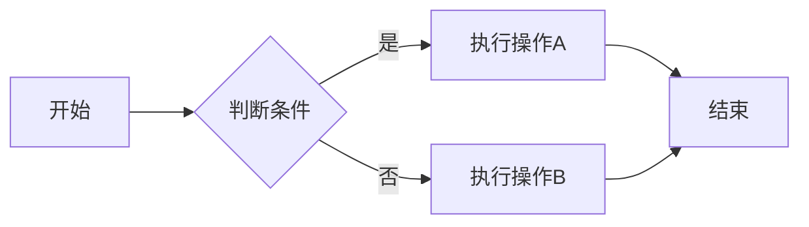
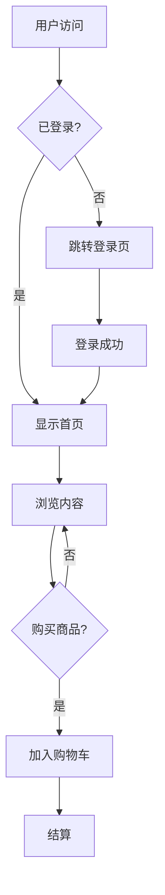
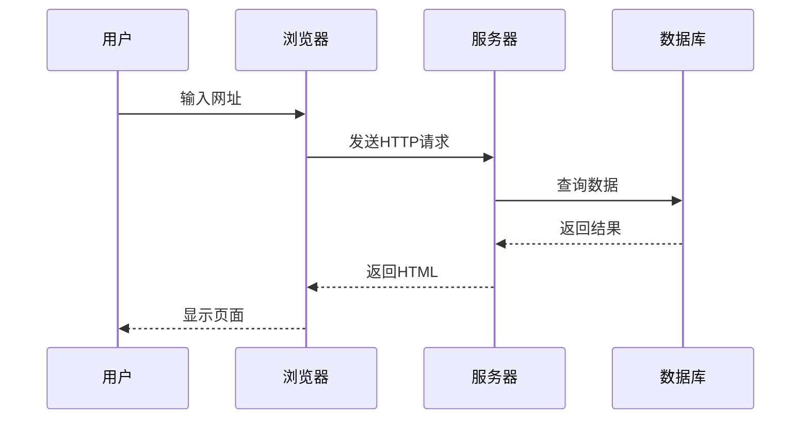
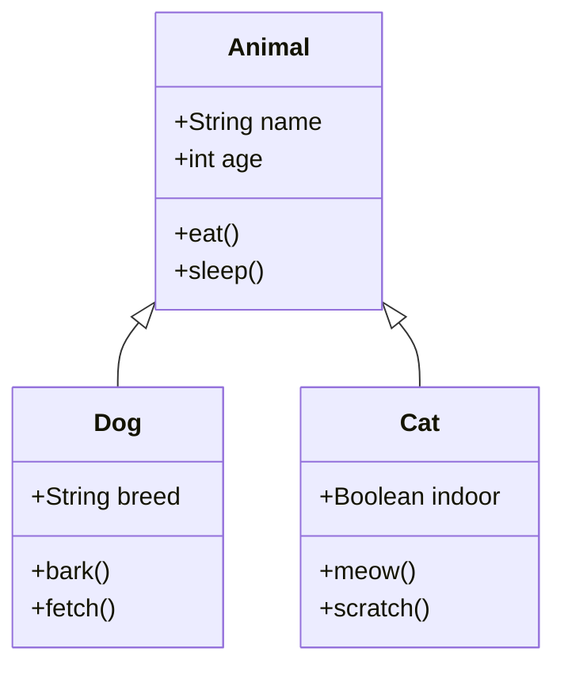
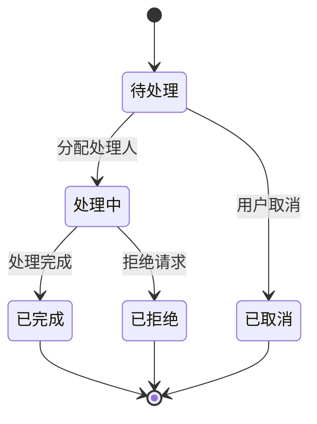
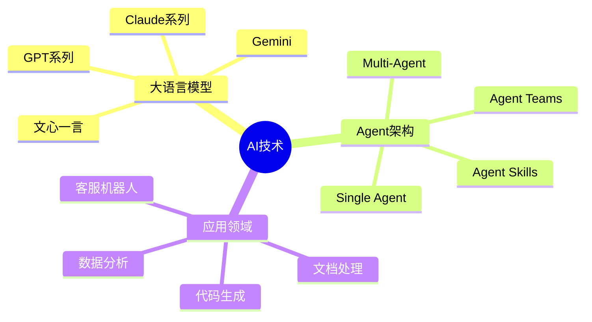
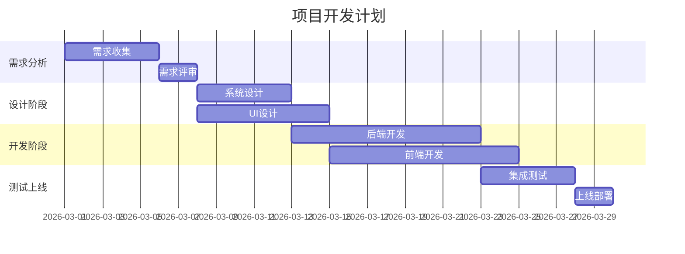
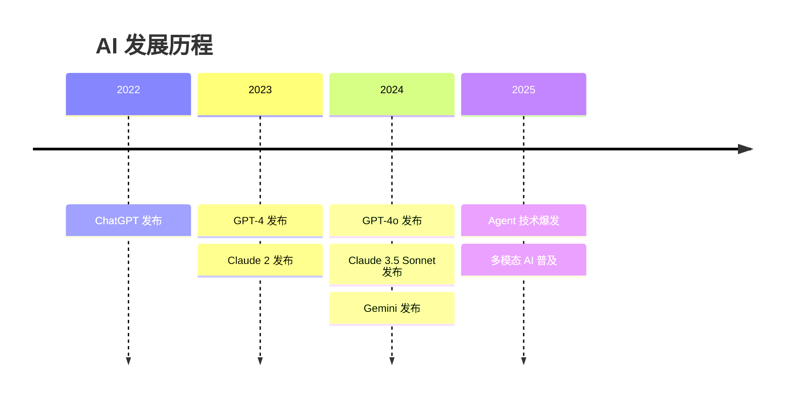
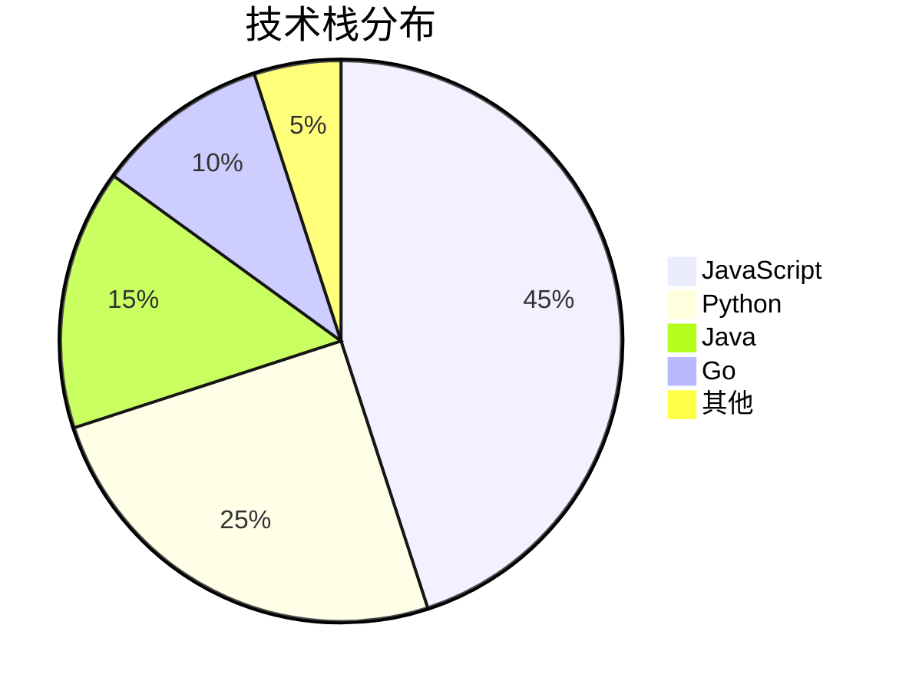
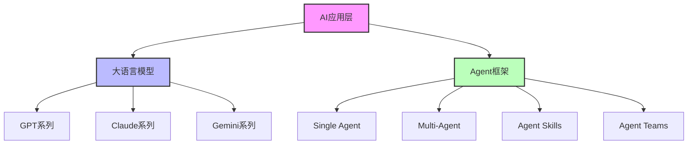

# Markdown 图表完全指南

本文档展示了所有支持的图表类型和功能。

---

## 一、Mermaid 图表

### 1.1 流程图 (Flowchart)

基础流程图：



复杂流程图：



### 1.2 序列图 (Sequence Diagram)



### 1.3 类图 (Class Diagram)



### 1.4 ER图 (Entity Relationship)

```mermaid
erDiagram
    USER ||--o{ ORDER : places
    USER {
        int id PK
        string name
        string email
        string password
    }
    ORDER ||--|{ ORDER_ITEM : contains
    ORDER {
        int id PK
        int userId FK
        datetime created_at
        string status
    }
    ORDER_ITEM {
        int id PK
        int orderId FK
        int productId FK
        int quantity
    }
    PRODUCT ||--o{ ORDER_ITEM : "ordered in"
    PRODUCT {
        int id PK
        string name
        decimal price
        int stock
    }
}
```

### 1.5 状态图 (State Diagram)



### 1.6 思维导图 (Mindmap)



### 1.7 甘特图 (Gantt Chart)



### 1.8 时间线 (Timeline)



### 1.9 饼图 (Pie Chart)



### 1.10 关系图 (Relationship Diagram)



---

## 二、Markdown 基础语法

### 2.1 表格

| 功能 | 插件 | 状态 |
|------|------|------|
| 代码高亮 | Expressive Code | ✅ 已启用 |
| 流程图 | Mermaid | ✅ 已启用 |
| 数学公式 | - | ⚠️ 待添加 |
| 标题锚点 | rehype-autolink-headings | ✅ 已启用 |

### 2.2 引用块

> 这是一个普通的引用块。

::: info
这是一个信息提示框，用于展示提示信息。
:::

::: warning
这是一个警告提示框，用于展示需要注意的事项。
:::

::: success
这是一个成功提示框，用于展示成功信息。
:::

### 2.3 代码块

```javascript
// 代码块支持语法高亮
function greet(name) {
  return `Hello, ${name}!`;
}

console.log(greet('World'));
```

### 2.4 列表

无序列表：
- 第一项
- 第二项
  - 子项 A
  - 子项 B
- 第三项

有序列表：
1. 第一步
2. 第二步
3. 第三步

---

## 三、使用技巧

### 3.1 标题锚点

将鼠标悬停在标题上，左侧会显示 `#` 符号，点击即可复制该章节的链接。

### 3.2 代码复制

所有代码块右上角都有复制按钮，点击即可复制代码内容。

### 3.3 深色模式

所有图表都支持深色模式自动切换。
