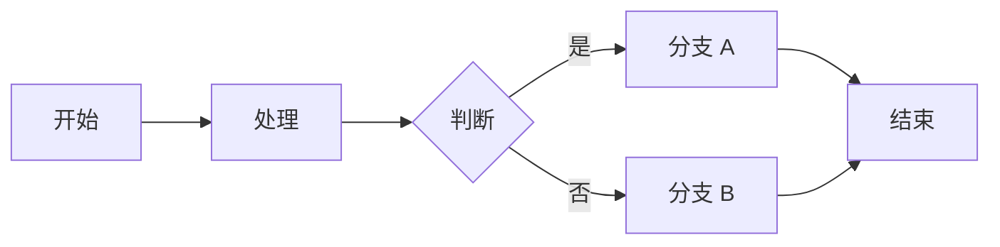
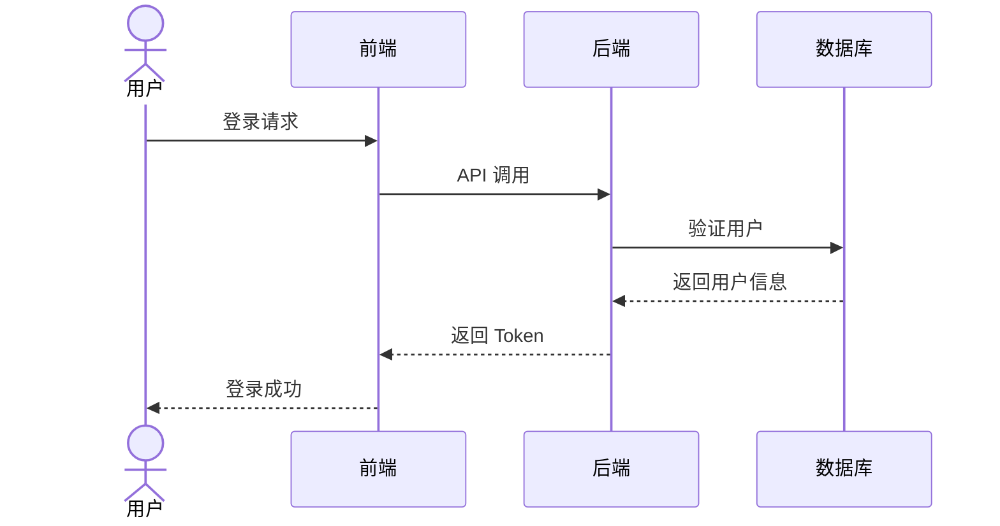
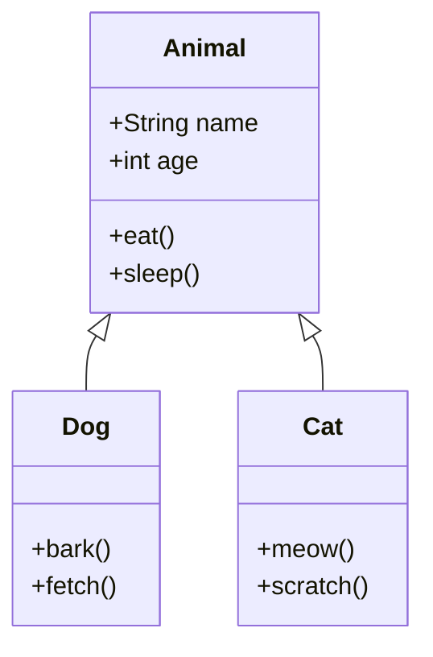
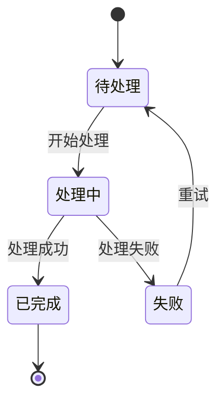
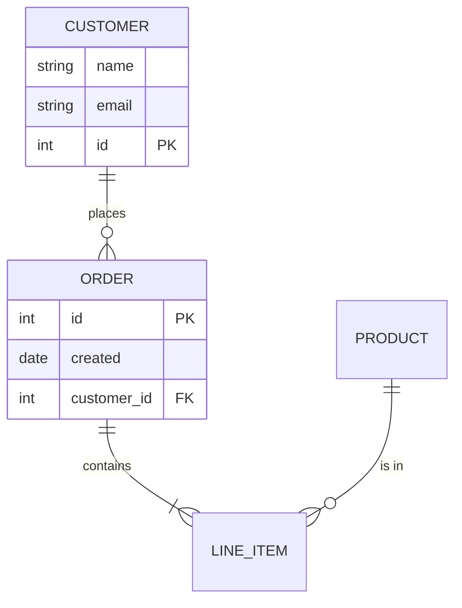
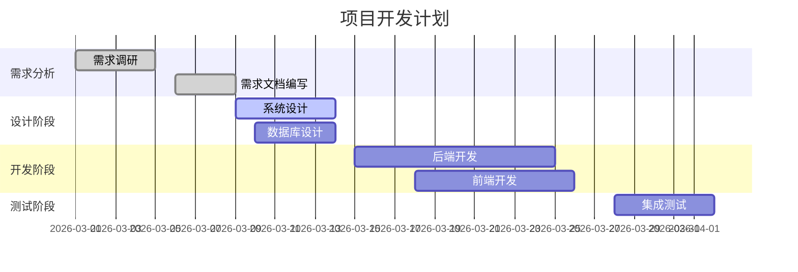
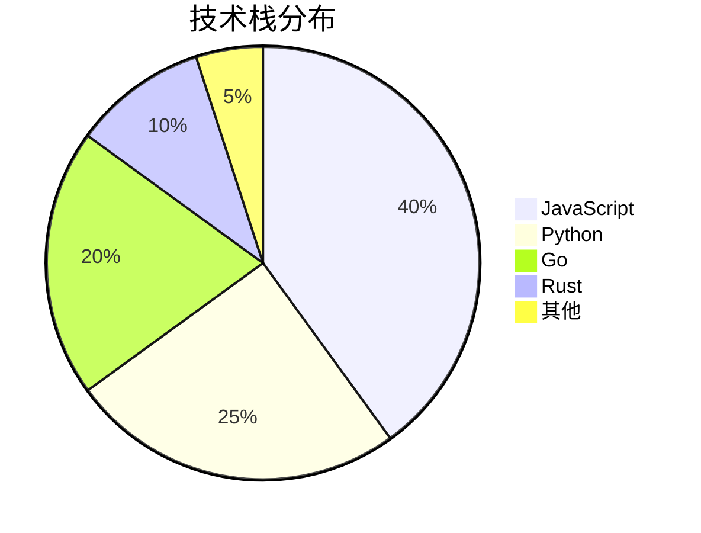
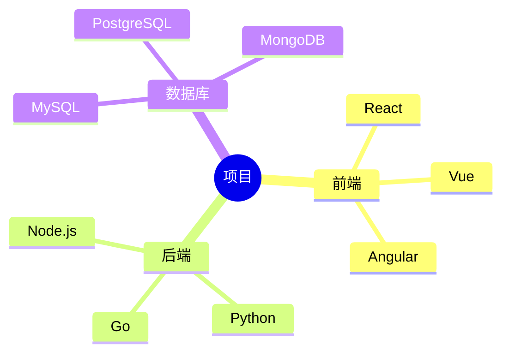

## Mermaid 图表指南

Mermaid 是一个基于 JavaScript 的图表绘制工具，可以通过简单的文本语法创建各种类型的图表。

### 支持的图表类型

### 1. 流程图 (Flowchart)

使用 `graph` 或 `flowchart` 关键字，支持 `TD`(自上而下) 和 `LR`(自左向右) 方向。



### 2. 序列图 (Sequence Diagram)

展示对象之间的交互顺序。



### 3. 类图 (Class Diagram)

用于展示类的结构和关系。



### 4. 状态图 (State Diagram)

展示对象的状态转换。



### 5. 实体关系图 (ER Diagram)

用于数据库设计。



### 6. 甘特图 (Gantt Chart)

用于项目进度管理。



### 7. 饼图 (Pie Chart)

展示数据占比。



### 8. 思维导图 (Mindmap)

层级结构展示。



### 样式自定义

你可以在图表中使用类来定义样式：

```mermaid
graph TD
    A[开始]:::start
    B[处理]:::process
    C[结束]:::end

    A --> B
    B --> C

    classDef start fill:#90EE90,stroke:#333,stroke-width:2px
    classDef process fill:#87CEEB,stroke:#333,stroke-width:2px
    classDef end fill:#FFB6C1,stroke:#333,stroke-width:2px
```

### 最佳实践

1. **保持简单**：复杂的图表可以拆分为多个小图
2. **使用描述性文字**：节点和边的标签要清晰易懂
3. **注意方向**：选择合适的图表方向 (TD/LR)
4. **适当使用样式**：用颜色突出重点
5. **测试渲染**：确保图表在主题切换时都能正常显示
