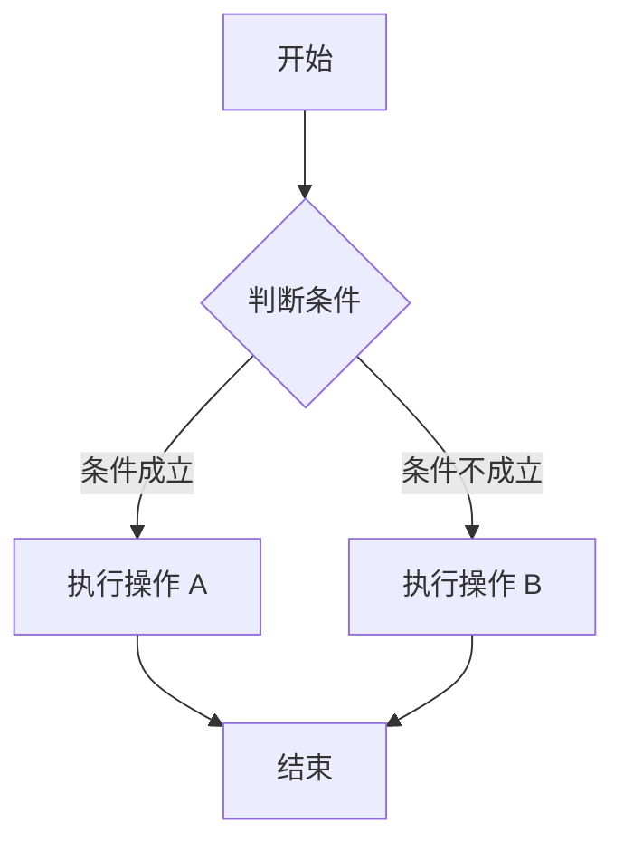
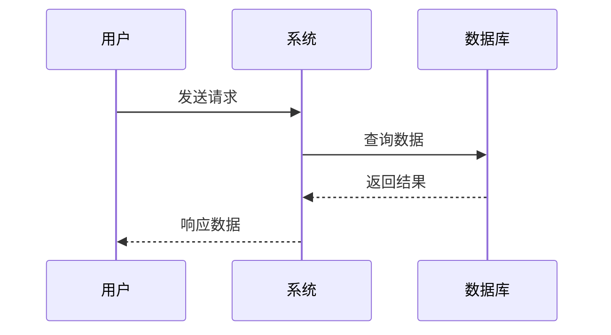
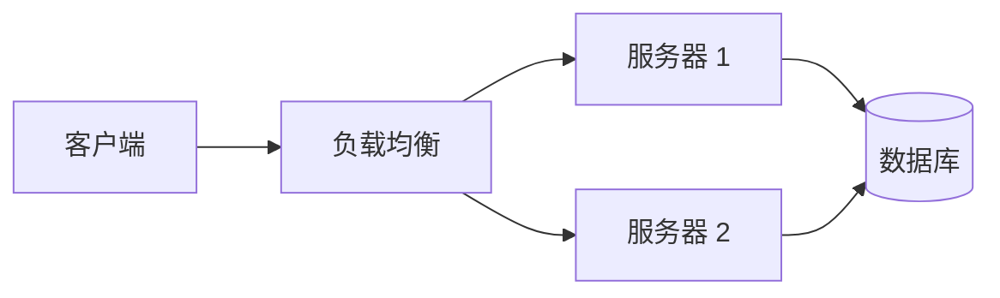

## 欢迎使用

这是一个功能完善的文档网站，支持以下特性：

- ✨ **Markdown 支持**：完整的 Markdown 语法支持
- 🎨 **代码高亮**：优美的代码块展示
- 🌙 **深色模式**：支持深色/浅色主题切换
- 🔍 **搜索功能**：快速查找文档内容
- 📊 **Mermaid 图表**：支持流程图、序列图等
- 📱 **响应式设计**：完美适配各种设备

## Markdown 语法示例

### 文本格式

你可以使用 **粗体**、*斜体*、~~删除线~~ 等格式。

### 列表

#### 无序列表

- 第一项
- 第二项
  - 子项 2.1
  - 子项 2.2
- 第三项

#### 有序列表

1. 第一步
2. 第二步
3. 第三步

### 代码块

```javascript
// JavaScript 示例
function greet(name) {
  return `Hello, ${name}!`
}

console.log(greet('World'))
```

```python
# Python 示例
def greet(name):
    return f"Hello, {name}!"

print(greet("World"))
```

### 引用块

> 这是一段引用文字。
>
> 可以有多行。

### 表格

| 特性 | 状态 | 说明 |
|------|------|------|
| Markdown | ✅ | 完全支持 |
| Mermaid | ✅ | 图表渲染 |
| 搜索 | ✅ | 全文搜索 |
| 深色模式 | ✅ | 主题切换 |

## Mermaid 图表示例

### 流程图



### 序列图



### 架构图



## 如何添加文档

1. 在 `src/content/posts` 目录下创建新的 Markdown 文件
2. 添加 frontmatter 元数据：

```yaml
---
title: '文档标题'
description: '文档描述'
date: '2026-03-27'
tags: ['标签1', '标签2']
---
```

3. 编写文档内容
4. 重新构建网站

## 快捷键

- `⌘K` / `Ctrl+K` - 打开搜索框
- `Esc` - 关闭搜索框

---

祝你使用愉快！
